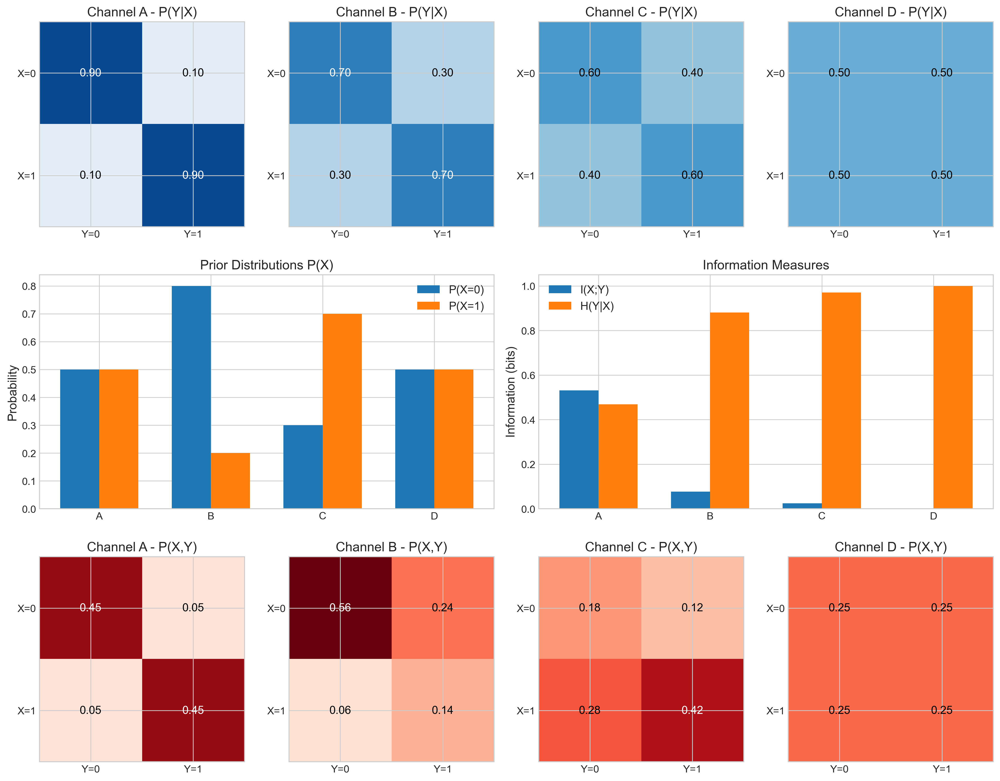

# Question 9: Information Theory in Communication Channels

## Problem Statement
The visualizations below illustrate various concepts from information theory applied to binary communication channels and probability distributions. Each visualization represents different aspects of entropy, mutual information, cross-entropy, and KL divergence.

## Tasks
Using only the information provided in these visualizations, answer the following questions:

1. Identify the channel (A, B, C, or D) with the highest information transmission capacity and explain why.
2. Rank the four channels in terms of their mutual information values from highest to lowest.
3. For distribution R, explain why it has the lowest entropy among all distributions P, Q, R, and S.
4. Explain why the KL divergence D_KL(P||Q) is not equal to D_KL(Q||P) based on the visualization.
5. Identify which channel can be described as a "completely random" channel, and explain your reasoning.

## Solution

### Step 1: Analyzing Channel Information Capacity

From the channel visualization and information measures in the first image, we can extract the following key information:

#### Channel Properties
| Channel | P(Y=0\|X=0) | P(Y=1\|X=0) | P(Y=0\|X=1) | P(Y=1\|X=1) | Mutual Info | Cond. Entropy |
|---------|-------------|-------------|-------------|-------------|-------------|---------------|
| A       | 0.90        | 0.10        | 0.10        | 0.90        | 0.5310      | 0.4690        |
| B       | 0.70        | 0.30        | 0.30        | 0.70        | 0.0768      | 0.8813        |
| C       | 0.60        | 0.40        | 0.40        | 0.60        | 0.0244      | 0.9710        |
| D       | 0.50        | 0.50        | 0.50        | 0.50        | 0.0000      | 1.0000        |

#### 1. Highest Information Transmission Capacity: Channel A
- **Mutual Information**: 0.5310 bits
- Channel A has the highest mutual information because it has the strongest probability (0.9) of correctly transmitting bits. This means that observing the output provides substantial information about what the input was.
- Mutual information quantifies how much information about X is gained by observing Y. Higher values indicate better information transmission.

#### 2. Ranking Channels by Mutual Information (highest to lowest):
1. Channel A: 0.5310 bits
2. Channel B: 0.0768 bits
3. Channel C: 0.0244 bits
4. Channel D: 0.0000 bits

This ranking directly correlates with how "reliable" each channel is in transmitting information. As the diagonal probabilities in the transition matrices decrease (from 0.9 to 0.5), the mutual information also decreases, indicating poorer information transmission.

### Step 2: Analyzing Distribution Entropy and KL Divergence

From the second visualization showing probability distributions and KL divergence:

#### Distribution Properties
| Distribution | Event 1 | Event 2 | Event 3 | Event 4 | Entropy |
|--------------|---------|---------|---------|---------|---------|
| P            | 0.25    | 0.25    | 0.25    | 0.25    | 2.0000  |
| Q            | 0.40    | 0.30    | 0.20    | 0.10    | 1.8464  |
| R            | 0.70    | 0.10    | 0.10    | 0.10    | 1.3568  |
| S            | 0.10    | 0.20    | 0.30    | 0.40    | 1.8464  |

#### 3. Why Distribution R Has the Lowest Entropy
- **Entropy**: 1.3568 bits
- Distribution R [0.7, 0.1, 0.1, 0.1] has the lowest entropy because:
  - It is the most 'certain' or least uniform distribution, with probability 0.7 concentrated on a single outcome (Event 1).
  - It has less uncertainty than the other distributions.
  - Entropy measures the average information content or 'surprise' in a probability distribution. More concentrated distributions have lower entropy.

In contrast, Distribution P has the highest entropy (2.0000 bits) because it's a uniform distribution with equal probabilities for all outcomes, representing maximum uncertainty.

#### 4. Asymmetry of KL Divergence

From the KL Divergence Matrix in the visualization:

| D_KL(row\|\|col) | P      | Q      | R      | S      |
|------------------|--------|--------|--------|--------|
| P                | 0.0000 | 0.1757 | 0.6201 | 0.1757 |
| Q                | 0.1536 | 0.0000 | 0.3525 | 0.6585 |
| R                | 0.6432 | 0.3067 | 0.0000 | 1.5067 |
| S                | 0.1536 | 0.6585 | 1.1948 | 0.0000 |

- **D_KL(P\|\|Q)** = 0.1757 bits
- **D_KL(Q\|\|P)** = 0.1536 bits

The KL divergence is asymmetric because it measures the extra bits needed to encode samples from distribution P using an optimal code designed for distribution Q. This is fundamentally an asymmetric operation.

Mathematically:
- D_KL(P\|\|Q) = Σ P(x) log(P(x)/Q(x))
- D_KL(Q\|\|P) = Σ Q(x) log(Q(x)/P(x))

These are different calculations that generally yield different results. The asymmetry can be interpreted as:
- D_KL(P\|\|Q): How well Q approximates P
- D_KL(Q\|\|P): How well P approximates Q

This asymmetry is clearly visible in the KL divergence matrix, where off-diagonal elements across the main diagonal have different values.

#### 5. The Completely Random Channel: Channel D

- **Mutual Information**: 0.0000 bits
- **Conditional Entropy**: 1.0000 bit

Channel D can be described as 'completely random' because:
  - Its transition probabilities are all 0.5, meaning the output Y is equally likely to be 0 or 1 regardless of the input X.
  - Its mutual information is exactly 0 bits, indicating that knowing the output Y provides absolutely no information about what the input X was.
  - Its conditional entropy H(Y|X) is 1.0000 bit, which is the maximum possible entropy for a binary variable.

In information-theoretic terms, this represents a channel where the output is completely independent of the input, essentially adding maximum noise to the signal. No information is preserved when transmitting through this channel.

## Key Insights

1. **Mutual Information and Channel Capacity**:
   - The mutual information I(X;Y) quantifies how much uncertainty about X is reduced by observing Y. Higher mutual information means better information transmission capacity.

2. **Relationship to Noise**:
   - As noise in a channel increases (moving from Channel A to D), mutual information decreases and conditional entropy increases.
   - A completely random channel (D) has zero mutual information and maximum conditional entropy.

3. **Entropy and Certainty**:
   - More concentrated distributions (like R) have lower entropy than more uniform distributions (like P).
   - Uniform distributions have maximum entropy for a given number of outcomes.

4. **Asymmetry of KL Divergence**:
   - KL divergence is not a true distance metric because it's asymmetric.
   - This asymmetry matters in machine learning when comparing models or distributions.

5. **Information Theory in Communication**:
   - These concepts directly relate to Claude Shannon's original application of information theory to communication channels, where the key question was how much information could be reliably transmitted through a noisy channel.

This problem demonstrates how visualizations can help understand complex information-theoretic concepts and their practical implications in communication systems and machine learning. 