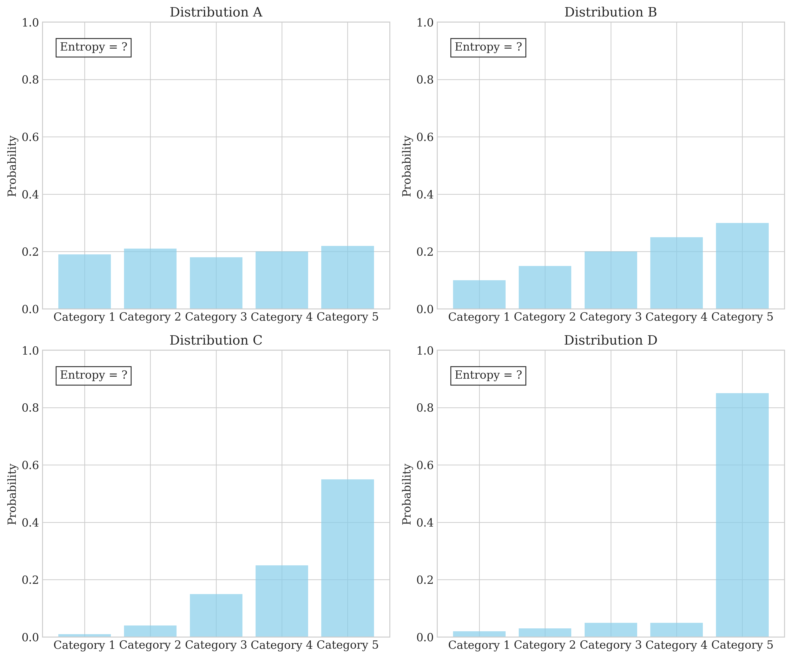
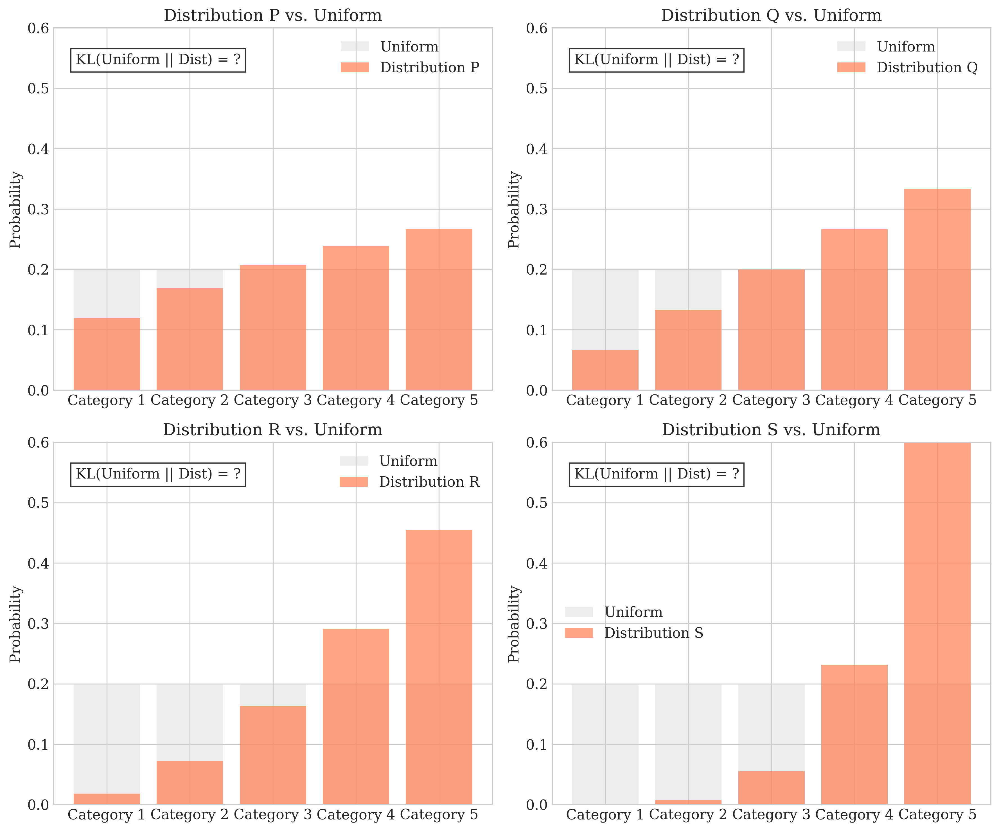
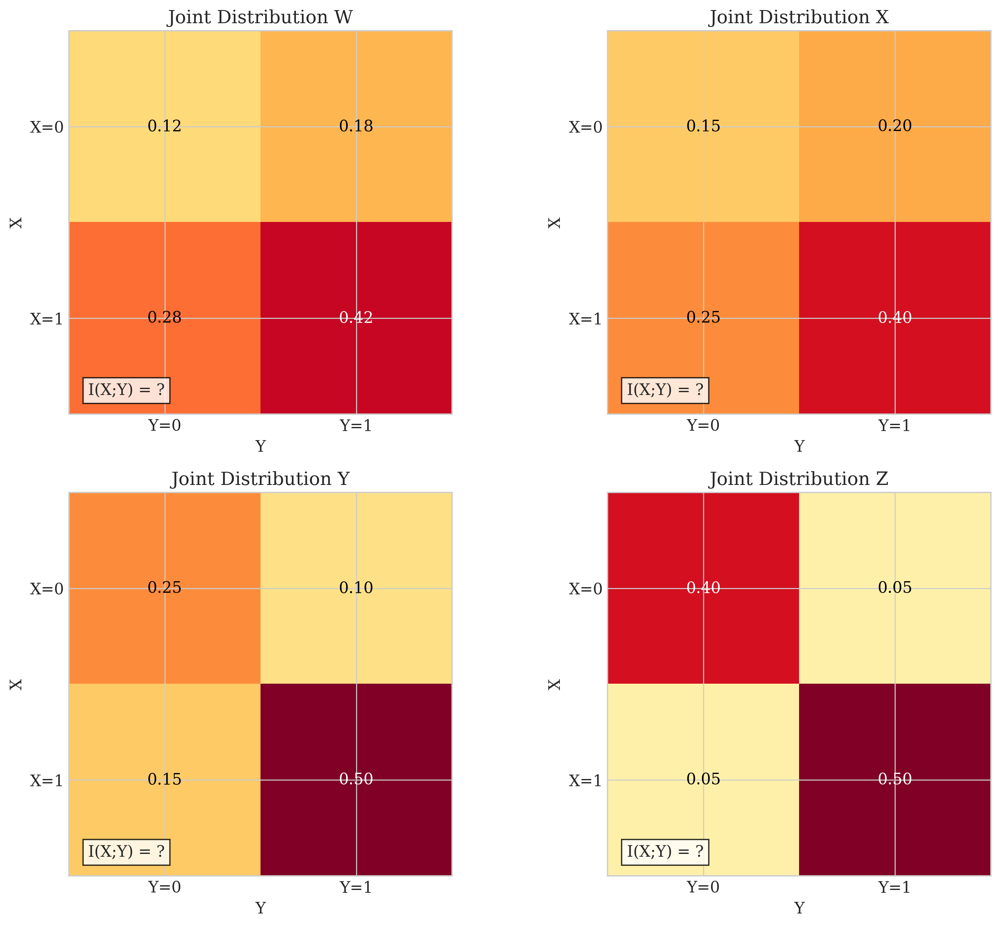
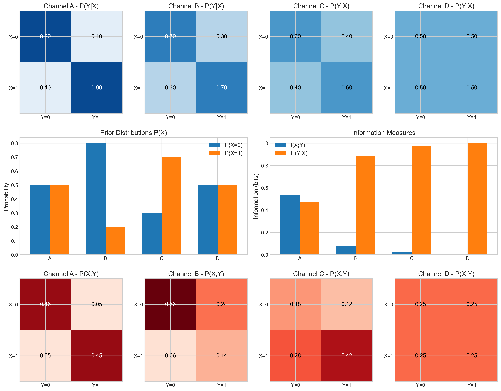
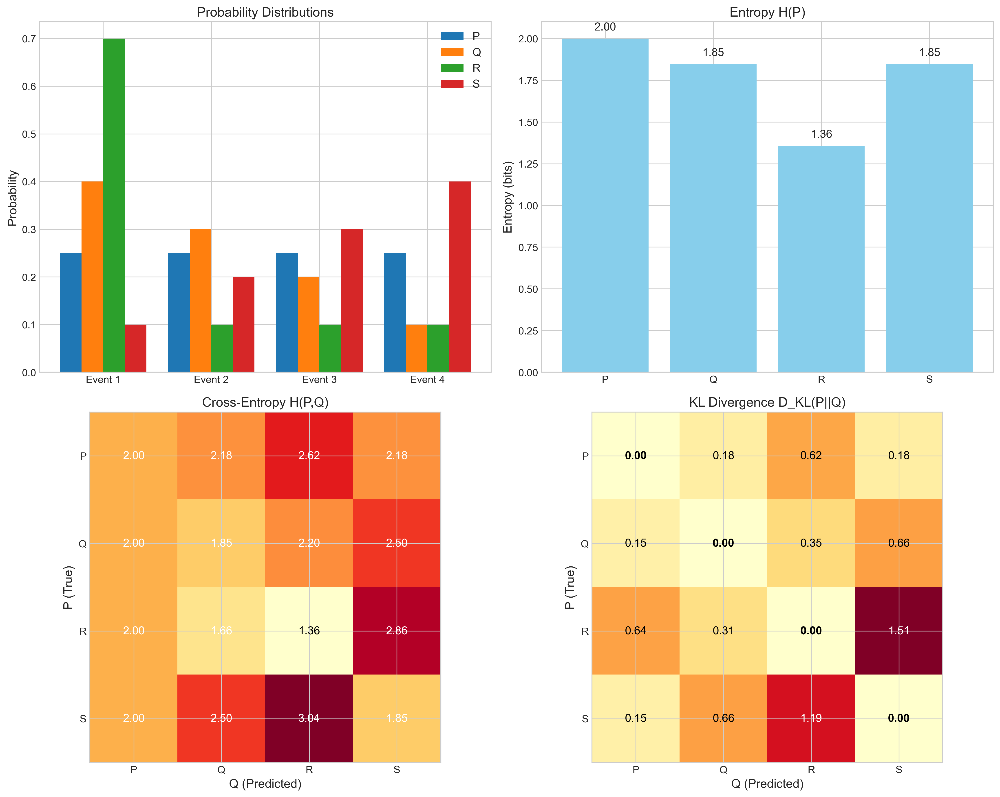

# Lecture 2.2: Information Theory and Entropy Quiz

## Overview
This quiz contains 9 questions from different topics covered in section 2.2 of the lectures on Information Theory and Entropy.

## Question 1

### Problem Statement
Consider a discrete random variable $X$ with the following probability distribution:
- $P(X = 1) = 0.2$
- $P(X = 2) = 0.3$
- $P(X = 3) = 0.4$
- $P(X = 4) = 0.1$

#### Task
1. Calculate the entropy $H(X)$ of this distribution
2. What would be the entropy if the distribution were uniform over these four values?
3. If we have another random variable $Y$ with the same possible values but is deterministic (i.e., one outcome has probability 1), what is its entropy?
4. Explain why the uniform distribution has maximum entropy among all distributions over the same set of values

For a detailed explanation of this question, see [Question 1: Entropy Calculations and Properties](L2_2_1_explanation.md).

## Question 2

### Problem Statement
Consider two distributions $P$ and $Q$ over the same discrete random variable $X$:
- $P$: $P(X = 0) = 0.7$, $P(X = 1) = 0.3$
- $Q$: $Q(X = 0) = 0.5$, $Q(X = 1) = 0.5$

#### Task
1. Calculate the KL divergence $D_{KL}(P||Q)$
2. Calculate the KL divergence $D_{KL}(Q||P)$
3. Calculate the cross-entropy $H(P, Q)$
4. Explain why $D_{KL}(P||Q) \neq D_{KL}(Q||P)$ and what this means in practice

For a detailed explanation of this question, see [Question 2: KL Divergence and Cross-Entropy](L2_2_2_explanation.md).

## Question 3

### Problem Statement
Consider two discrete random variables $X$ and $Y$ with the following joint probability distribution:

|       | $Y = 0$ | $Y = 1$ |
|-------|---------|---------|
| $X = 0$ | 0.3     | 0.2     |
| $X = 1$ | 0.1     | 0.4     |

#### Task
1. Calculate the entropy of $X$, $H(X)$
2. Calculate the entropy of $Y$, $H(Y)$
3. Calculate the joint entropy $H(X, Y)$
4. Calculate the mutual information $I(X; Y)$ and interpret what it means about the relationship between $X$ and $Y$

For a detailed explanation of this question, see [Question 3: Joint Entropy and Mutual Information](L2_2_3_explanation.md).

## Question 4

### Problem Statement
In a classification problem, we have a binary classifier that outputs the probability of the positive class. The true labels are $y$ and the predicted probabilities are $\hat{y}$.

#### Task
1. Write down the formula for the cross-entropy loss between the true labels and predicted probabilities
2. If we have 4 samples with true labels $y = [1, 0, 1, 0]$ and predicted probabilities $\hat{y} = [0.8, 0.3, 0.6, 0.2]$, calculate the cross-entropy loss
3. Calculate the KL divergence between the true distribution and predicted distribution
4. Explain how minimizing the cross-entropy loss relates to maximum likelihood estimation

For a detailed explanation of this question, see [Question 4: Cross-Entropy Loss in Classification](L2_2_4_explanation.md).

## Question 5

### Problem Statement
Consider a fair coin toss ($P(\text{heads}) = 0.5$, $P(\text{tails}) = 0.5$).

#### Task
1. Calculate the entropy of this distribution
2. If we have a biased coin with $P(\text{heads}) = 0.8$, what is its entropy?
3. Explain why the fair coin has higher entropy than the biased coin

For a detailed explanation of this question, see [Question 5: Entropy in Coin Tosses](L2_2_5_explanation.md).

## Question 6

### Problem Statement
Evaluate whether each of the following statements is TRUE or FALSE. Justify your answer with a brief explanation.

#### Task
1. The KL divergence between two identical probability distributions is always zero.
2. The entropy of a uniform distribution is always higher than any other distribution over the same set of values.
3. For any two random variables $X$ and $Y$, the mutual information $I(X;Y)$ is always non-negative.
4. The cross-entropy between two distributions is always greater than or equal to the entropy of the true distribution.
5. If the entropy of a random variable $X$ is zero, then $X$ must be deterministic.

For a detailed explanation of these true/false questions, see [Question 6: Information Theory True/False](L2_2_6_explanation.md).

## Question 7

### Problem Statement
Consider a simple binary classification problem where:
- The true distribution $P$ has $P(y=1) = 0.7$ and $P(y=0) = 0.3$
- The predicted distribution $Q$ has $Q(y=1) = 0.6$ and $Q(y=0) = 0.4$

#### Task
1. Calculate the cross-entropy $H(P, Q)$
2. Calculate the entropy $H(P)$
3. Calculate the KL divergence $D_{KL}(P||Q)$
4. Verify that $H(P, Q) = H(P) + D_{KL}(P||Q)$ 

For a detailed explanation of this question, see [Question 7: Cross-Entropy, Entropy, and KL Divergence Relationship](L2_2_7_explanation.md).

## Question 8

### Problem Statement
The graphs below illustrate various concepts related to information theory and entropy. Each visualization represents different aspects of information-theoretic measures for discrete probability distributions.

#### Task
Using only the information provided in these graphs (i.e., without any extra computation), determine:

1. Rank the entropy values of distributions A, B, C, and D from highest to lowest.
2. Rank the KL divergence values from uniform to distributions P, Q, R, and S from smallest to largest.
3. Rank the mutual information values of joint distributions W, X, Y, and Z from lowest to highest.
4. Explain the relationship between the visual characteristics of these distributions and their information-theoretic measures.

For a detailed explanation of this question, see [Question 8: Visual Information Theory](L2_2_8_explanation.md).

## Question 9

### Problem Statement
The visualizations below illustrate various concepts from information theory applied to binary communication channels and probability distributions. Each visualization represents different aspects of entropy, mutual information, cross-entropy, and KL divergence.

#### Task
Using only the information provided in these visualizations, answer the following questions:

1. Identify the channel (A, B, C, or D) with the highest information transmission capacity and explain why.
2. Rank the four channels in terms of their mutual information values from highest to lowest.
3. For distribution R, explain why it has the lowest entropy among all distributions P, Q, R, and S.
4. Explain why the KL divergence $D_{KL}(P||Q)$ is not equal to $D_{KL}(Q||P)$ based on the visualization.
5. Identify which channel can be described as a "completely random" channel, and explain your reasoning.

For a detailed explanation of this question, see [Question 9: Information Theory in Communication Channels](L2_2_9_explanation.md). 