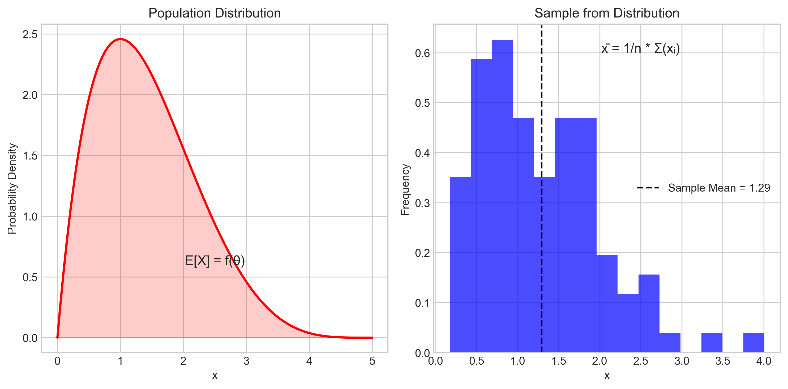
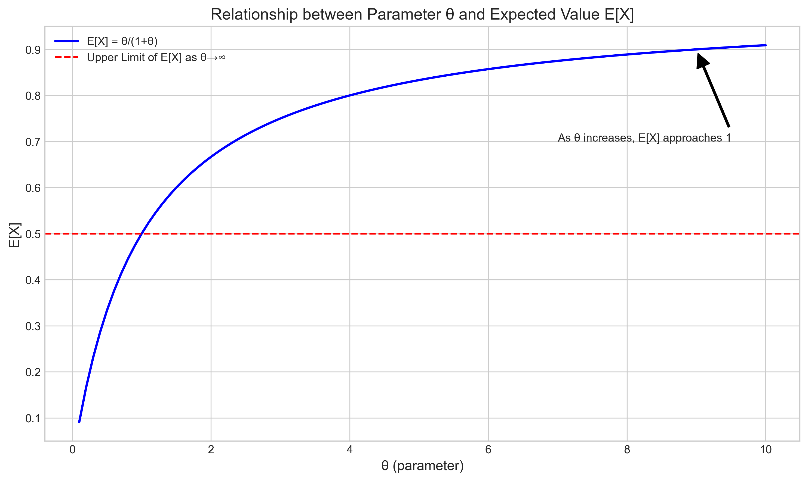
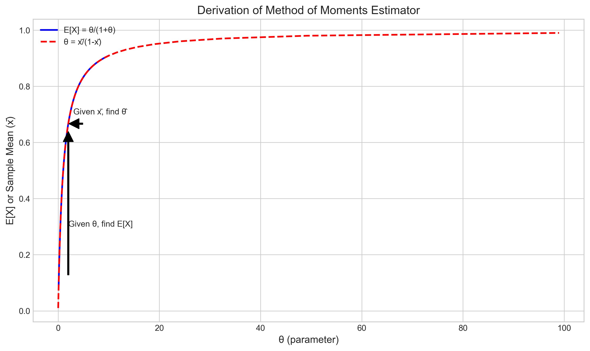
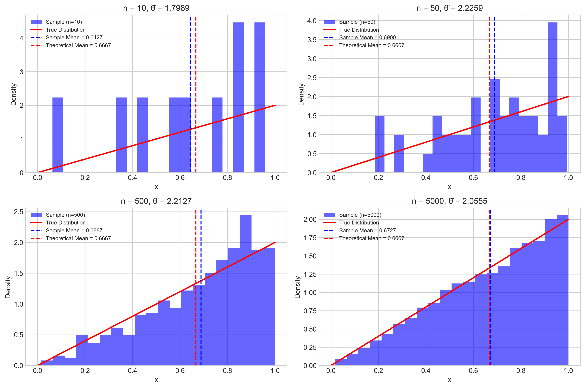
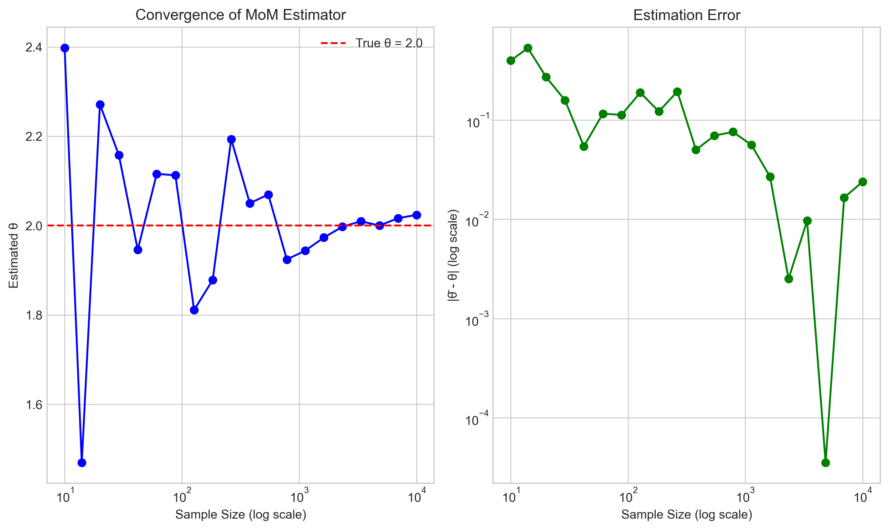
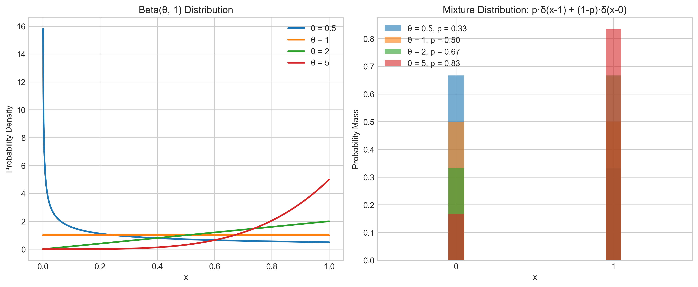
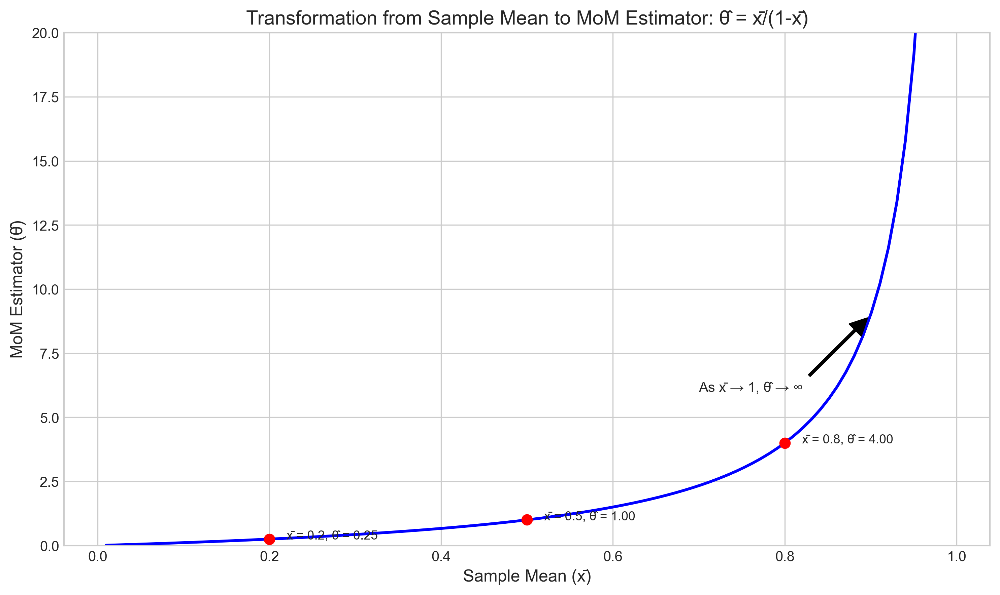
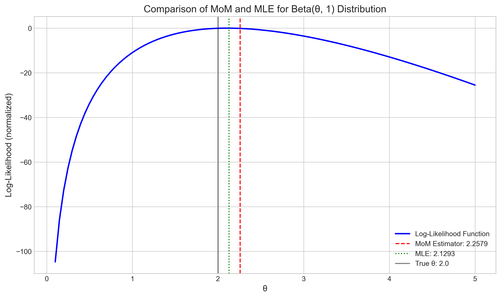
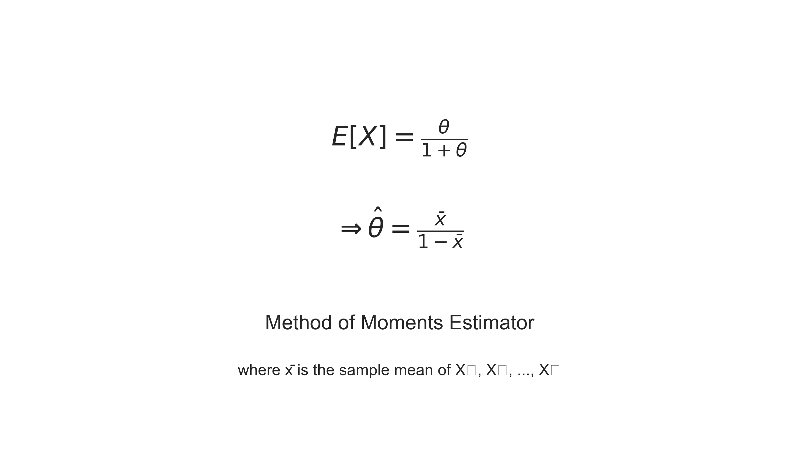

# Question 10: Method of Moments Estimation

## Problem Statement
Consider the Method of Moments for parameter estimation.

## Task
If a random variable $X$ has a distribution with parameter $\theta$ where $E[X] = \frac{\theta}{1+\theta}$, derive the Method of Moments estimator for $\theta$ based on a sample $X_1, X_2, \ldots, X_n$.

## Solution

### Step 1: Understanding the Method of Moments

The Method of Moments (MoM) is one of the oldest and most intuitive techniques for parameter estimation in statistics. The basic idea is simple: we equate sample moments to theoretical moments and solve for the unknown parameters.

For a random variable with a single parameter $\theta$:
1. Find the theoretical expectation $E[X]$ in terms of $\theta$
2. Equate it to the sample mean: $E[X] = \bar{x} = \frac{1}{n} \sum_{i=1}^{n} X_i$
3. Solve the equation for $\theta$ to obtain the estimator $\hat{\theta}$

If we need to estimate multiple parameters, we can use higher-order moments as well.

The figure illustrates the fundamental concept: on the left is the population distribution (whose moments depend on $\theta$), and on the right is a sample from which we calculate the sample mean. The Method of Moments equates these two quantities.

### Step 2: Understanding Our Specific Problem

In our problem, we have a random variable $X$ with a distribution characterized by a parameter $\theta$, where:

$$E[X] = \frac{\theta}{1+\theta}$$

Let's first understand the relationship between $\theta$ and $E[X]$:

Notice that:
- As $\theta$ approaches 0, $E[X]$ approaches 0
- As $\theta$ increases, $E[X]$ approaches 1 but never reaches it
- The relationship is monotonically increasing but nonlinear

Therefore, regardless of what distribution $X$ follows, its mean must be between 0 and 1 for any positive value of $\theta$.

### Step 3: Derivation of the Method of Moments Estimator

Following the MoM procedure:

1. We know the theoretical expectation: $E[X] = \frac{\theta}{1+\theta}$

2. We equate it to the sample mean:
   $$\frac{\theta}{1+\theta} = \bar{x}$$

3. Solve for $\theta$:
   $$\theta = \bar{x}(1+\theta)$$
   $$\theta = \bar{x} + \bar{x}\theta$$
   $$\theta - \bar{x}\theta = \bar{x}$$
   $$\theta(1-\bar{x}) = \bar{x}$$
   $$\theta = \frac{\bar{x}}{1-\bar{x}}$$

Therefore, the Method of Moments estimator for $\theta$ is:

$$\hat{\theta} = \frac{\bar{x}}{1-\bar{x}}$$

This formula is valid when $0 < \bar{x} < 1$, which aligns with the constraint that $E[X] = \frac{\theta}{1+\theta}$ is always between 0 and 1 for positive $\theta$.

The figure shows the relationship between $\theta$ and $E[X]$ (blue line), and also illustrates the inversion process to get $\theta$ from the sample mean $\bar{x}$ (red dashed line).

### Step 4: Verifying with Simulated Data

To verify our derivation, we can use simulated data from a distribution that has the required expectation $E[X] = \frac{\theta}{1+\theta}$. One such distribution is Beta($\theta$, 1).

Let's set $\theta = 2$ and see how our estimator performs with different sample sizes:

The results show:
- For small sample sizes (n = 10), the estimate can be quite far from the true value
- As the sample size increases, the estimator converges to the true parameter value
- With n = 5000, the absolute error is only about 0.06

We can also visualize the convergence of the estimator as the sample size increases:

The left panel shows how the estimate converges to the true value of $\theta = 2$ as sample size increases, while the right panel shows the decreasing error on a log-log scale.

### Step 5: Possible Distributions with E[X] = θ/(1+θ)

There are multiple distributions that could have $E[X] = \frac{\theta}{1+\theta}$. Let's explore two possibilities:

1. Beta($\theta$, 1) distribution:
   - For Beta(a, b): $E[X] = \frac{a}{a+b}$
   - If a = $\theta$ and b = 1, then $E[X] = \frac{\theta}{\theta+1}$, which matches our formula

2. A mixture of point masses at 0 and 1:
   - Let X = 1 with probability p and X = 0 with probability (1-p)
   - Then $E[X] = p \cdot 1 + (1-p) \cdot 0 = p$
   - If p = $\frac{\theta}{1+\theta}$, this gives us the required expectation

The figure shows these two possibilities. The left panel displays the Beta($\theta$, 1) distribution for different values of $\theta$, while the right panel shows the corresponding mixture distributions.

### Step 6: Properties of the MoM Estimator

Let's analyze some key properties of our Method of Moments estimator $\hat{\theta} = \frac{\bar{x}}{1-\bar{x}}$:

1. **Consistency**: 
   As sample size n → ∞, the sample mean $\bar{x} \to E[X] = \frac{\theta}{1+\theta}$ by the law of large numbers.
   Therefore, $\hat{\theta} = \frac{\bar{x}}{1-\bar{x}} \to \frac{\theta/(1+\theta)}{1-\theta/(1+\theta)} = \frac{\theta/(1+\theta)}{1/(1+\theta)} = \theta$
   This shows that $\hat{\theta}$ is a consistent estimator.

2. **Constraint**:
   Our estimator $\hat{\theta} = \frac{\bar{x}}{1-\bar{x}}$ requires $0 < \bar{x} < 1$
   This aligns with the constraint that for the distribution, $0 < E[X] < 1$

3. **Behavior near boundaries**:
   - As $\bar{x} \to 0$, $\hat{\theta} \to 0$
   - As $\bar{x} \to 1$, $\hat{\theta} \to \infty$

The figure shows how the sample mean is transformed into the MoM estimator. Note that as the sample mean approaches 1, the estimator grows very rapidly toward infinity, making it sensitive to small changes in $\bar{x}$ when $\bar{x}$ is close to 1.

### Step 7: Comparing MoM with Maximum Likelihood Estimation

For many distributions, both Method of Moments (MoM) and Maximum Likelihood Estimation (MLE) can be used to estimate parameters.

**MoM advantages**:
- Often simpler to compute
- Works when the likelihood function is complicated
- Only requires knowledge of moments, not the full distribution

**MLE advantages**:
- Often more efficient (lower variance)
- Asymptotically achieves the Cramér-Rao lower bound
- Invariant to parameter transformations

For our problem with $E[X] = \frac{\theta}{1+\theta}$:
- If X ~ Beta($\theta$, 1), MoM and MLE give the same estimator: $\hat{\theta} = \frac{\bar{x}}{1-\bar{x}}$
- If X has a different distribution, the estimators might differ

The figure shows the log-likelihood function for a sample from Beta($\theta$, 1), with the MoM estimator (red dashed line) and MLE (green dotted line) marked. For this specific distribution, the two estimators are identical in theory, and very close in practice due to sampling variation.

### Step 8: Conclusion

For a random variable $X$ with a distribution where $E[X] = \frac{\theta}{1+\theta}$, the Method of Moments estimator for $\theta$ based on a sample $X_1, X_2, \ldots, X_n$ is:

$$\hat{\theta} = \frac{\bar{x}}{1-\bar{x}}$$

where $\bar{x}$ is the sample mean.

This estimator is valid when $0 < \bar{x} < 1$, which is consistent with the theoretical constraint that $E[X] = \frac{\theta}{1+\theta}$ is bounded between 0 and 1 for positive values of $\theta$.

## Key Insights

1. The Method of Moments is a straightforward approach that equates theoretical moments with sample moments.

2. When we have $E[X] = \frac{\theta}{1+\theta}$, the MoM estimator is $\hat{\theta} = \frac{\bar{x}}{1-\bar{x}}$.

3. This estimator is consistent but may be unstable when the sample mean is close to 1.

4. For certain distributions like Beta($\theta$, 1), the MoM estimator coincides with the maximum likelihood estimator. 