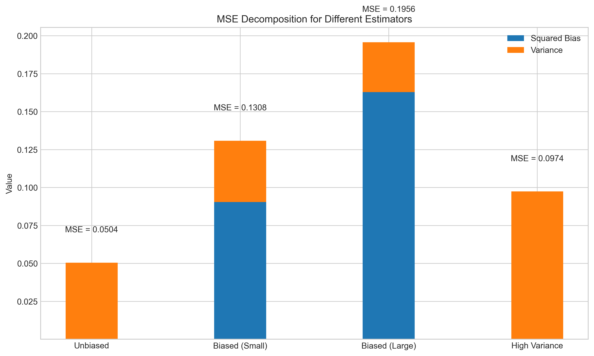

# Question 11: Statistical Estimation Fundamentals

## Problem Statement
Evaluate whether each of the following statements is TRUE or FALSE. Justify your answer with a brief explanation.

## Task
1. The likelihood function represents the probability of observing the data given the parameters.
2. If two estimators have the same variance, the one with lower bias will always have lower Mean Squared Error (MSE).

## Solution

### Statement 1: The Likelihood Function

#### Analysis
The likelihood function and probability function use the same mathematical expression but with fundamentally different interpretations:

- **Probability function P(x|θ)**: This represents the probability of observing data x given fixed parameters θ.
  - Function of x (data), with θ (parameters) fixed
  - For discrete random variables, represents the probability mass function
  - For continuous random variables, represents the probability density function
  - Integrates/sums to 1 over all possible values of x

- **Likelihood function L(θ|x)**: This represents the likelihood of parameters θ given fixed observed data x.
  - Function of θ (parameters), with x (data) fixed
  - Does NOT generally integrate/sum to 1 over values of θ
  - Not a proper probability distribution over θ
  - Used for parameter estimation, not for calculating probabilities

Let's consider a simple example with data from a normal distribution. The following figure shows the likelihood function for a sample from N(μ, 1.5), where we treat μ as the unknown parameter:

Notice several key properties of the likelihood function:
1. It reaches its maximum at the sample mean (the Maximum Likelihood Estimate)
2. The area under the curve is not normalized to 1
3. It represents how "likely" different parameter values are, given our observed data
4. It is not a proper probability distribution over μ

To better understand the distinction between likelihood and probability, we can compare the likelihood function with a prior and posterior distribution in Bayesian analysis:

This figure shows:
- Top left: The likelihood function L(θ|x) - not a proper PDF over θ
- Top right: A prior distribution P(θ) - a proper PDF representing our beliefs before seeing data
- Bottom: The posterior distribution P(θ|x) ∝ L(θ|x) × P(θ) - a proper PDF that combines the likelihood with the prior

#### Verdict
Statement 1 is **TRUE**. The likelihood function does represent the probability of observing the data given the parameters. However, it's important to clarify that the likelihood function uses this mathematical expression in a different way - as a function of the parameters with fixed data, rather than as a probability distribution over parameters.

### Statement 2: MSE, Bias, and Variance Relationship

#### Analysis
For an estimator θ̂ of a parameter θ, the Mean Squared Error (MSE) is defined as:

$$\text{MSE}(\hat{\theta}) = E[(\hat{\theta} - \theta)^2]$$

The MSE can be decomposed into bias and variance components:

$$\text{MSE}(\hat{\theta}) = (\text{Bias}(\hat{\theta}))^2 + \text{Var}(\hat{\theta})$$

where $\text{Bias}(\hat{\theta}) = E[\hat{\theta}] - \theta$

This decomposition reveals that MSE has two components:
1. Squared bias: how far the expected value of the estimator is from the true parameter value
2. Variance: how much the estimator varies around its expected value

When two estimators have the same variance:
- MSE_A = (Bias_A)² + Var
- MSE_B = (Bias_B)² + Var

If |Bias_A| < |Bias_B|, then (Bias_A)² < (Bias_B)², which means MSE_A < MSE_B.

We can visualize this relationship in the following figure:

The top panel shows that with fixed variance, MSE increases as the squared bias increases. The bottom panel compares two estimators with the same variance but different biases, demonstrating that the one with lower bias has lower MSE.

To further illustrate the bias-variance tradeoff, we can look at estimators with different bias-variance combinations but potentially similar MSE:

This figure shows that estimators with different bias-variance combinations can have similar MSE. However, when the variance is fixed, the one with lower bias will always have lower MSE.

We can also verify this through simulation. We defined four different estimators with varying bias and variance properties:
1. Unbiased: Sample mean (unbiased estimator)
2. Biased (Small): Slight bias with slightly reduced variance
3. Biased (Large): Larger bias with further reduced variance
4. High Variance: Unbiased but with higher variance

Running 10,000 simulations with a sample size of 20, we obtained:

| Estimator | Mean Est. | Bias | Variance | MSE | Bias²+Var |
|-----------|-----------|------|----------|-----|-----------|
| Unbiased | 5.0010 | 0.0010 | 0.0504 | 0.0504 | 0.0504 |
| Biased (Small) | 4.6993 | -0.3007 | 0.0404 | 0.1308 | 0.1308 |
| Biased (Large) | 4.5966 | -0.4034 | 0.0329 | 0.1956 | 0.1956 |
| High Variance | 5.0025 | 0.0025 | 0.0974 | 0.0974 | 0.0974 |

The MSE decomposition is visualized in the following figure:

This figure shows the contribution of squared bias (blue) and variance (orange) to the total MSE for each estimator. For any two estimators with the same variance component, the one with lower bias would have lower MSE.

#### Verdict
Statement 2 is **TRUE**. If two estimators have the same variance, the one with lower bias will always have lower Mean Squared Error (MSE). This follows directly from the MSE decomposition formula: MSE = (Bias)² + Variance.

## Conclusion

Both statements in Question 11 are **TRUE**:

1. The likelihood function does represent the probability of observing the data given the parameters, although it's important to understand that it's interpreted as a function of the parameters with fixed data.

2. If two estimators have the same variance, the one with lower bias will always have lower MSE, as directly shown by the MSE decomposition.

These concepts are fundamental to statistical estimation theory and help guide the choice of estimators in practical applications. While unbiased estimators are often preferred, the bias-variance tradeoff sometimes makes biased estimators with sufficiently low variance more desirable in terms of overall MSE.

## Key Insights

1. **Likelihood vs. Probability**: While they use the same mathematical expression, they have different interpretations and properties. The likelihood function is not a probability distribution over parameters.

2. **MSE Decomposition**: Understanding the decomposition of MSE into bias and variance components is crucial for evaluating and selecting estimators.

3. **Bias-Variance Tradeoff**: In practice, there's often a tradeoff between bias and variance. Sometimes accepting a small bias can significantly reduce variance, leading to a lower overall MSE.

4. **Maximum Likelihood Estimation**: The MLE is the parameter value that maximizes the likelihood function, making the observed data most probable.

5. **Bayesian vs. Frequentist Approaches**: Frequentist approaches focus on the likelihood, while Bayesian approaches incorporate prior information to obtain a posterior distribution over parameters. 