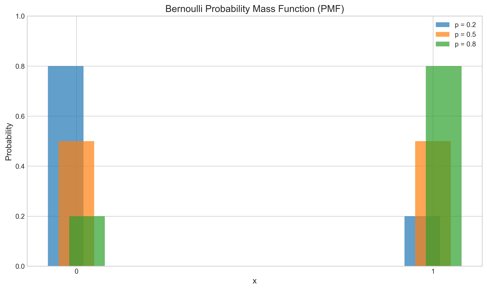
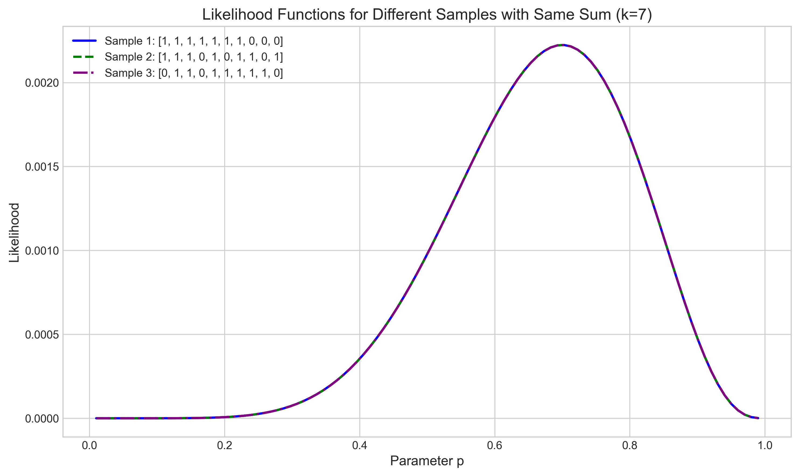
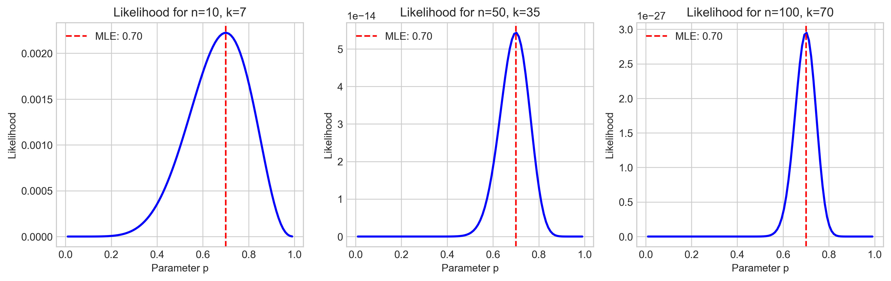
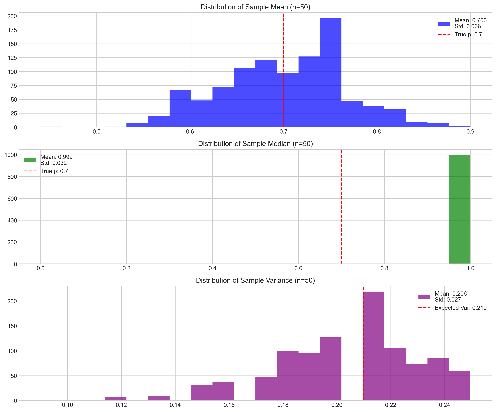
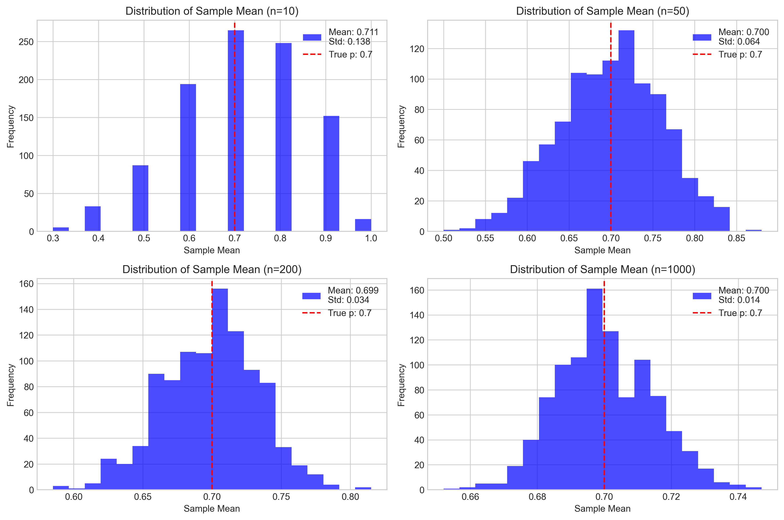

# Question 12: Sufficient Statistics for Bernoulli Distribution

## Problem Statement
Consider a random sample from a Bernoulli distribution with parameter $p$.

## Task
What is the sufficient statistic for estimating the parameter $p$?

A) The sample median
B) The sample mean
C) The sample variance
D) The sample size

## Correct Answer
B) The sample mean

## Solution

### Step 1: Understanding the Bernoulli Distribution

The Bernoulli distribution is a discrete probability distribution for a random variable that takes only two values:
- $1$ with probability $p$
- $0$ with probability $1-p$

Its probability mass function (PMF) is given by:
$$P(X = x) = p^x \cdot (1-p)^{1-x} \quad \text{for } x \in \{0, 1\}$$

Important properties of the Bernoulli distribution include:
- Mean: $E[X] = p$
- Variance: $\text{Var}(X) = p(1-p)$

The following figure shows the PMF of the Bernoulli distribution for different values of $p$:

### Step 2: Definition of Sufficient Statistics

A statistic $T(X)$ is sufficient for a parameter $\theta$ if the conditional distribution of the sample $X$ given $T(X)$ does not depend on $\theta$. Intuitively, a sufficient statistic contains all the information in the data that is relevant for estimating the parameter.

We can use the factorization theorem to identify sufficient statistics:
A statistic $T(X)$ is sufficient for $\theta$ if and only if the likelihood function can be factorized as:

$$L(\theta; x) = g(T(x), \theta) \cdot h(x)$$

where $g$ depends on $x$ only through $T(x)$, and $h$ does not depend on $\theta$.

### Step 3: Deriving the Likelihood Function

For a random sample $X_1, X_2, \ldots, X_n$ from a Bernoulli distribution with parameter $p$, the likelihood function is:

$$L(p; x_1, x_2, \ldots, x_n) = \prod_{i=1}^{n} p^{x_i} \cdot (1-p)^{(1-x_i)}$$

This can be rewritten as:

$$L(p; x_1, x_2, \ldots, x_n) = p^{\sum x_i} \cdot (1-p)^{n-\sum x_i}$$

From this factorization, we can see that the likelihood depends on the data only through $\sum x_i$, which is the total number of successes (1's) in the sample. This makes $\sum x_i$ a sufficient statistic for $p$.

Since the sample mean $\bar{X} = \frac{1}{n}\sum x_i$ is a one-to-one function of $\sum x_i$ (with $n$ known), the sample mean is also a sufficient statistic for $p$.

### Step 4: Visualization of the Sufficiency Property

To demonstrate the concept of sufficiency, we can look at the likelihood functions for different samples that have the same value of the sufficient statistic.

The following figure shows the likelihood functions for three different samples, all with the same sum (and therefore the same sample mean):

The key observation is that all three likelihood functions are identical, despite the samples being different. This confirms that samples with the same value of the sufficient statistic ($\sum x_i$ or equivalently $\bar{X}$) provide exactly the same information about the parameter $p$.

### Step 5: Maximum Likelihood Estimation

The maximum likelihood estimator (MLE) for the parameter $p$ is the value that maximizes the likelihood function. For the Bernoulli distribution, the MLE is:

$$\hat{p}_{MLE} = \frac{\sum x_i}{n} = \bar{X}$$

This is illustrated in the following figure, which shows the likelihood functions for different sample sizes with the same proportion of successes:

The red dotted line in each plot indicates the MLE, which is precisely the sample mean. As the sample size increases, the likelihood function becomes more concentrated around the true parameter value.

### Step 6: Comparing Different Statistics

We can compare different statistics to see which one fully captures the information in the data:

The plots show the distributions of different statistics calculated from Bernoulli samples. While the sample mean is an unbiased estimator of $p$ and is sufficient, other statistics like the sample median or variance do not fully capture all the information about $p$ contained in the data.

The distribution of the sample mean across multiple samples also confirms that it's a consistent estimator, with its variance decreasing as the sample size increases:

### Step 7: Why Other Options Are Incorrect

Let's examine why the other options are not correct:

A) **The sample median**: For Bernoulli distributions, the sample median is less informative than the sample mean, especially for small samples. It cannot distinguish between different data arrangements that have the same number of successes but different orderings.

C) **The sample variance**: While related to $p$ through the relationship $\text{Var}(X) = p(1-p)$, the sample variance alone doesn't fully capture all information about $p$.

D) **The sample size**: The sample size $n$ is typically fixed in advance and contains no information about the parameter $p$.

## Conclusion

The sufficient statistic for estimating the parameter $p$ of a Bernoulli distribution is the sample mean $\bar{X}$.

This is because:
1. The likelihood function depends on the data only through $\sum x_i$
2. The sample mean $\bar{X} = \frac{1}{n}\sum x_i$ is a one-to-one function of $\sum x_i$
3. Any two samples with the same sample mean will yield identical likelihood functions
4. The MLE of $p$ is precisely the sample mean: $\hat{p} = \bar{X}$

Therefore, the correct answer is: B) The sample mean. 