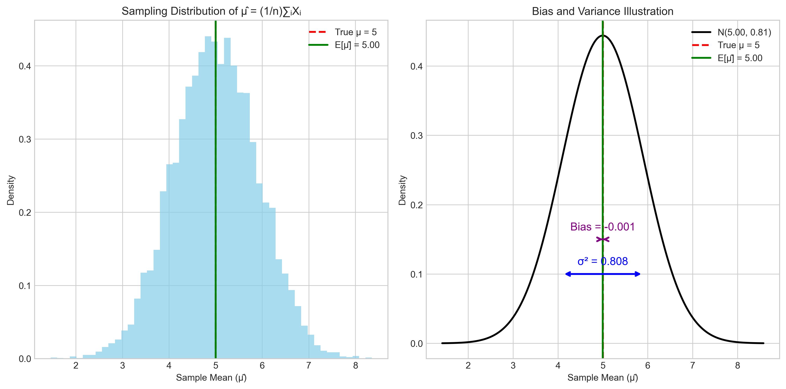
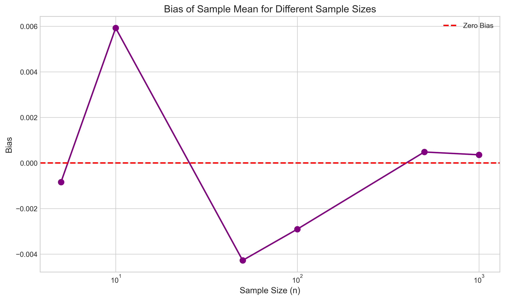
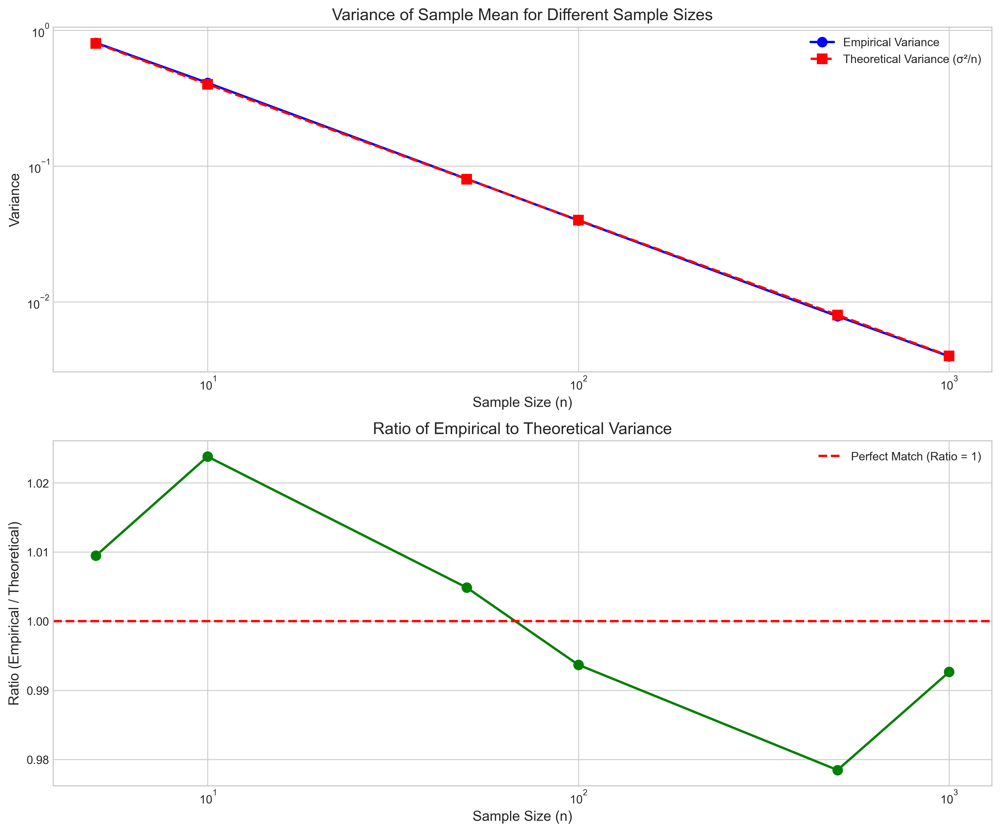
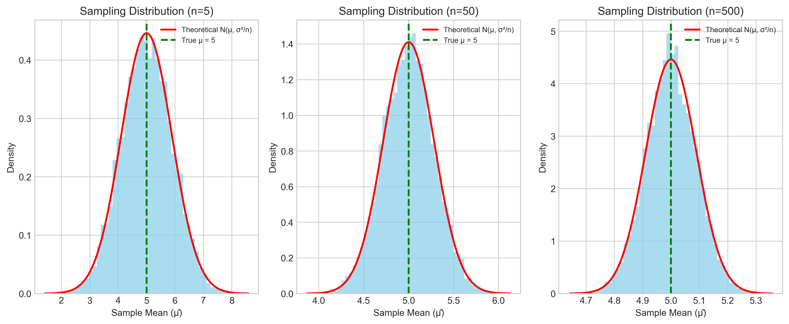

# Question 13: Bias and Variance of Sample Mean Estimator

## Problem Statement
For a random sample $X_1, X_2, \ldots, X_n$ from a distribution with unknown mean $\mu$ and known variance $\sigma^2$, the Point Estimator $\hat{\mu} = \frac{1}{n}\sum_{i=1}^{n}X_i$ is used.

## Task
Calculate the bias and variance of this estimator.

## Solution

### Step 1: Understanding Bias and Variance

To evaluate the quality of an estimator, we need to understand two key properties:

1. **Bias**: The difference between the expected value of the estimator and the true parameter value.
   $$\text{Bias}(\hat{\theta}) = E[\hat{\theta}] - \theta$$

2. **Variance**: The spread of the estimator around its expected value.
   $$\text{Var}(\hat{\theta}) = E[(\hat{\theta} - E[\hat{\theta}])^2]$$

The following figure illustrates these concepts with a simulation of 10,000 sample means, each calculated from 5 observations from a normal distribution with $\mu = 5$ and $\sigma = 2$:

The left panel shows the empirical distribution of the sample mean, while the right panel illustrates the concepts of bias (purple double arrow) and variance (blue double arrow). The true parameter value is indicated by the red dashed line, and the expected value of the estimator by the green line.

### Step 2: Calculating the Bias of the Sample Mean

To calculate the bias of the sample mean $\hat{\mu} = \frac{1}{n}\sum_{i=1}^{n}X_i$, we need to find $E[\hat{\mu}] - \mu$.

Step 1: Calculate $E[\hat{\mu}]$
$$\begin{aligned}
E[\hat{\mu}] &= E\left[\frac{1}{n}\sum_{i=1}^{n}X_i\right] \\
&= \frac{1}{n}\sum_{i=1}^{n}E[X_i] \quad \text{(by linearity of expectation)} \\
&= \frac{1}{n}\sum_{i=1}^{n}\mu \quad \text{(since $E[X_i] = \mu$ for all $i$)} \\
&= \frac{1}{n}(n\cdot\mu) \\
&= \mu
\end{aligned}$$

Step 2: Calculate the bias
$$\begin{aligned}
\text{Bias}(\hat{\mu}) &= E[\hat{\mu}] - \mu \\
&= \mu - \mu \\
&= 0
\end{aligned}$$

Therefore, the sample mean is an unbiased estimator of $\mu$.

### Step 3: Verifying Unbiasedness with Simulations

We can verify the unbiasedness of the sample mean through simulations. The following figure shows the empirical bias of the sample mean for different sample sizes, where each data point is based on 10,000 simulations:

The empirical biases fluctuate around zero, confirming our theoretical result that the sample mean is an unbiased estimator. As the sample size increases, the empirical bias approaches zero more closely.

Sample results from our simulations:
- For $n = 5$: Empirical $E[\hat{\mu}] = 4.999158$, Bias = $-0.000842$
- For $n = 10$: Empirical $E[\hat{\mu}] = 5.005925$, Bias = $0.005925$
- For $n = 50$: Empirical $E[\hat{\mu}] = 4.995723$, Bias = $-0.004277$
- For $n = 100$: Empirical $E[\hat{\mu}] = 4.997094$, Bias = $-0.002906$
- For $n = 500$: Empirical $E[\hat{\mu}] = 5.000482$, Bias = $0.000482$
- For $n = 1000$: Empirical $E[\hat{\mu}] = 5.000359$, Bias = $0.000359$

### Step 4: Calculating the Variance of the Sample Mean

To calculate the variance of the sample mean, we apply the properties of variance:

Step 1: Apply variance properties
$$\begin{aligned}
\text{Var}(\hat{\mu}) &= \text{Var}\left(\frac{1}{n}\sum_{i=1}^{n}X_i\right) \\
&= \left(\frac{1}{n}\right)^2 \cdot \text{Var}\left(\sum_{i=1}^{n}X_i\right)
\end{aligned}$$

Step 2: Since $X_1, X_2, \ldots, X_n$ are independent,
$$\begin{aligned}
\text{Var}\left(\sum_{i=1}^{n}X_i\right) &= \sum_{i=1}^{n}\text{Var}(X_i) \\
&= n\sigma^2 \quad \text{(since $\text{Var}(X_i) = \sigma^2$ for all $i$)}
\end{aligned}$$

Step 3: Substitute back
$$\begin{aligned}
\text{Var}(\hat{\mu}) &= \left(\frac{1}{n}\right)^2 \cdot (n\sigma^2) \\
&= \frac{\sigma^2}{n}
\end{aligned}$$

Therefore, the variance of the sample mean is $\frac{\sigma^2}{n}$.

This result shows that as the sample size $n$ increases, the variance of the sample mean decreases proportionally, making it a more precise estimator for larger samples.

### Step 5: Verifying Variance with Simulations

We can also verify the theoretical variance through simulations. The following figure compares the empirical variance with the theoretical variance $\frac{\sigma^2}{n}$ for different sample sizes:

The top panel shows how both the empirical and theoretical variances decrease with sample size, following the $\frac{\sigma^2}{n}$ relationship. The bottom panel shows the ratio of empirical to theoretical variance, which is close to 1 across all sample sizes, confirming our theoretical derivation.

Sample results from our simulations:
- For $n = 5$: Empirical Variance = $0.807577$, Theoretical = $0.8$, Ratio = $1.0095$
- For $n = 10$: Empirical Variance = $0.409524$, Theoretical = $0.4$, Ratio = $1.0238$
- For $n = 50$: Empirical Variance = $0.080389$, Theoretical = $0.08$, Ratio = $1.0049$
- For $n = 100$: Empirical Variance = $0.039748$, Theoretical = $0.04$, Ratio = $0.9937$
- For $n = 500$: Empirical Variance = $0.007828$, Theoretical = $0.008$, Ratio = $0.9785$
- For $n = 1000$: Empirical Variance = $0.003971$, Theoretical = $0.004$, Ratio = $0.9927$

### Step 6: Visualizing Sampling Distributions

The sampling distribution of the sample mean approaches a normal distribution as the sample size increases, as illustrated below for different sample sizes:

These plots show:
1. As $n$ increases, the sampling distribution becomes narrower (lower variance)
2. The sampling distribution is centered around the true parameter value (unbiased)
3. The distribution becomes more normal as $n$ increases (Central Limit Theorem)

### Step 7: Conclusion

For a random sample $X_1, X_2, \ldots, X_n$ from a distribution with unknown mean $\mu$ and known variance $\sigma^2$, the point estimator $\hat{\mu} = \frac{1}{n}\sum_{i=1}^{n}X_i$ has the following properties:

1. **Bias**: $\text{Bias}(\hat{\mu}) = E[\hat{\mu}] - \mu = \mu - \mu = 0$
   - The sample mean is an unbiased estimator of $\mu$.

2. **Variance**: $\text{Var}(\hat{\mu}) = \frac{\sigma^2}{n}$
   - The variance decreases as the sample size $n$ increases.

These properties make the sample mean an important estimator in statistics:
- It is unbiased, so it doesn't systematically over- or under-estimate the true parameter
- Its variance decreases at a rate of $\frac{1}{n}$, so it becomes more precise with larger samples
- By the Central Limit Theorem, the sampling distribution of $\hat{\mu}$ approaches a normal distribution as $n$ increases, regardless of the original distribution of the data

Therefore, the sample mean $\hat{\mu}$ is not only unbiased but also a consistent estimator of $\mu$. 