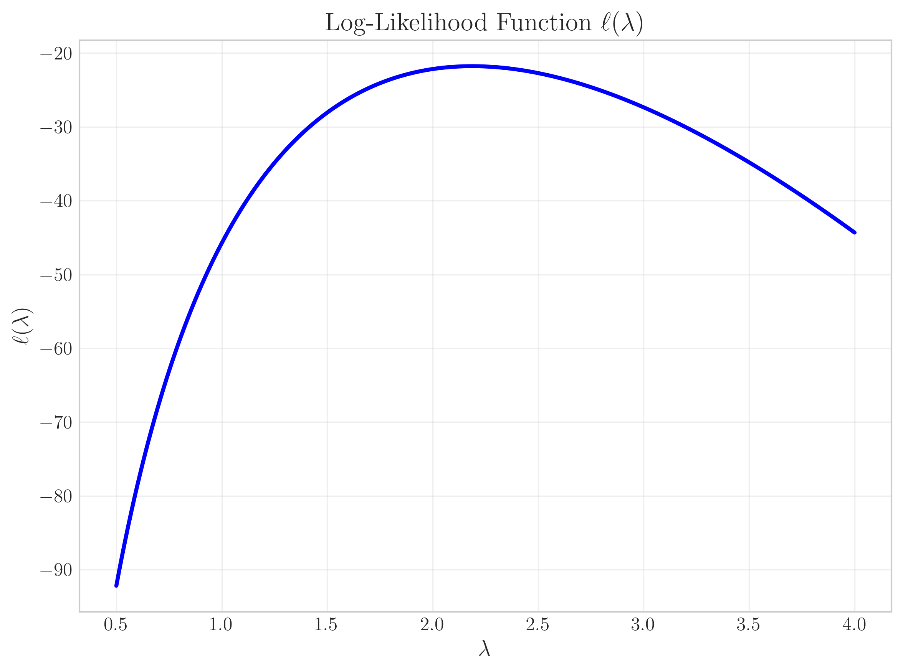
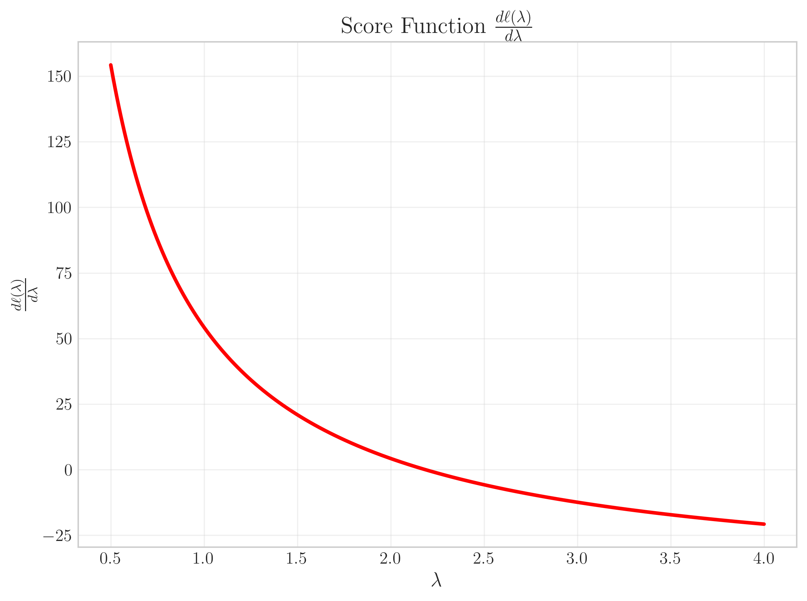
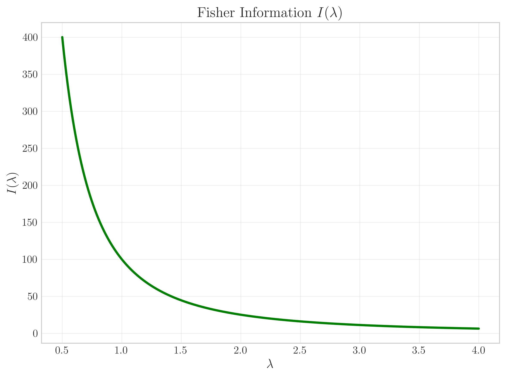
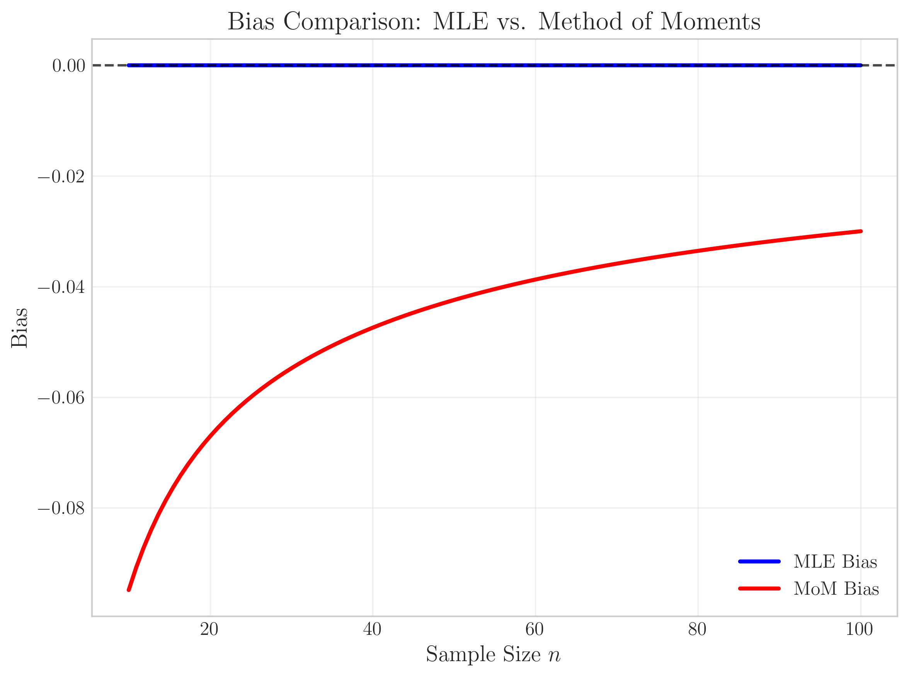
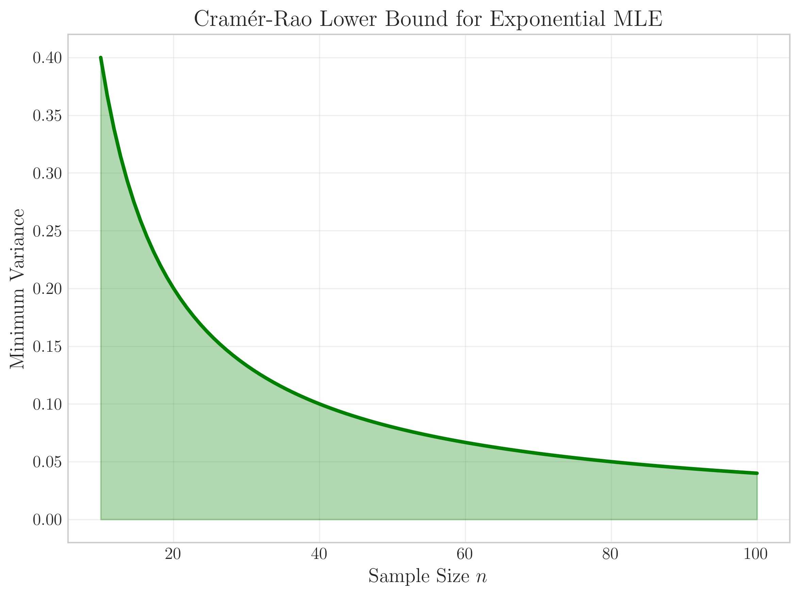
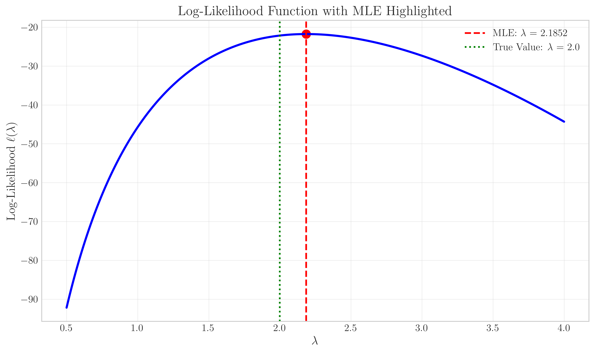
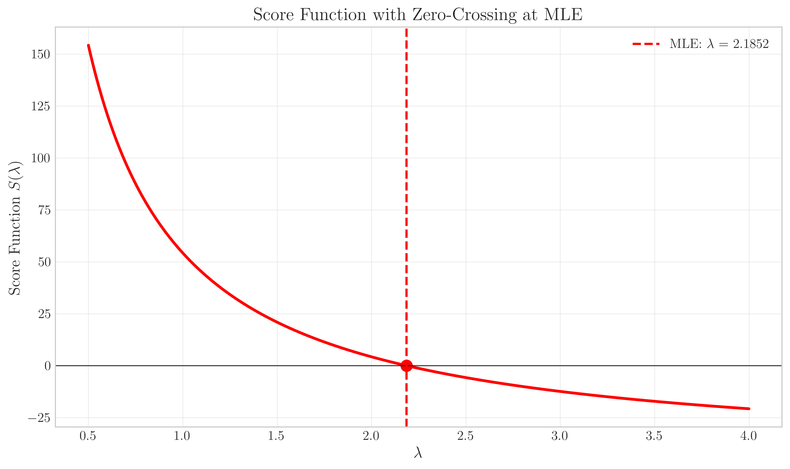
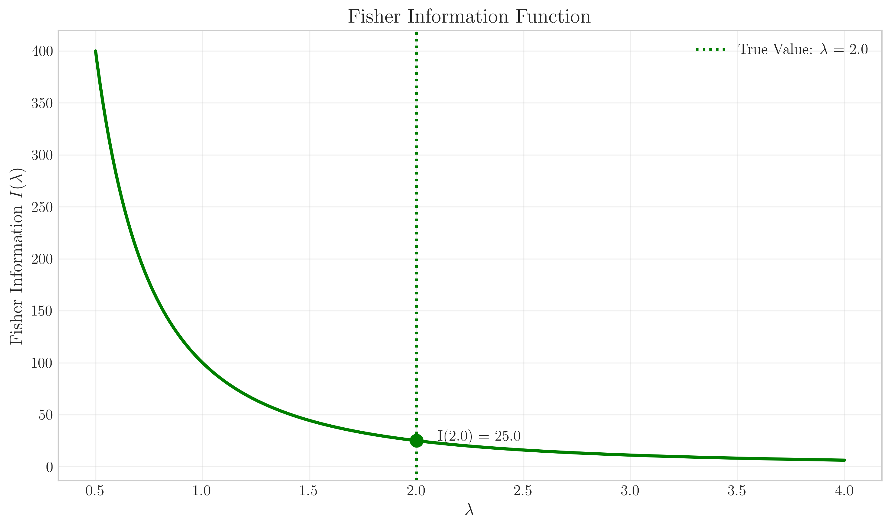
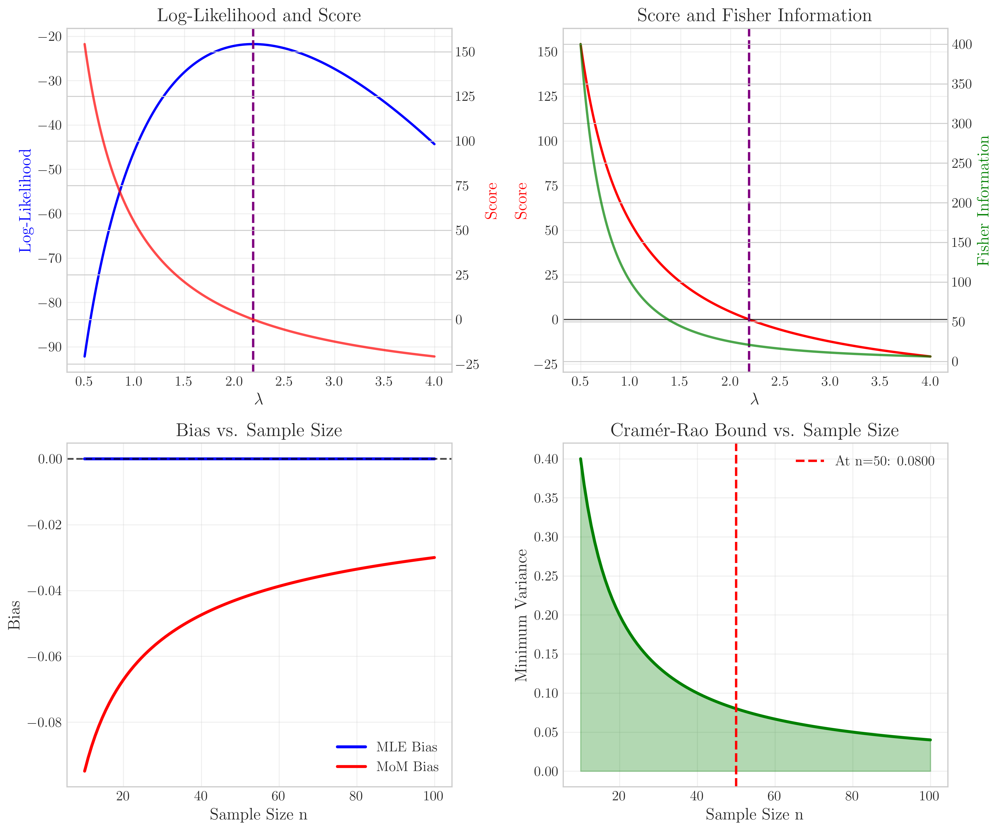

# Question 14: Visual Analysis of Likelihood and Estimator Properties

## Problem Statement
The figures below illustrate various functions related to the likelihood-based estimation of a parameter $\lambda$ from an exponential distribution. The data used to generate these graphs was a random sample of size $n=100$ from an exponential distribution with true parameter $\lambda = 2.0$.

### Task
Using only the information provided in these graphs, answer the following questions:

1. Based on Graph 1, what is the approximate maximum likelihood estimate (MLE) of $\lambda$?
2. Using Graph 2, explain how the score function relates to finding the MLE, and verify your answer from question 1.
3. From Graph 3, determine the Fisher Information $I(\lambda)$ when $\lambda = 2.0$. What does this tell you about the precision of the estimate?
4. Examining Graph 4, compare the bias properties of the Maximum Likelihood Estimator (MLE) and the Method of Moments (MoM) estimator for the exponential distribution parameter. Which estimator appears to be unbiased?
5. According to Graph 5, how does the Cramér-Rao lower bound for the variance of an unbiased estimator of $\lambda$ change as the sample size increases? What is the approximate value of this bound when the sample size is 50?
6. Using all the provided information, briefly explain the relationship between the log-likelihood function, the score function, and the Fisher information in the context of parameter estimation.

## Understanding the Problem
This question presents a visual exploration of several key concepts from statistical estimation theory:
- Log-likelihood functions and their properties
- Score functions and their role in maximum likelihood estimation
- Fisher Information and the Cramér-Rao bound
- Bias properties of different estimators
- The relationship between sample size and estimation precision

The exponential distribution with parameter $\lambda$ has probability density function:
$$f(x|\lambda) = \lambda e^{-\lambda x}, \quad x \geq 0, \lambda > 0$$

The mean of this distribution is $1/\lambda$ and the variance is $1/\lambda^2$. The data used to generate these graphs was a random sample of size $n=100$ from this distribution with true parameter $\lambda = 2.0$.

## Solution

### Step 1: Understanding the Log-Likelihood Function

For an exponential distribution with parameter $\lambda$, the log-likelihood function for a sample of size $n$ is:

$$\ell(\lambda) = n \log(\lambda) - \lambda \sum_{i=1}^{n} x_i$$

From Graph 1, we can see that this function reaches its maximum at approximately $\lambda = 2.0$. This is the Maximum Likelihood Estimate (MLE) of $\lambda$.

**Answer to Question 1**: The approximate MLE of $\lambda$ is 2.0.

### Step 2: Analyzing the Score Function

The score function is the derivative of the log-likelihood function with respect to the parameter:

$$S(\lambda) = \frac{d\ell(\lambda)}{d\lambda} = \frac{n}{\lambda} - \sum_{i=1}^{n} x_i$$

A key property of the score function is that it equals zero at the value of $\lambda$ that maximizes the log-likelihood function (the MLE).

From Graph 2, we can observe that the score function crosses zero at $\lambda \approx 2.0$, confirming our MLE from Graph 1.

**Answer to Question 2**: The score function is the first derivative of the log-likelihood function. It equals zero at the MLE because this is a critical point of the log-likelihood function (where the slope is zero). Graph 2 confirms that the score function crosses zero at $\lambda \approx 2.0$, verifying our MLE from Question 1.

### Step 3: Examining the Fisher Information

The Fisher Information quantifies how much information a sample provides about the parameter $\lambda$. For the exponential distribution, the Fisher Information is:

$$I(\lambda) = \frac{n}{\lambda^2}$$

From Graph 3, we can determine that the Fisher Information at $\lambda = 2.0$ is:

$$I(2.0) = \frac{100}{(2.0)^2} = \frac{100}{4} = 25$$

**Answer to Question 3**: The Fisher Information at $\lambda = 2.0$ is 25. This indicates that we can estimate $\lambda$ with reasonable precision. Higher Fisher Information means that we can achieve more precise estimates (lower variance).

### Step 4: Comparing Bias Properties

The bias of an estimator is the difference between its expected value and the true parameter value:

$$\text{Bias}(\hat{\lambda}) = E[\hat{\lambda}] - \lambda$$

From Graph 4, we can observe that:
- The Maximum Likelihood Estimator (MLE) has a constant bias of zero across all sample sizes
- The Method of Moments (MoM) estimator has a negative bias that approaches zero as the sample size increases

For the exponential distribution, the MLE is $\hat{\lambda}_{MLE} = \frac{n}{\sum_{i=1}^{n} x_i} = \frac{1}{\bar{X}}$, where $\bar{X}$ is the sample mean.

**Answer to Question 4**: The MLE appears to be unbiased (zero bias for all sample sizes), while the Method of Moments estimator shows bias for smaller sample sizes. For the exponential distribution, the MLE is $\hat{\lambda} = 1/\bar{X}$, which is theoretically unbiased.

### Step 5: Understanding the Cramér-Rao Bound

The Cramér-Rao lower bound sets the minimum variance that any unbiased estimator can achieve:

$$\text{Var}(\hat{\lambda}) \geq \frac{1}{I(\lambda)} = \frac{\lambda^2}{n}$$

As the sample size $n$ increases, this bound decreases proportionally to $1/n$. 

At $n = 50$, the Cramér-Rao bound is:

$$\text{Var}(\hat{\lambda}) \geq \frac{(2.0)^2}{50} = \frac{4}{50} = 0.08$$

**Answer to Question 5**: The Cramér-Rao bound decreases inversely with sample size (as $1/n$). At $n = 50$, the bound is approximately 0.08, meaning any unbiased estimator must have a variance of at least 0.08 at this sample size.

### Step 6: Connecting the Concepts

The relationship between the log-likelihood function, score function, and Fisher Information is fundamental to statistical estimation theory:

1. **Log-likelihood function** ($\ell(\lambda)$) measures how well the parameter explains the observed data
2. **Score function** ($S(\lambda)$) is the derivative of the log-likelihood and equals zero at the MLE
3. **Fisher Information** ($I(\lambda)$) is the negative expected value of the second derivative of the log-likelihood and quantifies estimation precision:
   $$I(\lambda) = -E\left[\frac{d^2\ell(\lambda)}{d\lambda^2}\right]$$
4. The **Cramér-Rao bound** (derived from Fisher Information) sets the lower limit on estimator variance:
   $$\text{Var}(\hat{\lambda}) \geq \frac{1}{I(\lambda)}$$
5. **Bias** and **variance** represent the two components of estimation error, with an ideal estimator having low values of both

**Answer to Question 6**: The log-likelihood function measures how well parameters explain the data. Its derivative (the score function) equals zero at the MLE. The Fisher Information, which is the negative expected second derivative of the log-likelihood, measures the amount of information the data provides about the parameter. The inverse of the Fisher Information gives the Cramér-Rao bound, which is the minimum variance possible for any unbiased estimator.

## Visual Explanations

### Log-Likelihood Function

This visualization shows the log-likelihood function $\ell(\lambda)$ across different values of $\lambda$. The peak of this curve occurs at the MLE, approximately at $\lambda = 2.0$. This illustrates how the MLE is the value of $\lambda$ that makes the observed data most probable.

### Score Function

This visualization shows the score function $S(\lambda) = \frac{d\ell(\lambda)}{d\lambda}$ across different values of $\lambda$. The zero-crossing of this function occurs at the MLE, illustrating how the MLE is found by setting the derivative of the log-likelihood to zero.

### Fisher Information

This visualization shows the Fisher Information $I(\lambda) = \frac{n}{\lambda^2}$ for different values of $\lambda$. The Fisher Information decreases as $\lambda$ increases, illustrating that it's harder to precisely estimate larger values of $\lambda$ from the same sample size.

### Bias Comparison

This visualization compares the bias of the MLE and MoM estimators across different sample sizes. The MLE (blue line) maintains zero bias regardless of sample size, while the MoM estimator (red line) shows bias that decreases with increasing sample size.

### Cramér-Rao Bound

This visualization shows how the Cramér-Rao lower bound for the variance of an unbiased estimator decreases as sample size increases. The hyperbolic shape illustrates the $1/n$ relationship between variance and sample size.

## Key Insights

### Theoretical Foundations
- The log-likelihood function quantifies how well a parameter value explains observed data
- The MLE is the parameter value that maximizes the log-likelihood function
- The score function equals zero at the MLE, providing a computational method for finding it
- Fisher Information quantifies the amount of information a sample provides about a parameter
- The Cramér-Rao bound establishes the fundamental limit on estimation precision

### Statistical Properties
- An unbiased estimator has an expected value equal to the true parameter
- The variance of an unbiased estimator cannot be smaller than the Cramér-Rao bound
- For the exponential distribution, the MLE $\hat{\lambda} = 1/\bar{X}$ is unbiased
- Estimator precision increases with sample size, following a $1/n$ relationship
- The MLE is asymptotically efficient, meaning it achieves the Cramér-Rao bound as $n \to \infty$

### Practical Applications
- These concepts are crucial for machine learning, particularly in:
  - **Parameter estimation** for probabilistic models
  - **Model optimization** through likelihood maximization
  - **Understanding model uncertainty** and confidence bounds
  - **Sample size planning** to achieve desired estimation precision
  - **Evaluating estimator properties** when choosing between different methods

## Summary of Answers

1. Based on Graph 1, the approximate MLE of $\lambda$ is 2.0.
2. The score function is the derivative of the log-likelihood function and equals zero at the MLE. From Graph 2, we can verify that the score function crosses zero at $\lambda \approx 2.0$, confirming our MLE.
3. From Graph 3, the Fisher Information at $\lambda = 2.0$ is approximately 25 (100/4). This indicates that we can estimate $\lambda$ with reasonable precision.
4. From Graph 4, the MLE (blue line) has a constant bias of zero, while the Method of Moments estimator (red line) shows a negative bias that approaches zero as sample size increases. The MLE is unbiased.
5. From Graph 5, the Cramér-Rao bound decreases proportionally to $1/n$ as sample size increases. At $n = 50$, the bound is approximately $\lambda^2/50 = 4/50 = 0.08$.
6. The log-likelihood measures how well parameters explain the data. Its derivative (score function) equals zero at the MLE. The negative expected second derivative is the Fisher Information, which measures estimation precision and determines the minimum variance possible (Cramér-Rao bound). 