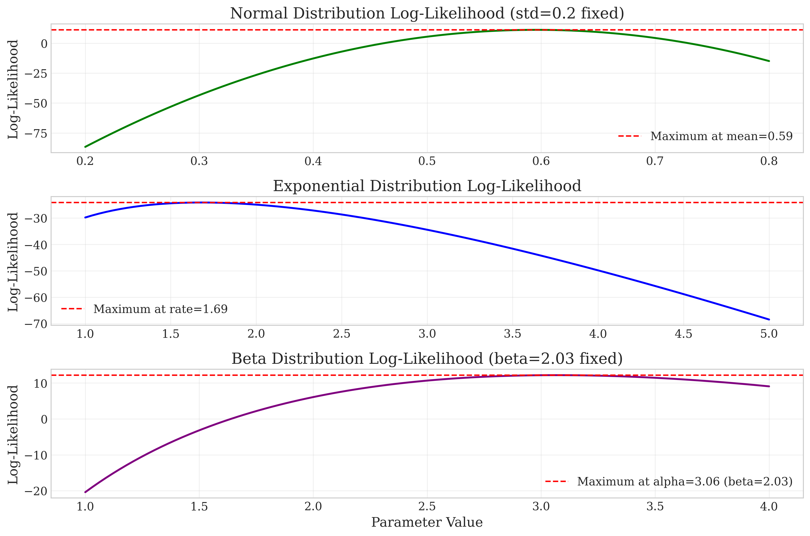

# Question 15: Likelihood Functions and Distribution Fitting

## Problem Statement
A researcher has collected 50 data points on a continuous random variable X, which takes values between 0 and 1. The researcher wants to determine the best probabilistic model for this data by comparing three different distribution families: Beta, Normal, and Exponential. The following figures show different aspects of the likelihood analysis.

## Task
Using only the information provided in these graphs, answer the following questions:

1. Based on Figure 3, what are the maximum likelihood estimates for the parameters of each distribution model?
2. According to Figure 6, which distribution family best fits the observed data? Explain your reasoning.
3. Looking at Figure 4, visually assess how well each fitted distribution matches the observed data histogram.
4. Using Figure 5, explain the key difference between probability and likelihood in your own words.
5. Based on all the information provided, which distribution would you recommend using to model this data? Justify your answer.

## Solution

### Question 1: Maximum Likelihood Estimates

From Figure 3 (Log-Likelihood Comparisons), we can read the MLE values for each distribution:

- **Normal Distribution**: mean = 0.59
- **Exponential Distribution**: rate = 1.69
- **Beta Distribution**: alpha = 3.06, beta = 2.03

These are the parameter values that maximize the log-likelihood function for each distribution family. The vertical red dashed lines in each plot indicate these MLE values.

### Question 2: Best-Fitting Distribution

From Figure 6 (Likelihood Ratio Comparison), we can see that the Beta distribution has the highest log-likelihood value, followed by the Normal distribution, and then the Exponential distribution. 

The log-likelihood values are approximately:
- Beta: -21.96
- Normal: -36.44
- Exponential: -44.17

The relative likelihood values (shown by the bar heights) indicate that the Beta distribution is exponentially more likely to have generated the data compared to the other distributions. The likelihood ratio between Beta and Normal is so large that the Normal's relative likelihood is nearly zero on this scale.

Therefore, the Beta distribution provides the best fit to the observed data according to the likelihood criterion.

### Question 3: Visual Assessment of Fit

Looking at Figure 4 (Fitted PDFs), we can visually assess how well each fitted distribution matches the observed data histogram:

- **Beta Distribution (purple line)**: This distribution appears to match the shape of the histogram very well. It captures the slight right skew in the data and aligns with the central tendency of the observations.

- **Normal Distribution (green line)**: While it captures the central tendency of the data, it extends significantly beyond the [0,1] range (which is impossible for the data) and doesn't match the slight skewness in the histogram.

- **Exponential Distribution (blue line)**: This distribution shows a poor fit, as it suggests a monotonically decreasing density, whereas the data appears to have a peak around 0.6.

The visual assessment confirms that the Beta distribution provides the best fit to the data, which aligns with the likelihood-based conclusion.

### Question 4: Probability vs. Likelihood

Figure 5 (Probability vs. Likelihood) illustrates the fundamental difference between probability and likelihood:

- **Probability** (top panel): Here, we fix the distribution (with set parameters) and vary the data point. The y-axis shows the probability density for different possible data values. Probability answers the question: "Given a specific distribution, what is the chance of observing a particular data point?"

- **Likelihood** (bottom panel): Here, we fix the data point (x = 0.5) and vary the distribution parameter (alpha). The y-axis shows how likely that fixed data point would be under different parameter values. Likelihood answers the question: "Given the observed data, which parameter values would make this data most probable?"

The key difference is in what's fixed and what varies:
- In probability, the distribution is fixed, and we assess different possible data values.
- In likelihood, the data is fixed, and we assess different possible distribution parameters.

Probability flows from parameters to data, while likelihood flows from data to parameters. This is why likelihood is fundamental to parameter estimation in statistics.

### Question 5: Recommended Distribution

Based on all the information provided, I would recommend using the Beta distribution to model this data for the following reasons:

1. **Highest Likelihood**: The Beta distribution has the highest log-likelihood value, indicating it best explains the observed data among the three candidates.

2. **Appropriate Domain**: The Beta distribution is defined on the interval [0,1], which matches the range of the observed data. Unlike the Normal distribution, it doesn't assign probability to impossible values outside this range.

3. **Flexible Shape**: The Beta distribution with parameters alpha ≈ 3.06 and beta ≈ 2.03 captures the slight right skew in the data that the symmetric Normal distribution cannot model accurately.

4. **Visual Fit**: As seen in Figure 4, the Beta distribution provides the best visual fit to the histogram of the observed data.

The evidence from both likelihood analysis and visual inspection strongly supports choosing the Beta distribution as the most appropriate model for this dataset. 