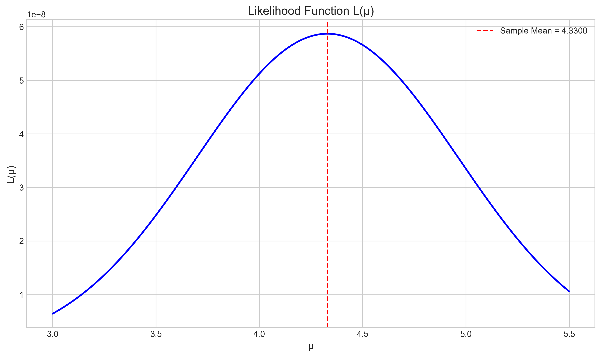

# Question 1: Likelihood Function and MLE

## Problem Statement
Consider a random sample $X_1, X_2, \ldots, X_{10}$ from a normal distribution with unknown mean $\mu$ and known standard deviation $\sigma = 2$. Suppose we observe the following values:
$\{4.2, 3.8, 5.1, 4.5, 3.2, 4.9, 5.3, 4.0, 4.7, 3.6\}$

## Tasks
1. Write down the likelihood function $L(\mu)$ for this sample
2. Write down the log-likelihood function $\ell(\mu)$
3. Calculate the maximum likelihood estimate for $\mu$
4. Find the likelihood ratio for testing $H_0: \mu = 5$ versus $H_1: \mu \neq 5$

## Solution

### Step 1: Understanding the Problem

We are given a sample of 10 observations from a normal distribution $N(\mu, \sigma^2)$ where:
- The mean $\mu$ is unknown and needs to be estimated
- The standard deviation is known to be $\sigma = 2$
- Our sample consists of the values: $\{4.2, 3.8, 5.1, 4.5, 3.2, 4.9, 5.3, 4.0, 4.7, 3.6\}$

Our goal is to find the most likely value of $\mu$ based on these observations using the maximum likelihood method.

### Step 2: Likelihood Function

The likelihood function represents the probability of observing our data given a particular value of the parameter $\mu$. For a normal distribution, the likelihood function is:

$$L(\mu) = \prod_{i=1}^{n} f(x_i|\mu) = \prod_{i=1}^{n} \frac{1}{\sigma\sqrt{2\pi}} \exp\left(-\frac{(x_i-\mu)^2}{2\sigma^2}\right)$$

Simplifying this expression:

$$L(\mu) = \left(\frac{1}{\sigma\sqrt{2\pi}}\right)^n \exp\left(-\frac{\sum(x_i-\mu)^2}{2\sigma^2}\right)$$

With our data and $\sigma = 2$:

$$L(\mu) = \left(\frac{1}{2\sqrt{2\pi}}\right)^{10} \exp\left(-\frac{\sum(x_i-\mu)^2}{2 \cdot 2^2}\right)$$

The graph below shows the likelihood function for different values of $\mu$:

### Step 3: Log-Likelihood Function

Since the likelihood function involves products and exponentials, it's often more convenient to work with the log-likelihood function. Taking the natural logarithm of the likelihood function:

$$\ell(\mu) = \log(L(\mu)) = n \log\left(\frac{1}{\sigma\sqrt{2\pi}}\right) - \frac{\sum(x_i-\mu)^2}{2\sigma^2}$$

This can be further simplified to:

$$\ell(\mu) = -n\log(\sigma) - \frac{n}{2}\log(2\pi) - \frac{\sum(x_i-\mu)^2}{2\sigma^2}$$

With our data and $\sigma = 2$:

$$\ell(\mu) = -10\log(2) - \frac{10}{2}\log(2\pi) - \frac{\sum(x_i-\mu)^2}{2 \cdot 2^2}$$

The first two terms are constants with respect to $\mu$, so they don't affect the maximization. The graph below shows the log-likelihood function:

### Step 4: Maximum Likelihood Estimation

To find the maximum likelihood estimate (MLE), we take the derivative of the log-likelihood function with respect to $\mu$, set it to zero, and solve for $\mu$:

$$\frac{d\ell(\mu)}{d\mu} = \frac{1}{\sigma^2} \sum(x_i-\mu) = 0$$

Simplifying:

$$\sum(x_i-\mu) = 0$$
$$\sum x_i - n\mu = 0$$
$$\mu = \frac{1}{n} \sum x_i$$

Therefore, the MLE for $\mu$ is the sample mean:

$$\hat{\mu} = \frac{1}{n} \sum x_i = \frac{1}{10}(4.2 + 3.8 + 5.1 + 4.5 + 3.2 + 4.9 + 5.3 + 4.0 + 4.7 + 3.6) = 4.33$$

This result is confirmed by:
1. The peak of the likelihood function occurs at $\mu = 4.33$
2. The peak of the log-likelihood function also occurs at $\mu = 4.33$
3. Numerical optimization yields the same result

### Step 5: Likelihood Ratio Test

The likelihood ratio test compares the likelihood of the data under a specific value of the parameter (null hypothesis) to the likelihood under the MLE. For our problem:

- Null hypothesis $H_0: \mu = 5$
- Alternative hypothesis $H_1: \mu \neq 5$

The likelihood ratio is calculated as:

$$\lambda = \frac{L(\mu = 5)}{L(\mu = \hat{\mu})} = \frac{L(5)}{L(4.33)}$$

From our calculations:
- Likelihood under $H_0$ ($\mu = 5$): $3.349 \times 10^{-8}$
- Likelihood under MLE ($\mu = 4.33$): $5.869 \times 10^{-8}$
- Likelihood ratio: $\lambda = 0.5706$

A likelihood ratio less than 1 indicates that the null hypothesis is less plausible than the MLE.

The log-likelihood ratio is:
$$\log(\lambda) = -0.5611$$

The chi-squared statistic for the likelihood ratio test is:
$$-2\log(\lambda) = 1.1223$$

Under the null hypothesis, this statistic follows a chi-squared distribution with 1 degree of freedom.

### Step 6: Summary of Results

Our comprehensive analysis is visualized in the summary figure:

The figure shows:
- Top left: The distribution of our sample data
- Top right: The normal PDFs with both the MLE and null hypothesis means
- Bottom left: The likelihood function
- Bottom right: The normalized likelihood with the likelihood ratio indicated

## Conclusion

1. The likelihood function for this sample is:
   $$L(\mu) = \left(\frac{1}{2\sqrt{2\pi}}\right)^{10} \exp\left(-\frac{\sum(x_i-\mu)^2}{8}\right)$$

2. The log-likelihood function is:
   $$\ell(\mu) = -10\log(2) - 5\log(2\pi) - \frac{\sum(x_i-\mu)^2}{8}$$

3. The maximum likelihood estimate for $\mu$ is:
   $$\hat{\mu} = 4.33$$

4. The likelihood ratio for testing $H_0: \mu = 5$ versus $H_1: \mu \neq 5$ is:
   $$\lambda = 0.5706$$

The likelihood ratio test suggests that the value $\mu = 5$ is plausible but less likely than the MLE value of $\mu = 4.33$. The relatively high likelihood ratio (not extremely close to zero) indicates that we might not have enough evidence to strongly reject the null hypothesis. 