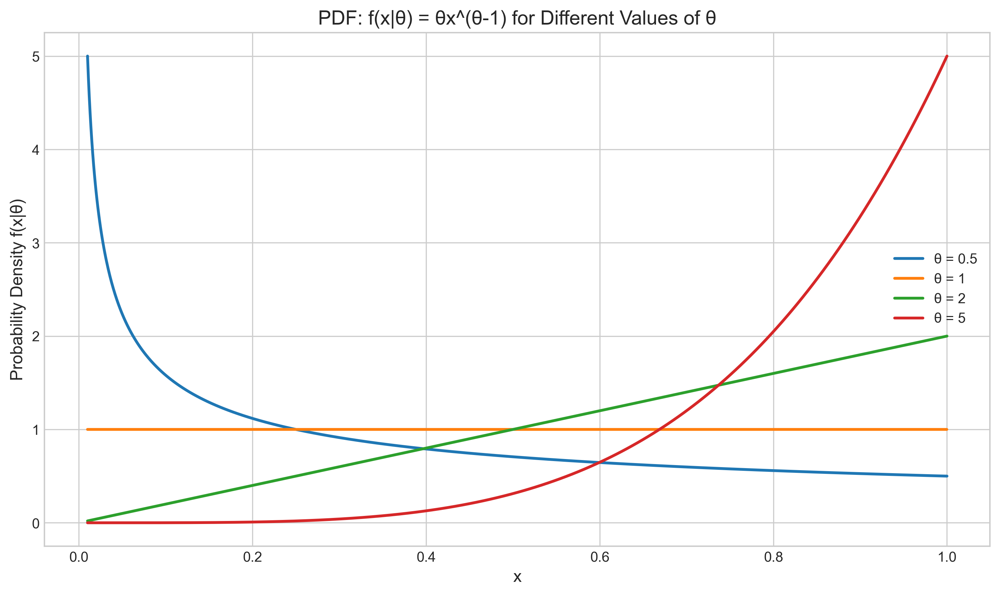
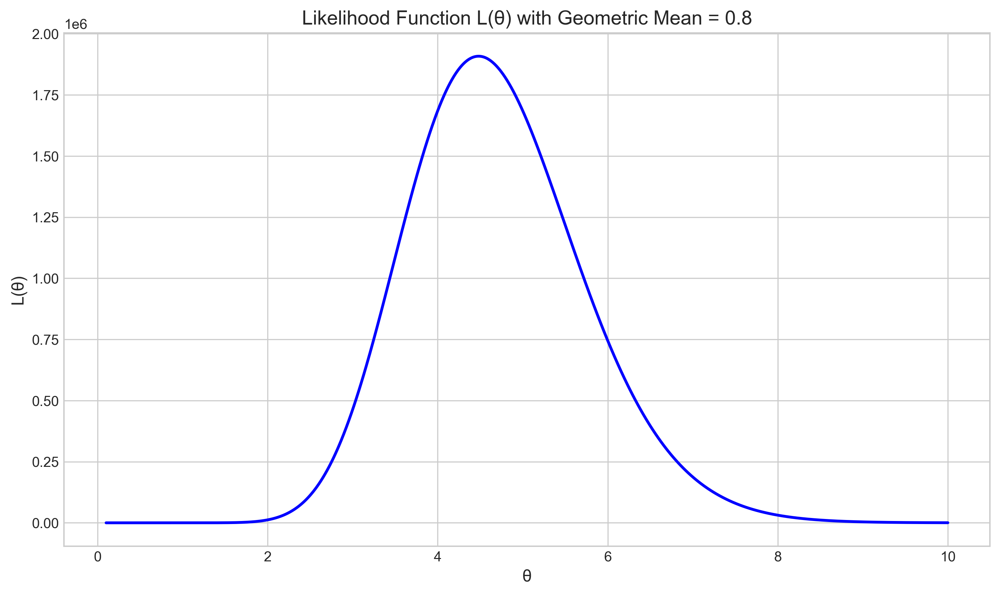
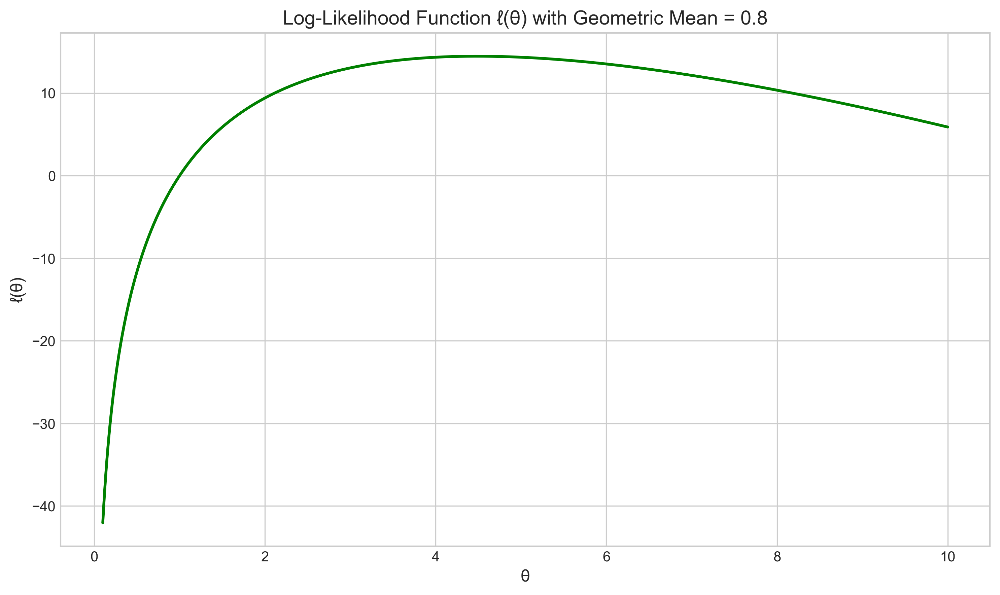
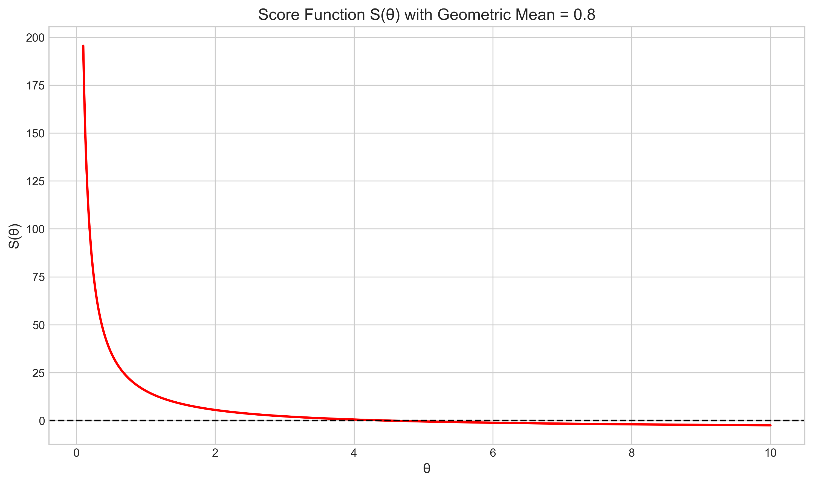
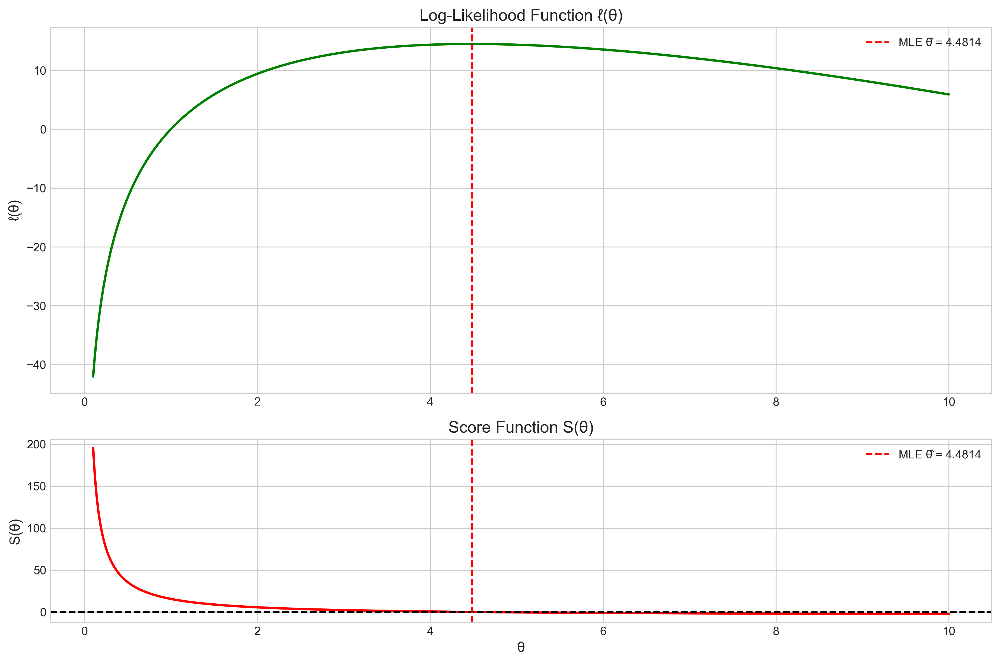
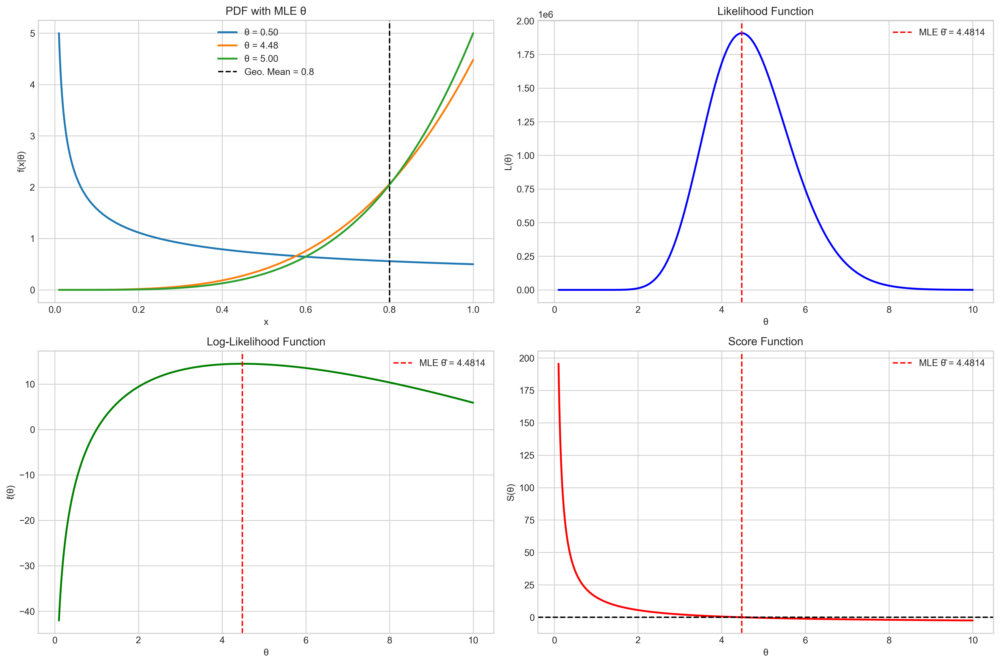

# Question 2: Likelihood and Score Function

## Problem Statement
Let $X_1, X_2, \ldots, X_{20}$ be a random sample from a distribution with PDF:

$$f(x|\theta) = \theta x^{\theta-1}, \quad 0 < x < 1, \theta > 0$$

## Tasks
1. Derive the likelihood function $L(\theta)$
2. Derive the log-likelihood function $\ell(\theta)$
3. Find the score function (the derivative of the log-likelihood with respect to $\theta$)
4. Suppose the observed data has geometric mean 0.8. Find the maximum likelihood estimate for $\theta$

## Solution

### Step 1: Understanding the Problem

We are working with a random sample of size 20 from a distribution with the probability density function:

$$f(x|\theta) = \theta x^{\theta-1}, \quad 0 < x < 1, \theta > 0$$

This is a power function distribution with parameter $\theta$. The shape of the distribution changes significantly as $\theta$ changes:

- For $\theta < 1$: The PDF approaches infinity as $x$ approaches 0
- For $\theta = 1$: The PDF is uniform on (0,1)
- For $\theta > 1$: The PDF increases as $x$ increases, with higher values of $\theta$ pushing more probability mass toward 1

Our goal is to find the most likely value of $\theta$ given that the geometric mean of our data is 0.8.

### Step 2: Likelihood Function

The likelihood function represents the joint probability density of observing our particular sample, as a function of the parameter $\theta$. For a random sample $X_1, X_2, \ldots, X_n$, the likelihood function is:

$$L(\theta) = \prod_{i=1}^{n} f(x_i|\theta) = \prod_{i=1}^{n} \theta x_i^{\theta-1}$$

We can rewrite this as:

$$L(\theta) = \theta^n \cdot \prod_{i=1}^{n} x_i^{\theta-1} = \theta^n \cdot \left(\prod_{i=1}^{n} x_i\right)^{\theta-1}$$

The term $\prod_{i=1}^{n} x_i$ is related to the geometric mean of the data. Specifically, if we denote the geometric mean as $\bar{x}_g$, then $\bar{x}_g^n = \prod_{i=1}^{n} x_i$. Thus:

$$L(\theta) = \theta^n \cdot \left(\bar{x}_g^n\right)^{\theta-1} = \theta^n \cdot \bar{x}_g^{n(\theta-1)}$$

For our case with $n = 20$ and $\bar{x}_g = 0.8$, the likelihood function is:

$$L(\theta) = \theta^{20} \cdot (0.8)^{20(\theta-1)}$$

The graph below shows the likelihood function for different values of $\theta$:

### Step 3: Log-Likelihood Function

Taking the natural logarithm of the likelihood function gives us the log-likelihood function:

$$\ell(\theta) = \log(L(\theta)) = \log\left(\theta^n \cdot \left(\prod_{i=1}^{n} x_i\right)^{\theta-1}\right)$$

Using the properties of logarithms:

$$\ell(\theta) = n\log(\theta) + (\theta-1)\log\left(\prod_{i=1}^{n} x_i\right)$$

The product inside the logarithm can be rewritten as a sum of logarithms:

$$\ell(\theta) = n\log(\theta) + (\theta-1)\sum_{i=1}^{n} \log(x_i)$$

Since the geometric mean $\bar{x}_g$ satisfies $\log(\bar{x}_g) = \frac{1}{n}\sum_{i=1}^{n} \log(x_i)$, we can rewrite the log-likelihood as:

$$\ell(\theta) = n\log(\theta) + (\theta-1) \cdot n \cdot \log(\bar{x}_g)$$

With $n = 20$ and $\bar{x}_g = 0.8$:

$$\ell(\theta) = 20\log(\theta) + (\theta-1) \cdot 20 \cdot \log(0.8)$$

Since $\log(0.8) < 0$, the second term is negative for $\theta > 1$, which creates a natural balancing effect in the log-likelihood function.

### Step 4: Score Function

The score function is the derivative of the log-likelihood function with respect to the parameter $\theta$:

$$S(\theta) = \frac{d\ell(\theta)}{d\theta} = \frac{d}{d\theta}[n\log(\theta) + (\theta-1) \cdot n \cdot \log(\bar{x}_g)]$$

Computing the derivative:

$$S(\theta) = \frac{n}{\theta} + n \cdot \log(\bar{x}_g)$$

This can be factored as:

$$S(\theta) = n \cdot \left[\frac{1}{\theta} + \log(\bar{x}_g)\right]$$

For our case with $\bar{x}_g = 0.8$:

$$S(\theta) = 20 \cdot \left[\frac{1}{\theta} + \log(0.8)\right]$$

The score function is graphed below, with the horizontal line at 0 indicating where the log-likelihood function achieves its maximum:

### Step 5: Maximum Likelihood Estimation

To find the maximum likelihood estimate (MLE) for $\theta$, we set the score function equal to zero and solve for $\theta$:

$$S(\theta) = n \cdot \left[\frac{1}{\theta} + \log(\bar{x}_g)\right] = 0$$

Since $n \neq 0$, we have:

$$\frac{1}{\theta} + \log(\bar{x}_g) = 0$$
$$\frac{1}{\theta} = -\log(\bar{x}_g)$$
$$\theta = -\frac{1}{\log(\bar{x}_g)}$$

For our case with $\bar{x}_g = 0.8$:

$$\theta = -\frac{1}{\log(0.8)} = -\frac{1}{-0.2231} = 4.4814$$

This can be verified through numerical optimization, which yields the same result:

The top panel shows the log-likelihood function with its maximum at $\theta = 4.4814$, and the bottom panel shows the score function crossing zero at the same value.

### Step 6: Comprehensive Analysis and Interpretation

Our analysis is summarized in this comprehensive visualization:

This figure shows:
- Top left: The PDF of the distribution for different values of $\theta$, including our MLE
- Top right: The likelihood function with the MLE indicated
- Bottom left: The log-likelihood function, which is maximized at the MLE
- Bottom right: The score function, which crosses zero at the MLE

## Conclusion

1. The likelihood function is:
   $$L(\theta) = \theta^{20} \cdot (0.8)^{20(\theta-1)}$$

2. The log-likelihood function is:
   $$\ell(\theta) = 20\log(\theta) + (\theta-1) \cdot 20 \cdot \log(0.8)$$

3. The score function is:
   $$S(\theta) = 20 \cdot \left[\frac{1}{\theta} + \log(0.8)\right]$$

4. The maximum likelihood estimate for $\theta$ is:
   $$\hat{\theta} = -\frac{1}{\log(0.8)} = 4.4814$$

This value of $\theta$ maximizes the likelihood function and represents the parameter value that makes our observed data (with geometric mean 0.8) most probable.

### Interpretation

For the distribution $f(x|\theta) = \theta x^{\theta-1}$ with $0 < x < 1$ and $\theta > 0$:
- When the geometric mean of the data is 0.8, the most likely value of the parameter $\theta$ is approximately 4.48
- With this value of $\theta$, the distribution places more probability mass on values closer to 1, which is consistent with having a geometric mean of 0.8
- The fact that $\theta > 1$ indicates that the probability density increases as $x$ increases on the interval (0,1)
- This specific relationship between the geometric mean and the MLE demonstrates how sufficient statistics can simplify parameter estimation 