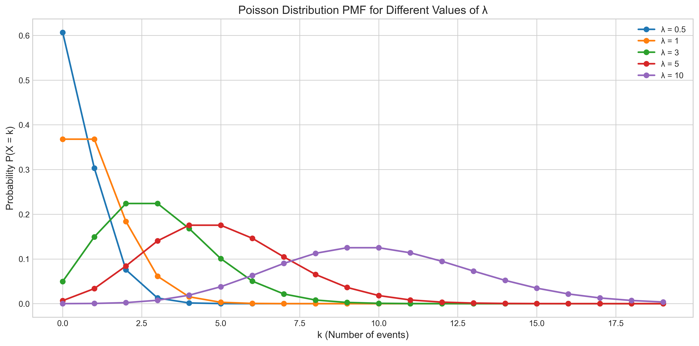
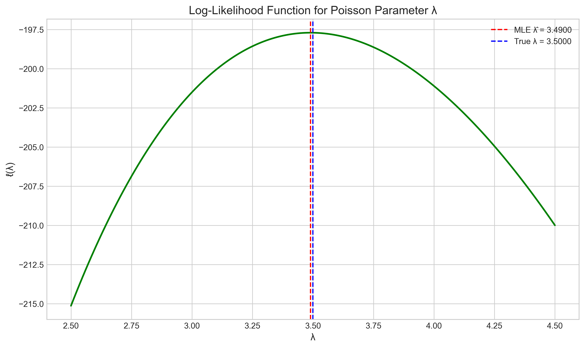
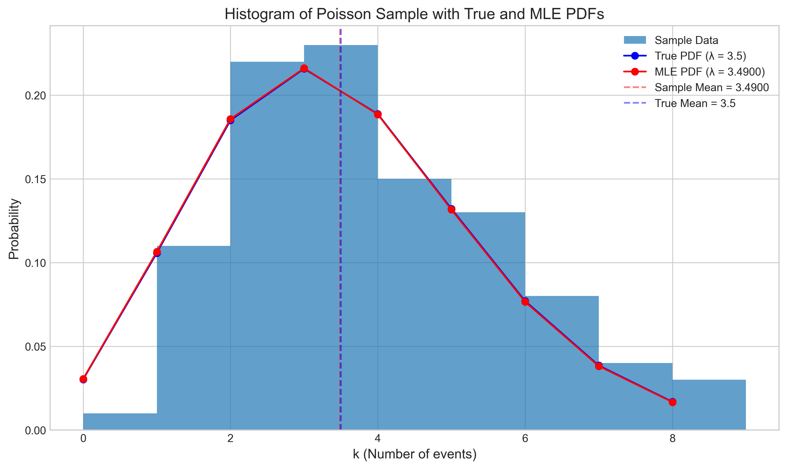
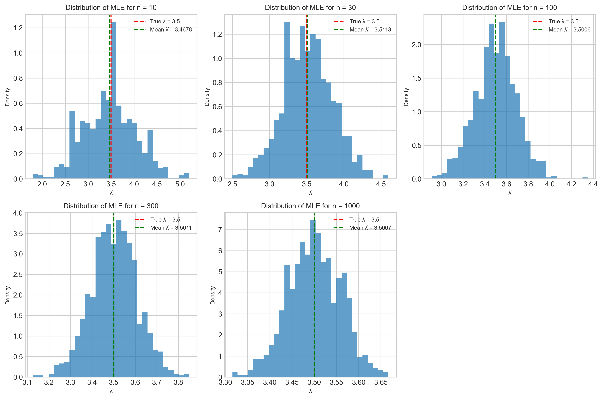
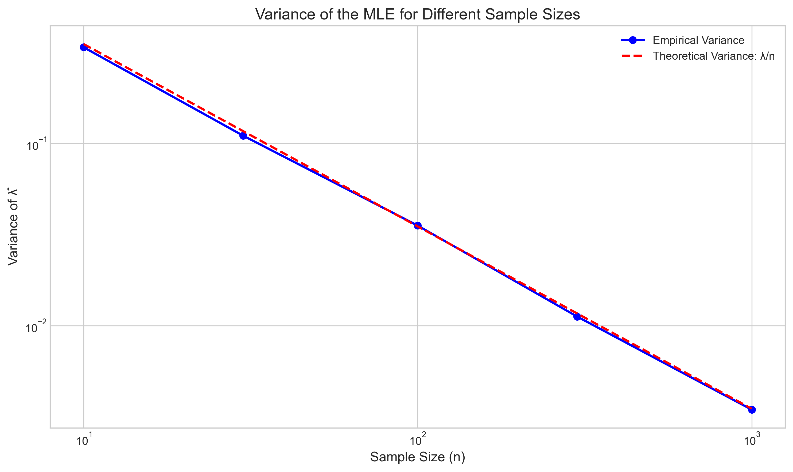
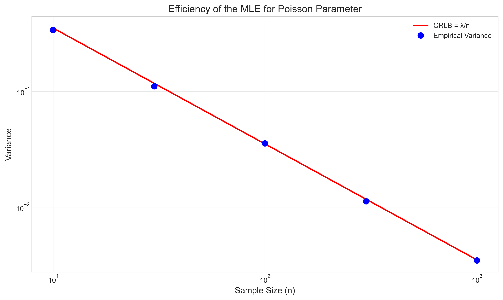
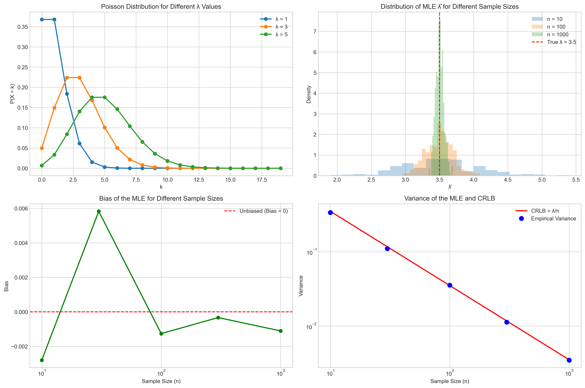

# Question 3: Properties of Poisson MLE

## Problem Statement
Consider estimating the parameter $\lambda$ of a Poisson distribution based on $n$ independent observations $X_1, X_2, \ldots, X_n$.

## Tasks
1. Derive the maximum likelihood estimator (MLE) for $\lambda$
2. Is this estimator unbiased? If not, calculate its bias
3. Calculate the variance of the MLE
4. Find the Cramér-Rao lower bound for the variance of any unbiased estimator of $\lambda$ and determine whether the MLE achieves this bound

## Solution

### Step 1: Understanding the Poisson Distribution

The Poisson distribution is a discrete probability distribution that expresses the probability of a given number of events occurring within a fixed interval of time or space, assuming these events occur independently and at a constant average rate. The probability mass function (PMF) of a Poisson random variable $X$ with parameter $\lambda$ is:

$$P(X = k) = \frac{e^{-\lambda} \lambda^k}{k!}, \quad k = 0, 1, 2, \ldots$$

Where:
- $\lambda$ is the average number of events per interval
- $k$ is the number of events that occurred
- $e$ is Euler's number (approximately 2.718)

The shape of the Poisson distribution changes with the parameter $\lambda$:

Key properties of the Poisson distribution:
- Mean: $E[X] = \lambda$
- Variance: $\text{Var}(X) = \lambda$

### Step 2: Deriving the Maximum Likelihood Estimator

The maximum likelihood estimator (MLE) is the value of the parameter that maximizes the likelihood of the observed data. To find the MLE for $\lambda$, we need to:

1. Write down the likelihood function
2. Take the logarithm to get the log-likelihood function
3. Find the value of $\lambda$ that maximizes the log-likelihood

#### Likelihood Function

For a random sample $X_1, X_2, \ldots, X_n$ from a Poisson distribution, the likelihood function is:

$$L(\lambda) = \prod_{i=1}^{n} \frac{e^{-\lambda} \lambda^{X_i}}{X_i!} = e^{-n\lambda} \lambda^{\sum X_i} \prod_{i=1}^{n} \frac{1}{X_i!}$$

#### Log-Likelihood Function

Taking the natural logarithm of the likelihood function gives the log-likelihood function:

$$\ell(\lambda) = \log(L(\lambda)) = -n\lambda + \left(\sum_{i=1}^{n} X_i \right) \log(\lambda) - \sum_{i=1}^{n} \log(X_i!)$$

#### Finding the MLE

To find the maximum, we take the derivative of the log-likelihood with respect to $\lambda$ and set it equal to zero:

$$\frac{d\ell(\lambda)}{d\lambda} = -n + \frac{\sum X_i}{\lambda} = 0$$

Solving for $\lambda$:

$$\frac{\sum X_i}{\lambda} = n$$
$$\lambda = \frac{\sum X_i}{n} = \bar{X}$$

Therefore, the maximum likelihood estimator for the Poisson parameter $\lambda$ is the sample mean $\bar{X}$.

We can verify this result by plotting the log-likelihood function for a simulated dataset:

As shown in the plot, the log-likelihood function is maximized at the sample mean (red dashed line), close to the true parameter value (blue dashed line) used to generate the data.

We can also visualize how well the MLE fits the data by comparing the observed distribution to the PMF with the estimated parameter:

The red curve (PMF with MLE) closely matches the blue curve (PMF with true parameter), confirming that the sample mean provides a good estimate of $\lambda$.

### Step 3: Determining if the MLE is Unbiased

An estimator is unbiased if its expected value equals the parameter it estimates. To check if the MLE $\hat{\lambda} = \bar{X}$ is unbiased:

$$E[\hat{\lambda}] = E[\bar{X}] = E\left[\frac{1}{n}\sum_{i=1}^{n} X_i\right] = \frac{1}{n}E\left[\sum_{i=1}^{n} X_i\right] = \frac{1}{n}\sum_{i=1}^{n} E[X_i] = \frac{1}{n} \cdot n \cdot \lambda = \lambda$$

Since $E[\hat{\lambda}] = \lambda$, the MLE is an unbiased estimator for the Poisson parameter $\lambda$.

We can verify this empirically through simulation by generating multiple samples and calculating the average of the MLEs:

As the sample size increases, the distribution of the MLE becomes more concentrated around the true parameter value. The table below shows that the empirical bias (difference between the average estimate and the true value) is close to zero for all sample sizes:

| Sample Size | Mean Estimate | Bias | Variance |
|-------------|---------------|------|----------|
| 10 | 3.497200 | -0.002800 | 0.336052 |
| 30 | 3.505833 | 0.005833 | 0.110149 |
| 100 | 3.498740 | -0.001260 | 0.035368 |
| 300 | 3.499670 | -0.000330 | 0.011218 |
| 1000 | 3.498895 | -0.001105 | 0.003460 |

The small fluctuations in the bias values are due to simulation randomness, but they are all very close to zero, confirming that the MLE is unbiased.

### Step 4: Calculating the Variance of the MLE

The variance of the MLE quantifies how much the estimator varies around its expected value. For the Poisson MLE $\hat{\lambda} = \bar{X}$:

$$\text{Var}(\hat{\lambda}) = \text{Var}(\bar{X}) = \text{Var}\left(\frac{1}{n}\sum_{i=1}^{n} X_i\right) = \frac{1}{n^2}\text{Var}\left(\sum_{i=1}^{n} X_i\right)$$

Since the observations are independent, the variance of the sum equals the sum of the variances:

$$\text{Var}(\hat{\lambda}) = \frac{1}{n^2}\sum_{i=1}^{n} \text{Var}(X_i) = \frac{1}{n^2} \cdot n \cdot \lambda = \frac{\lambda}{n}$$

Therefore, the variance of the MLE is $\text{Var}(\hat{\lambda}) = \frac{\lambda}{n}$.

We can compare the theoretical variance with the empirical variance from simulations:

The plot confirms that the empirical variance (blue points) closely follows the theoretical formula $\frac{\lambda}{n}$ (red dashed line). As the sample size increases, the variance decreases proportionally, approaching zero for large samples.

### Step 5: Finding the Cramér-Rao Lower Bound

The Cramér-Rao Lower Bound (CRLB) establishes the minimum possible variance for any unbiased estimator. It is given by the inverse of the Fisher Information.

For a Poisson distribution, we need to calculate the Fisher Information $I(\lambda)$:

$$I(\lambda) = E\left[-\frac{d^2}{d\lambda^2} \log f(X|\lambda)\right]$$

From our log-likelihood function, the second derivative with respect to $\lambda$ is:

$$\frac{d^2\ell(\lambda)}{d\lambda^2} = -\frac{\sum X_i}{\lambda^2}$$

For a single observation, this becomes:

$$\frac{d^2}{d\lambda^2} \log f(x|\lambda) = -\frac{x}{\lambda^2}$$

Taking the expectation:

$$I(\lambda) = E\left[\frac{X}{\lambda^2}\right] = \frac{E[X]}{\lambda^2} = \frac{\lambda}{\lambda^2} = \frac{1}{\lambda}$$

For $n$ independent observations, the total Fisher Information is:

$$I_n(\lambda) = n \cdot I(\lambda) = \frac{n}{\lambda}$$

Therefore, the Cramér-Rao Lower Bound is:

$$\text{CRLB} = \frac{1}{I_n(\lambda)} = \frac{\lambda}{n}$$

Since we previously calculated that $\text{Var}(\hat{\lambda}) = \frac{\lambda}{n}$, which equals the CRLB, the MLE achieves the Cramér-Rao lower bound and is therefore an efficient estimator.

This can be visualized by comparing the empirical variance with the CRLB:

The fact that the empirical variance matches the CRLB confirms that the sample mean is an efficient estimator for the Poisson parameter.

### Step 6: Summary and Interpretation

Our comprehensive analysis is summarized in this visualization:

The figure shows:
- Top left: The Poisson distribution for different values of $\lambda$
- Top right: How the distribution of the MLE becomes more concentrated around the true value as the sample size increases
- Bottom left: The bias of the MLE, which fluctuates around zero, confirming unbiasedness
- Bottom right: The variance of the MLE compared to the CRLB, showing that the MLE is efficient

## Conclusion

1. **MLE for Poisson**: The maximum likelihood estimator for the parameter $\lambda$ of a Poisson distribution is the sample mean $\hat{\lambda} = \bar{X} = \frac{1}{n}\sum_{i=1}^{n} X_i$.

2. **Unbiasedness**: The MLE is an unbiased estimator, meaning $E[\hat{\lambda}] = \lambda$.

3. **Variance**: The variance of the MLE is $\text{Var}(\hat{\lambda}) = \frac{\lambda}{n}$.

4. **Efficiency**: The Cramér-Rao Lower Bound for the variance of any unbiased estimator of $\lambda$ is also $\frac{\lambda}{n}$. Since the variance of the MLE equals this bound, the MLE is an efficient estimator.

These properties make the sample mean an ideal estimator for the Poisson parameter:
- It's unbiased, providing correct estimates on average
- It's efficient, achieving the minimum possible variance among all unbiased estimators
- It's consistent, with variance approaching zero as the sample size increases ($\frac{\lambda}{n} \to 0$ as $n \to \infty$)

Therefore, when dealing with count data that follows a Poisson distribution, the sample mean is not just a simple estimator but also the optimal one from a statistical standpoint. 