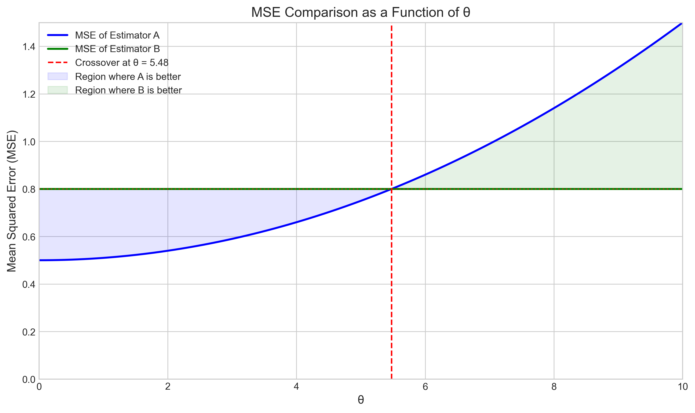

# Question 4: MSE and Bias-Variance Tradeoff

## Problem Statement
Consider the estimation of a parameter $\theta$ with two different estimators:

Estimator A: $\hat{\theta}_A$ with bias $b_A(\theta) = 0.1\theta$ and variance $\text{Var}(\hat{\theta}_A) = 0.5$

Estimator B: $\hat{\theta}_B$ with bias $b_B(\theta) = 0$ and variance $\text{Var}(\hat{\theta}_B) = 0.8$

## Tasks
1. Calculate the Mean Squared Error (MSE) for each estimator when $\theta = 2$
2. Which estimator would you prefer when $\theta = 2$, and why?
3. Is there a value of $\theta$ for which estimator A has lower MSE than estimator B? If yes, find the range of $\theta$ values for which this is true
4. Discuss the bias-variance tradeoff in the context of these two estimators

## Solution

### Step 1: Understanding Mean Squared Error (MSE)

The Mean Squared Error (MSE) is a measure of the quality of an estimator. It quantifies how close the estimator's predictions are to the true parameter value. The MSE is calculated as:

$$\text{MSE}(\hat{\theta}) = \text{Bias}(\hat{\theta})^2 + \text{Var}(\hat{\theta})$$

Where:
- $\text{Bias}(\hat{\theta}) = E[\hat{\theta}] - \theta$ is the expected difference between the estimator and the true parameter
- $\text{Var}(\hat{\theta})$ is the variance of the estimator

This decomposition of MSE into bias and variance components is known as the bias-variance decomposition, which is fundamental to understanding the tradeoff between bias and variance in statistical estimation.

### Step 2: Calculating MSE when $\theta = 2$

#### For Estimator A:
- Bias: $b_A(2) = 0.1 \times 2 = 0.2$
- Variance: $\text{Var}(\hat{\theta}_A) = 0.5$
- MSE: $\text{MSE}(\hat{\theta}_A) = (0.2)^2 + 0.5 = 0.04 + 0.5 = 0.54$

#### For Estimator B:
- Bias: $b_B(2) = 0$ (unbiased)
- Variance: $\text{Var}(\hat{\theta}_B) = 0.8$
- MSE: $\text{MSE}(\hat{\theta}_B) = 0^2 + 0.8 = 0.8$

The following visualization compares the squared bias and variance components of the MSE for each estimator when $\theta = 2$:

### Step 3: Which Estimator is Preferred when $\theta = 2$?

When $\theta = 2$:
- MSE of Estimator A = 0.54
- MSE of Estimator B = 0.8

Since the MSE of Estimator A (0.54) is lower than the MSE of Estimator B (0.8), **Estimator A is preferred** when $\theta = 2$.

This is because, even though Estimator A has some bias, its lower variance more than compensates for the squared bias term, resulting in a lower overall error. This demonstrates that an unbiased estimator (B) is not always the best choice—sometimes accepting some bias can lead to a more accurate estimator overall if it substantially reduces variance.

### Step 4: Finding the Range of $\theta$ where Estimator A has Lower MSE

To find the range of $\theta$ values where Estimator A has lower MSE than Estimator B, we need to solve the inequality:

$$\text{MSE}(\hat{\theta}_A) < \text{MSE}(\hat{\theta}_B)$$

Substituting the formulas:

$$b_A(\theta)^2 + \text{Var}(\hat{\theta}_A) < b_B(\theta)^2 + \text{Var}(\hat{\theta}_B)$$
$$(0.1\theta)^2 + 0.5 < 0^2 + 0.8$$
$$0.01\theta^2 + 0.5 < 0.8$$
$$0.01\theta^2 < 0.3$$
$$\theta^2 < 30$$
$$|\theta| < \sqrt{30} \approx 5.48$$

Therefore, Estimator A has lower MSE than Estimator B when $|\theta| < 5.48$.

The exact crossover point is $\theta = 5.4772$.

This relationship can be visualized by plotting the MSE of both estimators as a function of $\theta$:

The blue shaded region shows where Estimator A has lower MSE, while the green shaded region shows where Estimator B is better. The red vertical line marks the crossover point at $\theta \approx 5.48$.

### Step 5: The Bias-Variance Tradeoff

The bias-variance tradeoff is a fundamental concept in statistics and machine learning that highlights the balance between two sources of estimation error:

1. **Bias**: Represents how far the expected value of an estimator is from the true parameter value. High bias means the estimator systematically misses the true value.

2. **Variance**: Represents how much the estimator varies around its mean across different samples. High variance means the estimator is highly sensitive to the specific sample used.

In our problem:
- **Estimator A** has bias that grows linearly with $\theta$ (specifically, $0.1\theta$), but a relatively low variance of 0.5.
- **Estimator B** is unbiased ($b_B(\theta) = 0$), but has a higher variance of 0.8.

The following figure illustrates how the components of MSE change with $\theta$ for both estimators:

Key observations from this analysis:

1. For Estimator A (top left), the squared bias component grows quadratically with $\theta$, eventually dominating the MSE for large values of $\theta$.

2. For Estimator B (top right), the MSE is constant and equal to the variance (0.8) because there is no bias component.

3. The MSE comparison (bottom left) shows that Estimator A has lower MSE than Estimator B for $|\theta| < 5.48$, but beyond this point, Estimator B becomes preferable.

4. The conceptual bias-variance tradeoff (bottom right) illustrates how bias typically decreases and variance increases with model complexity, and there is usually an optimal point that minimizes total error.

### Step 6: Summary and Comparison Across Different Values of $\theta$

The following table summarizes the bias, variance, and MSE values for both estimators across different values of $\theta$, highlighting which estimator is preferred in each case:

As shown in the table:
- For $\theta$ values from 0 to 5, Estimator A is preferred (highlighted in blue)
- For $\theta$ values of 6 and higher, Estimator B is preferred (highlighted in green)
- The crossover occurs between $\theta = 5$ and $\theta = 6$, consistent with our analytical result of $\theta \approx 5.48$

## Conclusion

1. **MSE Calculation for $\theta = 2$**:
   - Estimator A: MSE = 0.54
   - Estimator B: MSE = 0.8
   - Estimator A is preferred for $\theta = 2$

2. **Range where Estimator A has Lower MSE**:
   - Estimator A has lower MSE when $|\theta| < 5.4772$
   - This means that for parameter values closer to zero, the biased estimator with lower variance (Estimator A) outperforms the unbiased estimator (Estimator B)

3. **Bias-Variance Tradeoff**:
   - This problem demonstrates that minimizing bias (as in Estimator B) does not always lead to the best estimator
   - Sometimes accepting some bias can substantially reduce variance, leading to a lower overall error
   - The optimal choice between biased and unbiased estimators depends on the true parameter value
   
4. **Practical Implications**:
   - When estimating parameters with values smaller than the crossover point ($|\theta| < 5.48$), a slightly biased estimator with lower variance (like Estimator A) would be more accurate
   - For larger parameter values, the unbiased estimator (Estimator B) becomes preferable
   - This illustrates why regularization techniques, which introduce bias to reduce variance, can be effective in many statistical and machine learning applications

This analysis highlights that the bias-variance tradeoff is not just a theoretical concept but has practical implications for choosing optimal estimators in real-world problems. 