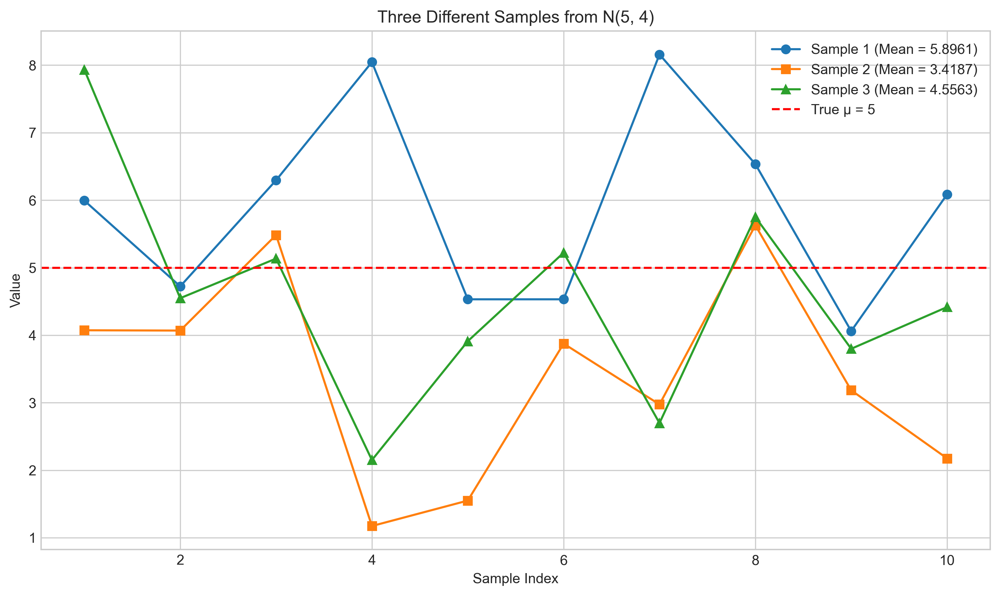
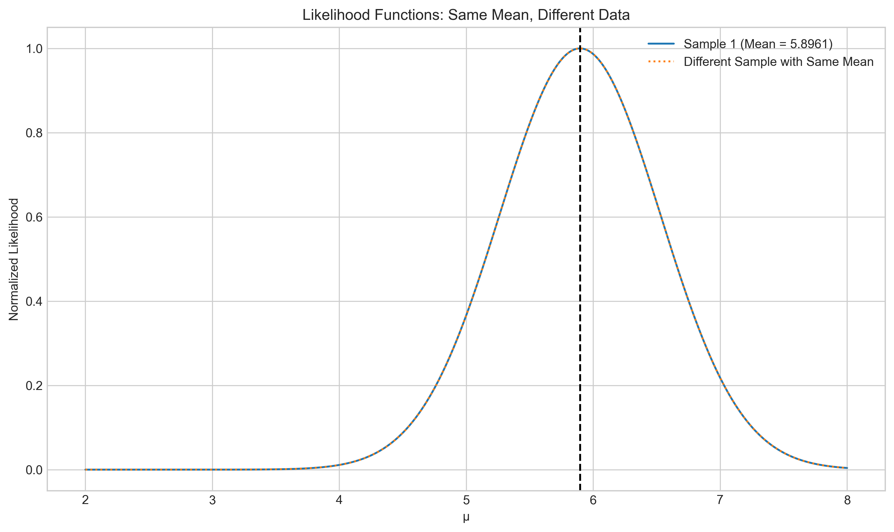
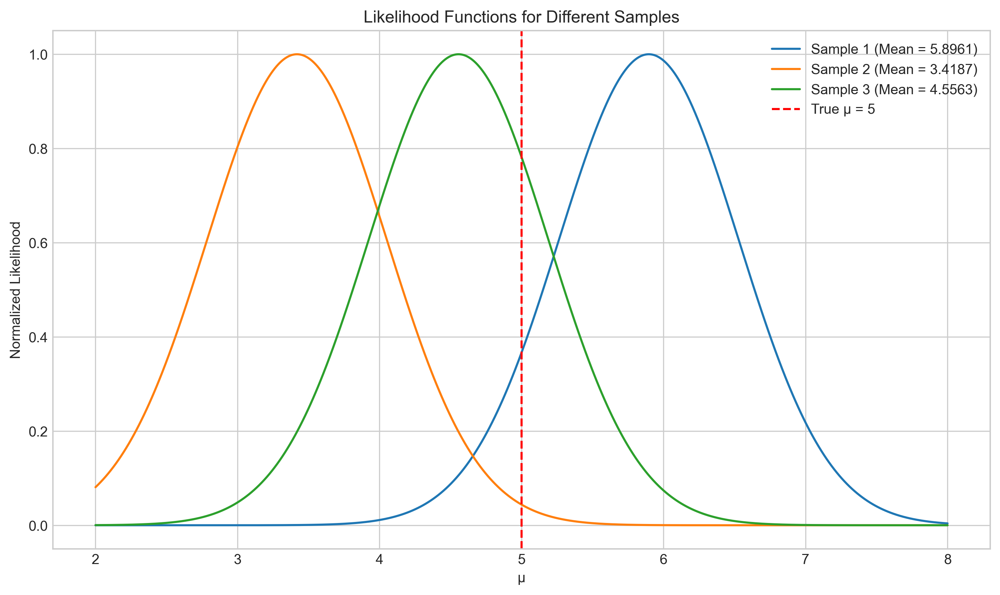
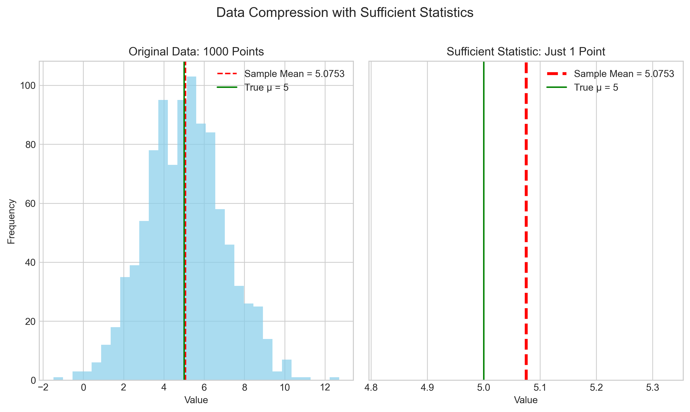

# Question 5: Sufficient Statistics for Normal Distribution

## Problem Statement
Is the sample mean a sufficient statistic for the parameter $\mu$ of a normal distribution with known variance?

### Task
1. Determine if the sample mean $\bar{X}$ is a sufficient statistic for $\mu$ in a normal distribution with known variance $\sigma^2$.
2. Prove your answer using the factorization theorem.
3. Explain the implications of your findings.

## Understanding the Problem
A sufficient statistic is a function of the data that contains all the information about a parameter of interest. For a parameter $\theta$, a statistic $T(X)$ is sufficient if the conditional distribution of the data $X$ given $T(X)$ does not depend on $\theta$. In this problem, we want to determine whether the sample mean $\bar{X}$ contains all the information about $\mu$ that is present in the sample $X_1, X_2, \ldots, X_n$ from a normal distribution with known variance $\sigma^2$.

## Solution

To determine if the sample mean is a sufficient statistic for $\mu$, we'll use the Fisher-Neyman factorization theorem.

### Step 1: Understanding Sufficient Statistics
A statistic $T(X)$ is sufficient for a parameter $\theta$ if the conditional distribution of the data $X$ given $T(X)$ doesn't depend on $\theta$. According to the factorization theorem, $T(X)$ is sufficient for $\theta$ if and only if the likelihood function can be factored as:

$$L(\theta|x) = g(T(x),\theta) \times h(x)$$

where $g$ depends on the data only through $T(x)$, and $h$ does not depend on $\theta$ at all.

### Step 2: Deriving the Likelihood Function
For a random sample $X_1, X_2, \ldots, X_n$ from a normal distribution $N(\mu, \sigma^2)$, the likelihood function is:

$$L(\mu|x) = \prod_{i=1}^n f(x_i|\mu)$$

where $f(x_i|\mu)$ is the PDF of a normal distribution:

$$f(x_i|\mu) = \frac{1}{\sqrt{2\pi\sigma^2}} \times \exp\left(-\frac{(x_i-\mu)^2}{2\sigma^2}\right)$$

Therefore:

$$L(\mu|x) = \left(\frac{1}{\sqrt{2\pi\sigma^2}}\right)^n \times \exp\left(-\frac{\sum_{i=1}^n(x_i-\mu)^2}{2\sigma^2}\right)$$

### Step 3: Factorizing the Likelihood
We can expand the sum in the exponent:

$$\sum_{i=1}^n(x_i-\mu)^2 = \sum_{i=1}^n(x_i^2 - 2\mu x_i + \mu^2) = \sum_{i=1}^n x_i^2 - 2\mu\sum_{i=1}^n x_i + n\mu^2$$

Substituting this into the likelihood:

$$L(\mu|x) = \left(\frac{1}{\sqrt{2\pi\sigma^2}}\right)^n \times \exp\left(-\frac{\sum_{i=1}^n x_i^2 - 2\mu\sum_{i=1}^n x_i + n\mu^2}{2\sigma^2}\right)$$

We can rearrange this as:

$$L(\mu|x) = \left(\frac{1}{\sqrt{2\pi\sigma^2}}\right)^n \times \exp\left(-\frac{\sum_{i=1}^n x_i^2}{2\sigma^2}\right) \times \exp\left(\frac{2\mu\sum_{i=1}^n x_i - n\mu^2}{2\sigma^2}\right)$$

Note that $\sum_{i=1}^n x_i = n\bar{x}$, so:

$$L(\mu|x) = \left(\frac{1}{\sqrt{2\pi\sigma^2}}\right)^n \times \exp\left(-\frac{\sum_{i=1}^n x_i^2}{2\sigma^2}\right) \times \exp\left(\frac{n\mu\bar{x} - n\mu^2/2}{\sigma^2}\right)$$

### Step 4: Applying the Factorization Theorem
We can factor this as:

$$L(\mu|x) = h(x) \times g(\bar{x},\mu)$$

where:

$$h(x) = \left(\frac{1}{\sqrt{2\pi\sigma^2}}\right)^n \times \exp\left(-\frac{\sum_{i=1}^n x_i^2}{2\sigma^2}\right)$$

$$g(\bar{x},\mu) = \exp\left(\frac{n\mu\bar{x} - n\mu^2/2}{\sigma^2}\right)$$

By the factorization theorem, since $h(x)$ depends only on the data and not on $\mu$, and $g(\bar{x},\mu)$ depends on the data only through $\bar{x}$, the sample mean $\bar{x}$ is a sufficient statistic for $\mu$.

## Generated Data from Simulation

For our demonstration, we generated random samples from a normal distribution $N(5, 4)$ with $\mu = 5$ and $\sigma^2 = 4$:

**Sample 1:** 
```
[5.99, 4.72, 6.30, 8.05, 4.53, 4.53, 8.16, 6.53, 4.06, 6.09]
```
**Sample Mean 1:** 5.8961

**Sample 2:** 
```
[4.07, 4.07, 5.48, 1.17, 1.55, 3.88, 2.97, 5.63, 3.18, 2.18]
```
**Sample Mean 2:** 3.4187

**Sample 3:** 
```
[7.93, 4.55, 5.14, 2.15, 3.91, 5.22, 2.70, 5.75, 3.80, 4.42]
```
**Sample Mean 3:** 4.5563

These samples, despite coming from the same distribution, have different sample means due to random variation.

## Visual Demonstrations

### Visualization 1: Sample Comparison


This figure shows three different samples drawn from the same normal distribution $N(5, 4)$. Each sample consists of 10 data points, and they have different sample means (Sample 1: 5.90, Sample 2: 3.42, Sample 3: 4.56). The red dashed line shows the true parameter value $\mu = 5$.

### Visualization 2: Same Mean, Different Data


This figure compares the likelihood functions for Sample 1 and another artificially constructed sample that has exactly the same mean but different individual values. The likelihood functions are nearly identical, demonstrating that once we know the sample mean, the specific data values don't affect the likelihood of $\mu$.

### Visualization 3: Different Means Comparison


This figure shows the likelihood functions for all three samples, which have different sample means. The peaks of the likelihood functions occur at their respective sample means, showing that samples with different means lead to different inferences about $\mu$. The red dashed line indicates the true value of $\mu = 5$.

### Visualization 4: Data Compression Demonstration


This visualization illustrates the concept of data compression through sufficient statistics. The left panel shows a histogram of 1,000 data points from a normal distribution, while the right panel shows that all the information about $\mu$ in those 1,000 points can be compressed into a single value: the sample mean. This dramatically reduces the data we need to store while preserving all information about $\mu$.

## Practical Implementation

When working with normal data where we're interested in estimating $\mu$ with known variance, we can apply several practical strategies:

1. We only need to compute and store the sample mean rather than the entire dataset
2. For large datasets, we can process data in batches, updating the sample mean incrementally
3. If multiple analysts need to work with the data, sharing just the sufficient statistic can save bandwidth and storage
4. When designing experiments, we can focus on minimizing the variance of the sample mean

The efficiency of using sufficient statistics becomes particularly important when dealing with large datasets or when computational resources are limited.

## Key Insights

### Theoretical Foundations
- A sufficient statistic contains all the information about a parameter that is available in the data
- For a normal distribution with known variance, the sample mean is sufficient for estimating $\mu$
- This is proven using the factorization theorem, where the likelihood function depends on the data only through $\bar{x}$

### Practical Applications
- When estimating the mean of a normal distribution, we can compress all information from $n$ data points into the single sample mean
- This has computational advantages as we can store just the sample mean instead of the entire dataset
- The MLE for $\mu$ in a normal distribution is the sample mean, which is both sufficient and efficient

### Statistical Efficiency
- Working with sufficient statistics allows for data reduction without loss of information
- The Rao-Blackwell theorem states that if we condition an unbiased estimator on a sufficient statistic, we can't increase its variance
- This makes sufficient statistics important for constructing optimal estimators

## Conclusion
- The sample mean is a sufficient statistic for $\mu$ in a normal distribution with known variance.
- This was proven by factoring the likelihood function into two parts: one that depends on the data only through $\bar{x}$, and another that doesn't depend on $\mu$ at all.
- The practical implication is that we can reduce our data from $n$ observations to a single value ($\bar{x}$) without losing any information about $\mu$.
- Our visualizations demonstrate that samples with the same mean produce identical likelihood functions for $\mu$, regardless of the individual data values. 