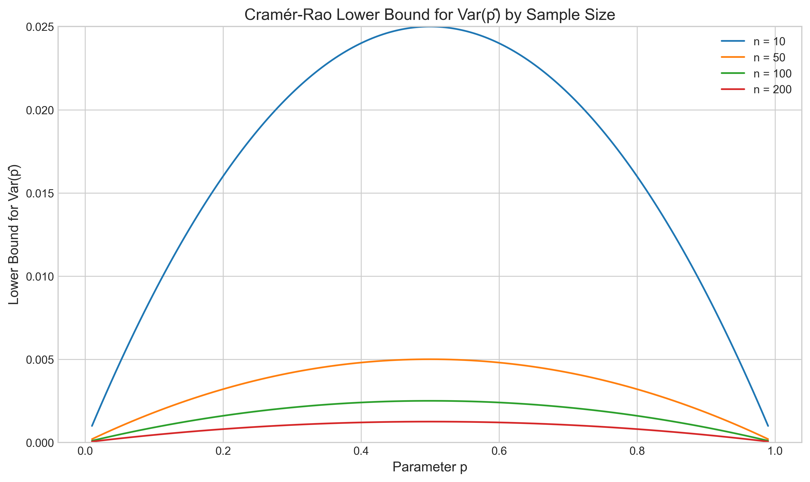

# Question 6: Fisher Information for Bernoulli Distribution

## Problem Statement
For a Bernoulli distribution with parameter $p$, write down the Fisher Information $I(p)$.

### Task
1. Define the Fisher Information and its significance.
2. Derive the Fisher Information $I(p)$ for a Bernoulli distribution.
3. Interpret the meaning of the result in practical terms.

## Understanding the Problem
The Fisher Information quantifies the amount of information that an observable random variable $X$ carries about an unknown parameter $\theta$ of a distribution. In this case, we are concerned with a Bernoulli distribution with parameter $p$, where the probability mass function (PMF) is given by $f(x|p) = p^x(1-p)^{1-x}$ for $x \in \{0,1\}$. We need to find how much information a single Bernoulli observation provides about the unknown probability parameter $p$.

## Solution

### Step 1: Understanding Fisher Information
The Fisher Information for a parameter $\theta$ is defined as:

$$I(\theta) = E\left[\left(\frac{\partial}{\partial\theta}\log f(X|\theta)\right)^2\right]$$

This represents the expected value of the squared score function, where the score function is the partial derivative of the log-likelihood with respect to the parameter.

Alternatively, it can be expressed as:

$$I(\theta) = -E\left[\frac{\partial^2}{\partial\theta^2}\log f(X|\theta)\right]$$

This is the negative of the expected value of the second derivative of the log-likelihood.

### Step 2: Deriving the Score Function for Bernoulli
For a Bernoulli distribution with parameter $p$, the PMF is:

$$f(x|p) = p^x(1-p)^{1-x} \text{ for } x \in \{0,1\}$$

First, we find the log-likelihood:

$$\log f(x|p) = x\log(p) + (1-x)\log(1-p)$$

Next, we compute the score function (first derivative):

$$\frac{\partial}{\partial p}\log f(x|p) = \frac{x}{p} - \frac{1-x}{1-p}$$

### Step 3: Computing the Fisher Information
We can compute the Fisher Information using the expected value of the squared score function:

$$I(p) = E\left[\left(\frac{\partial}{\partial p}\log f(X|p)\right)^2\right] = E\left[\left(\frac{X}{p} - \frac{1-X}{1-p}\right)^2\right]$$

Since $X$ follows a Bernoulli distribution with parameter $p$, we have:
- $P(X=1) = p$
- $P(X=0) = 1-p$

So:

$$I(p) = p\left(\frac{1}{p} - \frac{0}{1-p}\right)^2 + (1-p)\left(\frac{0}{p} - \frac{1}{1-p}\right)^2$$
$$I(p) = p\left(\frac{1}{p}\right)^2 + (1-p)\left(\frac{1}{1-p}\right)^2$$
$$I(p) = \frac{1}{p} + \frac{1-p}{(1-p)^2}$$
$$I(p) = \frac{1}{p} + \frac{1}{1-p}$$
$$I(p) = \frac{1-p + p}{p(1-p)}$$
$$I(p) = \frac{1}{p(1-p)}$$

Alternatively, we can compute using the second derivative:

$$\frac{\partial^2}{\partial p^2}\log f(x|p) = -\frac{x}{p^2} - \frac{1-x}{(1-p)^2}$$

Taking the expected value:

$$E\left[\frac{\partial^2}{\partial p^2}\log f(X|p)\right] = -\frac{p}{p^2} - \frac{1-p}{(1-p)^2} = -\frac{1}{p} - \frac{1}{1-p} = -\frac{1}{p(1-p)}$$

Therefore:

$$I(p) = -E\left[\frac{\partial^2}{\partial p^2}\log f(X|p)\right] = \frac{1}{p(1-p)}$$

## Visual Explanations

### Fisher Information Curve

This visualization shows how the Fisher Information $I(p) = \frac{1}{p(1-p)}$ varies with the parameter $p$. Key observations:
1. The Fisher Information reaches its minimum value of 4 at $p = 0.5$
2. It approaches infinity as $p$ approaches 0 or 1
3. When $p$ is close to 0.5, each observation provides the least information about the parameter
4. When $p$ is close to 0 or 1, each observation provides much more information about the parameter

### Cramér-Rao Lower Bound

This plot shows the Cramér-Rao lower bound for the variance of any unbiased estimator of $p$ for different sample sizes. The bound is calculated as $\frac{p(1-p)}{n}$, where $n$ is the sample size. Key insights:
1. For a fixed sample size, the variance is highest when $p = 0.5$
2. As sample size increases, the lower bound decreases proportionally
3. Parameters close to 0 or 1 can be estimated with lower variance for the same sample size
4. This illustrates why estimating probabilities near 0.5 requires larger samples for the same precision

### MLE Variance vs Cramér-Rao Bound

This comparison shows the empirical variance of the Maximum Likelihood Estimator (sample proportion) against the theoretical Cramér-Rao lower bound for different values of $p$ with a fixed sample size of 50. Key observations:
1. The sample proportion $\hat{p}$ achieves the Cramér-Rao lower bound
2. This confirms that the MLE is an efficient estimator for the Bernoulli parameter
3. Both empirical and theoretical variances follow the expected pattern, with maximum variance at $p = 0.5$
4. The close match between empirical and theoretical values validates our derivation of the Fisher Information

### Estimation Accuracy vs Sample Size

This log-log plot shows how estimation accuracy (measured by standard error) improves with increasing sample size for different values of $p$. Key insights:
1. For all values of $p$, the standard error decreases proportionally to $\sqrt{n}$, where $n$ is the sample size
2. Probabilities near 0.5 consistently require larger samples to achieve the same precision as probabilities near 0 or 1
3. The dashed lines represent the theoretical standard error (square root of the Cramér-Rao bound)
4. The empirical results closely match theoretical predictions, confirming that Fisher Information accurately characterizes the fundamental limits of estimation precision

## Key Insights

### Theoretical Interpretation
- The Fisher Information $I(p) = \frac{1}{p(1-p)}$ quantifies how much information a single observation provides about $p$
- When $p$ is close to 0.5, each observation provides the least information (minimum is $I(0.5) = 4$)
- When $p$ is close to 0 or 1, each observation provides more information about $p$
- This is intuitive: it's harder to estimate a probability near 0.5 (maximum uncertainty) than one near 0 or 1

### Practical Applications
- The Cramér-Rao lower bound indicates that the variance of any unbiased estimator must be at least $\frac{p(1-p)}{n}$
- For estimating $p$ close to 0.5, we need larger sample sizes for the same precision
- For $p$ close to 0 or 1, smaller samples may provide sufficient precision
- This has implications for experiment design: if we expect $p$ to be near 0.5, we should plan for larger samples

### Statistical Efficiency
- The sample proportion $\hat{p}$ is the Maximum Likelihood Estimator (MLE) for $p$
- The variance of $\hat{p}$ is $\frac{p(1-p)}{n}$, which equals the Cramér-Rao lower bound
- Therefore, $\hat{p}$ is an efficient estimator, achieving the minimum possible variance among all unbiased estimators

## Conclusion
- The Fisher Information for a Bernoulli distribution with parameter $p$ is $I(p) = \frac{1}{p(1-p)}$.
- This expression quantifies the amount of information that a Bernoulli random variable carries about its parameter.
- The result has important implications for parameter estimation, showing that probabilities near 0.5 are inherently harder to estimate precisely than those near 0 or 1.
- The visualizations confirm that the MLE achieves the theoretical efficiency bound and demonstrate how estimation accuracy varies with both $p$ and sample size. 