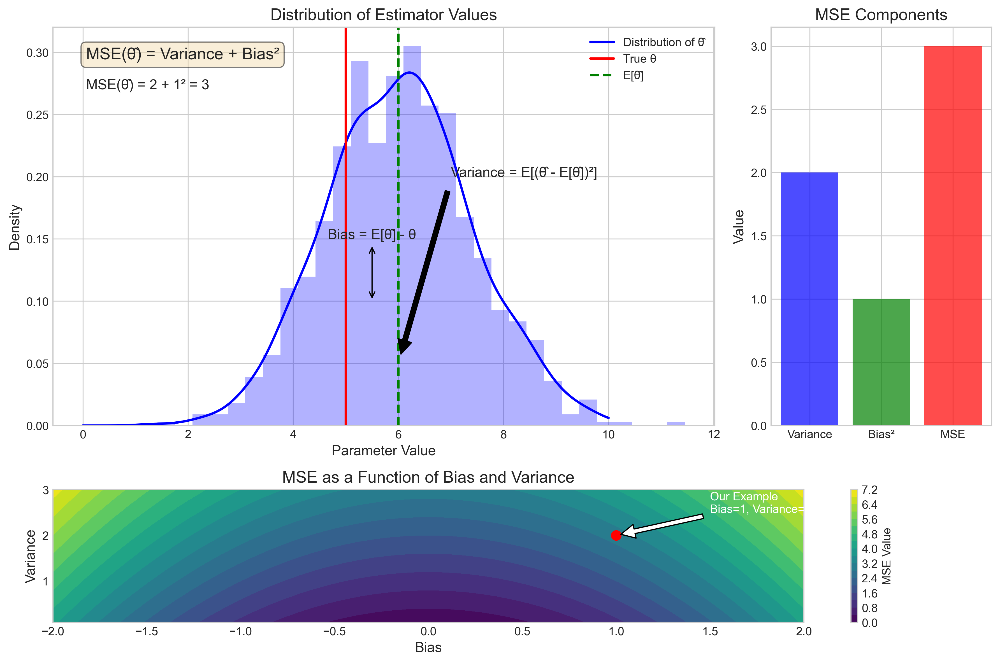
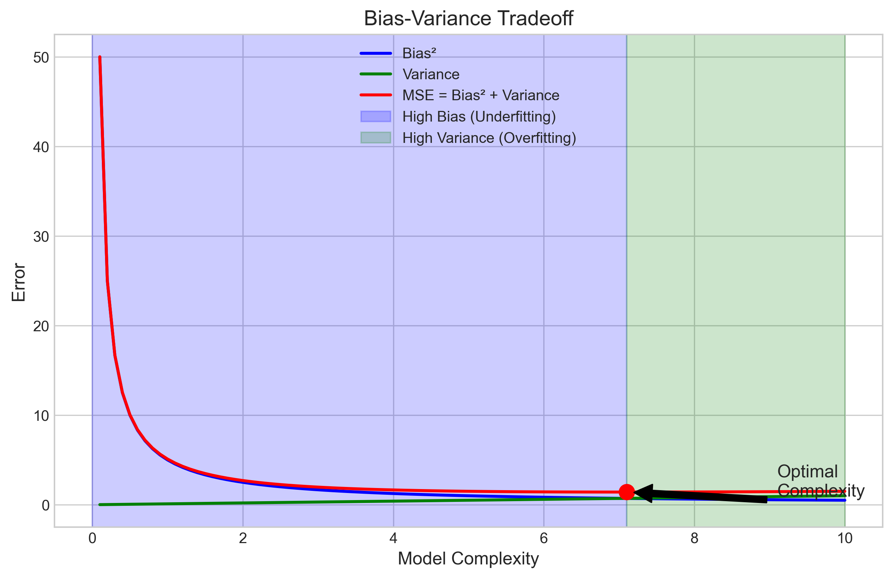
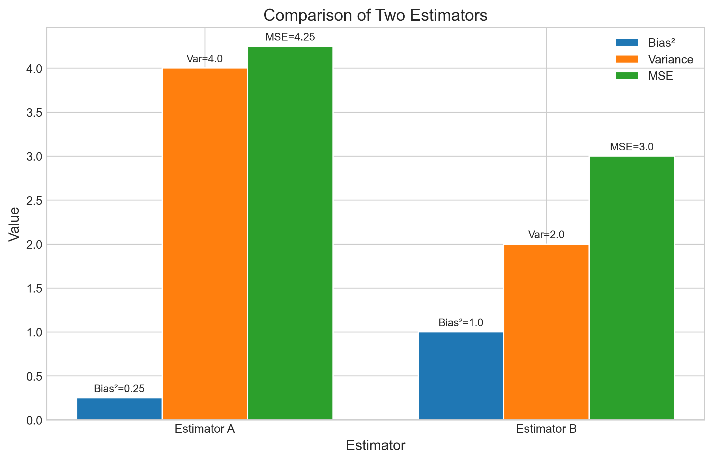

# Question 7: Mean Squared Error (MSE) Formula

## Problem Statement
Consider the bias-variance tradeoff in estimator selection.

## Task
If an estimator has bias $b(\theta)$ and variance $v(\theta)$, write the formula for its Mean Squared Error (MSE) in terms of $b(\theta)$ and $v(\theta)$.

## Correct Answer
$\text{MSE}(\hat{\theta}) = v(\theta) + (b(\theta))^2$

## Solution

To solve this problem, we need to understand what MSE is and how it relates to bias and variance in statistical estimation.

### Step 1: Understanding Mean Squared Error

The Mean Squared Error (MSE) of an estimator $\hat{\theta}$ is defined as the expected squared deviation of the estimator from the true parameter value:

$$\text{MSE}(\hat{\theta}) = E[(\hat{\theta} - \theta)^2]$$

Where:
- $\hat{\theta}$ is the estimator
- $\theta$ is the true parameter value
- $E[\cdot]$ denotes the expected value

MSE is a measure of the quality of an estimator - it tells us, on average, how far our estimates are from the true value, with larger deviations being penalized more heavily (due to the squaring).

### Step 2: Deriving the MSE Formula

To express MSE in terms of bias and variance, we can decompose it algebraically:

1. Start with the definition of MSE:
   $$\text{MSE}(\hat{\theta}) = E[(\hat{\theta} - \theta)^2]$$

2. Add and subtract $E[\hat{\theta}]$ inside the squared term:
   $$\text{MSE}(\hat{\theta}) = E[(\hat{\theta} - E[\hat{\theta}] + E[\hat{\theta}] - \theta)^2]$$

3. Group the terms:
   $$\text{MSE}(\hat{\theta}) = E[((\hat{\theta} - E[\hat{\theta}]) + (E[\hat{\theta}] - \theta))^2]$$

4. Expand the square:
   $$\text{MSE}(\hat{\theta}) = E[(\hat{\theta} - E[\hat{\theta}])^2 + 2(\hat{\theta} - E[\hat{\theta}])(E[\hat{\theta}] - \theta) + (E[\hat{\theta}] - \theta)^2]$$

5. Analyze each term:
   - $E[(\hat{\theta} - E[\hat{\theta}])^2]$ is the variance of $\hat{\theta}$, which is $v(\theta)$
   - $E[2(\hat{\theta} - E[\hat{\theta}])(E[\hat{\theta}] - \theta)]$ simplifies to $2(E[\hat{\theta}] - \theta) \cdot E[\hat{\theta} - E[\hat{\theta}]] = 0$ because $E[\hat{\theta} - E[\hat{\theta}]] = 0$
   - $(E[\hat{\theta}] - \theta)^2$ is the squared bias, which is $(b(\theta))^2$

6. Therefore:
   $$\text{MSE}(\hat{\theta}) = v(\theta) + (b(\theta))^2$$

### Step 3: Visual Representation of MSE Decomposition

The following figure illustrates the relationship between MSE, bias, and variance:

The visualization shows:
- The distribution of estimator values (blue) 
- The true parameter value (red vertical line)
- The expected value of the estimator (green dashed vertical line)
- The distance between the true value and expected estimator value is the bias
- The spread of the estimator distribution represents its variance
- The MSE combines both components as shown in the formula: $\text{MSE} = \text{Variance} + \text{Bias}^2$

### Step 4: The Bias-Variance Tradeoff

A key insight from the MSE formula is that it reveals the fundamental tradeoff between bias and variance in estimation:

This graph shows:
- As model complexity increases, bias typically decreases (blue line)
- As model complexity increases, variance typically increases (green line)
- The MSE (red line) is the sum of bias² and variance
- There is an optimal level of complexity that minimizes MSE
- To the left of this point, models suffer from high bias (underfitting)
- To the right of this point, models suffer from high variance (overfitting)

### Step 5: Practical Example

To understand the practical implications, consider two different estimators with different bias and variance characteristics:

In this example:
- Estimator A has low bias² (0.25) but high variance (4.0), resulting in MSE of 4.25
- Estimator B has higher bias² (1.0) but lower variance (2.0), resulting in MSE of 3.0

Despite Estimator A having a lower bias, Estimator B has a lower overall MSE due to its significantly lower variance. This demonstrates that sometimes accepting a bit more bias can be beneficial if it substantially reduces variance.

### Step 6: Key Insights

1. **Decomposition of Error**: MSE can be decomposed into two components: variance and squared bias.
2. **Tradeoff**: There is usually a tradeoff between bias and variance - reducing one often increases the other.
3. **Optimization Goal**: In practical applications, we typically want to minimize the MSE, not just bias or variance individually.
4. **Model Selection**: The bias-variance tradeoff is a fundamental concept in model selection and regularization.

## Conclusion

The Mean Squared Error (MSE) of an estimator $\hat{\theta}$ with bias $b(\theta)$ and variance $v(\theta)$ is:

$$\text{MSE}(\hat{\theta}) = v(\theta) + (b(\theta))^2$$

This formula demonstrates that MSE is the sum of the variance and the squared bias of an estimator. It encapsulates the bias-variance tradeoff, which is one of the most important concepts in statistical learning theory and guides many model selection decisions in practice. 