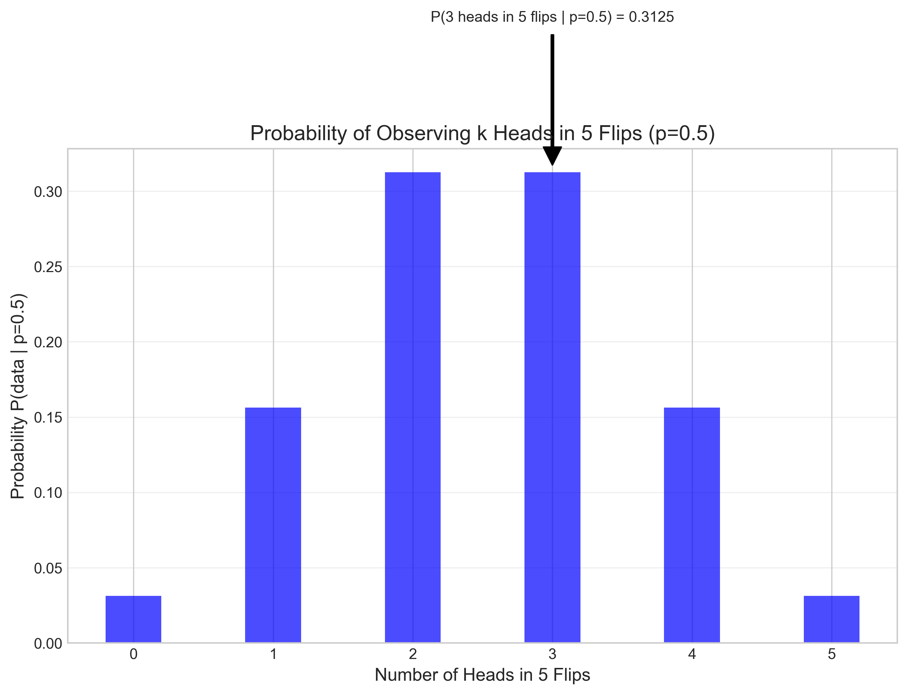
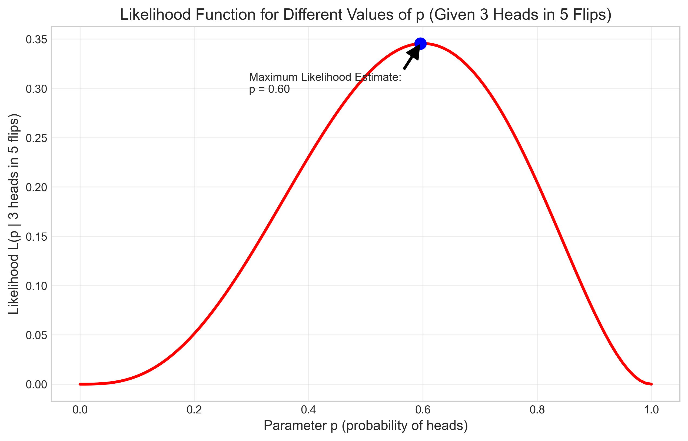
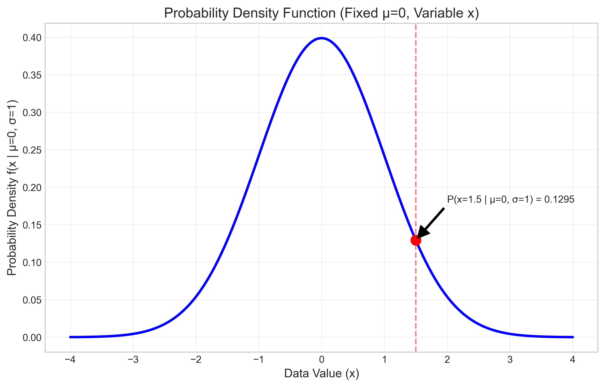
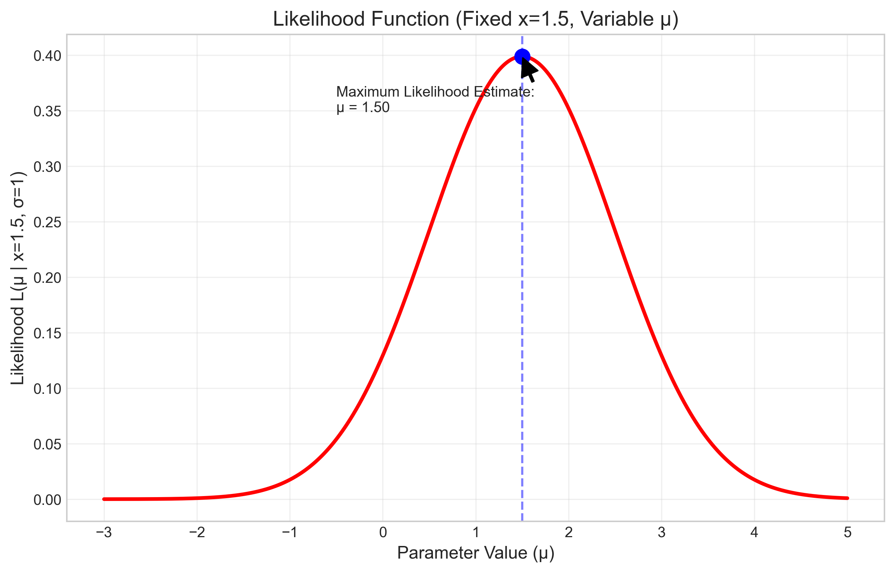
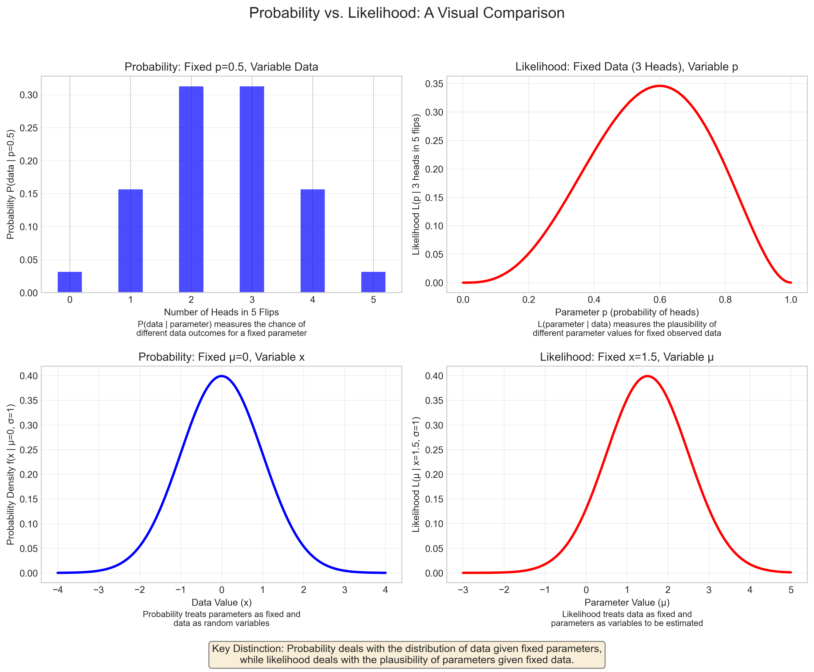
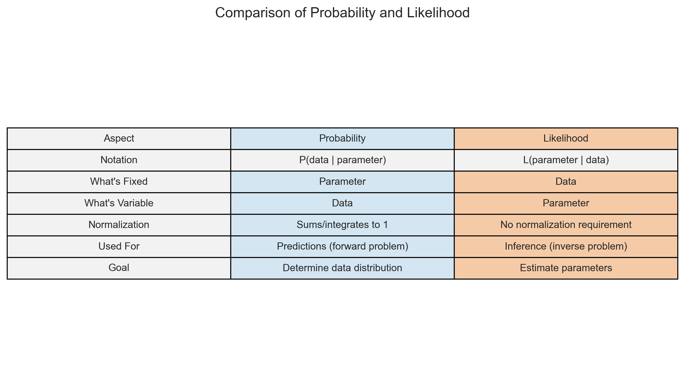

# Question 8: Probability vs Likelihood

## Problem Statement
What is the fundamental difference between probability and likelihood?

## Task
Explain in one sentence the key distinction between probability and likelihood in the context of statistical estimation.

## Correct Answer
Probability treats parameters as fixed and data as random ($P(\text{data}|\text{parameter})$), while likelihood treats data as fixed and parameters as variables to be estimated ($L(\text{parameter}|\text{data})$).

## Solution

To understand the difference between probability and likelihood, we'll explore these two fundamental concepts in statistics and how they differ in both interpretation and application.

### Step 1: Definition of Probability vs Likelihood

**Probability:**
- Measures the chance of observing data given a fixed parameter value
- Denoted as $P(\text{data} | \text{parameter})$
- Example: The probability of getting 3 heads in 5 coin flips with a fair coin ($p = 0.5$)

**Likelihood:**
- Measures the plausibility of a parameter value given fixed observed data
- Denoted as $L(\text{parameter} | \text{data})$
- Example: The likelihood that a coin has $p = 0.7$ (probability of heads) given that we observed 7 heads in 10 flips

The key distinction is in what is considered fixed and what varies:
- In probability: The parameter is fixed, data is variable
- In likelihood: The data is fixed, parameter is variable

### Step 2: Coin Flip Example

Let's consider a simple coin flipping experiment to illustrate the difference:

**Probability Perspective (Fixed Parameter):**
When we fix the parameter $p = 0.5$ (fair coin), we can calculate the probability of different possible outcomes:

This graph shows the probability of observing different numbers of heads in 5 coin flips, when we assume $p = 0.5$. The probability is highest for 2 or 3 heads, and lower for extreme values like 0 or 5 heads.

**Likelihood Perspective (Fixed Data):**
When we fix the observed data (e.g., 3 heads in 5 flips), we can calculate the likelihood of different possible parameter values:

This graph shows the likelihood of different parameter values $p$ (probability of heads) given that we observed 3 heads in 5 flips. The maximum likelihood estimate is at $p = 0.6$, which means this is the most plausible value of $p$ given our observed data.

### Step 3: Normal Distribution Example

The same concepts apply to continuous distributions like the normal distribution:

**Probability Perspective (Fixed Parameter):**
When we fix the parameter $\mu = 0$ (mean of the normal distribution), we can calculate the probability density at different possible $x$ values:

This graph shows the probability density function for a normal distribution with fixed mean $\mu = 0$ and standard deviation $\sigma = 1$. For any specific $x$ value (like $x = 1.5$), the height of the curve represents the relative probability density of observing that value.

**Likelihood Perspective (Fixed Data):**
When we fix the observed data (e.g., $x = 1.5$), we can calculate the likelihood of different possible mean values:

This graph shows the likelihood function for different values of the mean parameter $\mu$ given that we observed $x = 1.5$. The maximum likelihood estimate is at $\mu = 1.5$, indicating that this is the most plausible value for the population mean given our observation.

### Step 4: Side-by-Side Comparison

The following visualization combines both probability and likelihood perspectives for both examples:

This comprehensive visualization illustrates the key differences between probability and likelihood across both discrete (coin flip) and continuous (normal) distributions. The left panels show probability (fixed parameters, variable data) while the right panels show likelihood (fixed data, variable parameters).

### Step 5: Summary of Key Differences

The differences between probability and likelihood extend beyond what's fixed and what varies:

Key points from this comparison:
1. **Notation**: Probability is $P(\text{data} | \text{parameter})$, likelihood is $L(\text{parameter} | \text{data})$
2. **What's Fixed**: In probability, the parameter is fixed; in likelihood, the data is fixed
3. **What's Variable**: In probability, the data is variable; in likelihood, the parameter is variable
4. **Normalization**: Probability must sum/integrate to 1; likelihood has no such requirement
5. **Used For**: Probability is used for predictions (forward problem); likelihood is used for inference (inverse problem)
6. **Goal**: Probability determines data distribution; likelihood estimates parameters

### Step 6: Why This Matters

Understanding the difference between probability and likelihood is crucial because:

1. **Parameter Estimation**: Maximum likelihood estimation (MLE) involves finding the parameter values that maximize the likelihood function, not the probability
2. **Hypothesis Testing**: Likelihood ratios compare how well different parameter values explain the observed data
3. **Bayesian vs. Frequentist**: The distinction helps clarify differences between these statistical paradigms
4. **Model Selection**: Likelihood-based criteria (like AIC or BIC) are used to select between competing models

## Conclusion

The fundamental difference between probability and likelihood is in what they measure and how they're used:

- **Probability** measures the chance of observing different possible data outcomes for a fixed parameter value, answering the question "Given this parameter value, how likely are different possible observations?"

- **Likelihood** measures the plausibility of different possible parameter values for fixed observed data, answering the question "Given these observations, how plausible are different parameter values?"

In one sentence: Probability treats parameters as fixed and data as random ($P(\text{data}|\text{parameter})$), while likelihood treats data as fixed and parameters as variables to be estimated ($L(\text{parameter}|\text{data})$). 