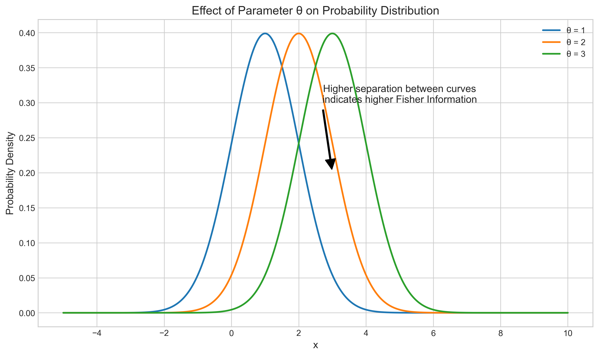
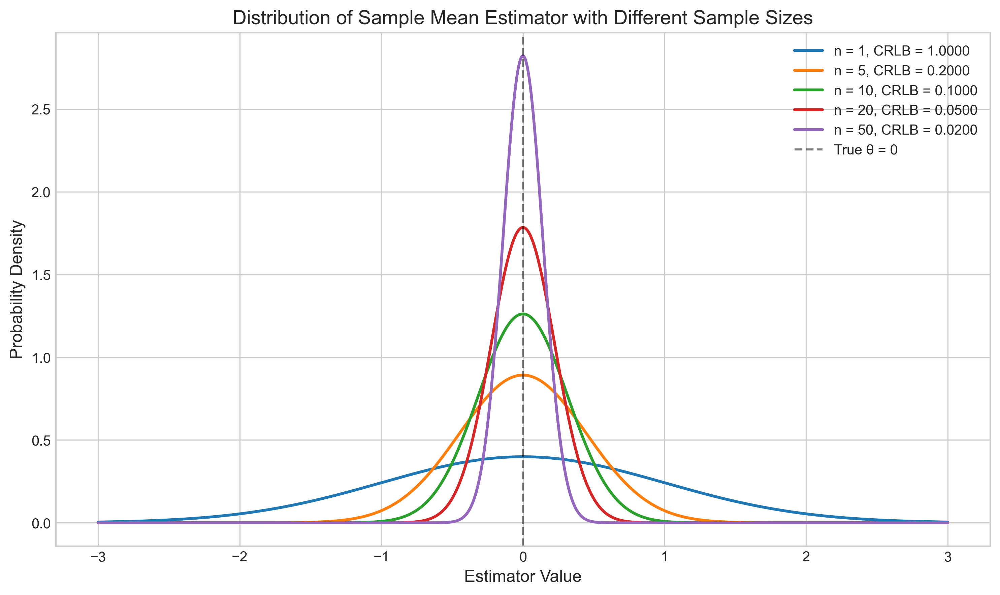
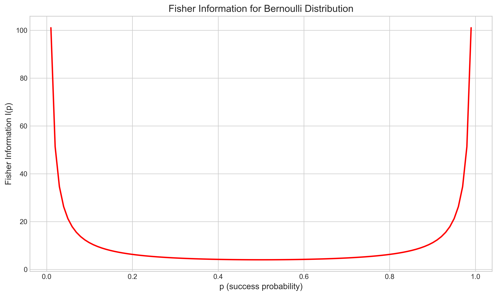
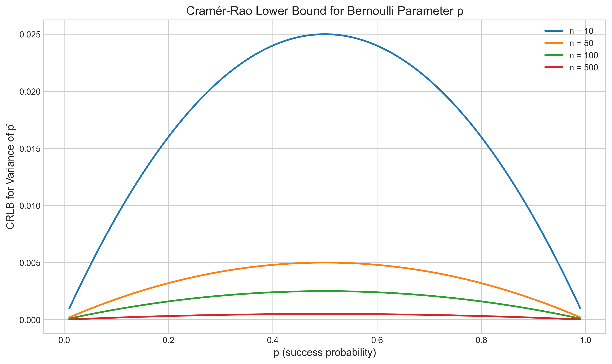
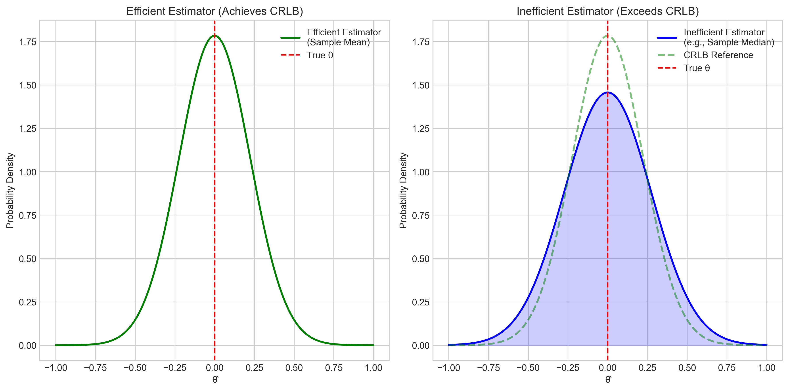
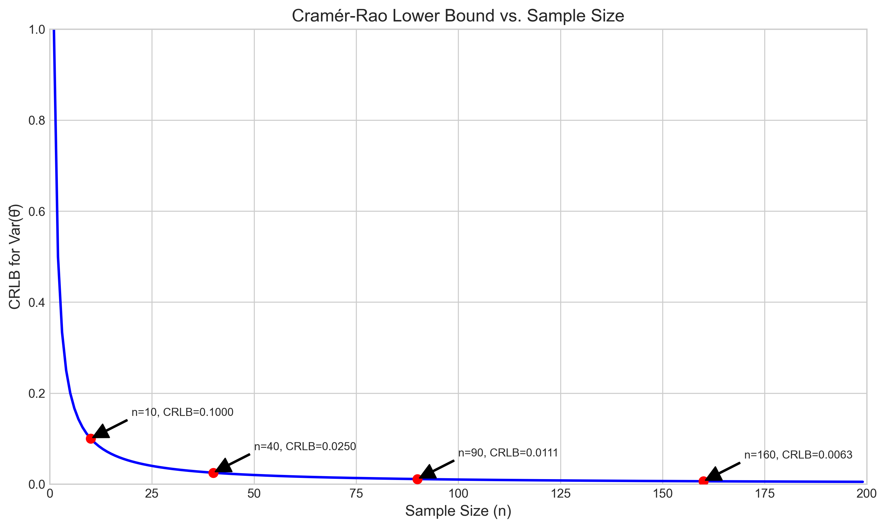
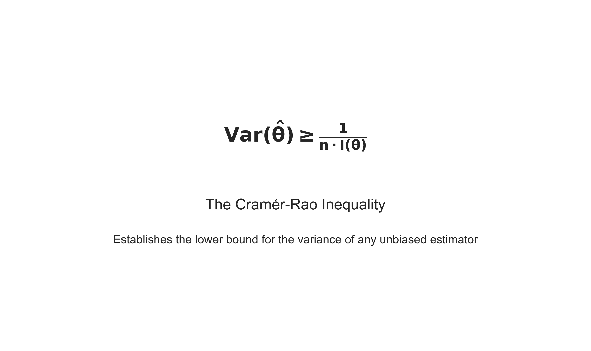

# Question A: Cramér-Rao Inequality

## Problem Statement
For a random sample $X_1, X_2, \ldots, X_n$ from a distribution with parameter $\theta$, the Fisher Information $I(\theta)$ quantifies how much information the sample contains about $\theta$.

## Task
If an estimator $\hat{\theta}$ is unbiased and has variance $\text{Var}(\hat{\theta})$, write the Cramér-Rao inequality that establishes the lower bound for the variance of $\hat{\theta}$.

## Solution

### Step 1: Understanding the Cramér-Rao Bound

The Cramér-Rao inequality establishes a fundamental lower bound for the variance of any unbiased estimator. It tells us that no matter how cleverly we design our estimator, there is a theoretical minimum to how precise it can be.

For an unbiased estimator $\hat{\theta}$ of parameter $\theta$:

$$\text{Var}(\hat{\theta}) \geq \frac{1}{n \cdot I(\theta)}$$

where:
- $n$ is the sample size
- $I(\theta)$ is the Fisher Information for a single observation

The expression $\frac{1}{n \cdot I(\theta)}$ is called the Cramér-Rao Lower Bound (CRLB).

### Step 2: Fisher Information

Fisher Information $I(\theta)$ is a way to measure how much information a random variable carries about an unknown parameter. Intuitively, it quantifies how sensitive the probability distribution is to changes in the parameter value.

For a probability density function $f(x|\theta)$, Fisher Information is defined as:

$$I(\theta) = E\left[\left(\frac{\partial}{\partial\theta} \log f(X|\theta)\right)^2\right]$$

Or equivalently:

$$I(\theta) = -E\left[\frac{\partial^2}{\partial\theta^2} \log f(X|\theta)\right]$$

Higher Fisher Information indicates:
- The parameter has more influence on the distribution
- We can estimate $\theta$ more precisely (with lower variance)

The figure above illustrates how Fisher Information relates to the separation between probability distributions with different parameter values. When distributions are more clearly distinguishable from each other (greater separation between curves), there is higher Fisher Information.

### Step 3: Example - Fisher Information for Normal Distribution

To make the concept more concrete, let's look at an example for the normal distribution.

For a normal distribution $N(\mu, \sigma^2)$ with known variance $\sigma^2$:

$$f(x|\mu) = \frac{1}{\sqrt{2\pi\sigma^2}} \exp\left(-\frac{(x-\mu)^2}{2\sigma^2}\right)$$

The score function (derivative of log-likelihood) is:

$$\frac{\partial}{\partial\mu} \log f(x|\mu) = \frac{x-\mu}{\sigma^2}$$

The Fisher Information for a single observation is:

$$I(\mu) = E\left[\left(\frac{X-\mu}{\sigma^2}\right)^2\right] = \frac{1}{\sigma^2}$$

Therefore, the Cramér-Rao Lower Bound for estimating $\mu$ is:

$$\text{CRLB} = \frac{1}{n \cdot I(\mu)} = \frac{\sigma^2}{n}$$

For the sample mean $\bar{X}$, we know that $\text{Var}(\bar{X}) = \sigma^2/n$. This means the sample mean is an efficient estimator as it achieves the CRLB.

The figure shows how the distribution of the sample mean estimator becomes more concentrated around the true parameter value as the sample size increases, in accordance with the CRLB.

### Step 4: Fisher Information for Various Distributions

The Fisher Information differs across probability distributions. Here are some common examples:

- Normal($\mu$, $\sigma^2$) - estimating $\mu$: $I(\theta) = 1/\sigma^2$
- Normal($\mu$, $\sigma^2$) - estimating $\sigma^2$: $I(\theta) = 2/\sigma^4$
- Bernoulli($p$): $I(\theta) = 1/[p(1-p)]$
- Poisson($\lambda$): $I(\theta) = 1/\lambda$
- Exponential($\lambda$): $I(\theta) = 1/\lambda^2$
- Uniform(0, $\theta$): $I(\theta) = 1/\theta^2$

As an example, let's visualize the Fisher Information for the Bernoulli distribution:

Notice how the Fisher Information is highest near $p=0$ and $p=1$, and lowest at $p=0.5$. This reveals that it's easier to estimate $p$ when it's close to 0 or 1, and more difficult when it's close to 0.5.

We can also visualize how the CRLB changes with different sample sizes:

As the sample size increases, the CRLB decreases, showing that larger samples allow for more precise estimation.

### Step 5: Efficiency of Estimators

An estimator is called efficient if its variance equals the CRLB. That is, if $\text{Var}(\hat{\theta}) = \frac{1}{n \cdot I(\theta)}$, then $\hat{\theta}$ is efficient.

For some distributions and parameters, efficient estimators exist:
- Sample mean for normal mean (with known variance)
- Sample proportion for Bernoulli parameter
- Sample mean for Poisson parameter

For other distributions or parameters, efficient estimators may not exist.

The figure compares an efficient estimator (left) that achieves the CRLB with an inefficient estimator (right) that has higher variance than the theoretical minimum.

### Step 6: Cramér-Rao Bound and Sample Size

The CRLB decreases proportionally to $1/n$ as sample size $n$ increases. This means that with more data, the lower bound on variance decreases.

For an unbiased estimator $\hat{\theta}$ with variance achieving CRLB:

$$\text{Var}(\hat{\theta}) = \frac{1}{n \cdot I(\theta)} \propto \frac{1}{n}$$

The standard error (standard deviation of $\hat{\theta}$) decreases proportionally to $1/\sqrt{n}$:

$$\text{SE}(\hat{\theta}) = \sqrt{\text{Var}(\hat{\theta})} \propto \frac{1}{\sqrt{n}}$$

This explains why we often need to quadruple the sample size to halve the standard error.

The figure illustrates how the CRLB decreases as the sample size increases, following the $1/n$ relationship.

### Step 7: Conclusion

The Cramér-Rao inequality is:

$$\text{Var}(\hat{\theta}) \geq \frac{1}{n \cdot I(\theta)}$$

Where:
- $\hat{\theta}$ is an unbiased estimator of $\theta$
- $n$ is the sample size
- $I(\theta)$ is the Fisher Information for a single observation

Key insights:
1. The CRLB sets a theoretical minimum variance for any unbiased estimator
2. Estimators that achieve this bound are called efficient
3. The bound decreases as sample size increases (proportional to $1/n$)
4. Fisher Information quantifies how much information a distribution carries about the parameter $\theta$

## Answer

The Cramér-Rao inequality that establishes the lower bound for the variance of an unbiased estimator $\hat{\theta}$ is:

$$\text{Var}(\hat{\theta}) \geq \frac{1}{n \cdot I(\theta)}$$

This inequality is fundamental in statistical theory as it establishes a theoretical limit on the precision of parameter estimation, regardless of the estimation method used. 