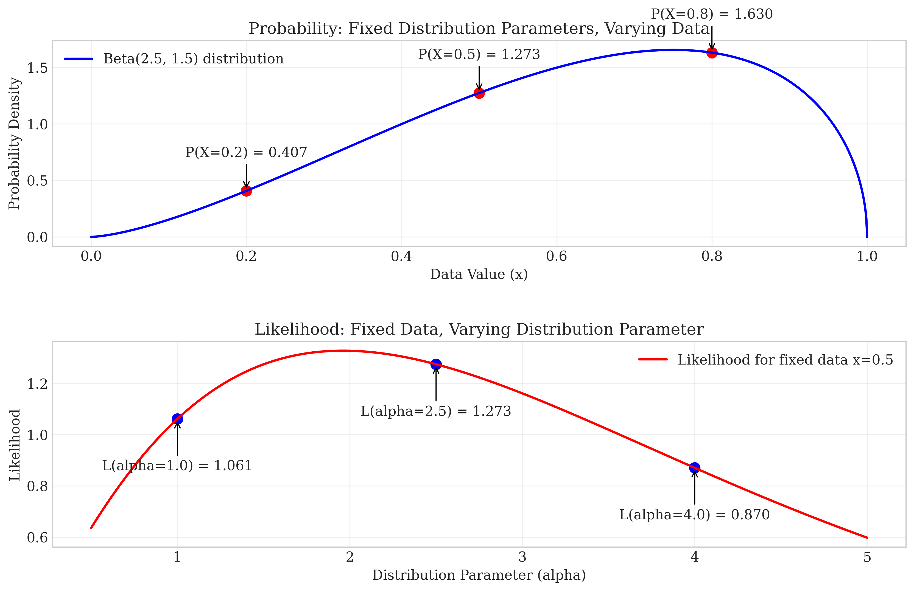

# Lecture 2.3: Statistical Estimation Basics Quiz

## Overview
This quiz contains 11 questions from different topics covered in section 2.3 of the lectures on Likelihood and Estimation.

## Question 1

### Problem Statement
Consider a random sample $X_1, X_2, \ldots, X_{10}$ from a normal distribution with unknown mean $\mu$ and known standard deviation $\sigma = 2$. Suppose we observe the following values:
$\{4.2, 3.8, 5.1, 4.5, 3.2, 4.9, 5.3, 4.0, 4.7, 3.6\}$

#### Task
1. Write down the likelihood function $L(\mu)$ for this sample
2. Write down the log-likelihood function $\ell(\mu)$
3. Calculate the maximum likelihood estimate for $\mu$
4. Find the likelihood ratio for testing $H_0: \mu = 5$ versus $H_1: \mu \neq 5$

For a detailed explanation of this question, see [Question 1: Likelihood Function and MLE](L2_3_1_explanation.md).

## Question 2

### Problem Statement
Let $X_1, X_2, \ldots, X_{20}$ be a random sample from a distribution with PDF:

$$f(x|\theta) = \theta x^{\theta-1}, \quad 0 < x < 1, \theta > 0$$

#### Task
1. Derive the likelihood function $L(\theta)$
2. Derive the log-likelihood function $\ell(\theta)$
3. Find the score function (the derivative of the log-likelihood with respect to $\theta$)
4. Suppose the observed data has geometric mean 0.8. Find the maximum likelihood estimate for $\theta$

For a detailed explanation of this question, see [Question 2: Likelihood and Score Function](L2_3_2_explanation.md).

## Question 3

### Problem Statement
Consider estimating the parameter $\lambda$ of a Poisson distribution based on $n$ independent observations $X_1, X_2, \ldots, X_n$.

#### Task
1. Derive the maximum likelihood estimator (MLE) for $\lambda$
2. Is this estimator unbiased? If not, calculate its bias
3. Calculate the variance of the MLE

For a detailed explanation of this question, see [Question 3: Properties of Poisson MLE](L2_3_3_explanation.md).

## Question 4

### Problem Statement
Consider the estimation of a parameter $\theta$ with two different estimators:

Estimator A: $\hat{\theta}_A$ with bias $b_A(\theta) = 0.1\theta$ and variance $\text{Var}(\hat{\theta}_A) = 0.5$
Estimator B: $\hat{\theta}_B$ with bias $b_B(\theta) = 0$ and variance $\text{Var}(\hat{\theta}_B) = 0.8$

#### Task
1. Calculate the Mean Squared Error (MSE) for each estimator when $\theta = 2$
2. Which estimator would you prefer when $\theta = 2$, and why?
3. Is there a value of $\theta$ for which estimator A has lower MSE than estimator B? If yes, find the range of $\theta$ values for which this is true
4. Discuss the bias-variance tradeoff in the context of these two estimators

For a detailed explanation of this question, see [Question 4: MSE and Bias-Variance Tradeoff](L2_3_4_explanation.md).

## Question 5

### Problem Statement
Is the sample mean a sufficient statistic for the parameter $\mu$ of a normal distribution with known variance?

### Task
1. Determine if the sample mean $\bar{X}$ is a sufficient statistic for $\mu$ in a normal distribution with known variance $\sigma^2$.

For a detailed explanation of this question, see [Question 5: Sufficient Statistics](L2_3_5_explanation.md).

## Question 6

### Problem Statement
Consider the bias-variance tradeoff in estimator selection.

#### Task
If an estimator has bias $b(\theta)$ and variance $v(\theta)$, write the formula for its Mean Squared Error (MSE) in terms of $b(\theta)$ and $v(\theta)$.

For a detailed explanation of this question, see [Question 6: MSE Formula](L2_3_7_explanation.md).

## Question 7

### Problem Statement
What is the fundamental difference between probability and likelihood?

#### Task
Explain in one sentence the key distinction between probability and likelihood in the context of statistical estimation.

For a detailed explanation of this question, see [Question 7: Probability vs Likelihood](L2_3_8_explanation.md).

## Question 8

### Problem Statement
Evaluate whether each of the following statements is TRUE or FALSE. Justify your answer with a brief explanation.

#### Task
1. The likelihood function represents the probability of observing the data given the parameters.
2. If two estimators have the same variance, the one with lower bias will always have lower Mean Squared Error (MSE).

For a detailed explanation of this question, see [Question 8: Statistical Estimation Fundamentals](L2_3_11_explanation.md).

## Question 9

### Problem Statement
Consider a random sample from a Bernoulli distribution with parameter $p$.

#### Task
What is the sufficient statistic for estimating the parameter $p$?

A) The sample median
B) The sample mean
C) The sample variance
D) The sample size

For a detailed explanation of this question, see [Question 9: Sufficient Statistics](L2_3_12_explanation.md).

## Question 10

### Problem Statement
For a random sample $X_1, X_2, \ldots, X_n$ from a distribution with unknown mean $\mu$ and known variance $\sigma^2$, the Point Estimator $\hat{\mu} = \frac{1}{n}\sum_{i=1}^{n}X_i$ is used.

#### Task
Calculate the bias and variance of this estimator.

For a detailed explanation of this question, see [Question 10: Bias and Variance of Estimators](L2_3_13_explanation.md).

## Question 11

### Problem Statement
A researcher has collected 50 data points on a continuous random variable X, which takes values between 0 and 1. The researcher wants to determine the best probabilistic model for this data by comparing three different distribution families: Beta, Normal, and Exponential. The following figures show different aspects of the likelihood analysis.

#### Task
Using only the information provided in these graphs, answer the following questions:

1. Based on Figure 3, explain how the likelihood function responds to changes in parameter values for each distribution model. Why does the likelihood function peak at certain parameter values?
2. According to Figure 6, which distribution family best fits the observed data? Explain your reasoning.
3. Looking at Figure 4, visually assess how well each fitted distribution matches the observed data histogram.
4. Using Figure 5, explain the key difference between probability and likelihood in your own words.
5. Based on all the information provided, which distribution would you recommend using to model this data? Justify your answer.

For a detailed explanation of this question, see [Question 11: Likelihood Functions and Distribution Fitting](L2_3_15_explanation.md).