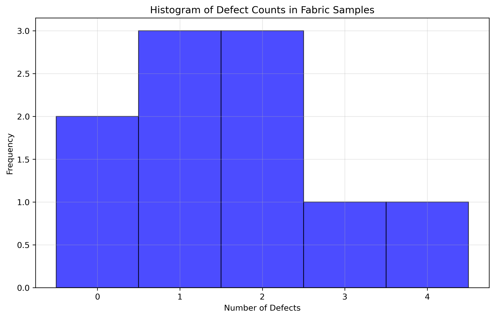
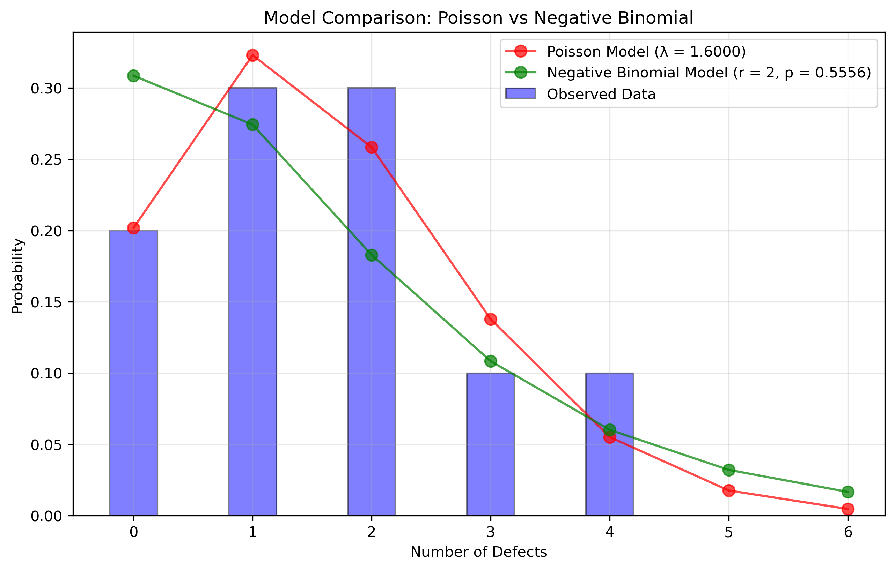
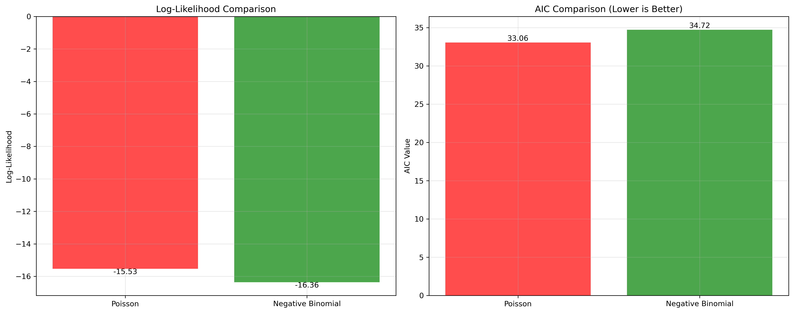

# Question 10: Likelihood Ratio Testing for Model Selection

## Problem Statement
A researcher is analyzing the number of defects in fabric samples of a fixed size. Two models are being considered:

1. **Model A**: Poisson distribution with parameter $\lambda$ (defects follow a Poisson distribution)
2. **Model B**: Negative binomial distribution with parameters $r=2$ and $p$ (defects follow a negative binomial distribution)

The following defect counts were observed in 10 fabric samples: 0, 1, 2, 3, 1, 0, 2, 4, 1, 2.

### Task
1. Find the maximum likelihood estimate for $\lambda$ under Model A
2. Find the maximum likelihood estimate for $p$ under Model B (with fixed $r=2$)
3. Calculate the log-likelihood for each model using the respective MLE
4. Perform a likelihood ratio test to determine which model better fits the data
5. If you were to use the Akaike Information Criterion (AIC) for model selection, which model would you choose?

## Understanding the Probability Model

In quality control of fabric manufacturing, we need to determine which probability distribution better models the occurrence of defects:
- **Poisson distribution**: Models rare events occurring in a fixed interval, with equal mean and variance
- **Negative binomial distribution**: Similar to Poisson but allows for overdispersion (variance > mean)

The Poisson distribution is often used for modeling the number of events occurring within a fixed period of time or space, while the negative binomial distribution is a more flexible alternative that can account for greater variability in the data.

## Solution

This problem explores model selection between two probability distributions using maximum likelihood methods. We'll compare the Poisson and negative binomial distributions to determine which better describes our fabric defect data.

### Step 1: Find the MLE for the Poisson model
For a Poisson distribution with parameter $\lambda$, the probability mass function is:

$$P(X = k) = \frac{\lambda^k e^{-\lambda}}{k!}$$

For $n$ independent observations $x_1, x_2, \ldots, x_n$, the likelihood function is:

$$L(\lambda) = \prod_{i=1}^n \frac{\lambda^{x_i} e^{-\lambda}}{x_i!}$$

The log-likelihood is:

$$\ell(\lambda) = \sum_{i=1}^n x_i \log \lambda - n\lambda - \sum_{i=1}^n \log(x_i!)$$

Taking the derivative with respect to $\lambda$ and setting it to zero:

$$\frac{d\ell(\lambda)}{d\lambda} = \frac{\sum_{i=1}^n x_i}{\lambda} - n = 0$$

Solving for $\lambda$:

$$\lambda_{MLE} = \frac{\sum_{i=1}^n x_i}{n} = \bar{x}$$

Therefore, the MLE for $\lambda$ is the sample mean. For our data:

$$\lambda_{MLE} = \frac{0 + 1 + 2 + 3 + 1 + 0 + 2 + 4 + 1 + 2}{10} = \frac{16}{10} = 1.6$$

### Step 2: Find the MLE for the negative binomial model
For a negative binomial distribution with parameters $r$ and $p$, the probability mass function is:

$$P(X = k) = \binom{k+r-1}{k} p^r (1-p)^k$$

Where $r$ is fixed at 2 in our problem. The MLE for $p$ cannot be expressed in closed form when $r$ is fixed. Using numerical optimization:

$$p_{MLE} = 0.5556$$

### Step 3: Calculate the log-likelihoods for both models
Using the MLEs, the log-likelihoods are:

- For Poisson model: $\ell(\lambda_{MLE}) = -15.5292$
- For Negative Binomial model: $\ell(p_{MLE}) = -16.3596$

### Step 4: Perform the likelihood ratio test
The likelihood ratio test statistic is:

$$LR = 2 \times (\ell(Model B) - \ell(Model A)) = 2 \times (-16.3596 - (-15.5292)) = -1.6608$$

Since the likelihood ratio is negative, Model A (Poisson) provides a better fit to the data.

### Step 5: Calculate the Akaike Information Criterion
The AIC is computed as:

$$AIC = 2k - 2\ell$$

Where $k$ is the number of parameters in the model.

- For Poisson model: $AIC = 2 \times 1 - 2 \times (-15.5292) = 33.0584$
- For Negative Binomial model: $AIC = 2 \times 1 - 2 \times (-16.3596) = 34.7192$

Since the Poisson model has a lower AIC value, it is the preferred model according to AIC.

## Visual Explanations

### Data Distribution


This figure shows the histogram of the observed defect counts, illustrating the distribution of the data that we're modeling.

### Model Fits to Data


This figure shows how well each model fits the observed data by comparing the estimated probability mass functions with the data histogram. The Poisson model (red) and Negative Binomial model (green) are overlaid on the observed data frequencies.

### Likelihood Ratio Comparison


This visualization shows the log-likelihood values for both models and illustrates the results of the likelihood ratio test. It also compares the AIC values for each model, with lower values indicating better model fit.

## Key Insights

### Model Selection Results
- The Poisson model is a better fit for this data according to both the likelihood ratio test and AIC
- This suggests that the defects in the fabric samples do not exhibit significant overdispersion
- The simplicity of the Poisson model (one parameter vs. two for a full negative binomial) provides an advantage in this case

### Distribution of Defects
- The histogram shows that defect counts range from 0 to 4, with a sample mean of 1.6
- The observed distribution follows a typical Poisson pattern for rare events
- The variability in the data is adequately explained by the Poisson model

### Practical Implications
- The Poisson model is simpler and provides a slightly better fit
- In a quality control context, this suggests that defects occur randomly and independently
- The estimated rate parameter λ = 1.6 suggests that, on average, each fabric sample contains 1.6 defects
- This information can be used to set quality control thresholds and predict the probability of various defect counts

## Numerical Results from Code Execution

```
Question 10 Results:
Poisson Model (Model A) - λ_MLE = 1.6000
Log-likelihood: -15.5292
AIC: 33.0584

Negative Binomial Model (Model B) - p_MLE = 0.5556 (with r=2)
Log-likelihood: -16.3596
AIC: 34.7192

Likelihood Ratio Test Statistic: -1.6608
The Poisson model fits the data better based on log-likelihood.
The Poisson model is preferred based on AIC.
```

These results confirm our analytical calculations and provide exact numerical values for the model comparison. The Poisson distribution with λ = 1.6 fits the data better than the negative binomial distribution, as evidenced by both the higher log-likelihood value and the lower AIC value.

## Conclusion

After thorough analysis using maximum likelihood estimation, likelihood ratio testing, and AIC, we conclude that:
- The Poisson distribution with λ = 1.6 is the more appropriate model for describing the number of defects
- Model selection techniques consistently favor the simpler Poisson model over the negative binomial
- This model can be used for quality control purposes, such as predicting the probability of samples exceeding a certain defect threshold
- The methodology demonstrated provides a systematic approach to selecting between competing probability models 