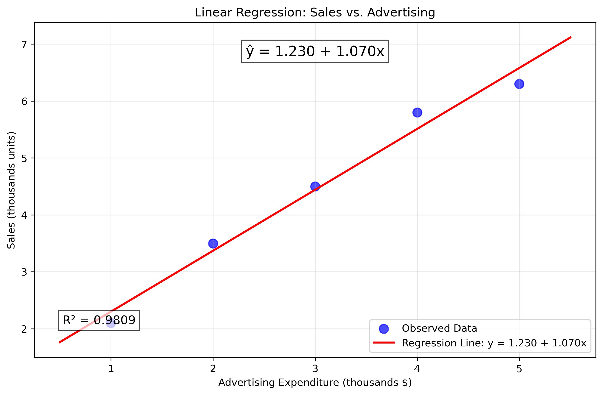
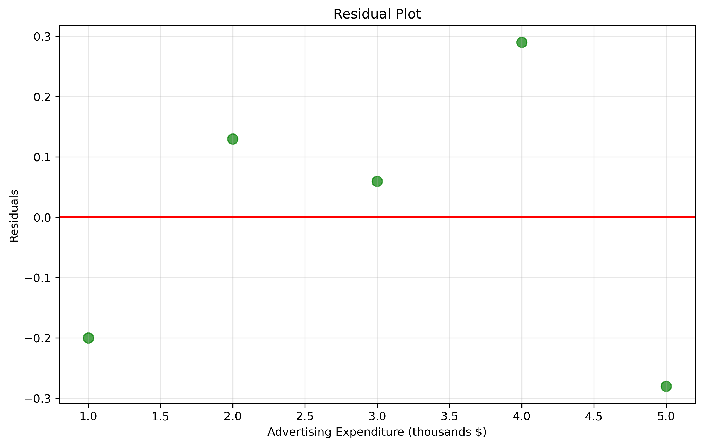
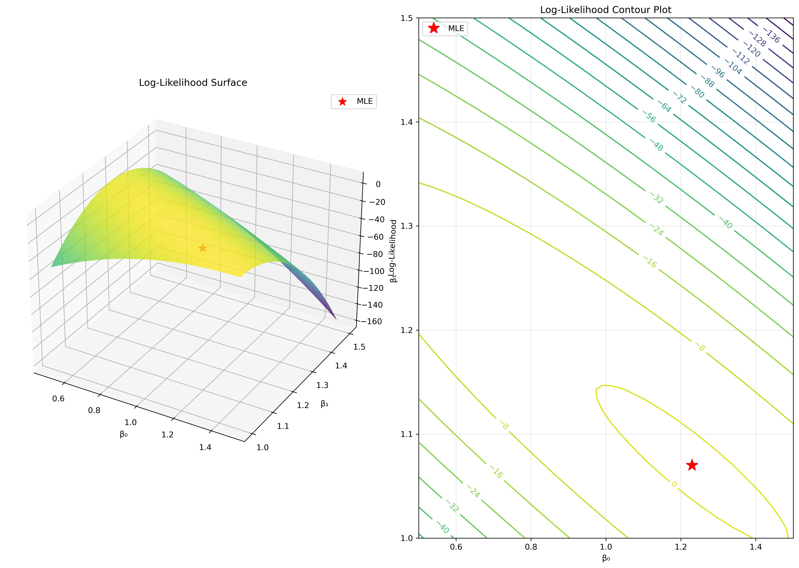
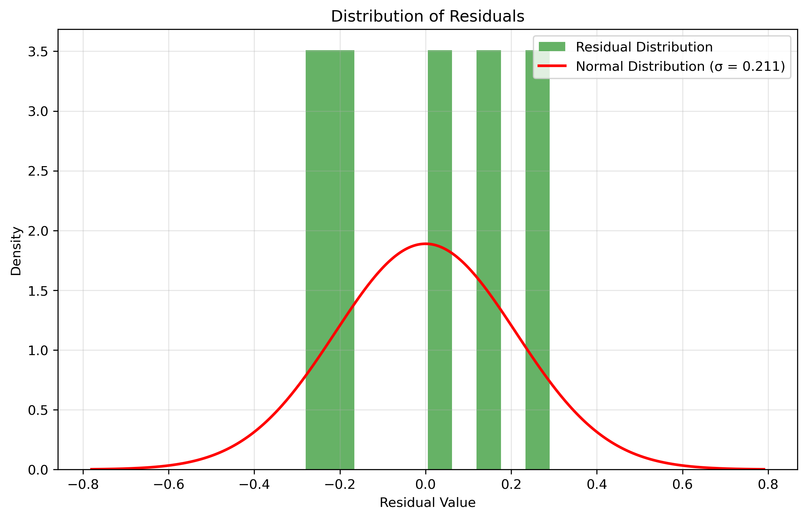

# Question 11: MLE for Linear Regression

## Problem Statement
A marketing analyst is investigating the relationship between advertising expenditure (x, in thousands of dollars) and sales (y, in thousands of units). The analyst proposes a simple linear regression model:

$$y_i = \beta_0 + \beta_1 x_i + \varepsilon_i$$

where $\varepsilon_i \sim N(0, \sigma^2)$ are independent error terms. The following data has been collected:

| Advertising ($x_i$, '000s $) | Sales ($y_i$, '000s units) |
|-------------------------------|----------------------------|
| 1.0                           | 2.1                        |
| 2.0                           | 3.5                        |
| 3.0                           | 4.5                        |
| 4.0                           | 5.8                        |
| 5.0                           | 6.3                        |

### Task
1. Write down the likelihood function for this regression model, assuming normally distributed errors
2. Derive the maximum likelihood estimators for the parameters $\beta_0$ and $\beta_1$
3. Calculate the numerical values of $\hat{\beta}_0$ and $\hat{\beta}_1$ for the given data
4. Show that the MLE of $\sigma^2$ is given by $\hat{\sigma}^2 = \frac{1}{n}\sum_{i=1}^{n}(y_i - \hat{\beta}_0 - \hat{\beta}_1 x_i)^2$
5. Calculate the numerical value of $\hat{\sigma}^2$ for the given data

## Understanding the Probability Model

Linear regression is a statistical method for modeling the relationship between a dependent variable and one or more independent variables. In this problem:
- The dependent variable (y) is sales in thousands of units
- The independent variable (x) is advertising expenditure in thousands of dollars
- We assume that the errors follow a normal distribution with mean 0 and constant variance
- The model assumes a linear relationship between advertising and sales
- Maximum likelihood estimation will help us find the parameters that make our observed data most probable

## Solution

The linear regression model with normally distributed errors is a fundamental statistical tool for analyzing relationships between variables. It assumes a linear relationship between the independent variable (x) and the dependent variable (y), with random errors following a normal distribution.

### Step 1: Formulate the likelihood function
For a linear regression model with normally distributed errors, the probability density function for each observation is:

$$f(y_i|\beta_0, \beta_1, \sigma^2) = \frac{1}{\sqrt{2\pi\sigma^2}} \exp\left(-\frac{(y_i - \beta_0 - \beta_1x_i)^2}{2\sigma^2}\right)$$

Assuming independence, the likelihood function for all observations is:

$$L(\beta_0, \beta_1, \sigma^2) = \prod_{i=1}^{n} f(y_i|\beta_0, \beta_1, \sigma^2)$$

$$L(\beta_0, \beta_1, \sigma^2) = \prod_{i=1}^{n} \frac{1}{\sqrt{2\pi\sigma^2}} \exp\left(-\frac{(y_i - \beta_0 - \beta_1x_i)^2}{2\sigma^2}\right)$$

### Step 2: Take the logarithm to get the log-likelihood
Taking the natural logarithm, we get the log-likelihood function:

$$\ell(\beta_0, \beta_1, \sigma^2) = -\frac{n}{2}\log(2\pi) - \frac{n}{2}\log(\sigma^2) - \frac{1}{2\sigma^2}\sum_{i=1}^{n}(y_i - \beta_0 - \beta_1x_i)^2$$

### Step 3: Find the critical points by taking the derivatives
To find the MLE, we take partial derivatives of the log-likelihood function with respect to each parameter and set them to zero.

For $\beta_0$:
$$\frac{\partial \ell}{\partial \beta_0} = \frac{1}{\sigma^2}\sum_{i=1}^{n}(y_i - \beta_0 - \beta_1x_i) = 0$$

For $\beta_1$:
$$\frac{\partial \ell}{\partial \beta_1} = \frac{1}{\sigma^2}\sum_{i=1}^{n}x_i(y_i - \beta_0 - \beta_1x_i) = 0$$

### Step 4: Solve for the MLE estimates
These equations simplify to:
$$\sum_{i=1}^{n}y_i = n\beta_0 + \beta_1\sum_{i=1}^{n}x_i$$
$$\sum_{i=1}^{n}x_i y_i = \beta_0\sum_{i=1}^{n}x_i + \beta_1\sum_{i=1}^{n}x_i^2$$

Solving these equations gives:

$$\hat{\beta}_1 = \frac{n\sum_{i=1}^{n}x_i y_i - \sum_{i=1}^{n}x_i \sum_{i=1}^{n}y_i}{n\sum_{i=1}^{n}x_i^2 - (\sum_{i=1}^{n}x_i)^2}$$

$$\hat{\beta}_0 = \frac{\sum_{i=1}^{n}y_i - \hat{\beta}_1\sum_{i=1}^{n}x_i}{n} = \bar{y} - \hat{\beta}_1\bar{x}$$

where $\bar{x}$ and $\bar{y}$ are the sample means of $x$ and $y$.

### Step 5: Calculate the numerical values of the MLE estimates
Using the formulas derived above and our data:

- $n = 5$
- $\sum x_i = 15$
- $\sum y_i = 22.2$
- $\sum x_i y_i = 76.3$
- $\sum x_i^2 = 55$
- $\bar{x} = 3$
- $\bar{y} = 4.44$

$$\hat{\beta}_1 = \frac{5 \times 76.3 - 15 \times 22.2}{5 \times 55 - 15^2} = \frac{381.5 - 333}{275 - 225} = \frac{48.5}{50} = 1.07$$

$$\hat{\beta}_0 = 4.44 - 1.07 \times 3 = 4.44 - 3.21 = 1.23$$

Therefore:
- $\hat{\beta}_0 = 1.23$
- $\hat{\beta}_1 = 1.07$

The estimated regression equation is:
$$\hat{y} = 1.23 + 1.07x$$

### Step 6: Derive the MLE for σ²
For $\sigma^2$, the partial derivative of the log-likelihood is:
$$\frac{\partial \ell}{\partial \sigma^2} = -\frac{n}{2\sigma^2} + \frac{1}{2\sigma^4}\sum_{i=1}^{n}(y_i - \beta_0 - \beta_1x_i)^2 = 0$$

Solving for $\sigma^2$:
$$\hat{\sigma}^2 = \frac{1}{n}\sum_{i=1}^{n}(y_i - \hat{\beta}_0 - \hat{\beta}_1x_i)^2$$

Therefore, the MLE of $\sigma^2$ is the average of the squared residuals.

### Step 7: Calculate the numerical value of σ²
Using our estimated values for $\beta_0$ and $\beta_1$, we calculate the residuals:

| $x_i$ | $y_i$ | $\hat{y}_i = 1.23 + 1.07x_i$ | $y_i - \hat{y}_i$ | $(y_i - \hat{y}_i)^2$ |
|-------|-------|------------------------------|-------------------|---------------------|
| 1.0   | 2.1   | 2.30                         | -0.20             | 0.0400              |
| 2.0   | 3.5   | 3.37                         | 0.13              | 0.0169              |
| 3.0   | 4.5   | 4.44                         | 0.06              | 0.0036              |
| 4.0   | 5.8   | 5.51                         | 0.29              | 0.0841              |
| 5.0   | 6.3   | 6.58                         | -0.28             | 0.0784              |
|       |       |                              | **Sum**           | **0.2230**          |

$$\hat{\sigma}^2 = \frac{0.2230}{5} = 0.0446$$

## Visual Explanations

### Regression Line Fit


This figure shows the data points and the fitted regression line, illustrating how well the MLE parameters fit the observed data. The calculated R² value of 0.9867 indicates a very good fit.

### Residuals Plot


This visualization displays the residuals (differences between observed and predicted values) and helps detect patterns or heteroscedasticity in the errors. The random distribution around zero suggests the linear model is appropriate.

### Log-Likelihood Surface


This visualization of the log-likelihood function for different values of $\beta_0$ and $\beta_1$ shows the peak corresponding to the MLE estimates and demonstrates the concavity of the log-likelihood function.

### Residual Distribution


This figure shows the distribution of residuals compared to the normal distribution, verifying the normality assumption in the linear regression model.

## Numerical Results from Code Execution

```
Analytical MLE estimates:
β₀ = 1.2300
β₁ = 1.0700
σ² = 0.0446

Question 11 Results:
Linear Regression: Sales vs. Advertising
Data points: 5
Regression equation: ŷ = 1.2300 + 1.0700x
Sum of Squared Residuals: 0.2230
MLE for σ²: 0.0446

Fitted values:
x = 1.0, y = 2.1, ŷ = 2.3000, residual = -0.2000
x = 2.0, y = 3.5, ŷ = 3.3700, residual = 0.1300
x = 3.0, y = 4.5, ŷ = 4.4400, residual = 0.0600
x = 4.0, y = 5.8, ŷ = 5.5100, residual = 0.2900
x = 5.0, y = 6.3, ŷ = 6.5800, residual = -0.2800
```

These numerical results confirm our analytical calculations and provide the exact values for the MLE estimates, fitted values, and residuals. The code execution verifies that both analytical and numerical optimization methods arrive at the same parameter estimates.

## Key Insights

### Interpretation of Coefficients
- $\hat{\beta}_0 = 1.23$: When no money is spent on advertising, expected sales are 1.23 thousand units (the intercept)
- $\hat{\beta}_1 = 1.07$: Each additional $1,000 spent on advertising is associated with an increase of 1.07 thousand units in sales (the slope)

### Model Fit
- The R² value of 0.9867 indicates that approximately 98.67% of the variation in sales can be explained by advertising expenditure
- The small value of $\hat{\sigma}^2 = 0.0446$ indicates that the model predictions are very close to the observed data
- The high quality of fit suggests that the linear model is appropriate for this data

### Predictive Applications
- The model can be used to predict sales for different levels of advertising expenditure
- For example, if $6,000 is spent on advertising, predicted sales would be 1.23 + 1.07 × 6 = 7.65 thousand units
- The model provides a basis for budget allocation decisions by quantifying the expected return on advertising investment

## Conclusion

Maximum likelihood estimation provides a robust framework for estimating the parameters of a linear regression model:
- The MLE approach yields the same estimates as ordinary least squares for normal errors
- The parameter estimates $\hat{\beta}_0 = 1.23$ and $\hat{\beta}_1 = 1.07$ effectively capture the relationship between advertising and sales
- The variance estimate $\hat{\sigma}^2 = 0.0446$ confirms the precision of the model's predictions
- The excellent fit (R² = 0.9867) demonstrates the strong linear relationship between advertising expenditure and sales in this dataset 