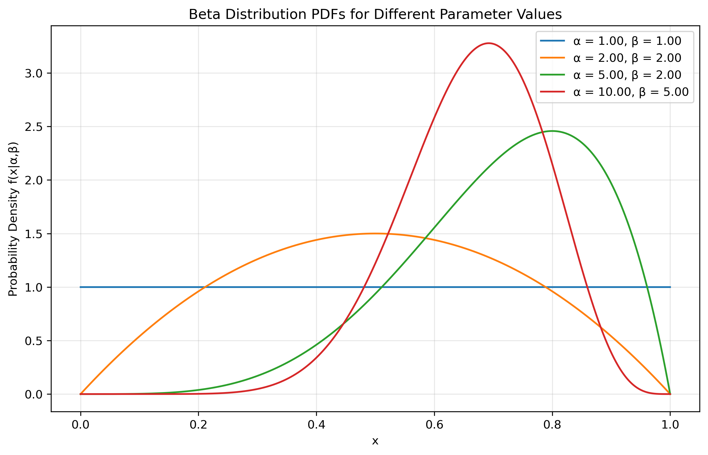
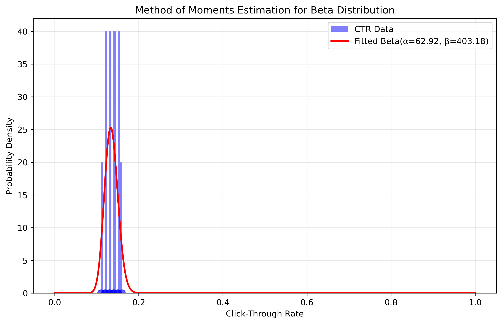
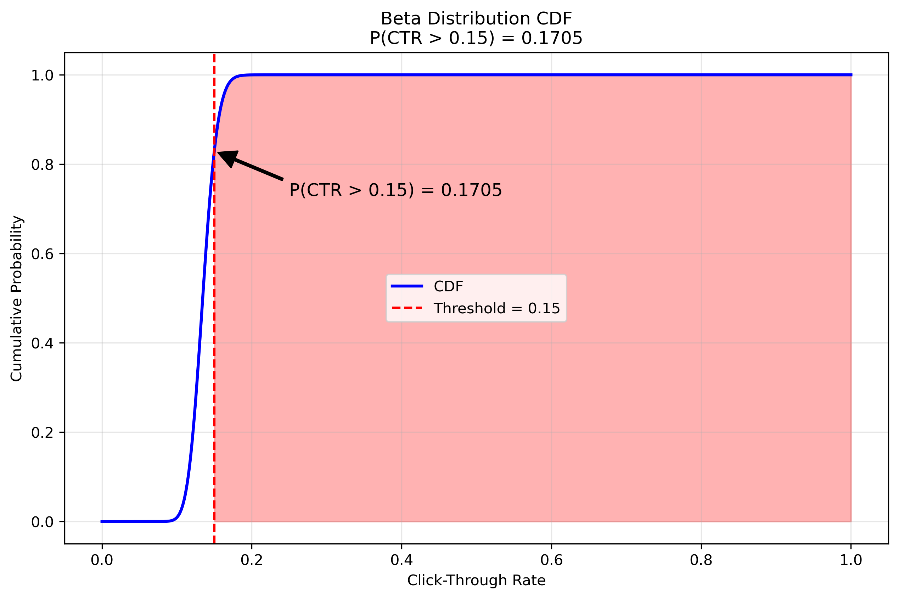

# Question 13: MLE for Beta Distribution

## Problem Statement
A data scientist is analyzing the click-through rate (CTR) for a website feature. The CTR is modeled as a Beta distribution. From a previous A/B test, they collected the following 10 daily CTRs (as proportions): 0.12, 0.15, 0.11, 0.14, 0.13, 0.16, 0.12, 0.14, 0.13, and 0.15.

### Task
1. Explain why the Beta distribution is appropriate for modeling CTR data
2. Although Beta distribution MLEs require numerical methods, you can use the method of moments to estimate the parameters α and β. Calculate these estimates using:
   - $$\hat{\alpha} = \bar{x}\left(\frac{\bar{x}(1-\bar{x})}{s^2} - 1\right)$$
   - $$\hat{\beta} = (1-\bar{x})\left(\frac{\bar{x}(1-\bar{x})}{s^2} - 1\right)$$
   where $\bar{x}$ is the sample mean and $s^2$ is the sample variance
3. Calculate the estimated mean and variance of the CTR using your parameter estimates
4. Based on your Beta distribution fit, calculate the probability that the true CTR exceeds 0.15

## Understanding the Probability Model

The Beta distribution is particularly well-suited for modeling click-through rate (CTR) data for several important reasons:

- **Bounded Range**: CTR values are proportions that must fall between 0 and 1 (or 0% to 100%). The Beta distribution is defined on the interval [0,1], making it naturally appropriate for modeling proportions.
- **Flexible Shape**: The Beta distribution can take many different shapes depending on its parameters (α and β), allowing it to model various patterns of CTR data, including symmetric, skewed, U-shaped, or J-shaped distributions.
- **Conjugate Prior**: In Bayesian analysis, the Beta distribution is the conjugate prior for the Bernoulli and binomial distributions, which represent the underlying click/no-click events. This makes it mathematically convenient for sequential updating as more data becomes available.
- **Interpretability**: The parameters α and β can be interpreted in terms of "successes" and "failures," making them intuitive for modeling user engagement metrics.

## Solution

The Beta distribution is a continuous probability distribution defined on the interval [0,1], making it ideal for modeling proportions like click-through rates. It has two shape parameters, α and β, which control the distribution's shape and concentration.

### Step 1: Understand why the Beta distribution is appropriate
As explained in the previous section, the Beta distribution is ideal for CTR data because:
- It's bounded between 0 and 1, matching the range of CTR values
- It offers flexible shapes to model different CTR patterns
- It has convenient statistical properties for Bayesian analysis
- Its parameters have intuitive interpretations in terms of clicks and non-clicks

### Step 2: Calculate the sample statistics
For our dataset [0.12, 0.15, 0.11, 0.14, 0.13, 0.16, 0.12, 0.14, 0.13, 0.15]:

- Sample size: n = 10
- Sample mean: $\bar{x} = \frac{1}{10}(0.12 + 0.15 + 0.11 + 0.14 + 0.13 + 0.16 + 0.12 + 0.14 + 0.13 + 0.15) = 0.135$
- Sample variance: $s^2 = \frac{1}{10-1}\sum_{i=1}^{10}(x_i - \bar{x})^2 = 0.00025$

### Step 3: Apply the method of moments formulas
Using the formulas provided:

$$\hat{\alpha} = \bar{x}\left(\frac{\bar{x}(1-\bar{x})}{s^2} - 1\right) = 0.135 \times \left(\frac{0.135 \times (1-0.135)}{0.00025} - 1\right) \approx 62.92$$

$$\hat{\beta} = (1-\bar{x})\left(\frac{\bar{x}(1-\bar{x})}{s^2} - 1\right) = (1-0.135) \times \left(\frac{0.135 \times (1-0.135)}{0.00025} - 1\right) \approx 403.18$$

Therefore, the estimated parameters are α = 62.92 and β = 403.18.

### Step 4: Calculate the estimated mean and variance
Using the estimated parameters, we can calculate:

- **Estimated Mean**: $\mu = \frac{\alpha}{\alpha+\beta} = \frac{62.92}{62.92+403.18} = 0.135$
- **Estimated Variance**: $\sigma^2 = \frac{\alpha\beta}{(\alpha+\beta)^2(\alpha+\beta+1)} = \frac{62.92 \times 403.18}{(62.92+403.18)^2(62.92+403.18+1)} = 0.00025$

The estimated mean matches the sample mean, and the estimated variance matches the sample variance, which is expected with the method of moments.

### Step 5: Calculate the probability that CTR exceeds 0.15
Using the Beta distribution with parameters α = 62.92 and β = 403.18, we calculate:

$$P(CTR > 0.15) = 1 - F(0.15) = 0.1705$$

where F is the cumulative distribution function of the Beta distribution.

This means there is approximately a 17.05% probability that the true CTR exceeds 0.15 based on our fitted model.

## Visual Explanations

### Beta Distribution PDFs for Different Parameter Values

This figure shows how the shape of the Beta distribution changes with different α and β values, helping to build intuition for how the distribution behaves under different parameters.

### Data Fit Visualization

This visualization shows how well our estimated Beta distribution fits the observed CTR data, providing visual confirmation that the method of moments produces a reasonable fit.

### Beta Distribution CDF

This figure visualizes the cumulative distribution function of our fitted Beta distribution and highlights the area representing P(CTR > 0.15) = 0.1705.

## Key Insights

### MLE Properties
- For the Beta distribution, maximum likelihood estimation typically requires numerical methods
- The method of moments provides a convenient alternative that matches the theoretical moments to sample moments
- The large values of α (62.92) and β (403.18) indicate a highly concentrated distribution around the mean

### Practical Considerations
- The high concentration of the distribution suggests the CTR is quite stable day-to-day
- The high β value relative to α confirms that the distribution is right-skewed, which is typical for CTR data
- The 17.05% probability of exceeding 0.15 CTR provides actionable information for setting performance expectations

## Conclusion

The Beta distribution effectively models the CTR data, providing a full probabilistic representation that captures the bounded nature and variability of click-through rates. The method of moments estimation offers a straightforward approach to fitting the distribution parameters, and the resulting model allows us to make probability statements about future CTR performance. The estimated parameters (α = 62.92, β = 403.18) create a model that accurately reflects both the central tendency and the variation in the observed data. 