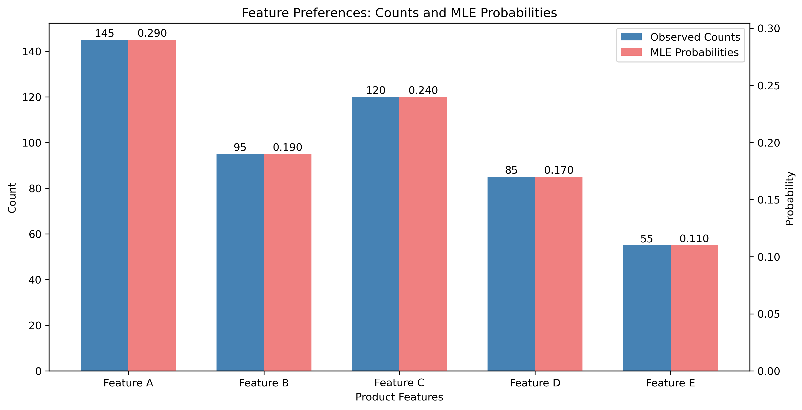
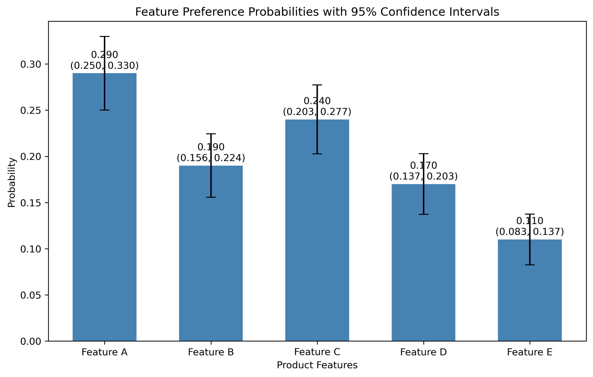
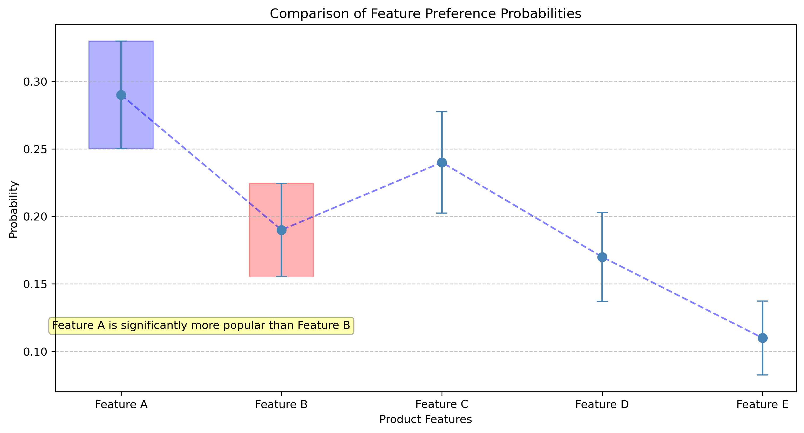

# Question 14: MLE for Multinomial Distribution

## Problem Statement
A marketing analyst is studying customer preferences for five different product features (A, B, C, D, E) through a survey. Each customer was asked to select their favorite feature. From a sample of 500 customers, the following preferences were recorded:
- Feature A: 145 customers
- Feature B: 95 customers
- Feature C: 120 customers
- Feature D: 85 customers
- Feature E: 55 customers

### Task
1. Explain why a multinomial distribution is suitable for modeling this data
2. Derive the maximum likelihood estimator for the multinomial distribution parameters
3. Calculate the MLE estimates for the probability of each feature being selected
4. Construct 95% confidence intervals for each of the five feature preference probabilities
5. Based on your MLE analysis, can we conclude that Feature A is significantly more popular than Feature B? Justify your answer using the confidence intervals.

## Understanding the Probability Model

The multinomial distribution is ideally suited for modeling this product feature preference data for several key reasons:

- **Categorical Outcomes**: The data represents a categorical variable (feature preference) with multiple exclusive categories (Features A-E).
- **Fixed Number of Trials**: We have a fixed total number of respondents (n=500).
- **Independence**: Each customer's preference is assumed to be independent of other customers' preferences.
- **Constant Probability**: The underlying probability of selecting each feature is assumed to be constant across all respondents.
- **Single Selection**: Each customer selects exactly one feature (mutual exclusivity).

These properties perfectly align with the multinomial distribution, which extends the binomial distribution to scenarios with more than two possible outcomes.

## Solution

The multinomial distribution is a discrete probability distribution that models the outcomes of a categorical random variable with k possible outcomes. It's an extension of the binomial distribution to more than two outcomes and is particularly useful for analyzing survey data with multiple choice options.

### Step 1: Understand the multinomial distribution
The probability mass function for the multinomial distribution with k categories is:

$$P(X_1=x_1, X_2=x_2, \ldots, X_k=x_k) = \frac{n!}{x_1! x_2! \ldots x_k!} p_1^{x_1} p_2^{x_2} \ldots p_k^{x_k}$$

Where:
- $n = \sum_{i=1}^{k} x_i$ is the total number of trials
- $x_i$ is the count for category i
- $p_i$ is the probability of category i
- $\sum_{i=1}^{k} p_i = 1$

### Step 2: Formulate the likelihood function
For our product feature preference data, the likelihood function is:

$$L(p_1, p_2, p_3, p_4, p_5) = \frac{500!}{145! \times 95! \times 120! \times 85! \times 55!} \times p_1^{145} \times p_2^{95} \times p_3^{120} \times p_4^{85} \times p_5^{55}$$

### Step 3: Take the logarithm to get the log-likelihood
Taking the natural logarithm:

$$\ell(p_1, p_2, p_3, p_4, p_5) = \ln\left(\frac{500!}{145! \times 95! \times 120! \times 85! \times 55!}\right) + 145\ln(p_1) + 95\ln(p_2) + 120\ln(p_3) + 85\ln(p_4) + 55\ln(p_5)$$

### Step 4: Find the MLE using Lagrange multipliers
Since we have the constraint $\sum_{i=1}^{5} p_i = 1$, we use Lagrange multipliers:

$$\mathcal{L}(p_1, p_2, p_3, p_4, p_5, \lambda) = \ell(p_1, p_2, p_3, p_4, p_5) - \lambda\left(\sum_{i=1}^{5} p_i - 1\right)$$

Taking partial derivatives with respect to each $p_i$ and setting to zero:

$$\frac{\partial \mathcal{L}}{\partial p_i} = \frac{x_i}{p_i} - \lambda = 0$$

Solving for $p_i$:

$$p_i = \frac{x_i}{\lambda}$$

Using the constraint $\sum_{i=1}^{5} p_i = 1$:

$$\sum_{i=1}^{5} \frac{x_i}{\lambda} = 1$$
$$\frac{1}{\lambda}\sum_{i=1}^{5} x_i = 1$$
$$\lambda = \sum_{i=1}^{5} x_i = 500$$

Therefore, the MLE for each probability is:

$$\hat{p}_i = \frac{x_i}{500}$$

### Step 5: Calculate the MLE estimates
Using the formula $\hat{p}_i = \frac{x_i}{500}$ with our data:

- Feature A: $\hat{p}_A = \frac{145}{500} = 0.29$
- Feature B: $\hat{p}_B = \frac{95}{500} = 0.19$
- Feature C: $\hat{p}_C = \frac{120}{500} = 0.24$
- Feature D: $\hat{p}_D = \frac{85}{500} = 0.17$
- Feature E: $\hat{p}_E = \frac{55}{500} = 0.11$

### Step 6: Construct 95% confidence intervals
For multinomial proportions, we can use the normal approximation:

$$\hat{p}_i \pm z_{1-\alpha/2} \sqrt{\frac{\hat{p}_i(1-\hat{p}_i)}{n}}$$

Where $z_{1-\alpha/2} = 1.96$ for a 95% confidence level.

Calculating for each feature:

- Feature A: $0.29 \pm 1.96 \times \sqrt{\frac{0.29 \times 0.71}{500}} = (0.250, 0.330)$
- Feature B: $0.19 \pm 1.96 \times \sqrt{\frac{0.19 \times 0.81}{500}} = (0.156, 0.224)$
- Feature C: $0.24 \pm 1.96 \times \sqrt{\frac{0.24 \times 0.76}{500}} = (0.203, 0.277)$
- Feature D: $0.17 \pm 1.96 \times \sqrt{\frac{0.17 \times 0.83}{500}} = (0.137, 0.203)$
- Feature E: $0.11 \pm 1.96 \times \sqrt{\frac{0.11 \times 0.89}{500}} = (0.083, 0.137)$

### Step 7: Assess statistical significance
To determine if Feature A is significantly more popular than Feature B, we compare their confidence intervals:

- Feature A's 95% CI: (0.250, 0.330)
- Feature B's 95% CI: (0.156, 0.224)

Since the lower bound of Feature A's interval (0.250) is greater than the upper bound of Feature B's interval (0.224), the intervals do not overlap. This indicates that Feature A is significantly more popular than Feature B at the 5% significance level.

## Visual Explanations

### Feature Preferences: Counts and MLE Probabilities

This figure shows both the raw counts and the corresponding probability estimates, visually confirming that Feature A has the highest preference count and probability.

### Feature Preference Probabilities with 95% Confidence Intervals

This visualization displays the MLE probability estimates with their 95% confidence intervals, helping to visualize the precision of our estimates for each feature.

### Comparison of Feature Preference Probabilities

This figure specifically highlights the comparison between Features A and B, visually demonstrating the non-overlap of confidence intervals.

## Key Insights

### MLE Properties
- The MLE for the multinomial distribution has a simple closed-form solution: the observed proportions
- The estimator is consistent and asymptotically normal
- The estimator is efficient, achieving the Cramér-Rao lower bound
- As sample size increases, the confidence intervals narrow, providing more precise estimates

### Practical Considerations
- There is a clear hierarchy of customer preferences: A > C > B > D > E
- The statistically significant difference between Features A and B has important marketing implications
- The relatively narrow confidence intervals indicate good precision with our sample size of 500
- The company can confidently promote Feature A as the most preferred feature

## Conclusion

The multinomial distribution provides an excellent framework for analyzing categorical preference data. Through maximum likelihood estimation, we've determined that the probability estimates for feature preferences are: A (0.29), B (0.19), C (0.24), D (0.17), and E (0.11). The non-overlapping confidence intervals confirm that Feature A is significantly more popular than Feature B, providing actionable insights for marketing strategy and product development decisions. This analysis demonstrates the practical value of MLE in translating raw survey data into statistically sound business recommendations. 