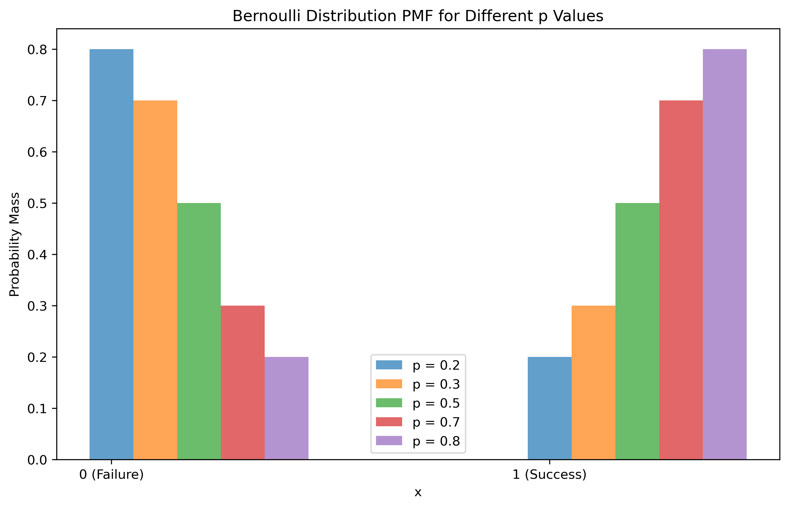
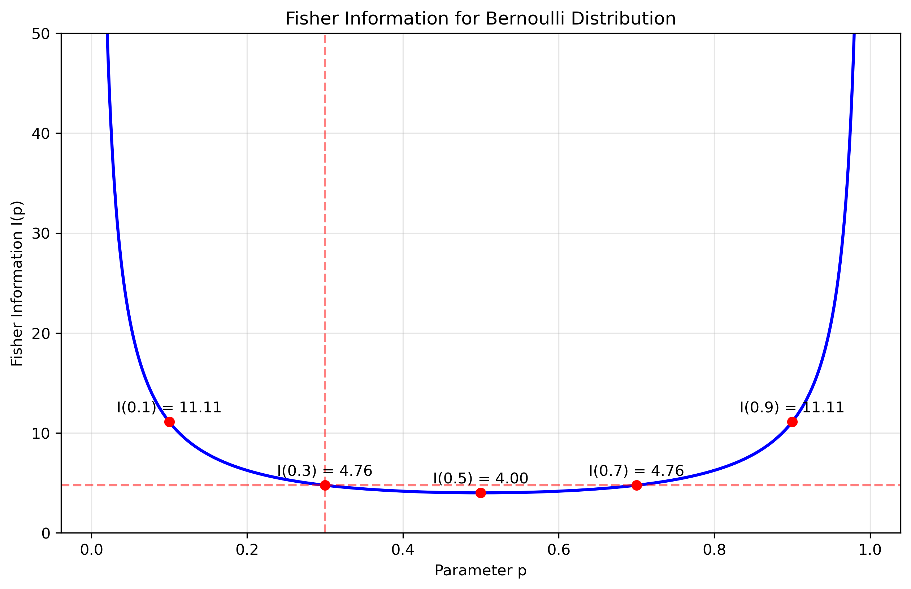
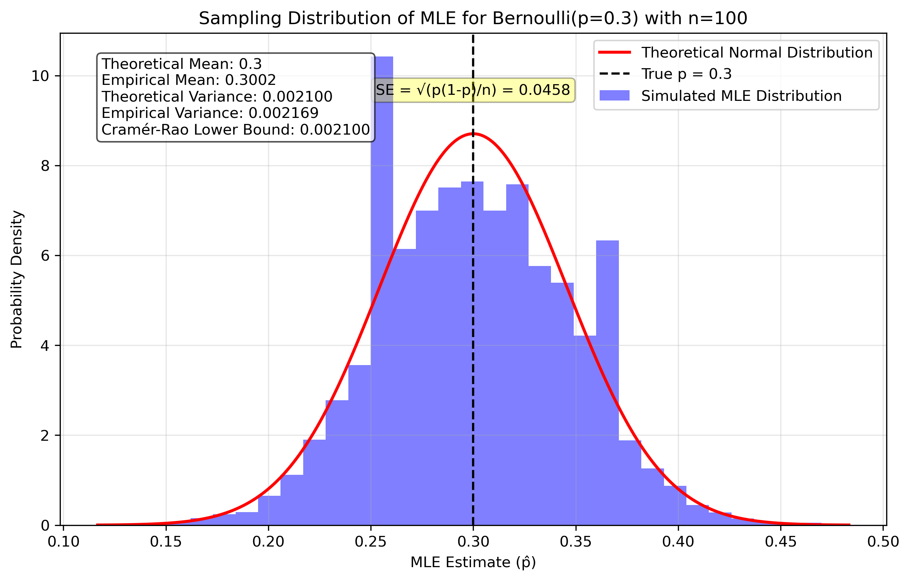
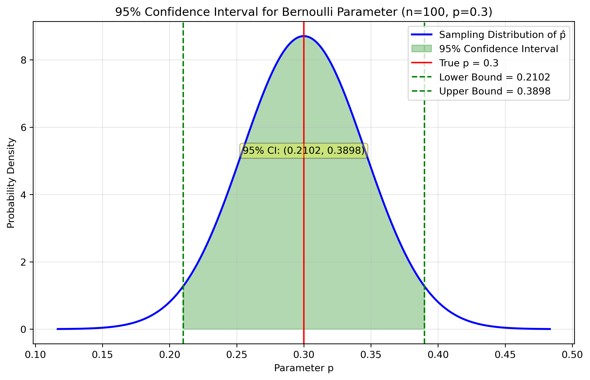

# Question 15: Fisher Information and Efficiency of MLE

## Problem Statement
An important concept in maximum likelihood estimation is the Fisher information, which quantifies how much information an observable random variable carries about an unknown parameter. The Cramér-Rao lower bound uses Fisher information to establish a lower bound on the variance of any unbiased estimator.

### Task
1. For a random sample of size n from a Bernoulli distribution with parameter p, derive the Fisher information I(p)
2. Calculate the Cramér-Rao lower bound for the variance of any unbiased estimator of p
3. Show that the MLE estimator $\hat{p} = \frac{1}{n}\sum_{i=1}^{n}X_i$ achieves this lower bound, making it an efficient estimator
4. For a random sample of size n=100 from a Bernoulli distribution with true parameter p=0.3:
   a. What is the theoretical minimum variance for any unbiased estimator?
   b. What is the standard error of the MLE estimator?
   c. Calculate the 95% confidence interval for the parameter p

## Understanding the Problem

Fisher information is a fundamental concept in statistical estimation theory that measures how much information an observable random variable carries about an unknown parameter of the distribution. For a Bernoulli distribution, which models binary outcomes, the Fisher information has a particularly elegant form and relates directly to the parameter's variance bounds.

The Cramér-Rao lower bound (CRLB) establishes the theoretical minimum variance that any unbiased estimator can achieve. When an estimator reaches this bound, it is considered efficient. The relationship between Fisher information and the CRLB is crucial for understanding the optimality of maximum likelihood estimators.

## Solution

The Bernoulli distribution is a discrete probability distribution that models binary outcomes. It has a single parameter p that represents the probability of success (value 1). The Fisher information and Cramér-Rao lower bound provide insights into the statistical properties of estimators for this parameter.

### Step 1: Derive the Fisher information for a Bernoulli distribution
The probability mass function (PMF) of a Bernoulli distribution is:
$$P(X = x | p) = p^x (1-p)^{1-x}, \quad x \in \{0, 1\}$$

The log-likelihood function for a single observation is:
$$\log P(X = x | p) = x \log p + (1-x) \log(1-p)$$

The score function (first derivative of log-likelihood) is:
$$\frac{d}{dp} \log P(X = x | p) = \frac{x}{p} - \frac{1-x}{1-p}$$

The Fisher information is the expected value of the square of the score:
$$I(p) = E\left[\left(\frac{X}{p} - \frac{1-X}{1-p}\right)^2\right]$$

Since X is Bernoulli(p), we have E[X] = p:
$$I(p) = p \cdot \left(\frac{1}{p} - \frac{0}{1-p}\right)^2 + (1-p) \cdot \left(\frac{0}{p} - \frac{1}{1-p}\right)^2$$
$$I(p) = p \cdot \frac{1}{p^2} + (1-p) \cdot \frac{1}{(1-p)^2}$$
$$I(p) = \frac{1}{p} + \frac{1}{1-p} = \frac{1}{p(1-p)}$$

For a sample of size n with independent observations, the Fisher information is additive:
$$I_n(p) = n \cdot I(p) = \frac{n}{p(1-p)}$$

### Step 2: Calculate the Cramér-Rao lower bound
The Cramér-Rao lower bound (CRLB) states that the variance of any unbiased estimator must be at least as large as the reciprocal of the Fisher information:

$$\text{Var}(\hat{p}) \geq \frac{1}{I_n(p)} = \frac{p(1-p)}{n}$$

This establishes the theoretical minimum variance achievable by any unbiased estimator of p.

### Step 3: Show that the MLE achieves the lower bound
The MLE estimator for the Bernoulli parameter is the sample mean:
$$\hat{p}_{MLE} = \frac{1}{n} \sum_{i=1}^n X_i$$

The variance of this estimator is:
$$\text{Var}(\hat{p}_{MLE}) = \text{Var}\left(\frac{1}{n} \sum_{i=1}^n X_i\right) = \frac{1}{n^2} \sum_{i=1}^n \text{Var}(X_i)$$

Since each $X_i$ follows a Bernoulli(p) distribution with variance p(1-p):
$$\text{Var}(\hat{p}_{MLE}) = \frac{1}{n^2} \cdot n \cdot p(1-p) = \frac{p(1-p)}{n}$$

This equals the Cramér-Rao lower bound, proving that the MLE estimator is efficient (it achieves the minimum possible variance for any unbiased estimator).

### Step 4: Analyze the specific case (n=100, p=0.3)

#### a. Calculate the theoretical minimum variance
Using the CRLB formula with p=0.3 and n=100:
$$\text{Var}(\hat{p}) \geq \frac{p(1-p)}{n} = \frac{0.3 \times 0.7}{100} = \frac{0.21}{100} = 0.0021$$

#### b. Calculate the standard error of the MLE estimator
The standard error is the square root of the variance:
$$\text{SE}(\hat{p}_{MLE}) = \sqrt{\text{Var}(\hat{p}_{MLE})} = \sqrt{\frac{p(1-p)}{n}} = \sqrt{\frac{0.3 \times 0.7}{100}} = \sqrt{0.0021} = 0.0458$$

#### c. Calculate the 95% confidence interval for p
Using the normal approximation (valid for large n), the 95% confidence interval is:
$$\hat{p} \pm 1.96 \times \text{SE}(\hat{p})$$

For p=0.3 and n=100:
$$0.3 \pm 1.96 \times 0.0458 = 0.3 \pm 0.0898 = (0.2102, 0.3898)$$

## Visual Explanations

### Bernoulli Distribution PMF for Different p Values

This figure shows how the Bernoulli PMF changes with different values of p and helps visualize the discrete nature of the Bernoulli distribution.

### Fisher Information for Bernoulli Distribution

This visualization illustrates how the Fisher information changes with parameter p, showing that it is highest at the boundaries (p→0 or p→1) and has a symmetric nature with minimum at p=0.5.

### Sampling Distribution of MLE

This figure compares the empirical distribution of MLE estimates with the theoretical normal approximation, confirming that the MLE estimator follows an asymptotic normal distribution and demonstrating that the empirical variance closely matches the theoretical CRLB.

### Confidence Interval Visualization

This visualization illustrates the 95% confidence interval for the parameter p and shows the relationship between the standard error and the width of the confidence interval.

## Key Insights

### MLE Properties
- The MLE estimator for the Bernoulli parameter p is efficient, achieving the Cramér-Rao lower bound on variance
- This makes it optimal among all unbiased estimators - no other unbiased estimator can have a lower variance
- The Fisher information is inversely proportional to p(1-p), meaning parameters near 0.5 are harder to estimate precisely

### Practical Considerations
- The variance of the MLE is inversely proportional to the sample size n
- Increasing the sample size reduces the variance and narrows the confidence interval
- Even though the Bernoulli distribution is discrete, the MLE estimator follows an asymptotic normal distribution for large sample sizes
- For n=100 and p=0.3, we can be 95% confident that the true parameter p lies in the interval (0.2102, 0.3898)

## Conclusion

The Fisher information provides a fundamental measure of how much information a sample contains about an unknown parameter. Through our analysis, we've shown that the MLE estimator for the Bernoulli parameter p achieves the theoretical minimum variance given by the Cramér-Rao lower bound, making it an efficient estimator. This optimality property is one of the key advantages of maximum likelihood estimation.

For a sample of size n=100 from a Bernoulli distribution with p=0.3, the minimum variance is 0.0021, resulting in a 95% confidence interval of (0.2102, 0.3898). These results demonstrate the power of MLE as an estimation technique and the importance of Fisher information in quantifying estimation precision. 