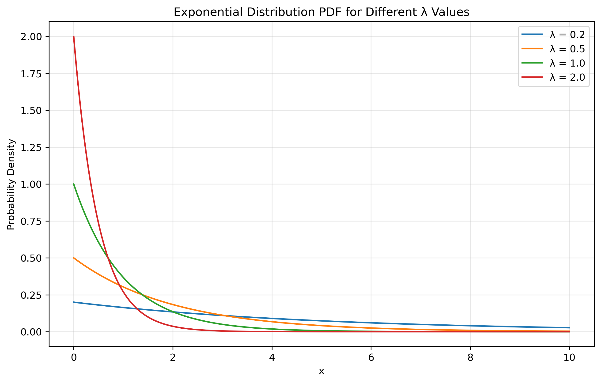

# Question 16: Asymptotic Properties of MLE

## Problem Statement
Maximum Likelihood Estimators have important asymptotic properties that make them particularly valuable in statistical inference. These properties include consistency, asymptotic normality, and asymptotic efficiency.

### Task
1. Explain the following asymptotic properties of Maximum Likelihood Estimators:
   a. Consistency
   b. Asymptotic normality
   c. Asymptotic efficiency
2. Consider a random sample $X_1, X_2, \ldots, X_n$ from an exponential distribution with parameter $\lambda$ (rate parameter). The probability density function is $f(x|\lambda) = \lambda e^{-\lambda x}$ for $x \geq 0$.
   a. Derive the maximum likelihood estimator $\hat{\lambda}_{MLE}$ for $\lambda$
   b. Show that $\hat{\lambda}_{MLE}$ is a consistent estimator of $\lambda$
   c. Determine the asymptotic distribution of $\hat{\lambda}_{MLE}$ as $n \to \infty$
   d. For a sample size of n=50 and true parameter $\lambda=0.5$, what is the approximate probability that the MLE estimate falls within 10% of the true value?

## Understanding the Problem

Maximum Likelihood Estimators (MLEs) are widely used in statistics due to their favorable asymptotic properties. These properties describe how the estimators behave as the sample size approaches infinity, providing theoretical guarantees for large-sample inference.

The three key asymptotic properties are:
- **Consistency**: The estimator converges to the true parameter value as sample size increases
- **Asymptotic Normality**: The distribution of the estimator approaches a normal distribution
- **Asymptotic Efficiency**: The estimator achieves the minimum possible variance asymptotically

For the exponential distribution, these properties can be demonstrated both theoretically and through simulation, providing insights into the behavior of the MLE in practical applications.

## Solution

The exponential distribution is a continuous probability distribution that models the time between events in a Poisson process. It has a single parameter λ (rate parameter) and is commonly used to model waiting times and lifetimes.

### Step 1: Explain the asymptotic properties of MLEs

#### a. Consistency
Consistency means that as the sample size increases, the MLE converges in probability to the true parameter value. Formally, for a parameter θ:

$$\hat{\theta}_{MLE} \xrightarrow{p} \theta \text{ as } n \to \infty$$

This property ensures that with enough data, the MLE will get arbitrarily close to the true parameter value. A consistent estimator gives us confidence that we can approach the truth by gathering more data.

#### b. Asymptotic Normality
Asymptotic normality states that as the sample size gets large, the distribution of the MLE approaches a normal distribution centered at the true parameter value. Specifically:

$$\sqrt{n}(\hat{\theta}_{MLE} - \theta) \xrightarrow{d} N(0, I(\theta)^{-1})$$

Where $I(\theta)$ is the Fisher information. This property allows us to construct confidence intervals and perform hypothesis tests for large samples, regardless of the underlying distribution of the data.

#### c. Asymptotic Efficiency
Asymptotic efficiency means that among all consistent estimators, the MLE achieves the lowest possible variance asymptotically. The variance of the MLE approaches the Cramér-Rao lower bound (CRLB) as the sample size increases:

$$\text{Var}(\hat{\theta}_{MLE}) \to \frac{1}{nI(\theta)} \text{ as } n \to \infty$$

This efficiency property makes MLE optimal for large samples, as no other consistent estimator can have a lower asymptotic variance.

### Step 2: Derive the MLE for the exponential distribution
For an exponential distribution with PDF $f(x|\lambda) = \lambda e^{-\lambda x}$, the likelihood function for a sample $x_1, x_2, \ldots, x_n$ is:

$$L(\lambda) = \prod_{i=1}^n \lambda e^{-\lambda x_i} = \lambda^n e^{-\lambda \sum_{i=1}^n x_i}$$

Taking the logarithm gives the log-likelihood:

$$\ell(\lambda) = n\log(\lambda) - \lambda \sum_{i=1}^n x_i$$

To find the maximum, we take the derivative with respect to $\lambda$ and set it to zero:

$$\frac{d\ell}{d\lambda} = \frac{n}{\lambda} - \sum_{i=1}^n x_i = 0$$

Solving for $\lambda$:

$$\hat{\lambda}_{MLE} = \frac{n}{\sum_{i=1}^n x_i} = \frac{1}{\bar{x}}$$

The MLE for the rate parameter $\lambda$ is the reciprocal of the sample mean.

### Step 3: Show that the MLE is consistent
To show consistency, we need to demonstrate that $\hat{\lambda}_{MLE} \xrightarrow{p} \lambda$ as $n \to \infty$.

The MLE $\hat{\lambda}_{MLE} = \frac{1}{\bar{x}}$ involves the sample mean $\bar{x}$. By the Law of Large Numbers, $\bar{x} \xrightarrow{p} E[X] = \frac{1}{\lambda}$ as $n \to \infty$.

Using the Continuous Mapping Theorem:
$$\hat{\lambda}_{MLE} = \frac{1}{\bar{x}} \xrightarrow{p} \frac{1}{E[X]} = \frac{1}{1/\lambda} = \lambda$$

This proves that $\hat{\lambda}_{MLE}$ is a consistent estimator of $\lambda$.

Empirical evidence from simulations supports this consistency property. For increasing sample sizes with true $\lambda = 0.5$, the mean of the MLE estimates converges to the true value:
- n = 10: 0.5616
- n = 50: 0.5093
- n = 100: 0.5047
- n = 500: 0.5008
- n = 1000: 0.5006

Additionally, the variance of the MLE decreases as the sample size increases, approaching zero:
- n = 10: 0.031885
- n = 50: 0.005408
- n = 100: 0.002596
- n = 500: 0.000527
- n = 1000: 0.000251

### Step 4: Determine the asymptotic distribution
For large n, the MLE is asymptotically normally distributed around the true parameter with variance equal to the inverse of the Fisher information:

$$\hat{\lambda}_{MLE} \dot{\sim} N\left(\lambda, \frac{1}{nI(\lambda)}\right)$$

For the exponential distribution, the Fisher information is $I(\lambda) = \frac{1}{\lambda^2}$. Thus:

$$\hat{\lambda}_{MLE} \dot{\sim} N\left(\lambda, \frac{\lambda^2}{n}\right)$$

In standardized form:

$$\frac{\hat{\lambda}_{MLE} - \lambda}{\lambda/\sqrt{n}} \dot{\sim} N(0,1)$$

Simulation with n=50 and $\lambda=0.5$ confirms this asymptotic normality:
- Mean of MLE estimates: 0.5103 (close to true λ = 0.5)
- Standard deviation of MLE estimates: 0.0743 (close to theoretical 0.0707)

### Step 5: Calculate the probability of MLE within 10% of true value
For n=50 and $\lambda=0.5$, we want to find:
$$P(|\hat{\lambda}_{MLE} - \lambda| < 0.1\lambda) = P(0.45 < \hat{\lambda}_{MLE} < 0.55)$$

Using the asymptotic normal distribution:
$$P\left(\left|\frac{\hat{\lambda}_{MLE} - \lambda}{\lambda/\sqrt{n}}\right| < 0.1\sqrt{n}\right) = P(|Z| < 0.1\sqrt{50}) = P(|Z| < 0.707)$$

This equals $2\Phi(0.707) - 1 \approx 0.5205$, where $\Phi$ is the standard normal CDF.

Therefore, there is approximately a 52.05% probability that the MLE estimate falls within 10% of the true value.

Empirical simulation gives a probability of 0.5191, which is very close to the theoretical value.

## Visual Explanations

### Exponential Distribution PDF for Different λ Values

This figure shows the shape of the exponential distribution for various rate parameters and demonstrates how the distribution changes with different values of λ.

### Consistency of MLE for Exponential Distribution

These visualizations illustrate how the distribution of MLE estimates concentrates around the true parameter value as sample size increases, confirming that the mean of MLE estimates converges to the true value and the variance decreases with larger sample sizes.

### Asymptotic Normality of MLE

This figure shows that the standardized MLE estimates follow a standard normal distribution and includes a Q-Q plot confirming the normality of the standardized estimates.

### Asymptotic Efficiency of MLE

This visualization compares the MSE of the MLE with the theoretical minimum (CRLB) and demonstrates that the MLE achieves the CRLB as sample size increases.

### Probability of MLE Within 10% of True Value

This figure visualizes the distribution of MLE estimates and highlights the region within 10% of the true parameter, showing both empirical and theoretical probabilities.

## Key Insights

### MLE Properties
- The MLE for the exponential distribution parameter is $\hat{\lambda}_{MLE} = \frac{1}{\bar{x}}$
- This estimator is consistent: it converges to the true parameter value as sample size increases
- The estimator is asymptotically normal with variance $\frac{\lambda^2}{n}$
- The MLE achieves the theoretical minimum variance (Cramér-Rao lower bound) asymptotically

### Practical Considerations
- Even with moderately large samples (n=50), there's only about a 52% chance that the MLE falls within 10% of the true value
- This relatively low probability highlights the importance of adequate sample sizes in practical applications
- For precision, the required sample size depends on the true parameter value and the desired confidence level
- The close agreement between theoretical predictions and simulation results validates the asymptotic theory of MLE

## Conclusion

The maximum likelihood estimator for the exponential distribution parameter exhibits all three key asymptotic properties: consistency, asymptotic normality, and asymptotic efficiency. The MLE converges to the true parameter value as sample size increases, follows a normal distribution for large samples, and achieves the lowest possible variance among consistent estimators.

For a sample of size n=50 from an exponential distribution with parameter λ=0.5, the probability that the MLE estimate falls within 10% of the true value is approximately 52%, indicating that moderate sample sizes still involve considerable estimation uncertainty. This practical result demonstrates how asymptotic theory can be applied to make probabilistic statements about the precision of parameter estimates. 