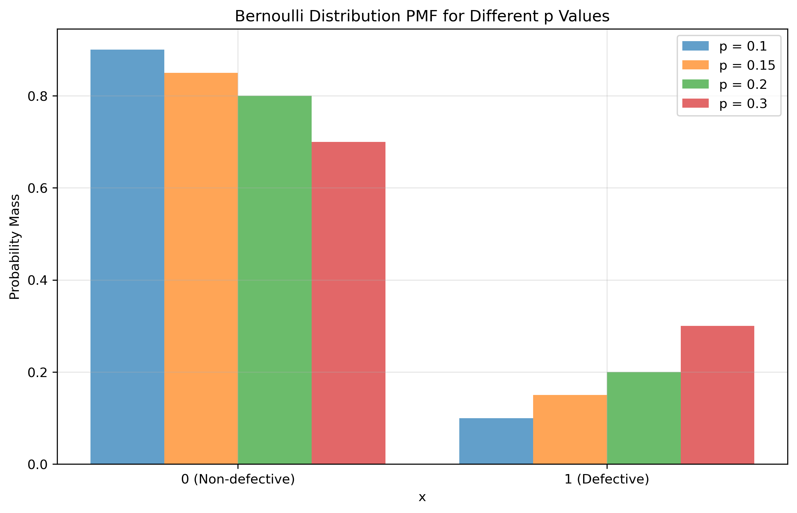
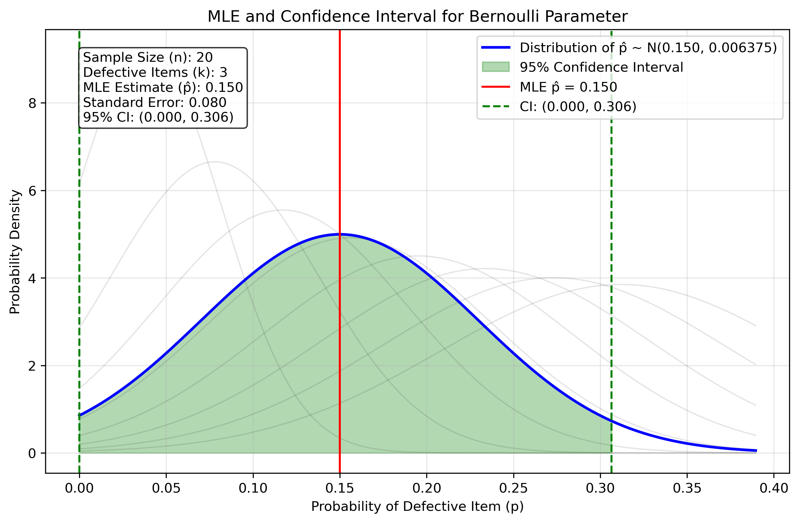
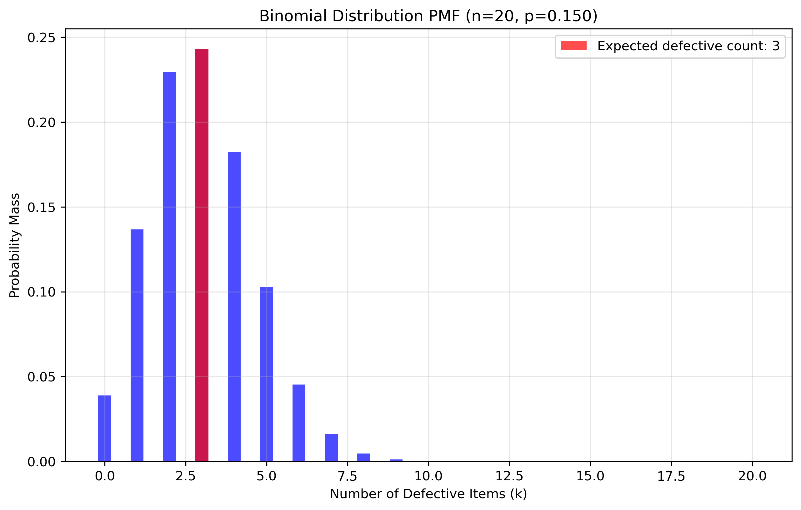

# Question 17: MLE for Bernoulli Distribution in Quality Control

## Problem Statement
A quality control engineer is testing a new manufacturing process. They randomly sample 20 items from the production line and find that 3 of them are defective. Assuming each item independently follows a Bernoulli distribution (where 1 represents a defective item and 0 represents a non-defective item):

### Task
1. Calculate the maximum likelihood estimate for the probability p of producing a defective item
2. Calculate the standard error of your estimate
3. Write the formula for a 95% confidence interval for p

## Understanding the Probability Model

The Bernoulli distribution is particularly suited for quality control applications as it models binary outcomes - in this case, whether an item is defective (1) or non-defective (0). Each item is assumed to have the same probability p of being defective, and the outcomes for different items are independent.

In quality control, estimating this defect probability p is crucial for:
- Assessing manufacturing process capability
- Setting quality standards and acceptance criteria
- Making decisions about process improvements
- Calculating expected costs related to defects

The maximum likelihood estimation approach provides a principled way to estimate p based solely on the observed sample data.

## Solution

The Bernoulli distribution is a discrete probability distribution that models binary outcomes such as defective/non-defective items. It has a single parameter p that represents the probability of producing a defective item.

### Step 1: Formulate the likelihood function
For a sample of n independent items where k are defective, the likelihood function is:

$$L(p) = \prod_{i=1}^{n} p^{x_i} (1-p)^{1-x_i} = p^k (1-p)^{n-k}$$

Where x_i = 1 for defective items and x_i = 0 for non-defective items.

### Step 2: Take the logarithm to get the log-likelihood
Taking the natural logarithm:

$$\ell(p) = \log L(p) = k \log(p) + (n-k) \log(1-p)$$

### Step 3: Find the critical points by taking the derivative
To find the maximum, we take the derivative with respect to p and set it to zero:

$$\frac{d\ell}{dp} = \frac{k}{p} - \frac{n-k}{1-p} = 0$$

### Step 4: Solve for the MLE estimate
Solving for p:

$$\frac{k}{p} = \frac{n-k}{1-p}$$
$$(1-p)k = p(n-k)$$
$$k - pk = pn - pk$$
$$k = pn$$
$$p = \frac{k}{n}$$

Therefore, the MLE is:

$$\hat{p}_{MLE} = \frac{k}{n}$$

For our quality control problem with n = 20 and k = 3:

$$\hat{p}_{MLE} = \frac{3}{20} = 0.15$$

Thus, the maximum likelihood estimate for the probability of producing a defective item is 0.15 or 15%.

### Step 5: Calculate the standard error of the estimate
The standard error of the MLE for a Bernoulli parameter p is:

$$SE(\hat{p}) = \sqrt{\frac{\hat{p}(1-\hat{p})}{n}}$$

For our problem:

$$SE(\hat{p}) = \sqrt{\frac{0.15 \times 0.85}{20}} = \sqrt{\frac{0.1275}{20}} = \sqrt{0.006375} \approx 0.080$$

Therefore, the standard error of our estimate is approximately 0.080 or 8.0%.

### Step 6: Derive the formula for a 95% confidence interval
The general formula for a (1-α)×100% confidence interval for a Bernoulli parameter p is:

$$\hat{p} \pm z_{1-\alpha/2} \times SE(\hat{p})$$

For a 95% confidence interval (α = 0.05), z₀.₉₇₅ = 1.96, and the formula becomes:

$$\hat{p} \pm 1.96 \times SE(\hat{p})$$

For our problem:

$$0.15 \pm 1.96 \times 0.080 = 0.15 \pm 0.157 = (0.000, 0.307)$$

Since probability cannot be negative, the actual 95% confidence interval is (0.000, 0.307).

## Visual Explanations

### Bernoulli Distribution PMF

This figure shows the probability mass function for different values of p and illustrates the discrete nature of the Bernoulli distribution.

### MLE and Confidence Interval

This visualization shows the MLE estimate and its 95% confidence interval, demonstrating the normal approximation to the sampling distribution of p̂.

### Binomial Distribution PMF

This figure shows the distribution of the number of defective items in a sample of n=20 and highlights the expected number of defectives based on MLE p̂=0.15.

## Key Insights

### MLE Properties
- The MLE for the Bernoulli parameter p is the sample proportion of defective items
- This estimator is unbiased: $E[p̂] = p$
- The variance of the estimator depends on both the true parameter value and the sample size
- For small samples, the normal approximation may not be highly accurate

### Practical Considerations
- The MLE estimate of 15% defect rate provides a point estimate, but the confidence interval gives a more complete picture
- The standard error of 8.0% is relatively large compared to the estimate itself, indicating considerable uncertainty
- The wide 95% confidence interval (0.000, 0.307) suggests the true defect rate could be anywhere from 0% to over 30%
- Quality control decisions should consider this uncertainty, possibly by:
  - Collecting a larger sample for more precise estimation
  - Using the upper bound of the confidence interval as a conservative planning estimate
  - Implementing process improvements if even the lower bound is too high

## Conclusion

The maximum likelihood estimator for the defect probability in this quality control scenario is p̂ = 0.15, with a standard error of 0.080. The 95% confidence interval is (0.000, 0.307). While the point estimate of 15% defective items provides our best single guess of the defect rate, the wide confidence interval indicates substantial uncertainty due to the small sample size.

This analysis demonstrates how maximum likelihood estimation can be applied to practical quality control problems, providing both point estimates and measures of uncertainty. The methods shown here form the foundation for statistical quality control and can guide decisions about process improvements and acceptance sampling. 