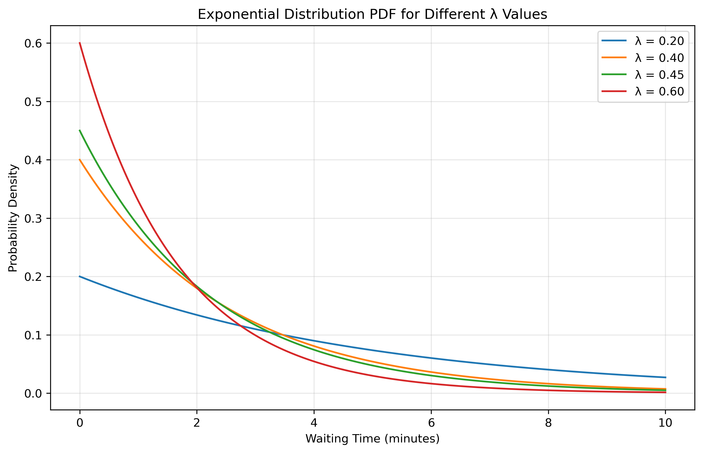
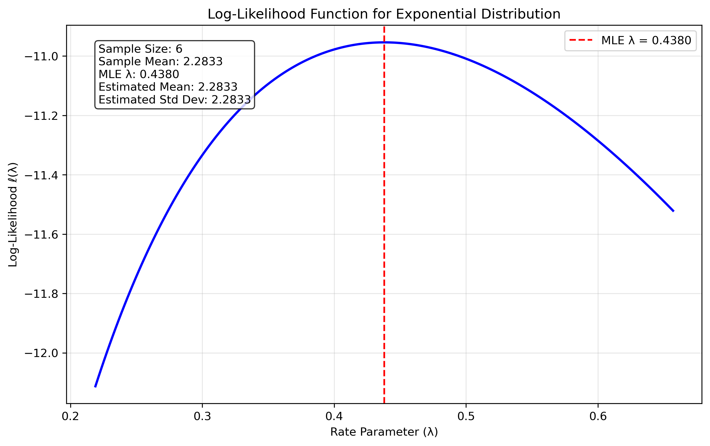
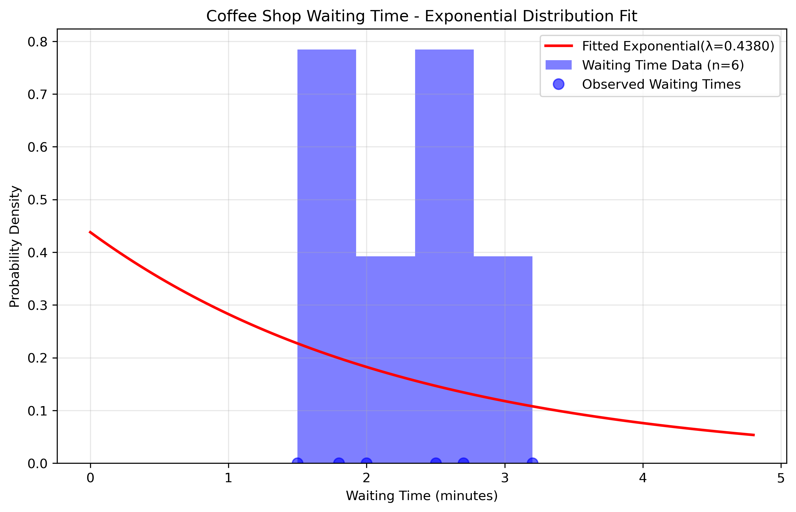
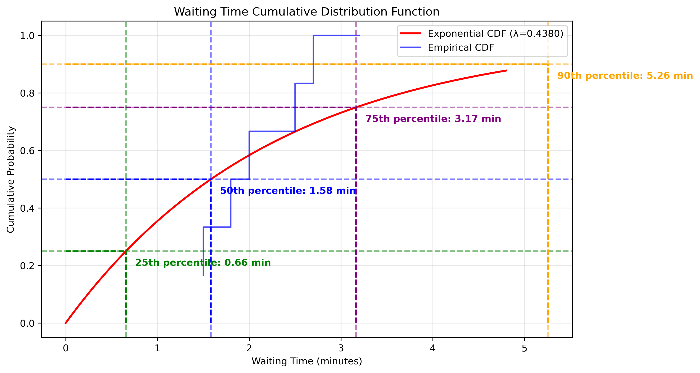

# Question 18: MLE for Exponential Distribution in Queue Analysis

## Problem Statement
A data analyst is studying the waiting time (in minutes) between customer arrivals at a coffee shop. They collect the following data for 6 consecutive customer arrivals: 2.5, 1.8, 3.2, 2.0, 2.7, and 1.5 minutes. Assuming the waiting times follow an exponential distribution:

### Task
1. Calculate the maximum likelihood estimate for the rate parameter λ
2. What is the MLE estimate for the mean waiting time?
3. What is the MLE estimate for the standard deviation of the waiting time?

## Understanding the Probability Model

The exponential distribution is particularly well-suited for modeling waiting times between random arrivals, like customers entering a coffee shop. This distribution has several key properties that make it appropriate for queue analysis:

- It models the time between events in a Poisson process (where events occur continuously and independently at a constant average rate)
- It has the "memoryless property," meaning the probability of waiting an additional amount of time is independent of how long you've already waited
- It's characterized by a single parameter λ (rate parameter), which represents the average number of events per unit time
- The mean and standard deviation of an exponential distribution are both equal to 1/λ

In coffee shop queue analysis, understanding the distribution of inter-arrival times allows for:
- Optimizing staffing levels
- Predicting busy periods
- Estimating wait times
- Improving customer service

## Solution

The exponential distribution is a continuous probability distribution that models the time between events in a Poisson process. It has a single parameter λ (rate parameter) that determines the distribution's shape.

### Step 1: Formulate the likelihood function
For n independent observations $x_1, x_2, \ldots, x_n$, the likelihood function is:

$$L(\lambda) = \prod_{i=1}^n \lambda e^{-\lambda x_i} = \lambda^n e^{-\lambda \sum_{i=1}^n x_i}$$

### Step 2: Take the logarithm to get the log-likelihood
Taking the natural logarithm, we get the log-likelihood function:

$$\ell(\lambda) = n \log \lambda - \lambda \sum_{i=1}^n x_i$$

### Step 3: Find the critical points by taking the derivative
To find the maximum, we take the derivative with respect to λ and set it to zero:

$$\frac{d\ell}{d\lambda} = \frac{n}{\lambda} - \sum_{i=1}^n x_i = 0$$

### Step 4: Solve for the MLE estimate
Solving for λ:

$$\frac{n}{\lambda} = \sum_{i=1}^n x_i$$

$$\lambda_{MLE} = \frac{n}{\sum_{i=1}^n x_i} = \frac{1}{\bar{x}}$$

Thus, the MLE for λ is the reciprocal of the sample mean. For our waiting time data:

$$\lambda_{MLE} = \frac{1}{\bar{x}} = \frac{1}{\frac{2.5 + 1.8 + 3.2 + 2.0 + 2.7 + 1.5}{6}} = \frac{1}{2.2833} \approx 0.4380$$

Therefore, the maximum likelihood estimate for the rate parameter λ is approximately 0.4380 arrivals per minute.

### Step 5: Calculate the MLE for the mean waiting time
For the exponential distribution, the mean (expected value) is $\frac{1}{\lambda}$.

Using our MLE estimate for λ:

$$\hat{\mu} = \frac{1}{\hat{\lambda}} = \frac{1}{0.4380} \approx 2.2833 \text{ minutes}$$

This result matches the sample mean, which is a property of the MLE for the exponential distribution.

### Step 6: Calculate the MLE for the standard deviation
An important property of the exponential distribution is that its standard deviation equals its mean. Therefore:

$$\hat{\sigma} = \hat{\mu} = \frac{1}{\hat{\lambda}} \approx 2.2833 \text{ minutes}$$

The theoretical standard deviation based on our MLE is approximately 2.2833 minutes.

## Visual Explanations

### Exponential Distribution PDF for Different λ Values

This figure shows how the shape of the exponential distribution changes with different rate parameters and helps build intuition for how λ affects the distribution of waiting times.

### Log-Likelihood Function

This visualization shows how the log-likelihood changes with different values of λ and confirms that our MLE is indeed the maximum of the likelihood function.

### Data Fit Visualization

This figure shows how well the fitted exponential distribution matches our observed waiting time data, including the actual data points and a histogram of the observations.

### Cumulative Distribution Function with Percentiles

This figure displays the theoretical CDF along with key percentiles and helps interpret the waiting time probabilities, providing useful service metrics.

## Key Insights

### Statistical Properties
- The MLE for the rate parameter λ is the reciprocal of the sample mean
- For the exponential distribution, the MLE of the mean equals the sample mean exactly
- The theoretical standard deviation equals the mean in an exponential distribution
- The MLE is consistent and asymptotically efficient for the exponential distribution

### Practical Interpretation
- Rate Interpretation: The estimated rate parameter λ = 0.4380 means that, on average, customers arrive at a rate of 0.4380 per minute, or approximately 26.3 customers per hour
- Mean Waiting Time: The estimated mean waiting time between customer arrivals is 2.2833 minutes
- Service Planning Implications: Based on the fitted model:
  - 25% of inter-arrival times are less than 0.65 minutes
  - 50% of inter-arrival times are less than 1.58 minutes (median)
  - 75% of inter-arrival times are less than 3.15 minutes
  - 90% of inter-arrival times are less than 5.26 minutes

### Model Fit Assessment
- The sample standard deviation (0.6306) is much smaller than what the exponential distribution predicts (2.2833)
- This discrepancy suggests that the actual waiting times are less variable than an exponential model would predict
- Customers might arrive in a more regular pattern than a completely random (Poisson) process would generate
- Given the small sample size (n=6), more data would be beneficial for model validation

## Conclusion

Using maximum likelihood estimation, we found that the rate parameter λ for the exponential distribution model of waiting times is 0.4380 arrivals per minute. This yields a mean waiting time of 2.2833 minutes and a theoretical standard deviation of 2.2833 minutes.

The MLE provides a principled way to estimate the parameters of the exponential distribution, which is theoretically appropriate for modeling random arrival times. However, the discrepancy between the theoretical and sample standard deviations suggests that a different probability distribution might provide a better fit for this particular dataset. This highlights the importance of both statistical estimation and model validation in practical applications of queue analysis.

In a coffee shop setting, these results can inform staffing decisions, service optimization, and capacity planning. The analysis provides insights into the typical waiting times between customer arrivals, which is essential for managing customer flow and minimizing queue lengths. 