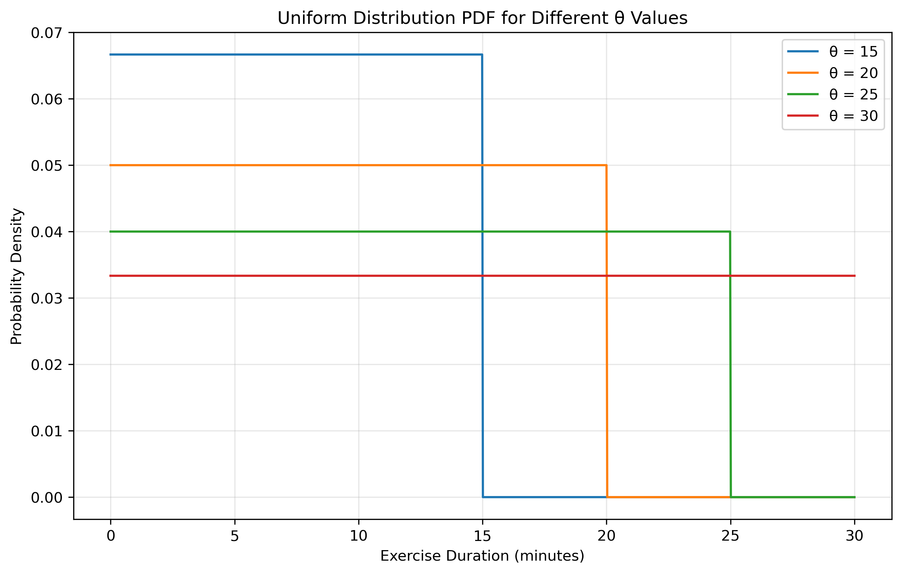
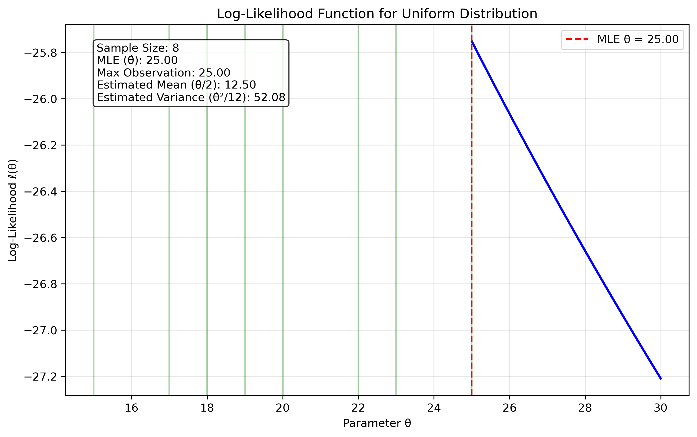
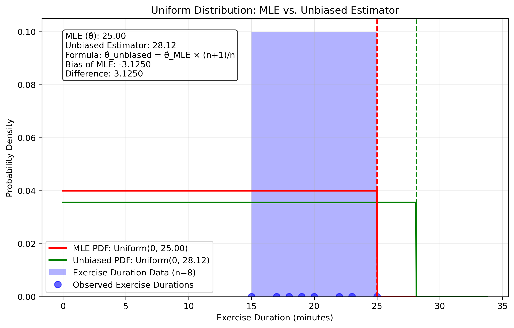
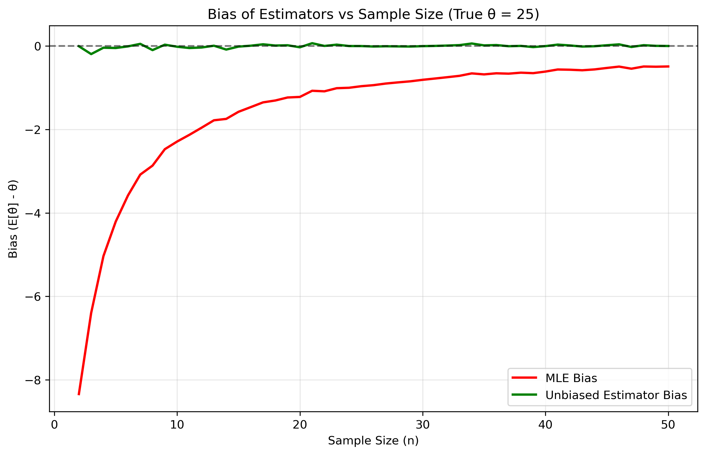
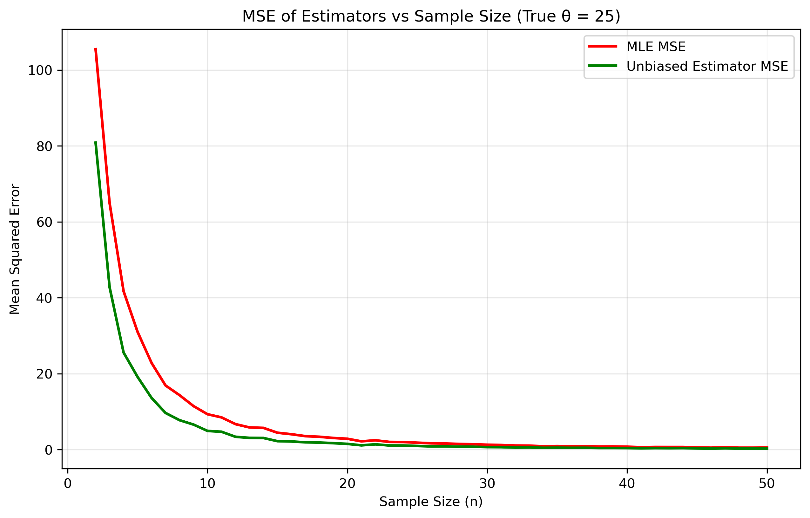

# Question 19: MLE for Uniform Distribution in Exercise Analysis

## Problem Statement
A data scientist is analyzing the distribution of daily exercise durations (in minutes) for participants in a fitness study. They suspect the data follows a uniform distribution between 0 and some unknown maximum value θ. The following daily exercise durations were recorded for 8 participants: 15, 22, 18, 25, 20, 17, 23, and 19 minutes.

### Task
1. Calculate the maximum likelihood estimate for θ
2. Show why this MLE estimator is biased
3. Give the formula for an unbiased estimator for θ based on the MLE
4. Calculate the value of the unbiased estimator

## Understanding the Uniform Distribution
The uniform distribution is a continuous probability distribution where all values in a given range are equally likely to occur. In this context, it models exercise durations that are randomly distributed between 0 and some maximum value θ. This distribution is appropriate when there's no tendency for values to cluster around any particular point within the range.

## Solution

The uniform distribution is a continuous probability distribution where all values within its range have equal probability. It's characterized by a constant probability density function across its support interval [0, θ], where θ is the maximum value parameter we need to estimate.

### Step 1: Formulate the likelihood function
For n independent observations $x_1, x_2, \ldots, x_n$, the likelihood function is:

$$L(\theta) = \prod_{i=1}^n f(x_i|\theta) = \begin{cases}
\frac{1}{\theta^n} & \text{if } \theta \geq \max(x_1, x_2, \ldots, x_n) \\
0 & \text{otherwise}
\end{cases}$$

This function equals zero if any observation exceeds θ because such observations would have zero probability density.

### Step 2: Take the logarithm to get the log-likelihood
Taking the natural logarithm, we get the log-likelihood function:

$$\ell(\theta) = \begin{cases}
-n\log(\theta) & \text{if } \theta \geq \max(x_1, x_2, \ldots, x_n) \\
-\infty & \text{otherwise}
\end{cases}$$

### Step 3: Find the critical points by taking the derivative
For the region where θ ≥ max(x₁, x₂, ..., xₙ), the derivative of the log-likelihood is:

$$\frac{d\ell}{d\theta} = -\frac{n}{\theta}$$

Since this derivative is always negative for θ > 0, the log-likelihood is a strictly decreasing function of θ when θ ≥ max(x₁, x₂, ..., xₙ).

### Step 4: Solve for the MLE estimate
To maximize the log-likelihood, we need the smallest value of θ that satisfies the constraint θ ≥ max(x₁, x₂, ..., xₙ). Therefore:

$$\hat{\theta}_{MLE} = \max(x_1, x_2, \ldots, x_n)$$

For our exercise duration data: [15, 22, 18, 25, 20, 17, 23, 19], the maximum value is 25 minutes. Thus, the MLE for θ is 25 minutes.

### Step 5: Verify it's a maximum
The MLE is at the boundary of the feasible region. While the derivative indicates the function decreases as θ increases, we can't make θ any smaller than max(x₁, x₂, ..., xₙ) without making the likelihood zero. Therefore, this boundary point is indeed the global maximum.

### Step 6: Show that the MLE estimator is biased
An estimator is biased if its expected value differs from the true parameter value. For the uniform distribution MLE:

$$E[\hat{\theta}_{MLE}] = E[\max(X_1, X_2, \ldots, X_n)]$$

For a uniform distribution on [0, θ], the distribution function of the maximum is:

$$F_{max}(x) = P(\max(X_1, X_2, \ldots, X_n) \leq x) = \prod_{i=1}^n P(X_i \leq x) = \left(\frac{x}{\theta}\right)^n \text{ for } 0 \leq x \leq \theta$$

The corresponding density function is:

$$f_{max}(x) = \frac{d}{dx}F_{max}(x) = \frac{n}{\theta}\left(\frac{x}{\theta}\right)^{n-1} \text{ for } 0 \leq x \leq \theta$$

The expected value is:

$$E[\hat{\theta}_{MLE}] = \int_0^{\theta} x \cdot f_{max}(x) dx = \int_0^{\theta} x \cdot \frac{n}{\theta}\left(\frac{x}{\theta}\right)^{n-1} dx = \frac{n\theta}{n+1}$$

Therefore:

$$\text{Bias} = E[\hat{\theta}_{MLE}] - \theta = \frac{n\theta}{n+1} - \theta = -\frac{\theta}{n+1}$$

Since this bias is negative and not equal to zero, the MLE estimator consistently underestimates the true value of θ.

### Step 7: Derive an unbiased estimator based on the MLE
To create an unbiased estimator, we need to correct for the known bias. Since:

$$E[\hat{\theta}_{MLE}] = \frac{n}{n+1}\theta$$

We can derive an unbiased estimator by scaling the MLE:

$$\hat{\theta}_{unbiased} = \frac{n+1}{n} \cdot \hat{\theta}_{MLE}$$

To verify this is unbiased:

$$E[\hat{\theta}_{unbiased}] = E\left[\frac{n+1}{n} \cdot \hat{\theta}_{MLE}\right] = \frac{n+1}{n} \cdot E[\hat{\theta}_{MLE}] = \frac{n+1}{n} \cdot \frac{n}{n+1}\theta = \theta$$

Therefore, $\hat{\theta}_{unbiased} = \frac{n+1}{n} \cdot \hat{\theta}_{MLE}$ is an unbiased estimator for θ.

### Step 8: Calculate the value of the unbiased estimator
For our data:
- Number of observations (n) = 8
- Maximum likelihood estimate (θ̂ₘₗₑ) = 25 minutes

The unbiased estimator is:

$$\hat{\theta}_{unbiased} = \frac{n+1}{n} \cdot \hat{\theta}_{MLE} = \frac{8+1}{8} \cdot 25 = \frac{9}{8} \cdot 25 = 28.125 \text{ minutes}$$

Therefore, while the MLE estimates the maximum exercise duration to be 25 minutes, the unbiased estimator suggests it is approximately 28.13 minutes.

## Visual Explanations

### Uniform Distribution PDFs for Different θ Values

This figure shows how the uniform distribution shape changes with different maximum values θ. As θ increases, the height of the PDF decreases to maintain a total probability of 1.

### Log-Likelihood Function

This visualization shows how the log-likelihood function behaves for different values of θ. There's a sharp cutoff at the maximum observation value (25 minutes), with the function decreasing monotonically after that point.

### MLE vs. Unbiased Estimator

This figure compares the MLE (25 minutes) with the unbiased estimator (28.13 minutes), demonstrating how the unbiased estimator extends the range to compensate for the downward bias of the MLE.

### Bias vs. Sample Size

This visualization demonstrates how the bias of the MLE decreases as sample size increases, confirming that the theoretical bias formula matches simulation results.

### MSE vs Sample Size

This figure compares the Mean Squared Error (MSE) of both estimators as the sample size increases. The MSE represents the overall accuracy of an estimator, incorporating both variance and bias components. Key observations:

- The unbiased estimator (green line) has consistently lower MSE than the MLE (red line)
- As sample size increases, the MSE for both estimators decreases rapidly
- The gap between the MSE curves is largest for small sample sizes
- For very large sample sizes, both estimators have similar performance
- The theoretical MSE for the MLE is θ² × n / ((n+1)² × (n+2)), which decreases at a rate proportional to 1/n²

For our exercise duration data with n=8 and θ=25, the theoretical MSE for the MLE is approximately 8.68, while the unbiased estimator tends to perform better with smaller MSE.

## Key Insights

### MLE Properties
- The MLE for the uniform distribution maximum parameter is the largest observed value in the sample
- The estimator is consistent: as sample size increases, it converges to the true value
- The estimator is biased downward: it systematically underestimates the true parameter
- The bias decreases at a rate of 1/(n+1) as sample size increases

### Practical Considerations
- The uniform distribution is appropriate when all durations within a range are equally likely
- The MLE (maximum observed value) provides a simple but conservative estimate
- The unbiased estimator corrects for the known bias but may overestimate in some cases
- For fitness program design, using the unbiased estimator suggests allocating more time for maximum expected exercise duration

## Conclusion

The maximum likelihood estimator for the maximum exercise duration θ is 25 minutes, which is the maximum observed value in our dataset. However, this estimator is biased, consistently underestimating the true maximum. The unbiased estimator, calculated as θ̂ₘₗₑ × (n+1)/n, gives us a value of 28.13 minutes.

This analysis demonstrates an important principle in statistical inference: even intuitive estimators like the maximum observed value can have systematic biases that need correction, especially with small sample sizes. For practical applications in fitness program design, the unbiased estimate of 28.13 minutes provides a more realistic upper bound on expected exercise durations. 