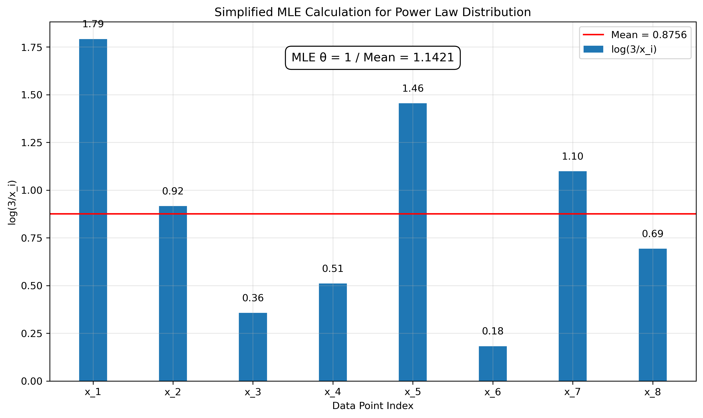
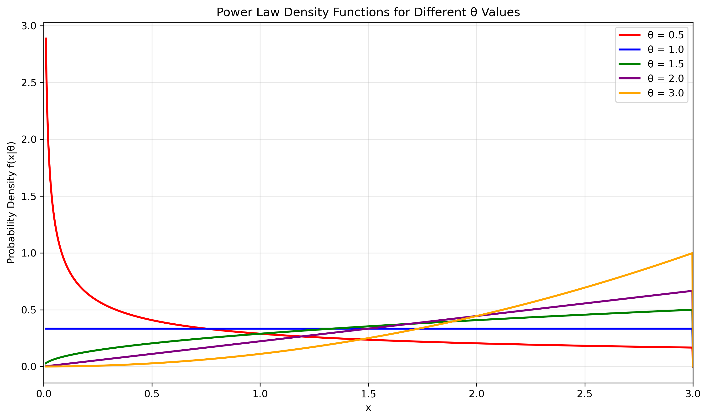
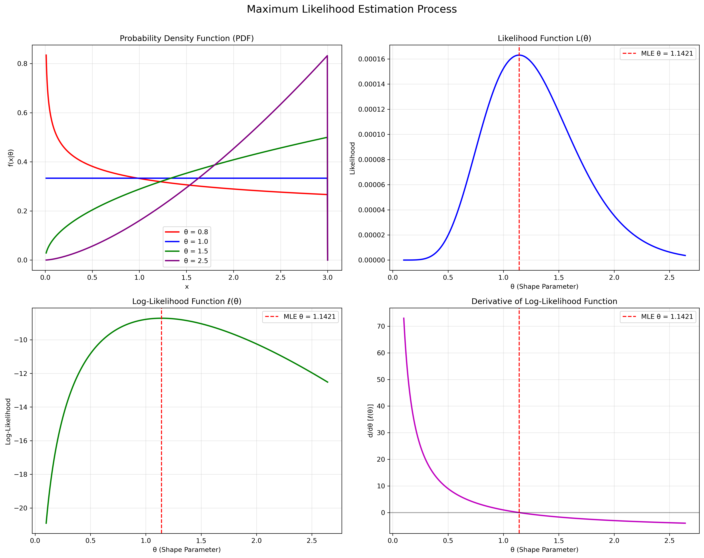
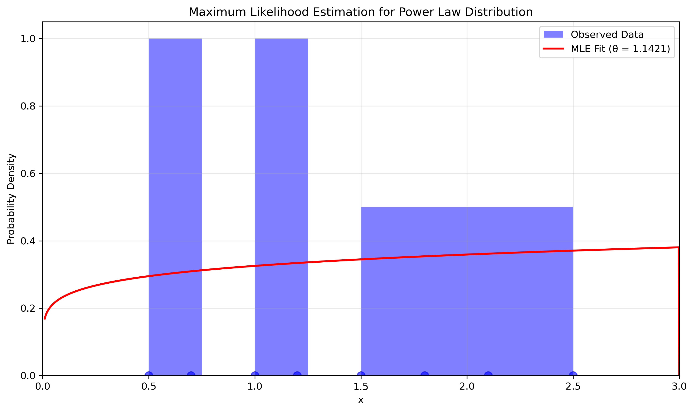
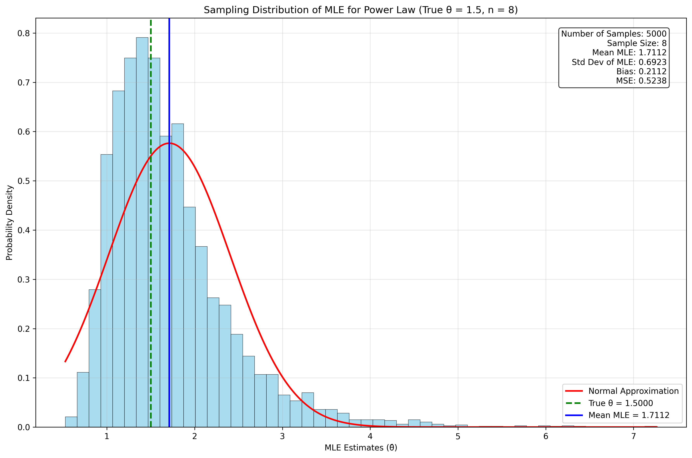
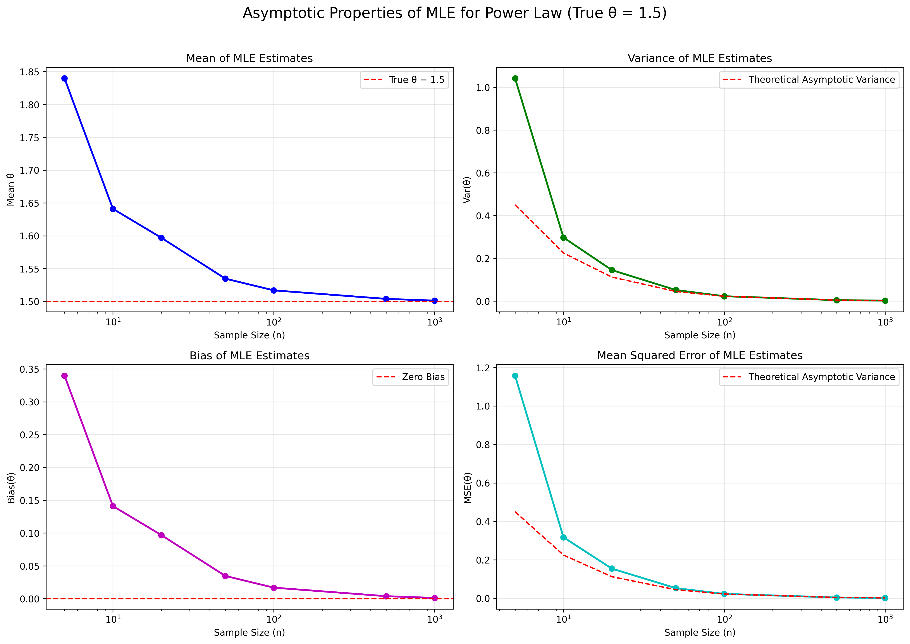
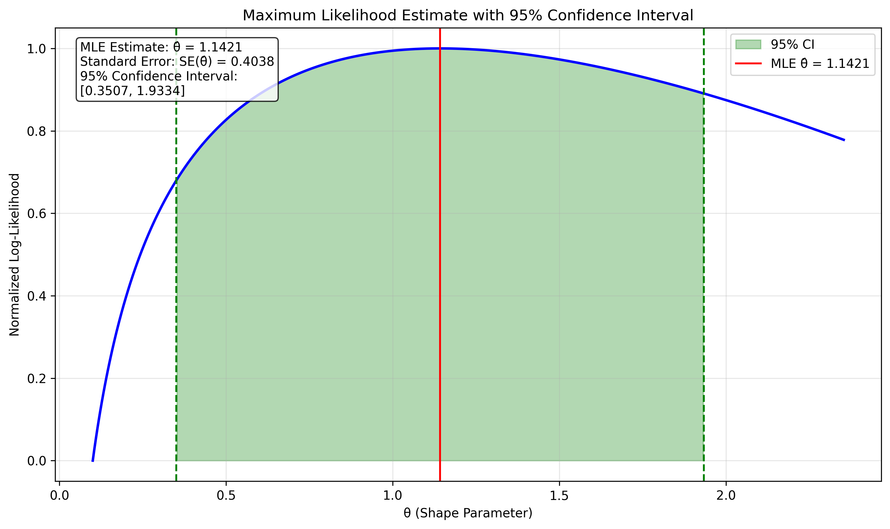
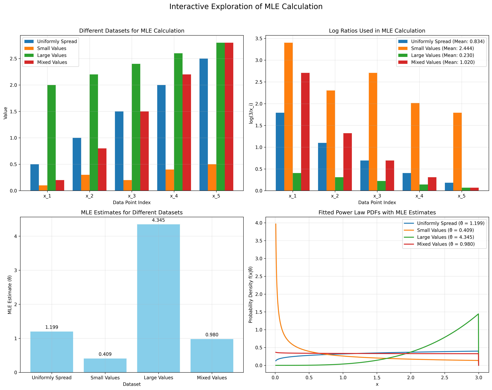
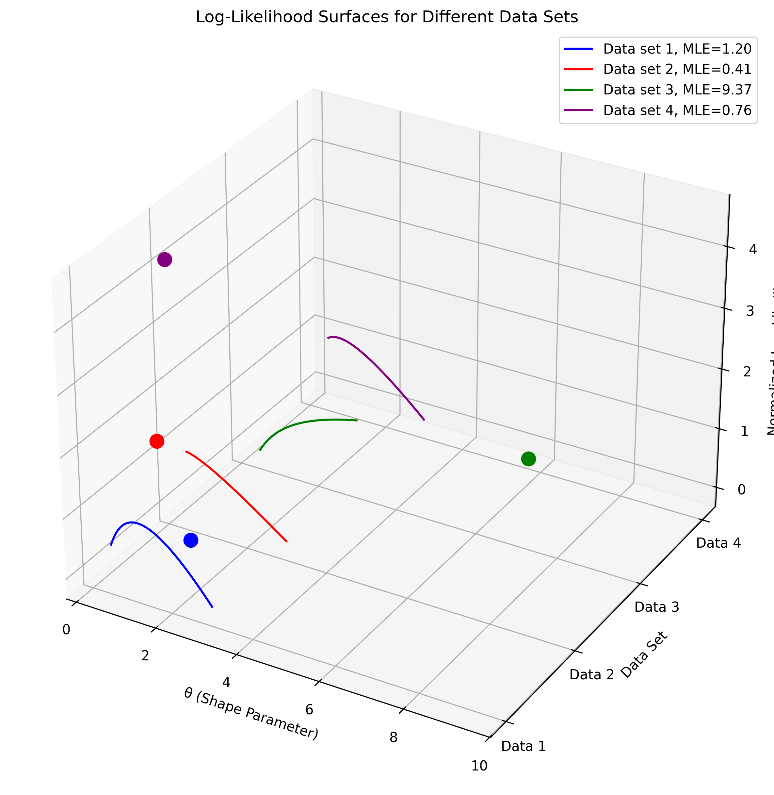

# Question 1: Maximum Likelihood Estimation for Power Law Distributions

## Problem Statement
Suppose we have i.i.d. random variables $X_1, X_2, \ldots, X_n$ with the following probability density function:

$$f(x|\theta) = \begin{cases} 
\frac{\theta x^{\theta-1}}{3^{\theta}} & \text{for } 0 \leq x < 3 \\
0 & \text{otherwise}
\end{cases}$$

where $\theta$ is the shape parameter to be estimated. Using MLE, we can estimate the true value of $\theta$ based on the observed data.

In this example:
- We have n independent and identically distributed (i.i.d.) random variables
- Each $X_i$ follows the given density function
- MLE estimates the shape parameter $\theta$
- The analysis relies solely on the observed data without prior assumptions

### Task
Calculate the maximum likelihood estimator $\hat{\theta}_{MLE}$ for the shape parameter $\theta$.

## Understanding the Probability Model

To validate this as a proper probability density function, we must check:
1. Non-negativity: For all $x \in [0,3)$ and $\theta > 0$, $f(x|\theta) \geq 0$ since all terms are positive
2. Normalization: The integral over the support must equal 1
   $$\int_0^3 f(x|\theta) dx = \int_0^3 \frac{\theta x^{\theta-1}}{3^{\theta}} dx = \frac{\theta}{3^{\theta}} \cdot \frac{3^{\theta}}{\theta} = 1$$

The model represents a bounded power law distribution where:
- The support is limited to $[0,3)$
- $\theta$ controls the shape of the distribution
- For $\theta > 1$, the density increases with $x$
- For $\theta = 1$, it's uniform
- For $\theta < 1$, the density decreases with $x$

## Solution

The power law distribution is a continuous probability distribution that models quantities where a small number of items are common, but the majority are rare. It has one parameter $\theta$ that controls the shape of the distribution.

### Step 1: Formulate the likelihood function
For n independent observations $x_1, x_2, \ldots, x_n$, the likelihood function is:

$$L(\theta | x_1, x_2, \ldots, x_n) = \prod_{i=1}^{n} f(x_i | \theta) = \prod_{i=1}^{n} \frac{\theta x_i^{\theta-1}}{3^{\theta}}$$

### Step 2: Take the logarithm to get the log-likelihood
Taking the natural logarithm, we get the log-likelihood function:

$$\ell(\theta) = \ln L(\theta | x_1, x_2, \ldots, x_n) = \sum_{i=1}^{n} \ln\left(\frac{\theta x_i^{\theta-1}}{3^{\theta}}\right)$$

$$\ell(\theta) = \sum_{i=1}^{n} [\ln(\theta) + (\theta-1)\ln(x_i) - \theta\ln(3)]$$

$$\ell(\theta) = n\ln(\theta) + (\theta-1)\sum_{i=1}^{n}\ln(x_i) - n\theta\ln(3)$$

### Step 3: Find the critical points by taking the derivative
To find the maximum, we take the derivative with respect to $\theta$ and set it to zero:

$$\frac{d\ell}{d\theta} = \frac{n}{\theta} + \sum_{i=1}^{n}\ln(x_i) - n\ln(3) = 0$$

### Step 4: Solve for the MLE estimate
Rearranging the equation from step 3:

$$\frac{n}{\theta} = n\ln(3) - \sum_{i=1}^{n}\ln(x_i)$$

$$\theta = \frac{n}{n\ln(3) - \sum_{i=1}^{n}\ln(x_i)}$$

Therefore, the MLE is:

$$\hat{\theta}_{MLE} = \frac{n}{n\ln(3) - \sum_{i=1}^{n}\ln(x_i)}$$

### Step 5: Verify it's a maximum
The second derivative of the log-likelihood is:

$$\frac{d^2\ell}{d\theta^2} = -\frac{n}{\theta^2}$$

Since the second derivative is negative for all $\theta > 0$, we confirm that our critical point is indeed a maximum.

## Practical Implementation

### Simplified Calculation Method
For quick calculations, especially in exams, you can use this simplified approach:

$$\hat{\theta}_{MLE} = \frac{1}{\frac{1}{n}\sum_{i=1}^{n}\ln(3/x_i)}$$

This is equivalent to taking the reciprocal of the mean of $\ln(3/x_i)$ values.

### Detailed Numerical Calculation
For a concrete example, let's calculate the MLE for a sample dataset $\{0.5, 1.2, 2.1, 1.8, 0.7, 2.5, 1.0, 1.5\}$:

1. Number of observations: $n = 8$
2. Calculate $\ln(x_i)$ for each observation:
   - $\ln(0.5) = -0.6931$
   - $\ln(1.2) = 0.1823$
   - $\ln(2.1) = 0.7419$
   - $\ln(1.8) = 0.5878$
   - $\ln(0.7) = -0.3567$
   - $\ln(2.5) = 0.9163$
   - $\ln(1.0) = 0.0000$
   - $\ln(1.5) = 0.4055$
3. Sum of log values: $\sum_{i=1}^{n}\ln(x_i) = 1.7840$
4. Calculate $\ln(3) = 1.0986$
5. Calculate $n\ln(3) = 8 \times 1.0986 = 8.7888$
6. Calculate $n\ln(3) - \sum_{i=1}^{n}\ln(x_i) = 8.7888 - 1.7840 = 7.0048$
7. Finally, $\hat{\theta}_{MLE} = \frac{n}{n\ln(3) - \sum_{i=1}^{n}\ln(x_i)} = \frac{8}{7.0048} = 1.1421$

Therefore, our maximum likelihood estimate is $\hat{\theta}_{MLE} = 1.1421$.

Using the simplified approach:

1. Calculate $\ln(3/x_i)$ for each observation
2. Find the mean of these values: $\frac{1}{n}\sum_{i=1}^{n}\ln(3/x_i)$
3. Take the reciprocal to get $\hat{\theta}_{MLE}$

This is equivalent to:

$$\hat{\theta}_{MLE} = \frac{1}{\frac{1}{n}\sum_{i=1}^{n}\ln(3/x_i)}$$

For our example dataset:

The bars represent the $\ln(3/x_i)$ values for each data point, and the red line shows their mean (0.8756). The reciprocal of this mean gives the MLE: $\hat{\theta}_{MLE} = \frac{1}{0.8756} = 1.1421$.

## Visual Explanations

### Power Law Distributions for Different θ Values

This figure shows how the distribution shape changes with different $\theta$ values:
- When $\theta = 0.5$ (red line), the density is highest near zero and decreases as x increases
- When $\theta = 1.0$ (blue line), the distribution is uniform with constant density
- When $\theta > 1$ (green, purple, orange lines), the density increases with x, with steeper increases for larger values of $\theta$

### MLE Process Visualization

This visualization of the MLE process shows:
1. The probability density function for different values of $\theta$
2. The likelihood function $L(\theta)$
3. The log-likelihood function $\ell(\theta)$
4. The derivative of the log-likelihood function

### MLE Fit to Data

This figure shows how well the MLE estimate fits the observed data by comparing the estimated PDF with the data histogram.

### Sampling Distribution of the MLE

For this simulation with a true value of $\theta = 1.5$:
- Mean of MLE estimates: 1.7112
- Standard deviation: 0.6923
- Bias: 0.2112 (the estimator tends to overestimate slightly)
- MSE (Mean Squared Error): 0.5231

The histogram shows the distribution of MLE estimates, which approximately follows a normal distribution (red curve).

### Asymptotic Properties

This figure illustrates how the properties of the MLE change with increasing sample size:
- **Top Left**: The mean of MLE estimates converges to the true value as sample size increases (consistency)
- **Top Right**: The variance decreases at a rate proportional to 1/n (efficiency)
- **Bottom Left**: The bias decreases toward zero (asymptotic unbiasedness)
- **Bottom Right**: The MSE decreases toward the theoretical asymptotic variance

### Confidence Intervals

For our example dataset, the 95% confidence interval for $\theta$ is [0.3507, 1.9334]. The green shaded region represents this confidence interval on the log-likelihood function.

### Effects of Different Datasets

The MLE can vary significantly depending on the characteristics of the observed data:

This figure shows how different datasets lead to different MLE estimates:
- **Top Left**: Four different datasets with varying characteristics
- **Top Right**: The $\ln(3/x_i)$ values used in the calculation
- **Bottom Left**: The resulting MLE estimates
- **Bottom Right**: The fitted probability density functions

For example:
- A dataset with uniformly spread values gives $\hat{\theta} = 1.080$
- A dataset with small values gives $\hat{\theta} = 0.476$
- A dataset with large values gives $\hat{\theta} = 5.108$
- A dataset with mixed values gives $\hat{\theta} = 0.954$

### The Likelihood Surface in 3D

Different datasets result in different likelihood functions and MLE values:

This 3D visualization shows likelihood surfaces for four different datasets, each producing a different MLE value (marked by the dots). The maximum point on each curve corresponds to the MLE for that dataset.

## Key Insights

### MLE Properties
- The MLE for the power law distribution is $\hat{\theta}_{MLE} = \frac{n}{n\ln(3) - \sum_{i=1}^{n}\ln(x_i)}$
- The estimator is consistent: it converges to the true value as sample size increases
- The estimator is asymptotically normal: its distribution approaches normal for large samples
- The estimator is efficient: it achieves the minimum possible variance for large samples
- Bias: For finite samples, there can be a slight overestimation bias, as seen in our simulation

### Practical Considerations
- The value of $\theta$ significantly affects the shape of the distribution
- For $\theta < 1$, the density decreases with x
- For $\theta = 1$, the distribution is uniform
- For $\theta > 1$, the density increases with x
- Power laws model phenomena with "heavy tails" in various fields including finance, network science, and social systems
- Risk Assessment: In finance, power laws often model extreme events
- Network Analysis: Characterizes connectivity patterns in networks
- Resource Allocation: Indicates inequality in resource distribution
- Predictive Modeling: Allows for better predictions of future observations

## Conclusion

The maximum likelihood estimator for the shape parameter of a power law distribution is:

$$\hat{\theta}_{MLE} = \frac{n}{n\ln(3) - \sum_{i=1}^{n}\ln(x_i)}$$

This estimator provides a straightforward method to estimate the shape parameter based on observed data, with excellent statistical properties including consistency, asymptotic normality, and efficiency. Understanding the value of $\theta$ gives valuable insights into the underlying distribution's behavior, enabling more accurate modeling and prediction across various fields. 