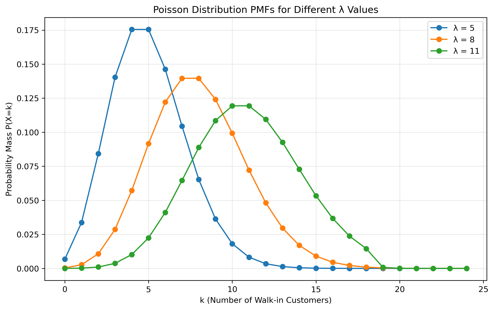
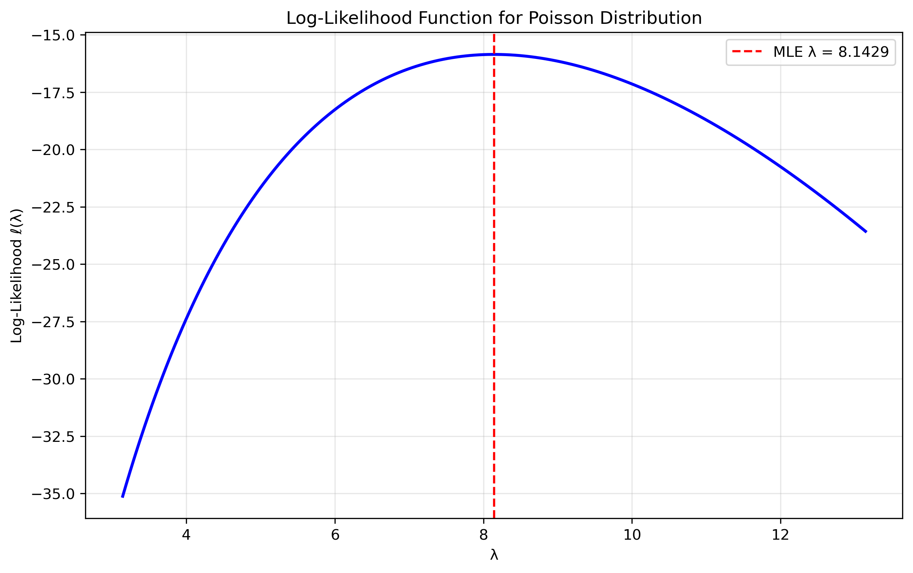

# Question 20: MLE for Poisson Distribution in Customer Analysis

## Problem Statement
A restaurant manager is analyzing the number of customers who walk in without reservations each evening. Over a week (7 days), they observe the following counts: 6, 8, 5, 7, 9, 12, and 10 walk-in customers. Assuming the number of walk-in customers follows a Poisson distribution:

### Task
1. Calculate the maximum likelihood estimate for the rate parameter λ
2. Interpret what this parameter represents in the context of the problem
3. Calculate the probability of having exactly 11 walk-in customers on a given evening using your MLE estimate
4. Calculate a 95% confidence interval for λ

## Understanding the Poisson Distribution
The Poisson distribution is a discrete probability distribution that models the number of events occurring within a fixed interval of time or space, given that these events occur with a known constant mean rate and independently of each other. In this case, we're modeling the number of walk-in customers in a restaurant each evening. The Poisson distribution is particularly suitable when:
- Events occur independently
- Events occur at a constant average rate
- Two events cannot occur at exactly the same time
- The occurrence of an event in a small interval is proportional to the size of the interval

## Solution

The Poisson distribution is a discrete probability distribution that models count data such as the number of customers arriving at a restaurant. It has one parameter λ that represents both the mean and variance of the distribution.

### Step 1: Formulate the likelihood function
For n independent observations $x_1, x_2, \ldots, x_n$, the likelihood function is:

$$L(\lambda) = \prod_{i=1}^n f(x_i|\lambda) = \prod_{i=1}^n \frac{\lambda^{x_i} e^{-\lambda}}{x_i!} = \frac{\lambda^{\sum_{i=1}^n x_i} e^{-n\lambda}}{\prod_{i=1}^n x_i!}$$

### Step 2: Take the logarithm to get the log-likelihood
Taking the natural logarithm, we get the log-likelihood function:

$$\ell(\lambda) = \log L(\lambda) = \sum_{i=1}^n x_i \log \lambda - n\lambda - \sum_{i=1}^n \log(x_i!)$$

### Step 3: Find the critical points by taking the derivative
To find the maximum, we take the derivative with respect to λ and set it to zero:

$$\frac{d\ell}{d\lambda} = \frac{\sum_{i=1}^n x_i}{\lambda} - n = 0$$

### Step 4: Solve for the MLE estimate
Solving for λ:

$$\frac{\sum_{i=1}^n x_i}{\lambda} = n$$

$$\lambda = \frac{\sum_{i=1}^n x_i}{n}$$

Therefore, the MLE is the sample mean:

$$\hat{\lambda}_{MLE} = \frac{1}{n} \sum_{i=1}^n x_i = \bar{x}$$

For our data [6, 8, 5, 7, 9, 12, 10]:

$$\hat{\lambda}_{MLE} = \frac{6 + 8 + 5 + 7 + 9 + 12 + 10}{7} = \frac{57}{7} = 8.1429$$

### Step 5: Verify it's a maximum
The second derivative of the log-likelihood is:

$$\frac{d^2\ell}{d\lambda^2} = -\frac{\sum_{i=1}^n x_i}{\lambda^2}$$

Since $\sum_{i=1}^n x_i > 0$ for any valid data and λ > 0, the second derivative is always negative, confirming that our critical point is indeed a maximum.

### Step 6: Interpret the parameter
In the context of the problem, λ represents the average number of walk-in customers the restaurant expects each evening. Based on our MLE, we estimate that the restaurant receives approximately 8.14 walk-in customers per evening on average.

This parameter is crucial for operational planning:
- It helps in staffing decisions
- It assists in inventory management
- It aids in table arrangement planning

### Step 7: Calculate the probability of exactly 11 walk-in customers
Using the Poisson probability mass function:

$$P(X = k) = \frac{\lambda^k e^{-\lambda}}{k!}$$

Substituting our MLE value and k = 11:

$$P(X = 11) = \frac{8.1429^{11} e^{-8.1429}}{11!} = 0.0760$$

Therefore, there is approximately a 7.60% probability of observing exactly 11 walk-in customers on a given evening, based on our MLE estimate.

### Step 8: Calculate a 95% confidence interval for λ
For the Poisson distribution, the variance of the count equals the mean parameter: $Var(X) = λ$. 

Since the MLE is the sample mean, its standard error is:

$$SE(\hat{\lambda}) = \sqrt{\frac{\lambda}{n}}$$

For a 95% confidence interval, we use the critical value from the standard normal distribution: $z_{0.025} = 1.96$.

$$CI_{95\%} = \hat{\lambda} \pm z_{0.025} \times SE(\hat{\lambda})$$

Substituting our values:

$$SE(\hat{\lambda}) = \sqrt{\frac{8.1429}{7}} = 1.0788$$

$$CI_{95\%} = 8.1429 \pm 1.96 \times 1.0788 = [6.0289, 10.2568]$$

Therefore, we are 95% confident that the true average number of walk-in customers per evening is between 6.03 and 10.26.

## Visual Explanations

### Poisson Distribution PMFs for Different λ Values

This figure shows how the Poisson distribution shape changes with different λ values. As λ increases, the distribution shifts to the right and becomes more spread out, illustrating how the rate parameter affects both the location and dispersion of the distribution.

### Likelihood Surface

This visualization of the log-likelihood function shows the maximum point corresponding to the MLE (λ ≈ 8.14) and demonstrates the concavity of the likelihood function, confirming that we have found a global maximum.

### MLE Fit to Data

This figure shows how well the MLE estimate fits the observed data by comparing the estimated Poisson PMF with the observed frequency of walk-in customers, helping to assess the goodness of fit of our model.

### Confidence Interval Visualization

This visualization displays the 95% confidence interval for λ (6.03 to 10.26) and shows the relationship between the confidence interval and the likelihood function, illustrating the uncertainty in our parameter estimate.

### Probability Demonstration

This figure visualizes the probability of observing exactly 11 walk-in customers (7.60%) by highlighting this specific probability within the entire PMF, putting the calculated probability in context.

## Key Insights

### MLE Properties
- The MLE for the Poisson distribution is simply the sample mean
- This estimator is unbiased: $E[\hat{\lambda}_{MLE}] = \lambda$
- The estimator is consistent: it converges to the true value as sample size increases
- The estimator is efficient: it achieves the Cramér-Rao lower bound
- The estimator is asymptotically normal: its distribution approaches normal for large samples

### Practical Considerations
- The Poisson distribution is well-suited for modeling count data like customer arrivals
- The MLE provides a computationally simple and intuitive estimator for the rate parameter
- The confidence interval quantifies our uncertainty about the true parameter value
- The model assumes a constant arrival rate, which may not hold if there are predictable patterns
- With only 7 observations, our estimates have relatively wide confidence intervals

## Conclusion

Maximum Likelihood Estimation for the Poisson distribution provides a powerful framework for analyzing count data like restaurant customer arrivals. For this restaurant:

1. We estimate an average of 8.14 walk-in customers per evening
2. There's a 7.60% chance of having exactly 11 walk-in customers on a given evening
3. We're 95% confident that the true average is between 6.03 and 10.26 customers

These insights can guide operational decisions, staffing levels, and resource allocation for the restaurant management. The analysis demonstrates how statistical inference can transform raw data into actionable business intelligence. 