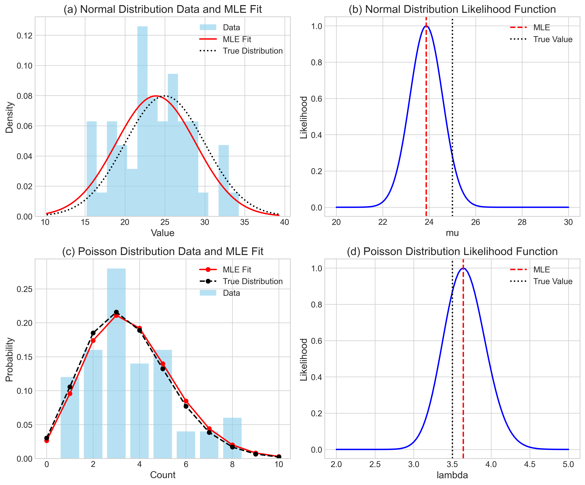

# Question 21: Visual Analysis of Maximum Likelihood Estimation

## Problem Statement
The following figure illustrates Maximum Likelihood Estimation (MLE) applied to two different probability distributions: Normal and Poisson. Each row represents a different distribution, while the columns show the data with fitted distributions and the corresponding likelihood functions.

### Task
Given the visualizations:

1. For the normal distribution (panels a and b), what is the relationship between the sample mean and the maximum likelihood estimate (MLE)? Explain why this relationship exists
2. For the Poisson distribution (panels c and d), analyze the difference between the MLE fit and the true distribution. What parameter is being estimated, and what is the formula for the MLE estimator?
3. Examine the likelihood functions in panels (b) and (d). Explain how these functions are used to determine the MLE, and discuss the uncertainty associated with each estimate.
4. The dataset for the normal distribution has a true mean of $\mu = 25.0$ but an MLE of approximately $\hat{\mu}_{MLE} \approx 23.9$. Explain this discrepancy in terms of sampling error and the properties of maximum likelihood estimators.

## Understanding the Problem

Maximum Likelihood Estimation (MLE) is a statistical method used to estimate the parameters of a probability distribution by maximizing the likelihood function. The likelihood function measures how probable the observed data is under different parameter values. In this problem, we are analyzing visual representations of MLE for two common distributions: normal and Poisson.

For a normal distribution, the parameter of interest is typically the mean ($\mu$), while for a Poisson distribution, it's the rate parameter ($\lambda$). The visualizations show both the data with fitted distributions and the likelihood functions that lead to the MLE estimates.

## Solution

### Step 1: Analyzing the Normal Distribution MLE (Panels a and b)

For a normal distribution with known variance $\sigma^2$ but unknown mean $\mu$, the probability density function is:

$$f(x|\mu) = \frac{1}{\sqrt{2\pi\sigma^2}} \exp\left(-\frac{(x-\mu)^2}{2\sigma^2}\right)$$

When we have independent observations $X_1, X_2, \ldots, X_n$ from this distribution, the likelihood function is the product of individual densities:

$$L(\mu) = \prod_{i=1}^{n} f(x_i|\mu) = \prod_{i=1}^{n} \frac{1}{\sqrt{2\pi\sigma^2}} \exp\left(-\frac{(x_i-\mu)^2}{2\sigma^2}\right)$$

Taking the logarithm (which preserves the maxima):

$$\log L(\mu) = -\frac{n}{2}\log(2\pi\sigma^2) - \frac{1}{2\sigma^2}\sum_{i=1}^{n}(x_i-\mu)^2$$

To find the value of $\mu$ that maximizes this function, we differentiate with respect to $\mu$ and set equal to zero:

$$\frac{d}{d\mu}\log L(\mu) = \frac{1}{\sigma^2}\sum_{i=1}^{n}(x_i-\mu) = 0$$

Solving for $\mu$:

$$\sum_{i=1}^{n}(x_i-\mu) = 0 \implies \sum_{i=1}^{n}x_i = n\mu \implies \mu = \frac{1}{n}\sum_{i=1}^{n}x_i$$

Therefore, for a normal distribution with known variance, the MLE for $\mu$ is equal to the sample mean:

$$\hat{\mu}_{MLE} = \bar{X} = \frac{1}{n}\sum_{i=1}^{n}x_i$$

This is exactly what we observe in panel (a) of the figure, where the MLE fit (red line) uses the sample mean as the center of the distribution.

### Step 2: Analyzing the Poisson Distribution MLE (Panels c and d)

For a Poisson distribution with parameter $\lambda$, the probability mass function is:

$$P(X=k|\lambda) = \frac{\lambda^k e^{-\lambda}}{k!}$$

Given a sample of independent observations $X_1, X_2, \ldots, X_n$, the likelihood function is:

$$L(\lambda) = \prod_{i=1}^{n} \frac{\lambda^{x_i} e^{-\lambda}}{x_i!}$$

Taking the logarithm:

$$\log L(\lambda) = \sum_{i=1}^{n} x_i \log \lambda - n\lambda - \sum_{i=1}^{n} \log(x_i!)$$

Differentiating with respect to $\lambda$ and setting equal to zero:

$$\frac{d}{d\lambda}\log L(\lambda) = \sum_{i=1}^{n} \frac{x_i}{\lambda} - n = 0$$

Solving for $\lambda$:

$$\sum_{i=1}^{n} {x_i} = n\lambda \implies \lambda = \frac{1}{n}\sum_{i=1}^{n}x_i$$

Therefore, for a Poisson distribution, the MLE for $\lambda$ is also equal to the sample mean:

$$\hat{\lambda}_{MLE} = \bar{X} = \frac{1}{n}\sum_{i=1}^{n}x_i$$

This is what we see in panel (c) of the figure, where the MLE fit (red line with circles) uses the sample mean to estimate $\lambda$. The difference between the MLE fit (red) and the true distribution (black) arises because the true $\lambda=3.5$, but the sample data happened to yield a slightly higher MLE estimate of $\lambda \approx 3.64$.

### Step 3: Interpreting the Likelihood Functions (Panels b and d)

The likelihood functions shown in panels (b) and (d) illustrate how the probability of the observed data varies with different parameter values:

- **Normal Distribution Likelihood (Panel b)**: The likelihood function peaks at $\mu \approx 23.9$, which is the MLE (red dashed line), while the true value is $\mu = 25.0$ (black dotted line). The bell-shaped curve of the likelihood function shows that parameter values close to the MLE still have relatively high likelihood, but as we move further away, the likelihood decreases rapidly.

- **Poisson Distribution Likelihood (Panel d)**: The likelihood function peaks at $\lambda \approx 3.64$, which is the MLE (red dashed line), while the true value is $\lambda = 3.5$ (black dotted line). Notably, this likelihood function appears narrower compared to the normal distribution case, suggesting less uncertainty in the Poisson parameter estimate.

The width of these likelihood functions is inversely related to the precision of the estimate - a narrower likelihood function indicates greater precision. This is formally quantified by the Fisher information, which measures the amount of information that an observable variable carries about an unknown parameter.

### Step 4: Explaining the Discrepancy Between MLE and True Value

For the normal distribution, the true mean is $\mu = 25.0$, but the MLE based on the sample is approximately $\hat{\mu}_{MLE} \approx 23.9$. This discrepancy of about 1.1 units is due to sampling error and can be explained as follows:

1. **Sampling Variability**: The MLE is calculated from a finite sample, which will contain random variation. Even though the MLE is the best estimate based on the observed data, it will rarely equal the true parameter value exactly.

2. **Sample Size Effect**: With a sample size of $n=50$, there is still considerable uncertainty. The standard error of the mean for a normal distribution is $\sigma/\sqrt{n} = 5/\sqrt{50} \approx 0.707$, meaning that deviations of about 0.7 units are typical. The observed discrepancy of 1.1 units is therefore within about 1.5 standard errors of the mean, which is not unusual.

3. **Consistency Property**: MLEs have the property of consistency, meaning that as the sample size increases, the MLE converges to the true parameter value. If we were to increase our sample size (e.g., to $n=500$ or $n=5000$), the discrepancy would likely become smaller.

4. **Confidence Interval**: A 95% confidence interval for the mean would be approximately $\hat{\mu}_{MLE} \pm 1.96 \times \sigma/\sqrt{n} = 23.9 \pm 1.96 \times 0.707 = (22.5, 25.3)$. The true mean of 25.0 falls within this interval, indicating that our estimate is reasonable given the sample size.

## Visual Explanations

### Theoretical Log-Likelihood for Normal Distribution

This figure provides a clearer view of the log-likelihood function for the normal distribution. The blue line represents the log-likelihood across different possible values of µ. The red dashed line marks the MLE (which is the sample mean), and the green dotted line shows the true mean. Notice how the log-likelihood peaks exactly at the sample mean, confirming that the MLE for a normal distribution with known variance is indeed the sample mean.

### Theoretical Log-Likelihood for Poisson Distribution

This visualization shows the log-likelihood function for the Poisson distribution (ignoring constant terms). Similar to the normal case, the function peaks at the sample mean, which is the MLE. The green dotted line indicates the true λ value of 3.5, while the red dashed line shows the MLE from our sample. The shape of this function determines how confident we can be in our parameter estimate.

### Likelihood Function Width Comparison

This figure compares the normalized likelihood functions for both distributions, showing their relative widths. The Poisson likelihood (right) is narrower than the normal likelihood (left), indicating greater precision in the Poisson parameter estimate. Both are shown relative to their respective MLEs, where the x-axis represents the relative difference from the MLE.

### Sampling Distribution of MLEs

This visualization shows the sampling distributions of the MLEs for both the normal (left) and Poisson (right) cases based on 1000 simulated samples. These distributions illustrate how the MLEs vary across different samples, confirming that they are centered around the true parameter values (red dashed lines) but have inherent variability. The green lines show the mean of the MLEs from the simulation.

## Key Insights

### Theoretical Properties of MLEs
- For both normal and Poisson distributions, the MLE of the main parameter is the sample mean, though this correspondence doesn't hold for all distributions.
- MLEs have several desirable properties: consistency, asymptotic normality, and asymptotic efficiency.
- The Fisher information, related to the curvature of the log-likelihood function, quantifies the precision of parameter estimates.
- As demonstrated by the simulations, MLEs are unbiased estimators for both the normal mean and Poisson rate parameter.

### Practical Implications
- The width of the likelihood function provides visual insight into the uncertainty of parameter estimates.
- Larger sample sizes lead to narrower likelihood functions and more precise estimates.
- Even when using the optimal estimation method (MLE), sampling variability means individual estimates will typically differ from the true parameter values.
- For a sample size of n=50, we observed a discrepancy between the MLE and true parameter that was still within an expected range given the standard error.

### Statistical Inference
- Confidence intervals provide a range of plausible values for the true parameter, accounting for sampling uncertainty.
- The standard error for a normal mean MLE is $\sigma/\sqrt{n}$, while for a Poisson rate MLE it's $\sqrt{\lambda/n}$.
- In our example, the standard error for the Poisson MLE is smaller than for the normal MLE, partly explaining the narrower likelihood function.
- The empirical sampling distributions from simulations match well with theoretical expectations, confirming our understanding of the sampling properties of MLEs.

## Conclusion

Maximum Likelihood Estimation provides a principled approach to parameter estimation, with the MLE being the parameter value that makes the observed data most probable. For both normal and Poisson distributions, the MLE simplifies to the sample mean, though the underlying likelihood functions and uncertainty characteristics differ.

The visual analysis demonstrates key statistical concepts:
- The relationship between observed data and fitted distributions
- How likelihood functions are used to determine optimal parameter estimates
- The inherent uncertainty in parameter estimation due to sampling variability
- The consistency property of MLEs, which ensures convergence to true parameter values as sample size increases

The discrepancy between the MLE and true parameter value in our normal distribution example is a natural consequence of sampling variability and does not indicate a flaw in the estimation method. Rather, it illustrates the reality that with finite samples, estimation uncertainty is inevitable, even when using optimal methods like MLE. 