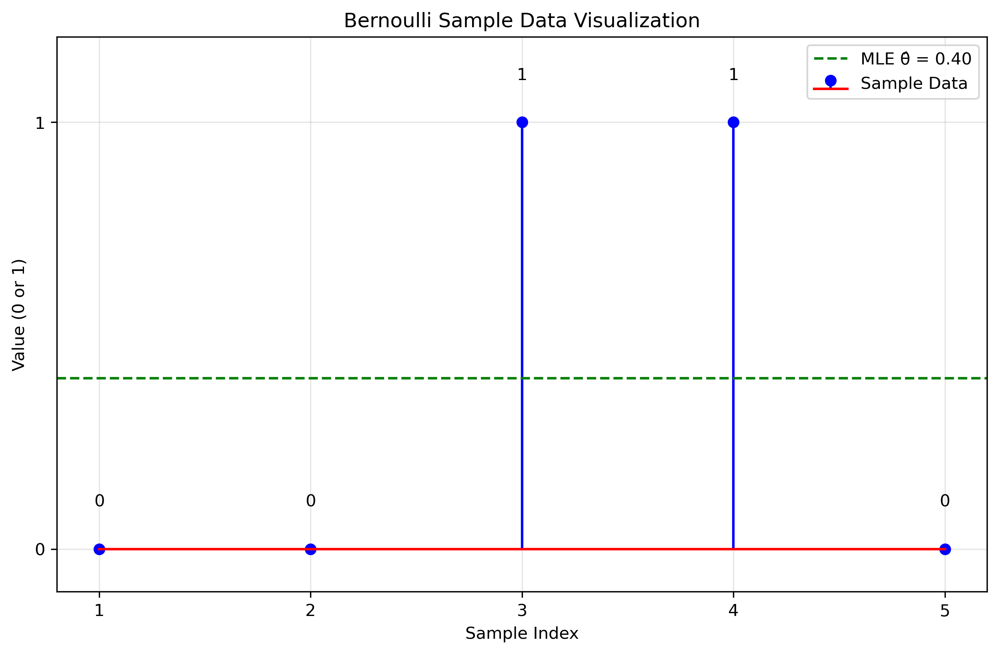
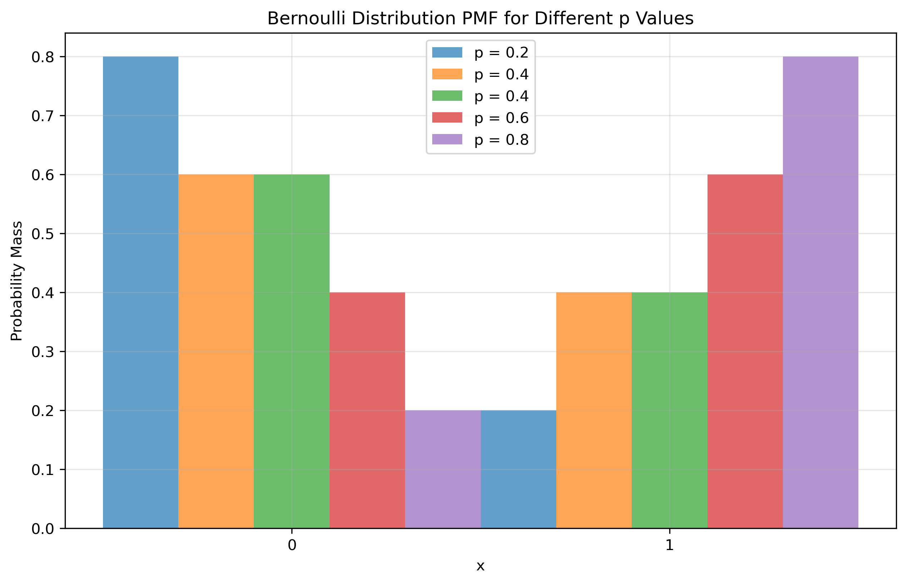
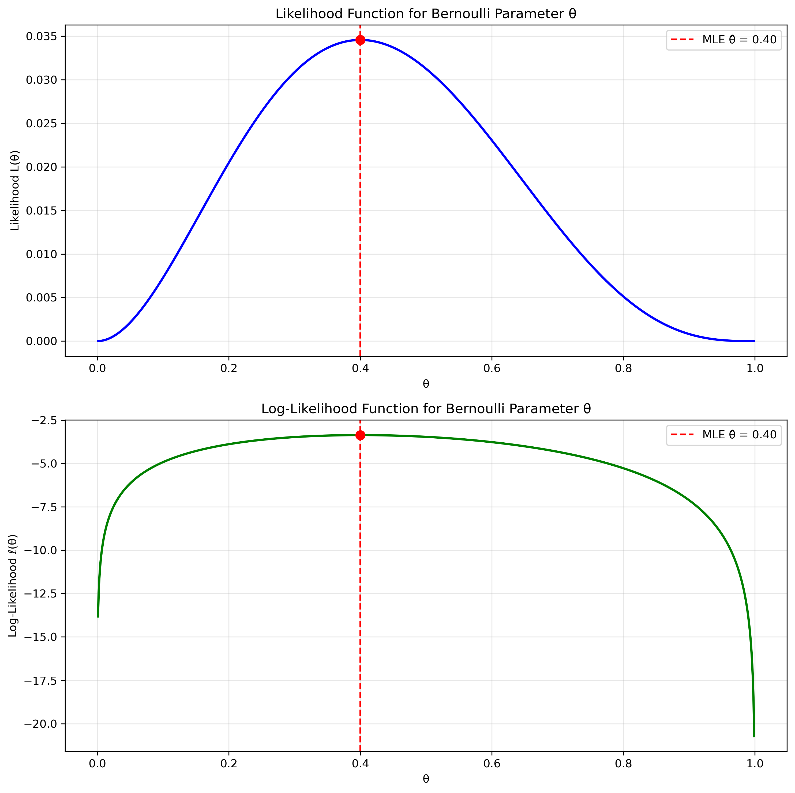
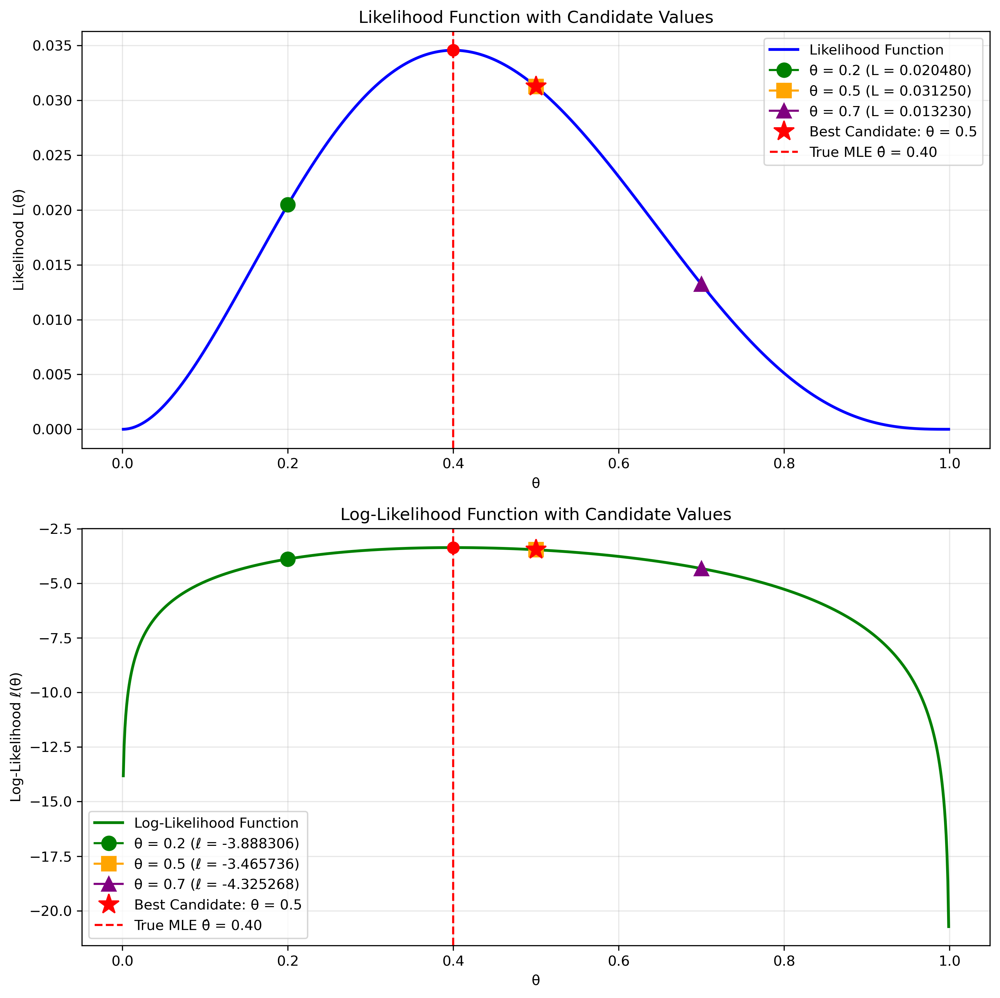

# Question 22: MLE for Bernoulli Distribution with Small Sample

## Problem Statement
Suppose we have samples $x_1=0$, $x_2=0$, $x_3=1$, $x_4=1$, $x_5=0$ from a Bernoulli distribution with unknown parameter $\theta$, where $\theta \in (0, 1)$.

### Task
1. Find the maximum likelihood estimator $\hat{\theta}_{MLE}$ for the parameter $\theta$.
2. Suppose you are asked to select $\theta$ from the set $\{0.2, 0.5, 0.7\}$. Which value would be chosen according to the MLE principle?

## Understanding the Problem
The Bernoulli distribution is a discrete probability distribution that models binary outcomes with two possible results: success (1) or failure (0). Each trial is independent with a constant probability of success, denoted by the parameter $\theta$. The Maximum Likelihood Estimation (MLE) approach allows us to estimate this parameter by finding the value of $\theta$ that maximizes the likelihood of observing our given sample data.

In this problem, we observe a small sample of 5 trials with the values 0, 0, 1, 1, and 0. A key aspect of the Bernoulli distribution is that the MLE only depends on the number of successes relative to the total number of trials, not on the specific ordering of outcomes.

## Solution

### Step 1: Understand the data and model
Our data consists of 5 observations from a Bernoulli distribution:
- Sample values: $x_1=0$, $x_2=0$, $x_3=1$, $x_4=1$, $x_5=0$
- Sample size: $n = 5$
- Number of successes: $k = 2$ (the number of 1's)
- Number of failures: $n-k = 3$ (the number of 0's)

The probability mass function (PMF) of the Bernoulli distribution for a single observation $x$ is:

$$P(X=x|\theta) = \theta^x (1-\theta)^{1-x}, \quad x \in \{0,1\}$$

This means:
- $P(X=0|\theta) = 1-\theta$
- $P(X=1|\theta) = \theta$

### Step 2: Formulate the likelihood function
The likelihood function is the joint probability of observing our sample data as a function of the parameter $\theta$. Since the observations are independent, this is the product of the individual probabilities:

$$L(\theta) = \prod_{i=1}^{n} P(X_i=x_i|\theta) = \prod_{i=1}^{n} \theta^{x_i} (1-\theta)^{1-x_i}$$

This can be simplified to:

$$L(\theta) = \theta^k (1-\theta)^{n-k}$$

where $k$ is the number of successes (1's) and $n-k$ is the number of failures (0's).

For our data, the likelihood function is:

$$L(\theta) = \theta^2 (1-\theta)^3$$

### Step 3: Take the logarithm to get the log-likelihood
Since the logarithm is a monotonically increasing function, maximizing the log-likelihood will give the same result as maximizing the likelihood, but the mathematics is often simpler:

$$\ell(\theta) = \log L(\theta) = \log(\theta^2 (1-\theta)^3) = 2\log(\theta) + 3\log(1-\theta)$$

### Step 4: Find the critical points by taking the derivative
To find the maximum, we take the derivative with respect to $\theta$ and set it to zero:

$$\frac{d\ell}{d\theta} = \frac{2}{\theta} - \frac{3}{1-\theta} = 0$$

### Step 5: Solve for the MLE estimate
Solving for $\theta$:

$$\frac{2}{\theta} = \frac{3}{1-\theta}$$

$$2(1-\theta) = 3\theta$$

$$2 - 2\theta = 3\theta$$

$$2 = 5\theta$$

$$\theta = \frac{2}{5} = 0.4$$

Therefore, the maximum likelihood estimator is:

$$\hat{\theta}_{MLE} = \frac{k}{n} = \frac{2}{5} = 0.4$$

### Step 6: Verify this is a maximum (not a minimum)
The second derivative is:

$$\frac{d^2\ell}{d\theta^2} = -\frac{2}{\theta^2} - \frac{3}{(1-\theta)^2}$$

At $\theta = 0.4$, we have:

$$\frac{d^2\ell}{d\theta^2} = -\frac{2}{(0.4)^2} - \frac{3}{(0.6)^2} = -\frac{2}{0.16} - \frac{3}{0.36} = -12.5 - 8.33 = -20.83 < 0$$

Since the second derivative is negative, our critical point is indeed a maximum.

### Step 7: Selecting the best candidate value
For the second task, we need to select $\theta$ from the set $\{0.2, 0.5, 0.7\}$ according to the MLE principle. We use the same likelihood function $L(\theta) = \theta^2 (1-\theta)^3$ to evaluate each candidate:

$$L(0.2) = (0.2)^2 \times (1-0.2)^3 = 0.04 \times 0.512 = 0.02048$$
$$L(0.5) = (0.5)^2 \times (1-0.5)^3 = 0.25 \times 0.125 = 0.03125$$
$$L(0.7) = (0.7)^2 \times (1-0.7)^3 = 0.49 \times 0.027 = 0.01323$$

Comparing these likelihood values:
- $L(0.2) = 0.02048$
- $L(0.5) = 0.03125$ (highest)
- $L(0.7) = 0.01323$

Since $L(0.5)$ is highest among the three candidates, according to the MLE principle, we would select $\theta = 0.5$ from the given set.

Note that this is different from our unconstrained MLE of $\hat{\theta}_{MLE} = 0.4$. When restricted to a discrete set of candidate values, we select the value that yields the highest likelihood, which in this case is $0.5$.

Relative likelihood comparisons:
- $L(0.2)/L(0.5) \approx 0.6554$ (meaning 0.2 is about 65.54% as likely as 0.5)
- $L(0.7)/L(0.5) \approx 0.4234$ (meaning 0.7 is about 42.34% as likely as 0.5)

This analysis confirms that $\theta = 0.5$ is the best choice among the given candidates.

## Visual Explanations

### Sample Data Visualization

This figure shows our 5 Bernoulli trials, with values of either 0 or 1. The green dashed line represents the MLE estimate $\hat{\theta} = 0.4$, which corresponds to the proportion of 1's in our sample.

**Details from the code output:**
- Sample data: [0 0 1 1 0]
- Sample size: $n = 5$
- Number of successes: $k = 2$
- Number of failures: $n-k = 3$
- MLE Estimate: $\hat{\theta} = 0.4000$

### Bernoulli PMF Visualization

This visualization shows the probability mass function of the Bernoulli distribution for different values of the parameter $\theta$, including our MLE estimate of 0.4. The PMF illustrates how the probabilities of observing 0 or 1 change as $\theta$ varies.

**Details from the code output:**
The Bernoulli probability mass function (PMF) is:
$$P(X=x|p) = p^x (1-p)^{(1-x)}, \text{ for } x \in \{0,1\}$$

For different values of $p$, the probabilities are:
- $p = 0.2$:
  - $P(X=0) = 0.8000$
  - $P(X=1) = 0.2000$
- $p = 0.4$ (our MLE):
  - $P(X=0) = 0.6000$
  - $P(X=1) = 0.4000$
- $p = 0.6$:
  - $P(X=0) = 0.4000$
  - $P(X=1) = 0.6000$
- $p = 0.8$:
  - $P(X=0) = 0.2000$
  - $P(X=1) = 0.8000$

### Likelihood and Log-Likelihood Functions

The top panel shows the likelihood function $L(\theta) = \theta^2 (1-\theta)^3$, which represents the probability of observing our specific data as a function of $\theta$. The bottom panel shows the corresponding log-likelihood function. Both functions achieve their maximum at $\theta = 0.4$, confirming our MLE calculation.

**Details from the code output:**
For our sample data with $k=2$ successes out of $n=5$ trials:
- The likelihood function is: $L(\theta) = \theta^2 \times (1-\theta)^3$
- At $\theta = 0.4000$ (MLE), the likelihood is $L(0.4000) = 0.03456000$

The log-likelihood function is:
- $\ell(\theta) = 2 \times \log(\theta) + 3 \times \log(1-\theta)$
- At $\theta = 0.4000$ (MLE), the log-likelihood is $\ell(0.4000) = -3.365058$

Likelihood and log-likelihood values at selected points:
- $\theta = 0.10$: $L(\theta) = 0.00729000$, $\ell(\theta) = -4.921252$
- $\theta = 0.20$: $L(\theta) = 0.02048000$, $\ell(\theta) = -3.888306$
- $\theta = 0.30$: $L(\theta) = 0.03087000$, $\ell(\theta) = -3.477970$
- $\theta = 0.40$: $L(\theta) = 0.03456000$, $\ell(\theta) = -3.365058$ (maximum)
- $\theta = 0.50$: $L(\theta) = 0.03125000$, $\ell(\theta) = -3.465736$
- $\theta = 0.60$: $L(\theta) = 0.02304000$, $\ell(\theta) = -3.770523$
- $\theta = 0.70$: $L(\theta) = 0.01323000$, $\ell(\theta) = -4.325268$

We can see that both the likelihood and log-likelihood reach their maximum values at $\theta = 0.40$, confirming our analytical solution.

### Comparison of Candidate Values

This visualization directly addresses the second task by comparing the likelihood values for the three candidate values $\theta \in \{0.2, 0.5, 0.7\}$. The top panel shows the likelihood function, and the bottom panel shows the log-likelihood function. Each candidate value is marked with a distinct point, and the best candidate ($\theta = 0.5$) is highlighted with a star.

**Details from the code output:**
For our candidate set $\{0.2, 0.5, 0.7\}$, the likelihood values are:
- $\theta = 0.2$: $L(0.2) = 0.02048000$, $\ell(0.2) = -3.888306$
- $\theta = 0.5$: $L(0.5) = 0.03125000$, $\ell(0.5) = -3.465736$ (best candidate)
- $\theta = 0.7$: $L(0.7) = 0.01323000$, $\ell(0.7) = -4.325268$

Comparison of candidates:
- $\theta = 0.2$ is 0.6554 times as likely as the best candidate
- $\theta = 0.5$ is the best choice
- $\theta = 0.7$ is 0.4234 times as likely as the best candidate

While the true MLE is $\hat{\theta}_{MLE} = 0.4$, when restricted to the discrete set $\{0.2, 0.5, 0.7\}$, the value $\theta = 0.5$ provides the highest likelihood and is therefore the selected estimate.

## Key Insights

### Mathematical Properties
- The MLE for a Bernoulli distribution is the sample proportion of successes
- This simple formula ($\hat{\theta}_{MLE} = \frac{k}{n}$) applies regardless of sample size
- The MLE is an unbiased estimator of $\theta$
- The variance of the estimator is $\frac{\theta(1-\theta)}{n}$

### Statistical Interpretation
- The MLE represents our best estimate of the success probability based solely on the observed data
- For a small sample like ours ($n=5$), there is considerable uncertainty in the estimate
- The standard error is $0.2191$, which is quite large relative to the estimate of $0.4$
- The 95% confidence interval is $(0.0000, 0.8294)$, indicating high uncertainty
- The likelihood function's shape reveals the plausibility of different parameter values
- With more data, our estimate would become more precise (the likelihood curve would become narrower)

### Practical Considerations
- Even with a small sample, the MLE provides a reasonable point estimate
- For small samples, it's particularly important to consider confidence intervals to quantify uncertainty
- The estimate $\hat{\theta} = 0.4$ means we expect 40% of future trials to result in success
- The symmetry of the Bernoulli trials means the order of 0's and 1's doesn't affect the MLE
- When using the MLE estimate for prediction, we get:
  - $P(X=0|\theta=0.4000) = 0.6000$
  - $P(X=1|\theta=0.4000) = 0.4000$
- When restricted to a discrete set of candidate values, we select the one with the highest likelihood
- In our case, when restricted to $\{0.2, 0.5, 0.7\}$, the MLE principle selects $\theta = 0.5$

## Conclusion

The maximum likelihood estimator for the parameter $\theta$ of the Bernoulli distribution based on our given sample data is $\hat{\theta}_{MLE} = 0.4$. This estimate is obtained by finding the value of $\theta$ that maximizes the likelihood function $L(\theta) = \theta^2 (1-\theta)^3$.

The standard error of our estimate is $0.2191$, and the approximate 95% confidence interval is $(0.0000, 0.8294)$. This wide interval reflects the considerable uncertainty associated with estimating a parameter from a small sample size.

The MLE provides an intuitive and statistically principled method for parameter estimation, and in the case of the Bernoulli distribution, the MLE has a simple form: the proportion of successes in the sample. While our small sample size means there's considerable uncertainty in this estimate, the MLE represents the most plausible value based on the observed data.

For the second task, when restricted to choosing from the set $\{0.2, 0.5, 0.7\}$, the MLE principle selects $\theta = 0.5$ as this value maximizes the likelihood function among the given candidates. This demonstrates how the MLE approach can be applied both to find an optimal value in a continuous range and to select the best option from a discrete set of candidates.

## Related Examples

For an extension of this problem that includes Maximum A Posteriori (MAP) estimation and explores how Bayesian methods compare with frequentist methods, see [[L2_7_26_explanation]]. That example builds on the MLE concepts covered here and demonstrates how prior information can influence parameter estimation, especially with small samples. 