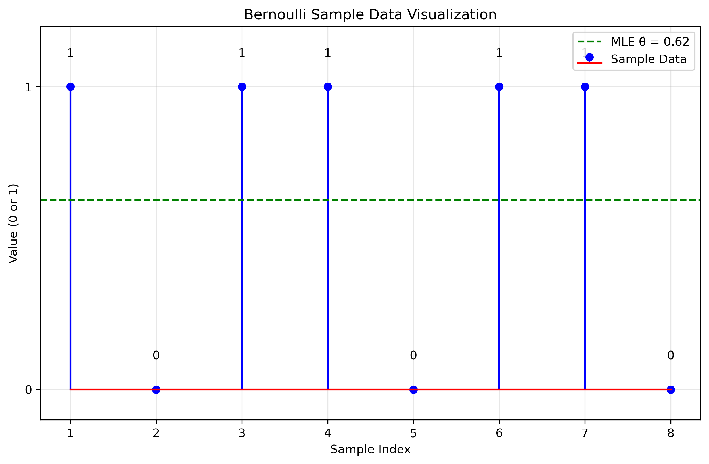
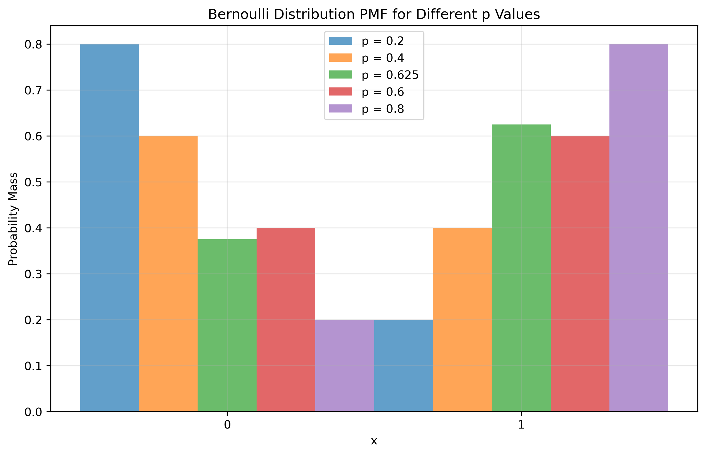
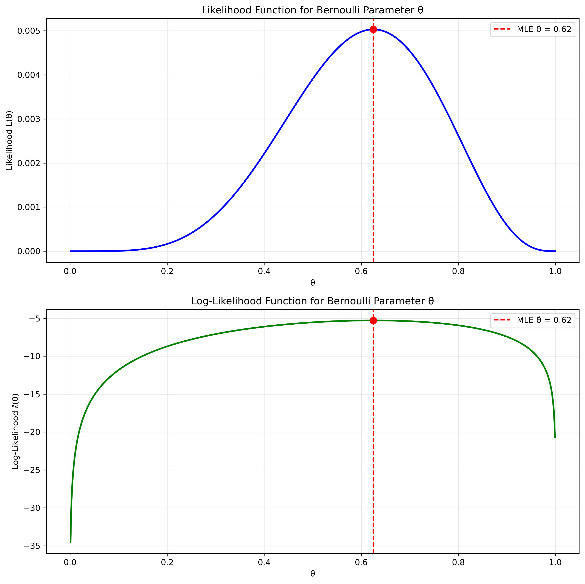
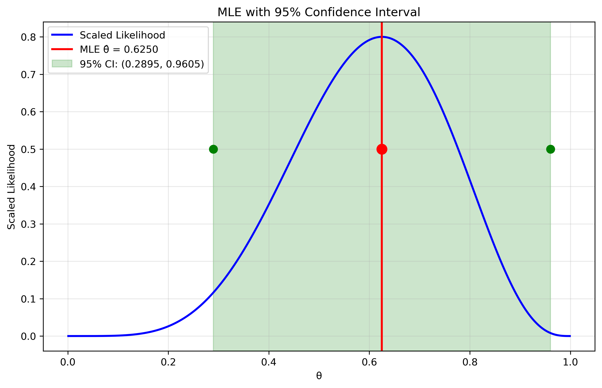

# Question 23: MLE for Bernoulli Distribution

## Problem Statement
A random sample of size $8$ — $X_1 = 1$, $X_2 = 0$, $X_3 = 1$, $X_4 = 1$, $X_5 = 0$, $X_6 = 1$, $X_7 = 1$, and $X_8 = 0$ — is taken from the probability function:

$$p_X(k; \theta) = \theta^k (1-\theta)^{1-k}, \quad k = 0, 1; \quad 0 < \theta < 1$$

### Task
Find the maximum likelihood estimate for $\theta$.

## Understanding the Problem
The Bernoulli distribution is a discrete probability distribution that models random experiments with exactly two possible outcomes: "success" (1) or "failure" (0). The parameter $\theta$ represents the probability of success in a single trial. Maximum Likelihood Estimation (MLE) is a method for estimating the parameters of a statistical model by finding the parameter values that maximize the likelihood function.

In this problem:
- We have 8 independent and identically distributed (i.i.d.) Bernoulli trials
- Each trial has resulted in either success (1) or failure (0)
- We need to find the value of $\theta$ that makes our observed data most likely

## Solution

### Step 1: Identify the sample data and parameter
Our data consists of 8 observations from a Bernoulli distribution:
- Sample values: $X_1 = 1$, $X_2 = 0$, $X_3 = 1$, $X_4 = 1$, $X_5 = 0$, $X_6 = 1$, $X_7 = 1$, and $X_8 = 0$
- Sample size: $n = 8$
- Number of successes: $k = 5$ (the number of 1's)
- Number of failures: $n-k = 3$ (the number of 0's)

The probability mass function (PMF) of a Bernoulli random variable is:

$$P(X=x|\theta) = \theta^x (1-\theta)^{1-x}, \quad x \in \{0,1\}$$

### Step 2: Formulate the likelihood function
The likelihood function is the joint probability of observing our sample data, viewed as a function of the parameter $\theta$. Since the observations are independent, the likelihood is the product of the individual probabilities:

$$L(\theta) = \prod_{i=1}^{n} P(X_i=x_i|\theta) = \prod_{i=1}^{n} \theta^{x_i} (1-\theta)^{1-x_i}$$

This can be simplified to:

$$L(\theta) = \theta^k (1-\theta)^{n-k}$$

where $k$ is the number of successes (1's) and $n-k$ is the number of failures (0's).

For our data, the likelihood function is:

$$L(\theta) = \theta^5 (1-\theta)^3$$

### Step 3: Take the logarithm to get the log-likelihood
Taking the natural logarithm of both sides gives us the log-likelihood function:

$$\ell(\theta) = \log L(\theta) = \log(\theta^5 (1-\theta)^3) = 5\log(\theta) + 3\log(1-\theta)$$

The log-likelihood is often easier to work with mathematically while preserving the same maximum point as the likelihood function.

### Step 4: Find the critical points by taking the derivative
To find the maximum of the log-likelihood function, we take the derivative with respect to $\theta$ and set it to zero:

$$\frac{d\ell}{d\theta} = \frac{5}{\theta} - \frac{3}{1-\theta} = 0$$

### Step 5: Solve for the MLE estimate
Solving for $\theta$:

$$\frac{5}{\theta} = \frac{3}{1-\theta}$$

$$5(1-\theta) = 3\theta$$

$$5 - 5\theta = 3\theta$$

$$5 = 8\theta$$

$$\theta = \frac{5}{8} = 0.625$$

Therefore, the maximum likelihood estimator is:

$$\hat{\theta}_{MLE} = \frac{k}{n} = \frac{5}{8} = 0.625$$

### Step 6: Verify this is a maximum (not a minimum)
The second derivative of the log-likelihood is:

$$\frac{d^2\ell}{d\theta^2} = -\frac{5}{\theta^2} - \frac{3}{(1-\theta)^2}$$

Evaluating at $\theta = 0.625$:

$$\frac{d^2\ell}{d\theta^2} = -\frac{5}{(0.625)^2} - \frac{3}{(0.375)^2} = -\frac{5}{0.3906} - \frac{3}{0.1406} < 0$$

Since the second derivative is negative, our critical point is indeed a maximum.

## Visual Explanations

### Sample Data Visualization

This figure shows our 8 Bernoulli trials, with values of either 0 or 1. The green dashed line represents the MLE estimate $\hat{\theta} = 0.625$, which corresponds to the proportion of 1's in our sample (5 out of 8 = 0.625).

### Bernoulli PMF Visualization

This visualization shows the probability mass function of the Bernoulli distribution for different values of the parameter $\theta$, including our MLE estimate of 0.625. The PMF illustrates how the probabilities of observing 0 or 1 change as $\theta$ varies.

With our MLE estimate $\hat{\theta} = 0.625$:
- The probability of observing $X = 0$ is $P(X=0|\hat{\theta}) = 1 - 0.625 = 0.375$
- The probability of observing $X = 1$ is $P(X=1|\hat{\theta}) = 0.625$

### Likelihood and Log-Likelihood Functions

The top panel shows the likelihood function $L(\theta) = \theta^5 (1-\theta)^3$, which represents the probability of observing our specific data as a function of $\theta$. The bottom panel shows the corresponding log-likelihood function. Both functions achieve their maximum at $\theta = 0.625$, confirming our MLE calculation.

At the MLE $\hat{\theta} = 0.625$:
- The likelihood value is $L(0.625) \approx 0.00503$
- The log-likelihood value is $\ell(0.625) \approx -5.293$

### Confidence Interval Visualization

This visualization shows the MLE estimate along with its 95% confidence interval. The confidence interval represents the range of plausible values for the parameter $\theta$ given our observed data. Due to our relatively small sample size (n=8), the confidence interval is quite wide, indicating considerable uncertainty in our estimate.

## Key Insights

### Mathematical Properties
- The MLE for a Bernoulli distribution is simply the sample proportion of successes: $\hat{\theta}_{MLE} = \frac{k}{n}$
- This estimator is unbiased: $E[\hat{\theta}_{MLE}] = \theta$
- The variance of the estimator is $Var(\hat{\theta}_{MLE}) = \frac{\theta(1-\theta)}{n}$
- For our data, the estimated variance is $\frac{0.625 \times 0.375}{8} \approx 0.029$
- The standard error of the estimate is $SE(\hat{\theta}_{MLE}) = \sqrt{Var(\hat{\theta}_{MLE})} \approx 0.171$

### Statistical Interpretation
- The MLE represents our best estimate of the success probability based solely on the observed data
- For our sample of size 8, there is considerable uncertainty in the estimate
- The 95% confidence interval is approximately (0.290, 0.961), which is quite wide
- As sample size increases, the MLE becomes more precise (narrower confidence interval)
- The Fisher Information for our model is $I(\theta) = \frac{n}{\theta(1-\theta)} \approx 34.13$, which quantifies how much information the data provides about $\theta$
- The Cramér-Rao lower bound is $\frac{1}{I(\theta)} \approx 0.029$, which is the minimum variance that any unbiased estimator can achieve

### Practical Applications
- In this context, $\theta$ represents the probability of success in a Bernoulli trial
- Our estimate $\hat{\theta} = 0.625$ means we expect about 62.5% of future trials to result in success
- This estimate can be used for prediction or decision-making purposes
- For example, in a quality control context, if "success" means a defective item, our estimate would suggest that about 62.5% of items are defective
- The wide confidence interval suggests we should collect more data before making strong conclusions

## Conclusion

The maximum likelihood estimator for the parameter $\theta$ of the Bernoulli distribution based on our sample data is $\hat{\theta}_{MLE} = 0.625$. This estimate is obtained by finding the value of $\theta$ that maximizes the likelihood function $L(\theta) = \theta^5 (1-\theta)^3$.

The MLE for a Bernoulli distribution has a simple, intuitive form: it is the proportion of successes in the sample. In our case, with 5 successes out of 8 trials, the MLE is 5/8 = 0.625.

While the MLE provides a point estimate, the 95% confidence interval (0.290, 0.961) gives us a measure of the uncertainty in our estimate. This wide interval reflects the relatively small sample size and suggests that we should be cautious when making inferences based on this estimate alone.

Maximum likelihood estimation provides a principled approach to parameter estimation that is widely applicable across different statistical models. In the case of the Bernoulli distribution, the MLE has particularly nice properties, being both unbiased and asymptotically efficient. 