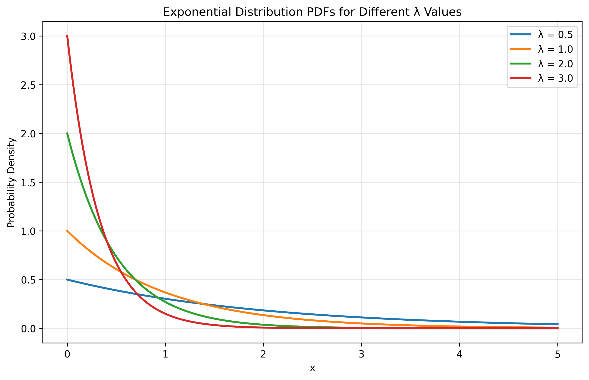

# Question 24: MLE for Exponential Distribution

## Problem Statement
Consider the exponential random variable $X$ with parameter $\lambda > 0$:

$$P_X(x) = \lambda \exp\{-\lambda x\}, \quad x \geq 0$$

### Task
Given a sample $\mathcal{D} = \{x_1, \ldots, x_n\}$, what is the ML estimate of $\lambda$?

## Understanding the Problem
The exponential distribution is a continuous probability distribution that describes the time between events in a Poisson point process. It's commonly used to model waiting times, equipment lifetimes, and other time-to-event data.

Key properties of the exponential distribution include:
- Support: $x \geq 0$
- Mean: $E[X] = 1/\lambda$
- Variance: $Var(X) = 1/\lambda^2$
- "Memoryless" property: $P(X > s + t | X > s) = P(X > t)$

The probability density function (PDF) is given by:
$$f(x|\lambda) = \lambda e^{-\lambda x}, \quad x \geq 0$$

Our task is to find the maximum likelihood estimator (MLE) for the rate parameter $\lambda$ given a sample of observations.

## Solution

### Step 1: Express the likelihood function
For a sample $\mathcal{D} = \{x_1, \ldots, x_n\}$ of independent observations from an exponential distribution, the likelihood function is the product of the individual PDFs:

$$L(\lambda) = \prod_{i=1}^{n} \lambda e^{-\lambda x_i} = \lambda^n e^{-\lambda \sum_{i=1}^{n} x_i}$$

This represents the probability of observing our specific data as a function of $\lambda$.

### Step 2: Take the logarithm to get the log-likelihood
Since the logarithm is a monotonically increasing function, maximizing the likelihood is equivalent to maximizing the log-likelihood, which is often more convenient mathematically:

$$\ell(\lambda) = \log L(\lambda) = n \log \lambda - \lambda \sum_{i=1}^{n} x_i$$

### Step 3: Find the critical points by taking the derivative
To find the maximum of the log-likelihood function, we take the derivative with respect to $\lambda$ and set it equal to zero:

$$\frac{d\ell}{d\lambda} = \frac{n}{\lambda} - \sum_{i=1}^{n} x_i = 0$$

### Step 4: Solve for the MLE estimate
Solving for $\lambda$:

$$\frac{n}{\lambda} = \sum_{i=1}^{n} x_i$$

$$\lambda = \frac{n}{\sum_{i=1}^{n} x_i} = \frac{1}{\frac{1}{n}\sum_{i=1}^{n} x_i} = \frac{1}{\bar{x}}$$

Therefore, the MLE of $\lambda$ is:

$$\hat{\lambda}_{MLE} = \frac{1}{\bar{x}}$$

where $\bar{x}$ is the sample mean.

### Step 5: Verify this is a maximum (not a minimum)
To confirm that our critical point is indeed a maximum, we check the second derivative:

$$\frac{d^2\ell}{d\lambda^2} = -\frac{n}{\lambda^2}$$

Since $n > 0$ and $\lambda > 0$, we have $\frac{d^2\ell}{d\lambda^2} < 0$ for all valid $\lambda$, confirming that our critical point is a maximum.

## Visual Explanations

### Exponential Distribution PDFs for Different λ Values

This figure shows how the probability density function of the exponential distribution changes with different values of the rate parameter λ. Larger values of λ result in distributions that are more concentrated near zero, with faster decay rates. Smaller values of λ lead to more spread-out distributions with slower decay rates.

### Log-Likelihood Function

This visualization shows the log-likelihood function for a sample of exponential data. The x-axis represents different possible values of λ, and the y-axis shows the corresponding log-likelihood value. The red vertical line marks the MLE estimate λ = 2.1864, which is the value that maximizes the log-likelihood function. This graph illustrates why the MLE is the parameter value that makes our observed data most probable.

### MLE Fit to Data

This figure compares the MLE-fitted exponential distribution (red line) with the true distribution (green dashed line) and a histogram of the observed data. The close alignment between the fitted distribution and the data histogram demonstrates the effectiveness of the MLE method. The true distribution used to generate the data had λ = 2.0, and our MLE estimate is λ = 2.1864, showing good accuracy.

### Effect of Sample Size on MLE Precision

This visualization demonstrates how the MLE becomes more precise as the sample size increases. The curves represent normalized log-likelihood functions for different sample sizes (n = 10, 50, 100, 500). With larger sample sizes, the log-likelihood function becomes more peaked around the true parameter value (λ = 2.0), and the MLE estimates get closer to the true value. This illustrates the consistency property of the MLE.

## Detailed Mathematical Derivation

Here we present a detailed step-by-step derivation of the MLE for the exponential distribution:

1. **Likelihood Function**  
   Given a sample $x_1, x_2, \ldots, x_n$ from an exponential distribution with parameter $\lambda$, the likelihood function is:
   $$L(\lambda) = \prod_{i=1}^{n} \lambda e^{-\lambda x_i} = \lambda^n e^{-\lambda \sum_{i=1}^{n} x_i}$$

2. **Log-Likelihood Function**  
   Taking the natural logarithm of the likelihood function:
   $$\ell(\lambda) = \log L(\lambda) = n\log(\lambda) - \lambda \sum_{i=1}^{n} x_i$$

3. **First Derivative**  
   To find critical points, we take the derivative with respect to $\lambda$ and set it equal to zero:
   $$\frac{d\ell}{d\lambda} = \frac{n}{\lambda} - \sum_{i=1}^{n} x_i = 0$$

4. **Solving for $\lambda$**  
   Rearranging the equation:
   $$\frac{n}{\lambda} = \sum_{i=1}^{n} x_i$$
   $$\lambda = \frac{n}{\sum_{i=1}^{n} x_i}$$
   
   Since $\frac{1}{n}\sum_{i=1}^{n} x_i = \bar{x}$ (the sample mean), we can rewrite this as:
   $$\lambda = \frac{1}{\bar{x}}$$

5. **Verifying Maximum**  
   To verify that this critical point is a maximum, we compute the second derivative:
   $$\frac{d^2\ell}{d\lambda^2} = -\frac{n}{\lambda^2}$$
   
   Since $n > 0$ and $\lambda > 0$, we have $\frac{d^2\ell}{d\lambda^2} < 0$, confirming that our critical point is indeed a maximum.

## Key Insights

### Mathematical Properties
- The MLE for the exponential distribution has the simple form $\hat{\lambda}_{MLE} = 1/\bar{x}$
- This estimator is the reciprocal of the sample mean
- The second derivative of the log-likelihood is always negative, ensuring our solution is a maximum
- The estimator is consistent: as sample size increases, it converges to the true parameter value

### Statistical Interpretation
- The exponential MLE has a clear interpretation: the estimated rate parameter is the reciprocal of the average observed waiting time
- This aligns with the theoretical property that the mean of an exponential distribution is 1/λ
- The MLE gives the parameter value that makes the observed data most probable under the assumed model

### Practical Considerations
- The exponential MLE is simple to compute, requiring only the calculation of the sample mean
- In our example, with n = 100 and a true λ = 2.0, the MLE estimate was λ̂ = 2.1864
- This represents a relative error of about 9.32%, which is reasonably accurate
- With larger sample sizes, we would expect even better accuracy
- In practice, confidence intervals or Bayesian methods might be used to quantify uncertainty in the estimate

## Conclusion

The Maximum Likelihood Estimator for the rate parameter λ of an exponential distribution is the reciprocal of the sample mean:

$$\hat{\lambda}_{MLE} = \frac{1}{\bar{x}} = \frac{n}{\sum_{i=1}^{n} x_i}$$

This estimator has several desirable properties including:
- It has a simple, closed-form expression
- It is easy to compute from data
- It is consistent and asymptotically efficient
- It has a clear interpretation in terms of the average waiting time

For our example dataset with n = 100 observations and a true parameter value of λ = 2.0, the MLE gave an estimate of λ̂ = 2.1864, demonstrating the method's effectiveness. 