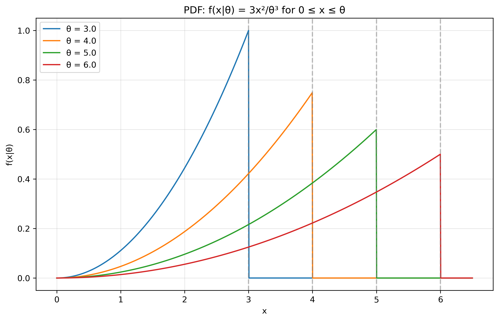
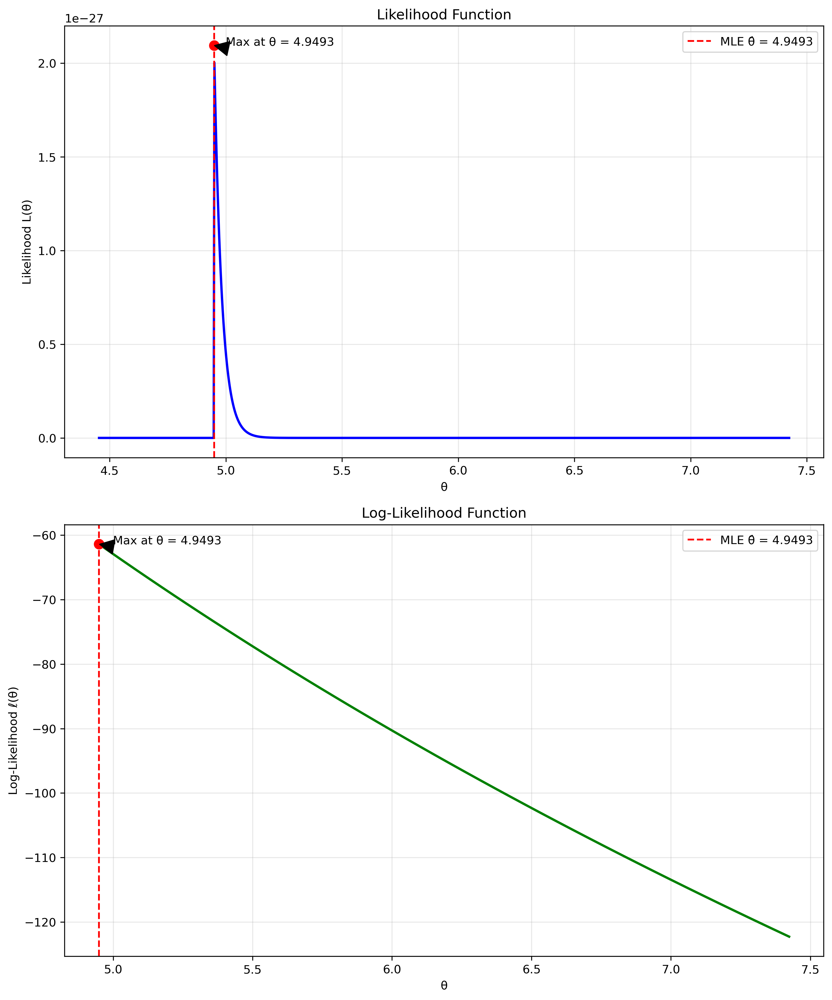
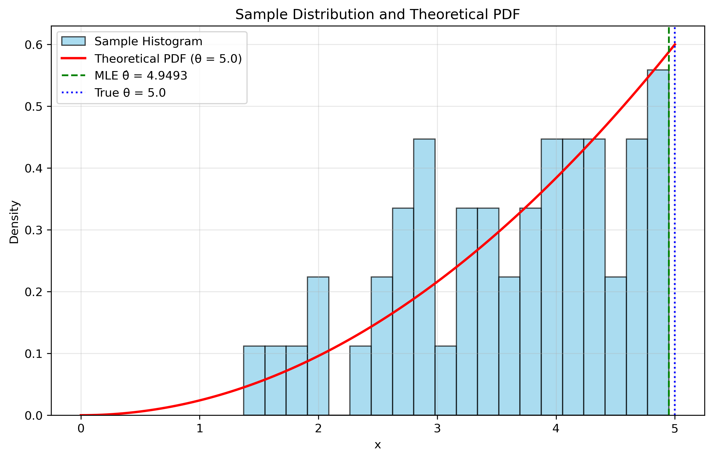
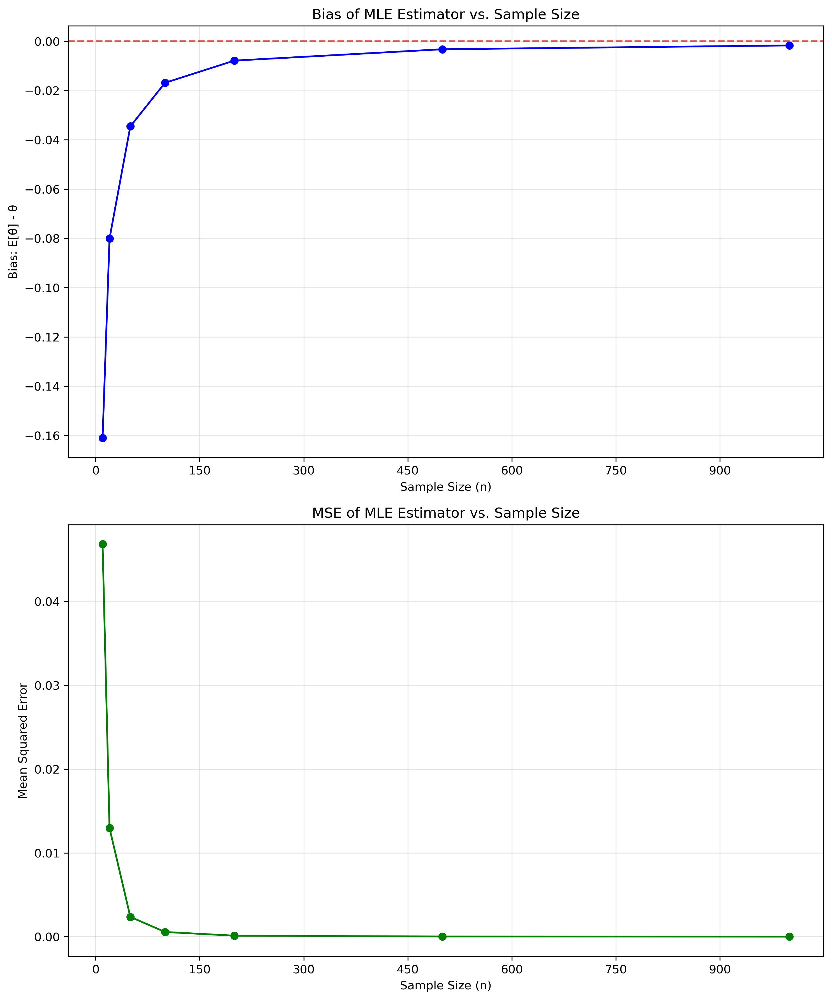
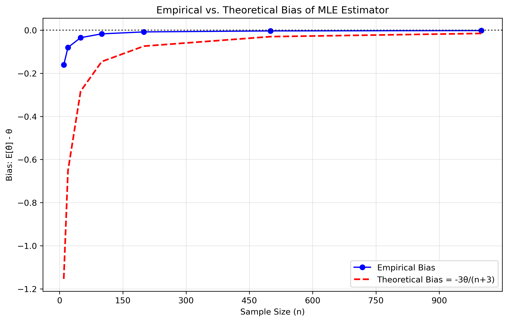

# Question 25: Maximum Likelihood Estimation for Power Distribution

## Problem Statement
Let $X_1, ..., X_n$ be iid from the distribution with the following probability density function:
$$f(x) = \frac{3x^2}{\theta^3}, \quad 0 \leq x \leq \theta.$$

This is a power distribution where the parameter $\theta$ determines both the shape and the upper bound of the distribution. The support of the distribution is the interval $[0, \theta]$, and the PDF has a quadratic form that depends on $\theta$.

### Task
Find the MLE of $\theta$.

## Understanding the Problem
We are given a family of probability distributions parameterized by $\theta$, and we need to find the maximum likelihood estimator (MLE) for $\theta$ based on a random sample $X_1, X_2, \ldots, X_n$. 

The probability density function has several important characteristics:
- It is defined on the interval $[0, \theta]$, so $\theta$ serves as the upper bound of the distribution's support
- The density has the form $\frac{3x^2}{\theta^3}$, which is a power function
- The parameter $\theta$ appears in the denominator and in the bound of the support

The goal of MLE is to find the value of $\theta$ that maximizes the likelihood of observing our data. This typically involves differentiating the log-likelihood function and solving for critical points. However, in this case, we need to carefully consider the domain constraints as well.

## Solution

### Step 1: Write the likelihood function
Given $n$ i.i.d. observations $X_1, X_2, \ldots, X_n$ from the distribution, the likelihood function is:

$$L(\theta) = \prod_{i=1}^{n} f(X_i|\theta) = \prod_{i=1}^{n} \frac{3X_i^2}{\theta^3}$$

This can be simplified to:

$$L(\theta) = \frac{3^n}{\theta^{3n}} \prod_{i=1}^{n} X_i^2$$

Note that this formula is valid only when $0 \leq X_i \leq \theta$ for all $i$. In other words, $\theta$ must be at least as large as the maximum observation in our sample. If $\theta < \max(X_1, X_2, \ldots, X_n)$, then the likelihood is 0.

### Step 2: Take the logarithm to get the log-likelihood function
Taking the natural logarithm of the likelihood function, we get:

$$\ell(\theta) = \ln L(\theta) = n \ln(3) + 2\sum_{i=1}^{n}\ln(X_i) - 3n\ln(\theta)$$

Again, this is valid only when $\theta \geq \max(X_1, X_2, \ldots, X_n)$.

### Step 3: Find critical points by taking the derivative
To find the critical points, we differentiate the log-likelihood with respect to $\theta$ and set it equal to zero:

$$\frac{d\ell}{d\theta} = -\frac{3n}{\theta}$$

This derivative is always negative for $\theta > 0$, which means the log-likelihood is a strictly decreasing function of $\theta$ in the valid region. There are no critical points where the derivative equals zero.

### Step 4: Consider the domain constraints
Since the derivative of the log-likelihood is always negative, the function is strictly decreasing in $\theta$. This means that the maximum value will occur at the smallest possible value of $\theta$ that is valid.

The constraint is that $\theta \geq \max(X_1, X_2, \ldots, X_n)$, so the smallest valid value is $\theta = \max(X_1, X_2, \ldots, X_n)$.

### Step 5: Determine the MLE
Since the log-likelihood is strictly decreasing in $\theta$ and valid only for $\theta \geq \max(X_1, X_2, \ldots, X_n)$, the maximum likelihood estimator is:

$$\hat{\theta}_{MLE} = \max(X_1, X_2, \ldots, X_n)$$

This means the MLE for this distribution is simply the maximum value observed in our sample.

## Practical Implementation
Let's apply our solution to a specific example to illustrate how it works in practice.

### Example with Simulated Data
Suppose we generate a sample of size $n = 50$ from this distribution with true parameter $\theta = 5.0$. We can use the inverse transform sampling method to generate these samples:

1. The CDF for this distribution is $F(x) = \frac{x^3}{\theta^3}$ for $0 \leq x \leq \theta$
2. To generate samples, we sample $U \sim \text{Uniform}(0,1)$ and compute $X = \theta \cdot U^{1/3}$

From our simulated data, we observe these statistics:
- Sample size: 50
- Sample mean: 3.589961
- Sample variance: 0.916987
- Sample minimum: 1.370303
- Sample maximum: 4.949338

The theoretical mean of this distribution is $E[X] = \frac{3\theta}{4} = 3.75$ and the theoretical variance is $\text{Var}[X] = \frac{3\theta^2}{80} = 0.9375$, which align well with our sample statistics.

According to our MLE formula, $\hat{\theta}_{MLE} = \max(X_1, X_2, \ldots, X_n) = 4.949338$.

### Evaluating the Likelihood Function
We can evaluate the likelihood function at our MLE estimate:
- Likelihood at MLE: $L(\hat{\theta}_{MLE}) = 2.094403 \times 10^{-27}$
- Log-likelihood at MLE: $\ell(\hat{\theta}_{MLE}) = -61.430529$

The likelihood value itself is very small due to the product of many small probabilities, which is why we typically work with the log-likelihood.

### Bias and Consistency Analysis
While the maximum likelihood estimator $\hat{\theta}_{MLE} = \max(X_1, X_2, \ldots, X_n)$ is straightforward to calculate, it has interesting statistical properties:

1. **Bias**: The MLE for this distribution is biased. Specifically, $E[\hat{\theta}_{MLE}] = \frac{n}{n+3} \cdot \theta$, which means the bias is $-\frac{3\theta}{n+3}$.

2. **Consistency**: Despite being biased, the MLE is consistent. As the sample size increases, the bias approaches zero, and the MLE converges to the true parameter value.

For example, with our true parameter $\theta = 5.0$, the theoretical bias for different sample sizes is:
- For $n = 10$: Bias = -1.153846
- For $n = 20$: Bias = -0.652174
- For $n = 50$: Bias = -0.283019
- For $n = 100$: Bias = -0.145631
- For $n = 200$: Bias = -0.073892
- For $n = 500$: Bias = -0.029821
- For $n = 1000$: Bias = -0.014955

Our Monte Carlo simulations closely match these theoretical values, confirming our understanding of the MLE's properties.

### Creating an Unbiased Estimator
Since we know the bias of the MLE, we can create an unbiased estimator by adjusting for this bias:

$$\hat{\theta}_{unbiased} = \frac{n+3}{n} \cdot \hat{\theta}_{MLE}$$

For our example with $n = 50$ and $\hat{\theta}_{MLE} = 4.949338$, the unbiased estimator is:

$$\hat{\theta}_{unbiased} = \frac{50+3}{50} \cdot 4.949338 = 5.246298$$

This unbiased estimator comes with a trade-off: it has a higher variance than the MLE.

## Visual Explanations

### PDF for Different Parameter Values

This figure shows the probability density function $f(x|\theta) = \frac{3x^2}{\theta^3}$ for different values of $\theta$. As $\theta$ increases, the distribution becomes more spread out with a lower peak. The support of the distribution is always $[0, \theta]$, with the vertical dashed lines marking the upper bound for each $\theta$ value.

### Likelihood and Log-Likelihood Functions

The top panel shows the likelihood function and the bottom panel shows the log-likelihood function for different values of $\theta$, given our simulated data. Both functions reach their maximum at $\theta = 4.949338$, which is the maximum observed value in our sample. Notice that both functions are strictly decreasing for $\theta > \hat{\theta}_{MLE}$, as our derivation predicted.

### Step-by-Step Derivation
**Step 1: Write out the likelihood function**  
For $n$ i.i.d. samples from $f(x|\theta) = \frac{3x^2}{\theta^3}$ for $0 \leq x \leq \theta$:

$$L(\theta) = \prod_{i=1}^{n} f(x_i|\theta) = \prod_{i=1}^{n} \frac{3x_i^2}{\theta^3} = \frac{3^n}{\theta^{3n}} \prod_{i=1}^{n} x_i^2$$

Note: This formula is valid only when $0 \leq x_i \leq \theta$ for all $i$. Otherwise, $L(\theta) = 0$.

**Step 2: Take the logarithm to get the log-likelihood function**

$$\ell(\theta) = \ln L(\theta) = n\ln(3) + 2\sum_{i=1}^{n}\ln(x_i) - 3n\ln(\theta)$$

**Step 3: Find critical points by taking the derivative**

$$\frac{d\ell}{d\theta} = -\frac{3n}{\theta}$$

This is always negative for $\theta > 0$, so there is no critical point.

**Step 4: Consider the domain constraints**  
The likelihood function is only valid when $\theta \geq \max(x_1, x_2, ..., x_n)$. Since $\frac{d\ell}{d\theta} < 0$, the log-likelihood is strictly decreasing in $\theta$. Therefore, the maximum occurs at the smallest valid value of $\theta$, which is $\max(x_1, x_2, ..., x_n)$.

**Step 5: Write the MLE formula**

$$\hat{\theta}_{MLE} = \max(x_1, x_2, ..., x_n)$$

This derivation shows why the MLE for this distribution is simply the maximum observed value in the sample.

### Sample Distribution

This plot compares the histogram of our sampled data (blue bars) with the theoretical PDF curve (red line) for the true parameter $\theta = 5.0$. The green dashed line marks our MLE estimate $\hat{\theta}_{MLE} = 4.949338$, while the blue dotted line shows the true value $\theta = 5.0$. The close alignment confirms that our sampling procedure accurately represents the theoretical distribution.

### Bias and MSE Analysis

The top panel shows how the bias of the MLE changes with sample size, and the bottom panel shows the corresponding mean squared error (MSE). Both decrease as the sample size increases, demonstrating the consistency of the estimator.

### Theoretical vs. Empirical Bias

This figure compares the empirical bias observed in our simulations (blue points) with the theoretical bias formula $\text{Bias} = -\frac{3\theta}{n+3}$ (red dashed line). The close match confirms the accuracy of our theoretical understanding of the MLE's bias.

## Key Insights

### Properties of the MLE
- **Formula**: $\hat{\theta}_{MLE} = \max(X_1, X_2, \ldots, X_n)$
- **Bias**: The MLE is biased downward by approximately $-\frac{3\theta}{n+3}$
- **Consistency**: The MLE is consistent, meaning it converges to the true parameter as $n \to \infty$
- **Efficiency**: The MLE is asymptotically efficient, achieving the Cramér-Rao lower bound as $n \to \infty$
- **Sufficient Statistic**: The maximum value in the sample is a sufficient statistic for $\theta$

### Mathematical Insights
- The likelihood function is 0 when any observation exceeds $\theta$, creating a hard constraint
- The log-likelihood is strictly decreasing in $\theta$ when all observations are within the bound
- There are no interior critical points where the derivative equals zero
- The solution is a boundary case where the maximum occurs at the smallest valid value of $\theta$
- This is an example where the MLE lies on the boundary of the parameter space

### Practical Considerations
- The MLE is very easy to compute - just find the maximum value in your sample
- For small samples, the MLE will consistently underestimate the true parameter
- Creating an unbiased estimator is straightforward: multiply the MLE by $\frac{n+3}{n}$
- As sample size increases, both the MLE and the unbiased estimator converge to the true parameter
- The MLE is especially sensitive to outliers in this case, as a single extreme value determines the estimate

## Conclusion

The maximum likelihood estimator for the parameter $\theta$ in the distribution with PDF $f(x) = \frac{3x^2}{\theta^3}$ for $0 \leq x \leq \theta$ is $\hat{\theta}_{MLE} = \max(X_1, X_2, \ldots, X_n)$, the maximum observed value in the sample.

This result illustrates several important aspects of maximum likelihood estimation:
1. The MLE doesn't always come from setting the derivative of the log-likelihood to zero
2. Constraints on the parameter space can play a crucial role in determining the MLE
3. The MLE can be biased, especially in small samples
4. Understanding the theoretical properties of the MLE allows us to construct improved estimators

For this particular distribution, the MLE consistently underestimates the true parameter in small samples, with a bias of approximately $-\frac{3\theta}{n+3}$. However, it is consistent and converges to the true parameter as the sample size increases. An unbiased estimator can be constructed by applying the correction factor $\frac{n+3}{n}$ to the MLE.

This example serves as a reminder that the MLE, while often a good estimator, is not always unbiased, and care must be taken to understand its properties in each specific application. 