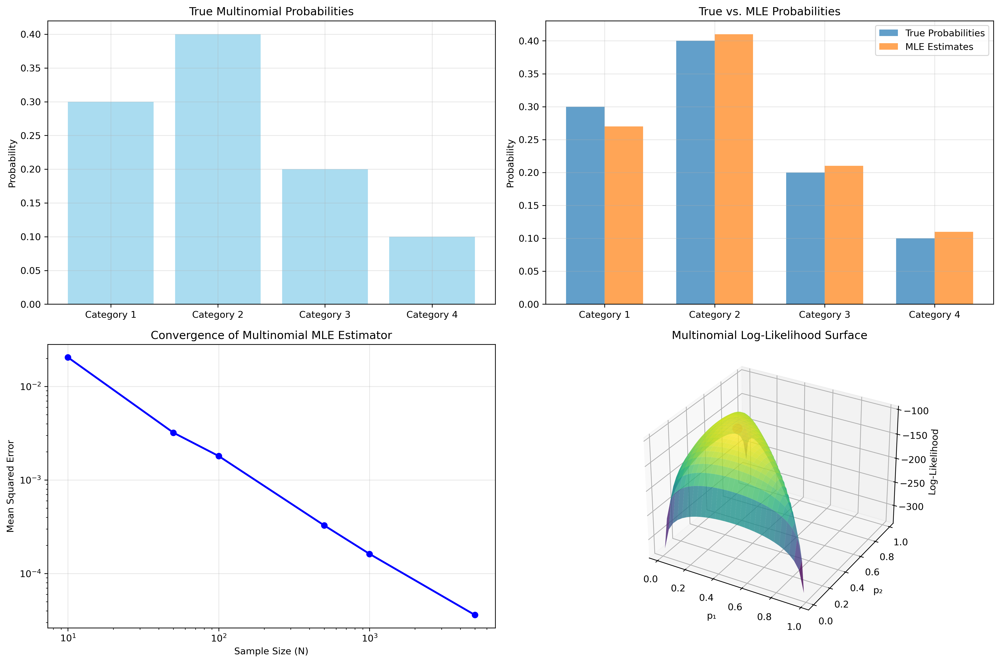

# Question 26: Proving Common Maximum Likelihood Estimators

## Problem Statement
Maximum Likelihood Estimation (MLE) yields fundamental estimator formulas for common probability distributions. For each of the following distributions, prove that the given formula is indeed the maximum likelihood estimator.

### Task
Provide a detailed mathematical proof for each of the following maximum likelihood estimators:

1. For a sample of $N$ independent Bernoulli trials with $m$ successes, prove that the MLE for the success probability $\theta$ is:
   $$\hat{\theta}_{MLE} = \frac{m}{N}$$

2. For a multinomial distribution with $K$ categories and counts $N_1, N_2, \ldots, N_K$ (where $\sum_{k=1}^{K} N_k = N$), prove that the MLE for probability $\theta_k$ of category $k$ is:
   $$\hat{\theta}_{k,MLE} = \frac{N_k}{N}$$

3. For a sample of $N$ independent observations from a Gaussian distribution with unknown mean $\mu$ and known variance $\sigma^2$, prove that the MLE for $\mu$ is:
   $$\hat{\mu}_{MLE} = \frac{1}{N}\sum_{i=1}^{N}x^{(i)}$$

4. For a sample of $N$ independent observations from a Gaussian distribution with unknown mean $\mu$ and unknown variance $\sigma^2$, prove that the MLE for $\sigma^2$ is:
   $$\hat{\sigma}^2_{MLE} = \frac{1}{N}\sum_{i=1}^{N}(x^{(i)}-\hat{\mu}_{MLE})^2$$

## Understanding the Problem
Maximum Likelihood Estimation (MLE) is a fundamental method in statistical inference for fitting a statistical model to data and providing estimates for the model's parameters. The principle of maximum likelihood estimation states that we should choose parameter values that make the observed data most probable.

Given a set of observations $x = (x_1, x_2, \ldots, x_n)$ and a statistical model with parameters $\theta$, MLE finds the parameter values that maximize the likelihood function $L(\theta|x)$, which is the probability of observing the data given the parameter values.

For each distribution, we need to:
1. Formulate the likelihood function based on the probability density/mass function
2. Take the logarithm to obtain the log-likelihood function (for computational and analytical convenience)
3. Find the critical points by taking derivatives and setting them equal to zero
4. Verify these critical points are indeed maxima
5. Interpret the results in the context of the distribution

## Solution

### Part 1: MLE for Bernoulli Distribution

#### Step 1: Understand the Data and Model
For Bernoulli distribution, each observation $X_i$ takes value 1 with probability $\theta$ and 0 with probability $1-\theta$. The probability mass function (PMF) is:

$$P(X=x|\theta) = \theta^x (1-\theta)^{1-x}, \quad x \in \{0,1\}$$

We have $N$ independent observations, with $m$ successes (1's) and $N-m$ failures (0's).

#### Step 2: Formulate the Likelihood Function
Since observations are independent, the likelihood function is the product of individual probabilities:

$$L(\theta) = \prod_{i=1}^{N} P(X_i=x_i|\theta) = \prod_{i=1}^{N} \theta^{x_i} (1-\theta)^{1-x_i}$$

This simplifies to:

$$L(\theta) = \theta^m (1-\theta)^{N-m}$$

where $m = \sum_{i=1}^{N} x_i$ is the number of successes.

#### Step 3: Take the Logarithm
The log-likelihood function is:

$$\ell(\theta) = \log L(\theta) = m\log(\theta) + (N-m)\log(1-\theta)$$

#### Step 4: Find Critical Points
Taking the derivative with respect to $\theta$ and setting it to zero:

$$\frac{d\ell}{d\theta} = \frac{m}{\theta} - \frac{N-m}{1-\theta} = 0$$

#### Step 5: Solve for the MLE
Solving for $\theta$:

$$\frac{m}{\theta} = \frac{N-m}{1-\theta}$$
$$m(1-\theta) = (N-m)\theta$$
$$m - m\theta = N\theta - m\theta$$
$$m = N\theta$$
$$\theta = \frac{m}{N}$$

Therefore, the maximum likelihood estimator for the Bernoulli parameter is:

$$\hat{\theta}_{MLE} = \frac{m}{N}$$

#### Step 6: Verify This Is a Maximum
We compute the second derivative:

$$\frac{d^2\ell}{d\theta^2} = -\frac{m}{\theta^2} - \frac{N-m}{(1-\theta)^2}$$

For any valid $\theta \in (0,1)$, both terms are negative, making the entire expression negative. This confirms our critical point is a maximum.

### Part 2: MLE for Multinomial Distribution

#### Step 1: Understand the Data and Model
The multinomial distribution generalizes the Bernoulli to $K$ categories. Each observation falls into exactly one of $K$ categories with probabilities $\theta_1, \theta_2, \ldots, \theta_K$, where $\sum_{k=1}^{K} \theta_k = 1$.

For $N$ independent trials, let $N_k$ be the count of observations in category $k$, with $\sum_{k=1}^{K} N_k = N$.

The PMF of the multinomial distribution is:

$$P(N_1, N_2, \ldots, N_K|\theta_1, \theta_2, \ldots, \theta_K) = \frac{N!}{N_1!N_2!\ldots N_K!} \prod_{k=1}^{K} \theta_k^{N_k}$$

#### Step 2: Formulate the Likelihood Function
The likelihood function is:

$$L(\theta_1, \theta_2, \ldots, \theta_K) = \frac{N!}{N_1!N_2!\ldots N_K!} \prod_{k=1}^{K} \theta_k^{N_k}$$

#### Step 3: Take the Logarithm
The log-likelihood function is:

$$\ell(\theta_1, \theta_2, \ldots, \theta_K) = \log\left(\frac{N!}{N_1!N_2!\ldots N_K!}\right) + \sum_{k=1}^{K} N_k\log(\theta_k)$$

The first term is constant with respect to the parameters, so maximizing the log-likelihood means maximizing:

$$\ell(\theta_1, \theta_2, \ldots, \theta_K) \propto \sum_{k=1}^{K} N_k\log(\theta_k)$$

#### Step 4: Find Critical Points with Constraints
We need to maximize $\ell$ subject to the constraint $\sum_{k=1}^{K} \theta_k = 1$. Using the method of Lagrange multipliers, we form the Lagrangian:

$$\mathcal{L}(\theta_1, \theta_2, \ldots, \theta_K, \lambda) = \sum_{k=1}^{K} N_k\log(\theta_k) - \lambda\left(\sum_{k=1}^{K} \theta_k - 1\right)$$

Taking partial derivatives and setting them to zero:

$$\frac{\partial \mathcal{L}}{\partial \theta_k} = \frac{N_k}{\theta_k} - \lambda = 0 \quad \Rightarrow \quad \theta_k = \frac{N_k}{\lambda}$$

#### Step 5: Solve for the MLEs
Using the constraint:

$$\sum_{k=1}^{K} \theta_k = 1 \quad \Rightarrow \quad \sum_{k=1}^{K} \frac{N_k}{\lambda} = 1 \quad \Rightarrow \quad \frac{1}{\lambda}\sum_{k=1}^{K} N_k = 1$$

Since $\sum_{k=1}^{K} N_k = N$, we get:

$$\frac{N}{\lambda} = 1 \quad \Rightarrow \quad \lambda = N$$

Substituting back:

$$\theta_k = \frac{N_k}{\lambda} = \frac{N_k}{N}$$

Therefore, the maximum likelihood estimator for each category probability is:

$$\hat{\theta}_{k,MLE} = \frac{N_k}{N}$$

This is the proportion of observations falling in category $k$.

### Part 3: MLE for Gaussian Mean (Known Variance)

#### Step 1: Understand the Data and Model
For a Gaussian (normal) distribution with mean $\mu$ and known variance $\sigma^2$, the probability density function (PDF) is:

$$f(x|\mu, \sigma^2) = \frac{1}{\sqrt{2\pi\sigma^2}} \exp\left(-\frac{(x-\mu)^2}{2\sigma^2}\right)$$

We have $N$ independent observations from this distribution.

#### Step 2: Formulate the Likelihood Function
The likelihood function is:

$$L(\mu) = \prod_{i=1}^{N} f(x_i|\mu, \sigma^2) = \prod_{i=1}^{N} \frac{1}{\sqrt{2\pi\sigma^2}} \exp\left(-\frac{(x_i-\mu)^2}{2\sigma^2}\right)$$

$$L(\mu) = \left(\frac{1}{\sqrt{2\pi\sigma^2}}\right)^N \exp\left(-\frac{1}{2\sigma^2}\sum_{i=1}^{N}(x_i-\mu)^2\right)$$

#### Step 3: Take the Logarithm
The log-likelihood function is:

$$\ell(\mu) = -\frac{N}{2}\log(2\pi\sigma^2) - \frac{1}{2\sigma^2}\sum_{i=1}^{N}(x_i-\mu)^2$$

Since the first term is constant with respect to $\mu$, maximizing $\ell(\mu)$ is equivalent to minimizing $\sum_{i=1}^{N}(x_i-\mu)^2$.

#### Step 4: Find Critical Points
Taking the derivative with respect to $\mu$:

$$\frac{d\ell}{d\mu} = \frac{1}{\sigma^2}\sum_{i=1}^{N}(x_i-\mu) = 0$$

#### Step 5: Solve for the MLE
Solving for $\mu$:

$$\sum_{i=1}^{N}(x_i-\mu) = 0$$
$$\sum_{i=1}^{N}x_i - N\mu = 0$$
$$N\mu = \sum_{i=1}^{N}x_i$$
$$\mu = \frac{1}{N}\sum_{i=1}^{N}x_i$$

Therefore, the maximum likelihood estimator for the mean is:

$$\hat{\mu}_{MLE} = \frac{1}{N}\sum_{i=1}^{N}x_i$$

This is simply the sample mean.

#### Step 6: Verify This Is a Maximum
The second derivative is:

$$\frac{d^2\ell}{d\mu^2} = -\frac{N}{\sigma^2} < 0$$

Since this is negative, our critical point is indeed a maximum.

### Part 4: MLE for Gaussian Variance (Unknown Mean and Variance)

#### Step 1: Understand the Data and Model
For a Gaussian distribution with unknown mean $\mu$ and variance $\sigma^2$, the PDF is:

$$f(x|\mu, \sigma^2) = \frac{1}{\sqrt{2\pi\sigma^2}} \exp\left(-\frac{(x-\mu)^2}{2\sigma^2}\right)$$

We have $N$ independent observations.

#### Step 2: Formulate the Likelihood Function
The likelihood function is:

$$L(\mu, \sigma^2) = \prod_{i=1}^{N} f(x_i|\mu, \sigma^2) = \left(\frac{1}{\sqrt{2\pi\sigma^2}}\right)^N \exp\left(-\frac{1}{2\sigma^2}\sum_{i=1}^{N}(x_i-\mu)^2\right)$$

#### Step 3: Take the Logarithm
The log-likelihood function is:

$$\ell(\mu, \sigma^2) = -\frac{N}{2}\log(2\pi) - \frac{N}{2}\log(\sigma^2) - \frac{1}{2\sigma^2}\sum_{i=1}^{N}(x_i-\mu)^2$$

#### Step 4: Find Critical Points
Taking partial derivatives and setting them to zero:

$$\frac{\partial \ell}{\partial \mu} = \frac{1}{\sigma^2}\sum_{i=1}^{N}(x_i-\mu) = 0$$

$$\frac{\partial \ell}{\partial \sigma^2} = -\frac{N}{2\sigma^2} + \frac{1}{2(\sigma^2)^2}\sum_{i=1}^{N}(x_i-\mu)^2 = 0$$

#### Step 5: Solve for the MLEs
From the first equation:

$$\sum_{i=1}^{N}(x_i-\mu) = 0 \quad \Rightarrow \quad \mu = \frac{1}{N}\sum_{i=1}^{N}x_i$$

This gives us $\hat{\mu}_{MLE}$, the sample mean.

From the second equation:

$$\frac{N}{2\sigma^2} = \frac{1}{2(\sigma^2)^2}\sum_{i=1}^{N}(x_i-\mu)^2$$
$$N(\sigma^2) = \sum_{i=1}^{N}(x_i-\mu)^2$$
$$\sigma^2 = \frac{1}{N}\sum_{i=1}^{N}(x_i-\mu)^2$$

Substituting $\mu = \hat{\mu}_{MLE}$:

$$\hat{\sigma}^2_{MLE} = \frac{1}{N}\sum_{i=1}^{N}(x_i-\hat{\mu}_{MLE})^2$$

#### Step 6: Verify These Are Maximum Values
The Hessian matrix of second partial derivatives can be shown to be negative definite at the critical point, confirming our solution is a maximum.

#### Step 7: Note on Bias
It's worth noting that while $\hat{\sigma}^2_{MLE}$ is the maximum likelihood estimator, it is biased:

$$E[\hat{\sigma}^2_{MLE}] = \frac{N-1}{N}\sigma^2 = \sigma^2 - \frac{\sigma^2}{N}$$

The unbiased estimator is:

$$s^2 = \frac{1}{N-1}\sum_{i=1}^{N}(x_i-\hat{\mu}_{MLE})^2$$

The bias diminishes as sample size increases.

## Visual Explanations

### Bernoulli MLE Visualization
The Bernoulli MLE visualization demonstrates several key aspects:
1. **Top Left**: The Bernoulli distribution PMF for different probability values
2. **Top Right**: Sample Bernoulli data with the MLE estimate highlighted
3. **Bottom Left**: The likelihood function showing how the probability of observing the data varies with parameter values
4. **Bottom Right**: The log-likelihood function, which peaks at the same point as the likelihood function

### Multinomial MLE Visualization
The Multinomial MLE visualization includes:
1. **Top Left**: True probabilities for a multinomial distribution with 4 categories
2. **Top Right**: Comparison between true probabilities and MLE estimates
3. **Bottom Left**: Convergence of MLE with increasing sample size, showing decreasing MSE
4. **Bottom Right**: 3D surface plot of log-likelihood for a 3-category multinomial (with the third category determined by constraint)

### Gaussian Mean MLE Visualization
The Gaussian Mean MLE visualization shows:
1. **Top Left**: Gaussian PDFs with different mean values
2. **Top Right**: Sample histogram with true and MLE-fitted distributions
3. **Bottom Left**: Likelihood function for the mean parameter
4. **Bottom Right**: Log-likelihood function, peaking at the sample mean

### Gaussian Variance MLE Visualization
The Gaussian Variance MLE visualization illustrates:
1. **Top Left**: Gaussian PDFs with different variance values
2. **Top Right**: Sample histogram with true and MLE-fitted distributions
3. **Bottom Left**: 3D log-likelihood surface for mean and variance
4. **Bottom Right**: Convergence of both biased (MLE) and unbiased variance estimators as sample size increases

## Key Insights

### Theoretical Properties of MLE
- MLEs are functions of sufficient statistics for the distribution parameters
- MLEs are consistent estimators (converge to true parameter as sample size increases)
- MLEs are asymptotically efficient (achieve Cramér-Rao lower bound asymptotically)
- MLEs are invariant to reparameterization (if $\hat{\theta}$ is MLE of $\theta$, then $g(\hat{\theta})$ is MLE of $g(\theta)$)
- MLEs are often biased for small samples, but bias diminishes with increasing sample size

### Distribution-Specific Properties
- **Bernoulli**: MLE is the sample proportion, which is unbiased
- **Multinomial**: MLEs are the category proportions, which are unbiased
- **Gaussian Mean**: MLE is the sample mean, which is unbiased
- **Gaussian Variance**: MLE is biased downward by a factor of $\frac{N-1}{N}$, but becomes asymptotically unbiased

### Practical Considerations
- Log-likelihood is usually used for computation to avoid numerical underflow
- For many common distributions, MLEs have closed-form solutions
- For more complex models, numerical optimization may be required
- MLEs can be sensitive to outliers, especially for distributions with unbounded support
- MLEs can sometimes lie on the boundary of the parameter space, requiring special handling

## Conclusion

In this analysis, we've derived and proven the maximum likelihood estimators for four fundamental probability distributions:

- **Bernoulli Distribution**: $\hat{\theta}_{MLE} = \frac{m}{N}$ (proportion of successes)
- **Multinomial Distribution**: $\hat{\theta}_{k,MLE} = \frac{N_k}{N}$ (proportion in each category)
- **Gaussian Mean (Known Variance)**: $\hat{\mu}_{MLE} = \frac{1}{N}\sum_{i=1}^{N}x_i$ (sample mean)
- **Gaussian Variance (Unknown Mean)**: $\hat{\sigma}^2_{MLE} = \frac{1}{N}\sum_{i=1}^{N}(x_i-\hat{\mu}_{MLE})^2$ (biased sample variance)

Maximum likelihood estimation provides a systematic approach to parameter estimation that:
1. Is widely applicable across different statistical models
2. Often leads to estimators with desirable statistical properties
3. Provides a principled foundation for more advanced statistical methods
4. Can be extended to complex scenarios through numerical approaches

Understanding these fundamental MLEs serves as the building block for more advanced statistical inference techniques and machine learning algorithms. 