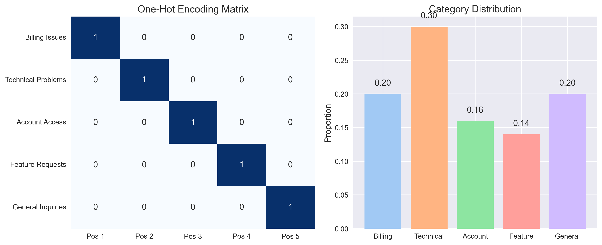
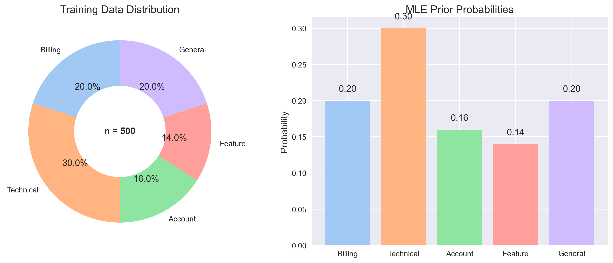
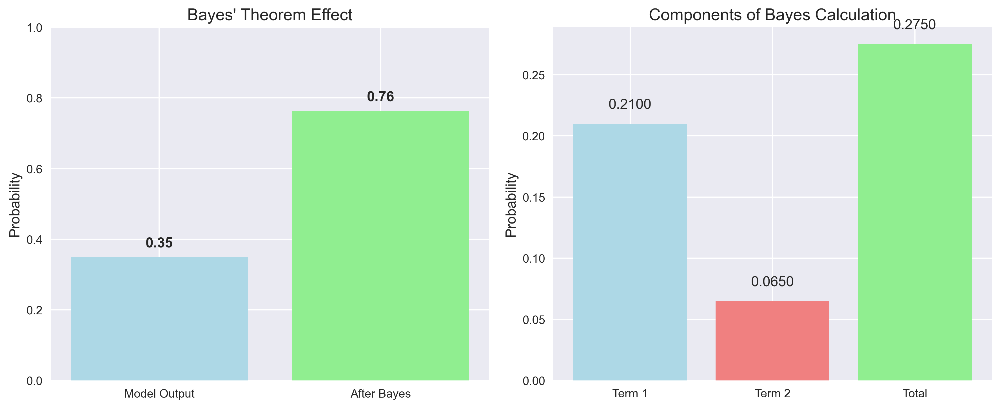
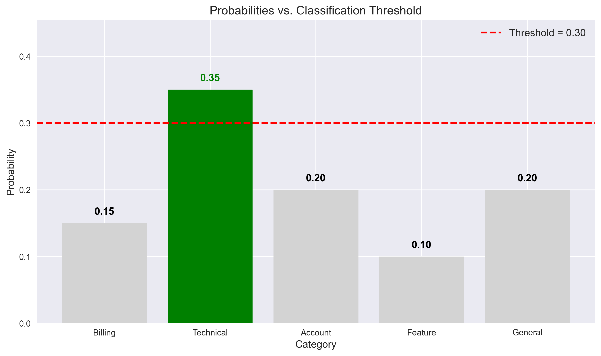
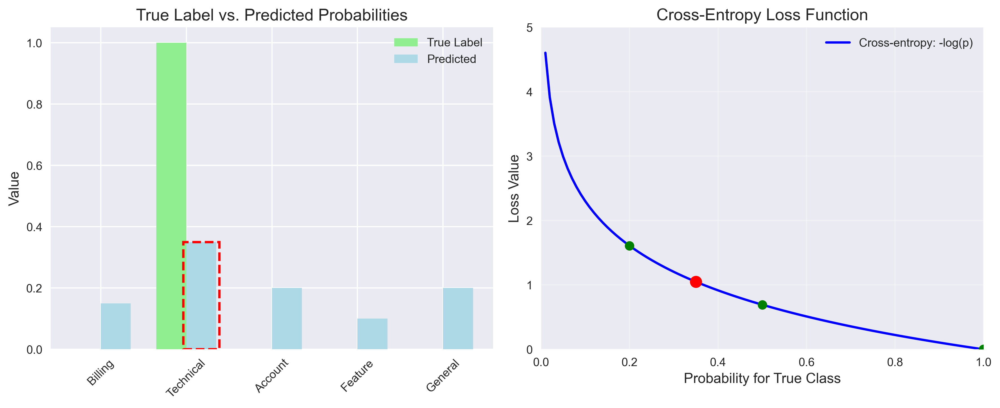

# Question 27: One-Hot Encoding and Multinomial Classification

## Problem Statement
A natural language processing engineer is building a text classification model for customer support tickets. The engineer has a dataset with 500 support tickets that have been manually labeled with one of five categories:

1. Billing Issues
2. Technical Problems
3. Account Access
4. Feature Requests
5. General Inquiries

To prepare the data for a logistic regression model, the engineer one-hot encodes the category labels. After training, the model predicts probabilities for each category. For a new unlabeled ticket, the model outputs the following probabilities:

- $P(\text{Billing Issues}) = 0.15$
- $P(\text{Technical Problems}) = 0.35$
- $P(\text{Account Access}) = 0.20$
- $P(\text{Feature Requests}) = 0.10$
- $P(\text{General Inquiries}) = 0.20$

The original training data had the following distribution of categories:

- Billing Issues: 100 tickets
- Technical Problems: 150 tickets
- Account Access: 80 tickets
- Feature Requests: 70 tickets
- General Inquiries: 100 tickets

### Task
1. Explain the relationship between one-hot encoding and the multinomial distribution in this context
2. Calculate the maximum likelihood estimates for the prior probabilities of each category based on the training data
3. Using Bayes' theorem and assuming the model outputs are accurate likelihood estimates, calculate the posterior probability that the ticket belongs to the "Technical Problems" category if we know that 60% of all support tickets are about technical issues (regardless of what the model predicts)
4. The engineer decides to use a classification threshold of 0.30, meaning a ticket is assigned to a category if its probability exceeds this threshold. Based on the model outputs for the new ticket:
   a. Which category would be assigned to the ticket?
   b. What are the potential issues with using a fixed threshold for multinomial classification?
5. Calculate the cross-entropy loss between the true one-hot encoded label $[0,1,0,0,0]$ (Technical Problems) and the model's predicted probabilities using:
   $$H(y, \hat{y}) = -\sum_{i=1}^{5} y_i \log(\hat{y}_i)$$

## Understanding the Problem
This problem explores the application of probability theory and information theory to machine learning classification tasks, specifically in a customer support ticket categorization context. Key concepts include:

- **One-hot encoding**: A technique for representing categorical variables as binary vectors
- **Multinomial distribution**: A probability distribution used to model the likelihood of observing counts across multiple categories
- **Maximum likelihood estimation**: A method to determine the most likely parameters of a distribution based on observed data
- **Bayes' theorem**: A fundamental rule for updating probability estimates based on new evidence
- **Classification threshold**: A decision boundary for making categorical predictions from probabilities
- **Cross-entropy loss**: A measure of the difference between predicted probability distributions and actual labels

These concepts are essential for understanding how machine learning models handle categorical data, make probability-based classifications, and are evaluated for performance.

## Solution

### Step 1: Relationship Between One-Hot Encoding and Multinomial Distribution

One-hot encoding represents categorical variables as binary vectors where only one element is "hot" (1) and all others are "cold" (0). For our five-category problem, the encodings are:

- Billing Issues: $[1, 0, 0, 0, 0]$
- Technical Problems: $[0, 1, 0, 0, 0]$
- Account Access: $[0, 0, 1, 0, 0]$
- Feature Requests: $[0, 0, 0, 1, 0]$
- General Inquiries: $[0, 0, 0, 0, 1]$

The multinomial distribution models the probability of observing specific counts across multiple categories. Its probability mass function is:

$$P(X_1=n_1, X_2=n_2, \ldots, X_k=n_k) = \frac{n!}{n_1! \times n_2! \times \ldots \times n_k!} \times p_1^{n_1} \times p_2^{n_2} \times \ldots \times p_k^{n_k}$$

Where:
- $n = n_1 + n_2 + \ldots + n_k$ is the total number of trials
- $p_1, p_2, \ldots, p_k$ are the probabilities for each category (with $\sum p_i = 1$)

The relationship between one-hot encoding and the multinomial distribution includes:

1. Each support ticket represents a single trial in the multinomial distribution
2. One-hot vectors indicate which category a ticket belongs to, with the position of the "1" corresponding to the specific category
3. For a single ticket with one-hot label $y = [y_1, y_2, \ldots, y_5]$ and model probabilities $p = [p_1, p_2, \ldots, p_5]$, the probability of observing $y$ is:
   $$P(y) = p_1^{y_1} \times p_2^{y_2} \times \ldots \times p_5^{y_5} = p_i \text{ (where } y_i = 1\text{)}$$
4. For multiple tickets, the joint probability follows the multinomial distribution
5. Multinomial logistic regression uses softmax activation to output probabilities that sum to 1, aligning with the requirements of the multinomial distribution
6. Cross-entropy loss is derived from the negative log-likelihood of the multinomial distribution

**Example calculation:**  
With one-hot encoding $[0,1,0,0,0]$ (Technical Problems) and model probabilities:
$$P(y) = 0.15^0 \times 0.35^1 \times 0.20^0 \times 0.10^0 \times 0.20^0 = 0.35$$

### Step 2: Maximum Likelihood Estimates for Prior Probabilities

The Maximum Likelihood Estimate (MLE) for the prior probabilities is the proportion of training examples in each category. We can derive this through a step-by-step approach:

1. **Setup**: Define the likelihood function for multinomial distribution:
   $$L(p_1, p_2, \ldots, p_5) = \frac{n!}{n_1! \times n_2! \times \ldots \times n_5!} \times p_1^{n_1} \times p_2^{n_2} \times \ldots \times p_5^{n_5}$$

2. **Log-Likelihood**: Take the natural logarithm (simpler to work with):
   $$\ln(L) = \ln\left(\frac{n!}{n_1! \times n_2! \times \ldots \times n_5!}\right) + n_1\ln(p_1) + n_2\ln(p_2) + \ldots + n_5\ln(p_5)$$
   
   The first term is constant with respect to $p_i$, so we focus on:
   $$\ln(L) \propto n_1\ln(p_1) + n_2\ln(p_2) + \ldots + n_5\ln(p_5)$$

3. **Constraint**: The probabilities must sum to 1:
   $$p_1 + p_2 + \ldots + p_5 = 1$$

4. **Lagrangian**: Maximize $\ln(L)$ subject to the constraint:
   $$\mathcal{L} = n_1\ln(p_1) + n_2\ln(p_2) + \ldots + n_5\ln(p_5) - \lambda(p_1 + p_2 + \ldots + p_5 - 1)$$

5. **Partial Derivatives**: Set all $\frac{\partial\mathcal{L}}{\partial p_i} = 0$:
   $$\frac{\partial\mathcal{L}}{\partial p_i} = \frac{n_i}{p_i} - \lambda = 0$$
   $$\frac{n_i}{p_i} = \lambda \text{ for all } i$$
   $$p_i = \frac{n_i}{\lambda} \text{ for all } i$$

6. **Apply Constraint**:
   $$\sum_{i=1}^{5} p_i = 1$$
   $$\sum_{i=1}^{5} \frac{n_i}{\lambda} = 1$$
   $$\frac{1}{\lambda}\sum_{i=1}^{5} n_i = 1$$
   $$\frac{n}{\lambda} = 1$$
   $$\lambda = n$$

7. **Final MLE Formula**: Substituting back:
   $$p_i = \frac{n_i}{\lambda} = \frac{n_i}{n}$$

Calculating the MLEs for each category:

| Category | Count ($n_i$) | Total ($n$) | MLE ($\hat{p}_i = \frac{n_i}{n}$) |
|----------|---------------|-------------|----------------------------------|
| Billing Issues | 100 | 500 | 0.2000 (20.0%) |
| Technical Problems | 150 | 500 | 0.3000 (30.0%) |
| Account Access | 80 | 500 | 0.1600 (16.0%) |
| Feature Requests | 70 | 500 | 0.1400 (14.0%) |
| General Inquiries | 100 | 500 | 0.2000 (20.0%) |

Verification: $0.2000 + 0.3000 + 0.1600 + 0.1400 + 0.2000 = 1.0000$

### Step 3: Posterior Probability Using Bayes' Theorem

We need to calculate the posterior probability that the ticket belongs to the "Technical Problems" category given that:
- The model predicts $P(\text{Technical Problems}) = 0.35$
- We know that 60% of all support tickets are about technical issues

Using Bayes' theorem:
$$P(\text{Technical}|\text{Model}) = \frac{P(\text{Model}|\text{Technical}) \times P(\text{Technical})}{P(\text{Model})}$$

#### Step-by-step calculation:

1. **Identify the values we know:**
   - Model probability for Technical Problems: 0.35 (this is $P(\text{Model}|\text{Technical})$)
   - Prior probability $P(\text{Technical})$: 0.60
   - Prior probability $P(\text{Non-Technical})$: 0.40 = 1 - 0.60

2. **Calculate the model's behavior for non-technical tickets:**
   - Non-technical probabilities from model output: [0.15, 0.20, 0.10, 0.20]
   - Sum of non-technical probabilities: 0.15 + 0.20 + 0.10 + 0.20 = 0.65
   - Average (estimate for $P(\text{Model}|\text{Non-Technical})$): 0.65 / 4 = 0.1625

3. **Calculate $P(\text{Model})$ using the law of total probability:**
   $$P(\text{Model}) = P(\text{Model}|\text{Technical}) \times P(\text{Technical}) + P(\text{Model}|\text{Non-Technical}) \times P(\text{Non-Technical})$$
   $$P(\text{Model}) = 0.35 \times 0.60 + 0.1625 \times 0.40 = 0.2100 + 0.0650 = 0.2750$$

4. **Apply Bayes' theorem:**
   $$P(\text{Technical}|\text{Model}) = \frac{P(\text{Model}|\text{Technical}) \times P(\text{Technical})}{P(\text{Model})}$$
   $$P(\text{Technical}|\text{Model}) = \frac{0.35 \times 0.60}{0.2750} = \frac{0.2100}{0.2750} = 0.7636 \text{ or } 76.36\%$$

### Step 4: Classification with Threshold

Using a classification threshold of 0.30, a ticket is assigned to a category if its probability exceeds this threshold.

#### 4a. Category Assignment

Let's compare each category's probability to the threshold:

| Category | Probability | Comparison | Decision |
|----------|-------------|------------|----------|
| Billing Issues | 0.15 | 0.15 ≤ 0.30 | Don't assign |
| Technical Problems | 0.35 | 0.35 > 0.30 | Assign |
| Account Access | 0.20 | 0.20 ≤ 0.30 | Don't assign |
| Feature Requests | 0.10 | 0.10 ≤ 0.30 | Don't assign |
| General Inquiries | 0.20 | 0.20 ≤ 0.30 | Don't assign |

Since only the "Technical Problems" category exceeds the threshold, the ticket would be classified as "Technical Problems".

#### 4b. Potential Issues with Fixed Threshold

Using a fixed threshold for multinomial classification has several potential issues:

1. **Information Loss:** Thresholding discards valuable probability information, treating a prediction of 0.31 the same as a prediction of 0.99
2. **Ambiguity with Multiple Categories:** If multiple categories exceed the threshold, additional decision rules would be needed
3. **Ambiguity with No Categories:** If no category exceeds the threshold, the classification decision is undefined
4. **Suboptimal Thresholds:** Different categories may require different optimal thresholds based on their base rates
5. **Class Imbalance Insensitivity:** Fixed thresholds don't account for class imbalance in the data
6. **Varying Misclassification Costs:** Different types of errors may have different costs, which fixed thresholds don't consider

#### Alternative Approaches
Better alternatives to fixed thresholds include:
- Always selecting the highest probability category (argmax)
- Using category-specific thresholds
- Incorporating prior probabilities through Bayes' theorem
- Using a reject option for low-confidence predictions
- Applying calibration techniques to improve probability estimates

### Step 5: Cross-Entropy Loss

The cross-entropy loss between the true one-hot encoded label $[0,1,0,0,0]$ (Technical Problems) and the model's predicted probabilities is calculated using:

$$H(y, \hat{y}) = -\sum_{i=1}^{5} y_i \log(\hat{y}_i)$$

#### Step-by-step calculation:

1. **Review the input values:**
   - True label ($y$): $[0, 1, 0, 0, 0]$ (one-hot encoding for Technical Problems)
   - Predicted probabilities ($\hat{y}$): $[0.15, 0.35, 0.20, 0.10, 0.20]$

2. **Calculate each term in the summation:**
   - Since $y_i = 0$ for all indices except $i=2$ (Technical Problems), all terms except the second will be zero:
     - Billing Issues ($i=1$): $-0 \times \log(0.15) = 0$
     - Technical Problems ($i=2$): $-1 \times \log(0.35) = -1 \times (-1.049822) = 1.049822$
     - Account Access ($i=3$): $-0 \times \log(0.20) = 0$
     - Feature Requests ($i=4$): $-0 \times \log(0.10) = 0$
     - General Inquiries ($i=5$): $-0 \times \log(0.20) = 0$

3. **Sum all terms to get the final cross-entropy loss:**
   $$H(y, \hat{y}) = 0 + 1.049822 + 0 + 0 + 0 = 1.049822$$

4. **Example Loss Values for Different Probabilities:**
   | Probability for Correct Class | Cross-Entropy Loss | Notes |
   |-------------------------------|---------------------|-------|
   | 0.10 | 2.3026 | |
   | 0.20 | 1.6094 | Random guessing |
   | 0.35 | 1.0498 | (our model) |
   | 0.50 | 0.6931 | |
   | 0.80 | 0.2231 | |
   | 0.90 | 0.1054 | |
   | 1.00 | 0.0000 | Perfect |

## Key Insights

### Theoretical Foundations
- One-hot encoding creates a direct mathematical mapping between categorical variables and the multinomial distribution parameters
- Maximum Likelihood Estimation provides a principled approach for estimating prior probabilities from observed frequencies
- Bayes' theorem allows us to incorporate prior knowledge into our predictions, potentially dramatically improving classification decisions
- Cross-entropy loss quantifies the difference between predicted probabilities and true labels, providing a natural training objective derived from the negative log-likelihood of the multinomial distribution

### Practical Applications
- Incorporating known prior probabilities can dramatically alter classification decisions. In our example, the posterior probability increased from 35% to 76.36% when we incorporated prior knowledge
- Threshold-based classification simplifies decision-making but loses valuable probability information and can lead to ambiguities
- Cross-entropy loss encourages models to assign high probabilities to correct classes, improving classification performance
- Alternative classification approaches like argmax selection or category-specific thresholds can mitigate issues with fixed thresholds

### Common Pitfalls
- Ignoring prior probabilities can lead to suboptimal classifications, especially when training data distribution differs from real-world distribution
- Fixed thresholds may not be appropriate for all categories, especially in imbalanced classification problems
- Focusing solely on accuracy metrics without considering probability calibration can hide important information about model uncertainty
- Failing to understand the connection between the loss function and the probabilistic interpretation can lead to misinterpretations of model outputs

## Conclusion

This problem demonstrated several key concepts in classification modeling:

- One-hot encoding provides an effective representation for categorical data that aligns with the multinomial distribution, with a direct mathematical relationship through the probability mass function
- Maximum Likelihood Estimation provides a principled way to estimate prior probabilities from training data
- Bayes' theorem allows us to update probabilities based on prior knowledge, potentially leading to dramatic improvements in classification accuracy
- While threshold-based classification is practical, it has several limitations that should be considered in real-world applications
- Cross-entropy loss provides a principled way to evaluate and optimize classification models that output probability distributions

These concepts form the foundation of many machine learning classification techniques, particularly in natural language processing applications where categorical outcomes are common.