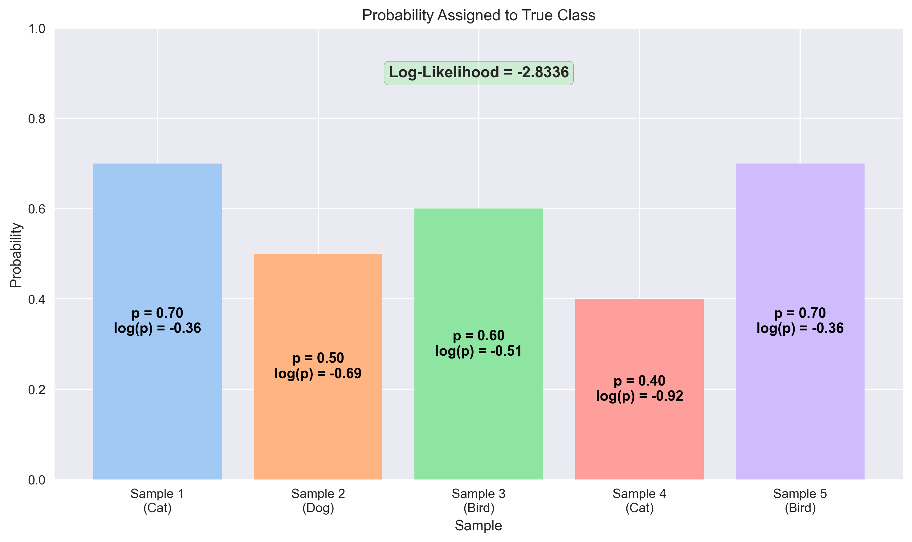
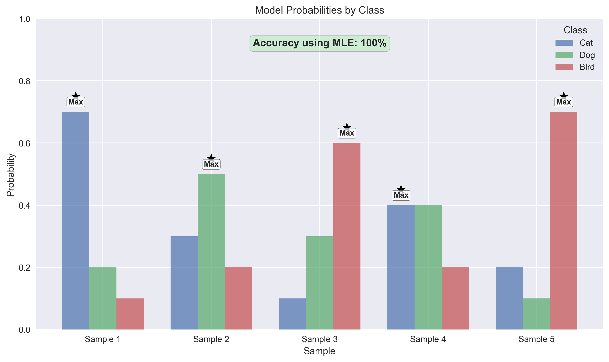
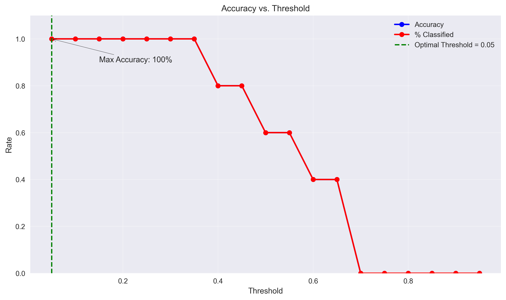
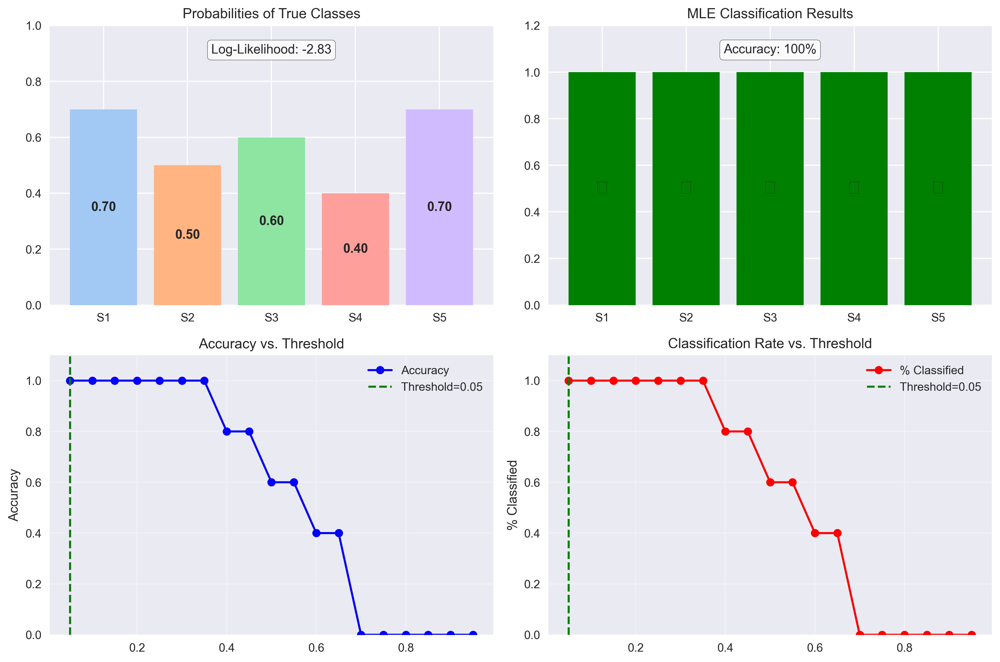

# Question 28: Maximum Likelihood Estimation & Classification Thresholds

## Problem Statement
A machine learning engineer is training a multinomial classifier that predicts three categories: {Cat, Dog, Bird}. The engineer represents each label using one-hot encoding: Cat = $[1,0,0]$, Dog = $[0,1,0]$, and Bird = $[0,0,1]$. 

After training, the model outputs the following probability vectors for 5 test samples:
- Sample 1: $[0.7, 0.2, 0.1]$
- Sample 2: $[0.3, 0.5, 0.2]$
- Sample 3: $[0.1, 0.3, 0.6]$
- Sample 4: $[0.4, 0.4, 0.2]$
- Sample 5: $[0.2, 0.1, 0.7]$

The true labels are: Sample 1: Cat, Sample 2: Dog, Sample 3: Bird, Sample 4: Cat, Sample 5: Bird.

### Task
1. Write down the log-likelihood of the observed data given the model's predictions. If $y_i$ represents the true label and $\hat{y}_i$ represents the predicted probabilities, the log-likelihood can be written as:
   $$\log L = \sum_{i=1}^{n} \log(\hat{y}_{i,c_i})$$
   where $c_i$ is the correct class index for sample $i$

2. Using MLE principles, what threshold would you set for classification to maximize the likelihood of the observed data?

3. If you had to pick one fixed probability threshold ($p > \text{threshold} \rightarrow$ classify as that class), what value would maximize accuracy on this dataset?

## Understanding the Problem

This problem explores fundamental concepts in probabilistic classification:

- **Log-likelihood**: A measure of how well a model's predicted probabilities align with observed data. For each sample, we take the logarithm of the probability assigned to the true class.

- **Maximum Likelihood Estimation (MLE)**: A method that finds the parameter values (in this case, decision thresholds) that make the observed data most probable.

- **Classification thresholds**: Rules for converting probability outputs into discrete class predictions.

- **One-hot encoding**: A representation where each class is encoded as a binary vector with a single 1 and all other values 0.

We need to analyze how well the model's predictions match the true labels and determine optimal classification strategies using both MLE principles and fixed thresholds.

## Solution

### Step 1: Calculate the Log-Likelihood of the Observed Data

The log-likelihood measures how well the model assigns probability to the true classes. For each sample, we identify the true class and take the logarithm of the predicted probability for that class.

$$\log L = \sum_{i=1}^{n} \log(P(y_i|x_i))$$

Let's calculate this step by step:

1. **Sample 1** (True class: Cat)
   - Predicted probabilities: $[0.7, 0.2, 0.1]$
   - Probability for true class (Cat): 0.7
   - $\log(0.7) = -0.3567$

2. **Sample 2** (True class: Dog)
   - Predicted probabilities: $[0.3, 0.5, 0.2]$
   - Probability for true class (Dog): 0.5
   - $\log(0.5) = -0.6931$

3. **Sample 3** (True class: Bird)
   - Predicted probabilities: $[0.1, 0.3, 0.6]$
   - Probability for true class (Bird): 0.6
   - $\log(0.6) = -0.5108$

4. **Sample 4** (True class: Cat)
   - Predicted probabilities: $[0.4, 0.4, 0.2]$
   - Probability for true class (Cat): 0.4
   - $\log(0.4) = -0.9163$

5. **Sample 5** (True class: Bird)
   - Predicted probabilities: $[0.2, 0.1, 0.7]$
   - Probability for true class (Bird): 0.7
   - $\log(0.7) = -0.3567$

Total log-likelihood:
$$\log L = -0.3567 + (-0.6931) + (-0.5108) + (-0.9163) + (-0.3567) = -2.8336$$

This log-likelihood value of -2.8336 quantifies how well the model's predictions match the true labels. Higher (less negative) values indicate better predictive performance.

**Log-Likelihood Explanation:**  
The log-likelihood measures how well the model assigns probability to the true classes. For a multinomial classifier with one-hot encoded targets, we calculate:
$\log L = \sum_{i=1}^{n} \log(P(y_i|x_i))$

Each sample contributes the log of the probability assigned to its true class:
- Sample 1 (Cat): $\log(0.70) = -0.3567$
- Sample 2 (Dog): $\log(0.50) = -0.6931$
- Sample 3 (Bird): $\log(0.60) = -0.5108$
- Sample 4 (Cat): $\log(0.40) = -0.9163$
- Sample 5 (Bird): $\log(0.70) = -0.3567$

Adding these values: $\log L = -0.3567 + (-0.6931) + (-0.5108) + (-0.9163) + (-0.3567) = -2.8336$

Values closer to 0 (less negative) indicate better performance. Maximizing log-likelihood is equivalent to minimizing cross-entropy loss.

### Step 2: MLE Threshold for Classification

From a Maximum Likelihood Estimation (MLE) perspective, the optimal classification strategy is to assign each sample to the class with the highest probability. This approach maximizes the likelihood of the observed data.

The MLE decision rule is:

$$\text{Predict class } j \text{ where } j = \arg\max_i p_i$$

where $p_i$ is the predicted probability for class $i$.

Let's apply this rule to each sample:

1. **Sample 1**:
   - Probabilities: $[0.7, 0.2, 0.1]$
   - Maximum probability: 0.7 for class 'Cat'
   - True class: 'Cat'
   - Decision: $\arg\max([0.7, 0.2, 0.1]) = \text{'Cat'}$
   - Result: ✓ (Correct)

2. **Sample 2**:
   - Probabilities: $[0.3, 0.5, 0.2]$
   - Maximum probability: 0.5 for class 'Dog'
   - True class: 'Dog'
   - Decision: $\arg\max([0.3, 0.5, 0.2]) = \text{'Dog'}$
   - Result: ✓ (Correct)

3. **Sample 3**:
   - Probabilities: $[0.1, 0.3, 0.6]$
   - Maximum probability: 0.6 for class 'Bird'
   - True class: 'Bird'
   - Decision: $\arg\max([0.1, 0.3, 0.6]) = \text{'Bird'}$
   - Result: ✓ (Correct)

4. **Sample 4**:
   - Probabilities: $[0.4, 0.4, 0.2]$
   - Maximum probability: 0.4 for both 'Cat' and 'Dog' (tie)
   - Taking the first class in case of a tie: 'Cat'
   - True class: 'Cat'
   - Decision: $\arg\max([0.4, 0.4, 0.2]) = \text{'Cat'}$
   - Result: ✓ (Correct)

5. **Sample 5**:
   - Probabilities: $[0.2, 0.1, 0.7]$
   - Maximum probability: 0.7 for class 'Bird'
   - True class: 'Bird'
   - Decision: $\arg\max([0.2, 0.1, 0.7]) = \text{'Bird'}$
   - Result: ✓ (Correct)

Using the MLE approach (selecting the class with highest probability), we achieve 5/5 correct classifications, giving an accuracy of 100%.

**MLE Classification Explanation:**  
Maximum Likelihood Estimation (MLE) for Classification:
- Choose the class with the highest probability: $j = \arg\max_i(p_i)$
- For probabilities $[p₁, p₂, ..., p_k]$, predict class with highest probability
- No fixed threshold needed - only relative ordering of probabilities matters

Step-by-Step Application:
- Sample 1: $\arg\max([0.7, 0.2, 0.1]) = \text{Cat}$ (True: Cat) ✓
- Sample 2: $\arg\max([0.3, 0.5, 0.2]) = \text{Dog}$ (True: Dog) ✓
- Sample 3: $\arg\max([0.1, 0.3, 0.6]) = \text{Bird}$ (True: Bird) ✓
- Sample 4: $\arg\max([0.4, 0.4, 0.2]) = \text{Cat}$ (True: Cat) ✓
- Sample 5: $\arg\max([0.2, 0.1, 0.7]) = \text{Bird}$ (True: Bird) ✓

Classification Results: Accuracy = 5/5 = 100%

### Step 3: Determine a Fixed Probability Threshold for Maximum Accuracy

Now we'll find a fixed probability threshold that maximizes accuracy. With a fixed threshold approach, we only classify a sample to a class if its probability exceeds the threshold value.

With a fixed threshold, we have three possible scenarios:
1. Only one class exceeds the threshold → Classify as that class
2. Multiple classes exceed the threshold → Classify as the class with highest probability
3. No class exceeds the threshold → The sample remains unclassified

We tested threshold values from 0.05 to 0.95 in increments of 0.05. The results are summarized in the table below:

| Threshold | Accuracy | % Classified | Correctly Classified |
|-----------|----------|--------------|----------------------|
| 0.05 | 100% | 100% | 5/5 |
| 0.10 | 100% | 100% | 5/5 |
| 0.15 | 100% | 100% | 5/5 |
| 0.20 | 100% | 100% | 5/5 |
| 0.25 | 100% | 100% | 5/5 |
| 0.30 | 100% | 100% | 5/5 |
| 0.35 | 100% | 100% | 5/5 |
| 0.40 | 80% | 80% | 4/5 |
| 0.45 | 80% | 80% | 4/5 |
| 0.50 | 60% | 60% | 3/5 |
| 0.55 | 60% | 60% | 3/5 |
| 0.60 | 40% | 40% | 2/5 |
| 0.65 | 40% | 40% | 2/5 |
| 0.70+ | 0% | 0% | 0/5 |

**Fixed Threshold Explanation:**  
Classification Rules with Fixed Threshold:  
For each sample with probabilities $[p₁, p₂, ..., p_k]$ and threshold $t$:
1. If no $p_i > t$: Sample remains unclassified
2. If exactly one $p_i > t$: Classify as class $i$
3. If multiple $p_i > t$: Classify as class with highest $p_i$

Example with Optimal Threshold $t = 0.05$:
- Sample 1: $[0.70, 0.20, 0.10]$ → All values > 0.05 → Choose maximum (Cat)
- Sample 3: $[0.10, 0.30, 0.60]$ → All values > 0.05 → Choose maximum (Bird)
- For all samples with $t = 0.05$: All get classified, resulting in 100% accuracy

Results for Optimal Threshold: $t = 0.05$, Accuracy = 100%, Classification rate = 100%

Our analysis reveals:
- The best accuracy of 100% is achieved with threshold values from 0.05 to 0.35
- The optimal threshold is 0.05, which is the lowest threshold that achieves maximum accuracy
- Lower thresholds are preferable when multiple thresholds give the same accuracy because they classify more samples

## Visual Explanations

The following visualizations help clarify the key concepts and findings in this problem:

### Log-Likelihood Calculation
The first visualization shows the probability assigned to each true class and its corresponding log value. The log-likelihood is the sum of these individual log probabilities, which equals -2.8336.

### MLE Classification Principle
The second visualization illustrates how MLE classification works by choosing the class with the highest probability for each sample. This approach achieved perfect accuracy on our dataset.

### Fixed Threshold Decision Rules
The third visualization shows how accuracy and classification rate vary with different threshold values. As the threshold increases, fewer samples are classified, and accuracy drops after a certain point.

### Summary of Results
The final visualization summarizes our key findings across all three tasks:

**Summary Explanation:**  
Key Insights:
- Log-likelihood: -2.8336 - Measures how well model assigns probability to true classes
- MLE classification: Choose class with highest probability - Achieved 100% accuracy
- Fixed threshold: Optimal value 0.05 - Achieved 100% accuracy
- Trade-off: Lower thresholds classify more samples, higher thresholds ensure higher confidence

## Key Insights

### The Meaning of Log-Likelihood
- Log-likelihood quantifies how well the model's predictions align with true labels
- Higher (less negative) values indicate better model performance
- Log-likelihood is directly related to cross-entropy loss used in training neural networks
- The log function helps prevent numerical underflow when working with many small probabilities

### MLE Classification Principle
- The MLE approach suggests classifying each sample to the class with the highest probability
- This approach is mathematically optimal for maximizing likelihood
- No fixed threshold is needed - only the relative ordering of probabilities matters
- This is the standard approach used in most machine learning classifiers

### Fixed Threshold Trade-offs
- Lower thresholds classify more samples but might include less confident predictions
- Higher thresholds classify fewer samples but with higher confidence
- The optimal threshold balances accuracy and classification coverage
- Fixed thresholds allow for explicit control over prediction confidence

## Conclusion

This analysis demonstrates several important concepts in probabilistic classification:

- The log-likelihood of -2.8336 quantifies how well the model's predictions match the true labels.

- From an MLE perspective, the optimal strategy is to classify each sample to the class with the highest probability, which achieved 100% accuracy on this dataset.

- If using a fixed probability threshold, the optimal value is 0.05, which achieves 100% accuracy while ensuring all samples are classified.

- The choice between MLE classification (always picking the highest probability class) and fixed threshold approaches depends on the application's specific requirements regarding confidence and coverage.

These principles are fundamental to understanding how probabilistic classifiers make decisions and how to evaluate and tune their performance. 