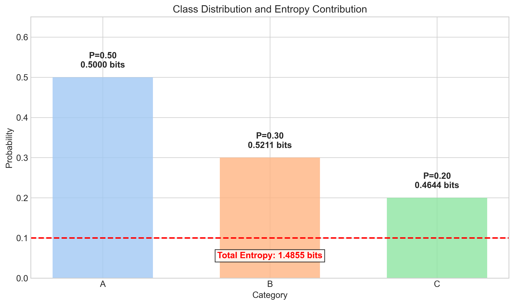
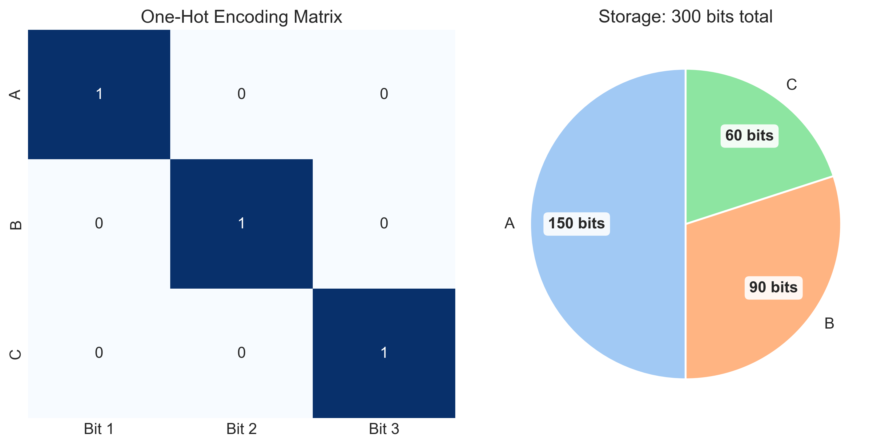
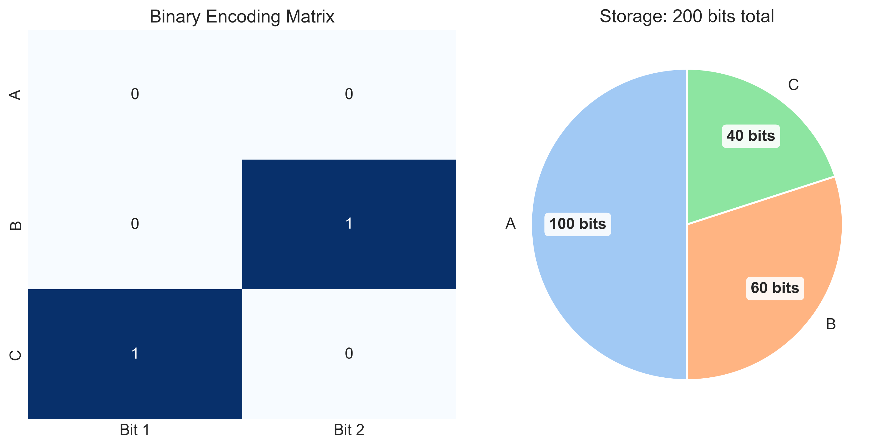
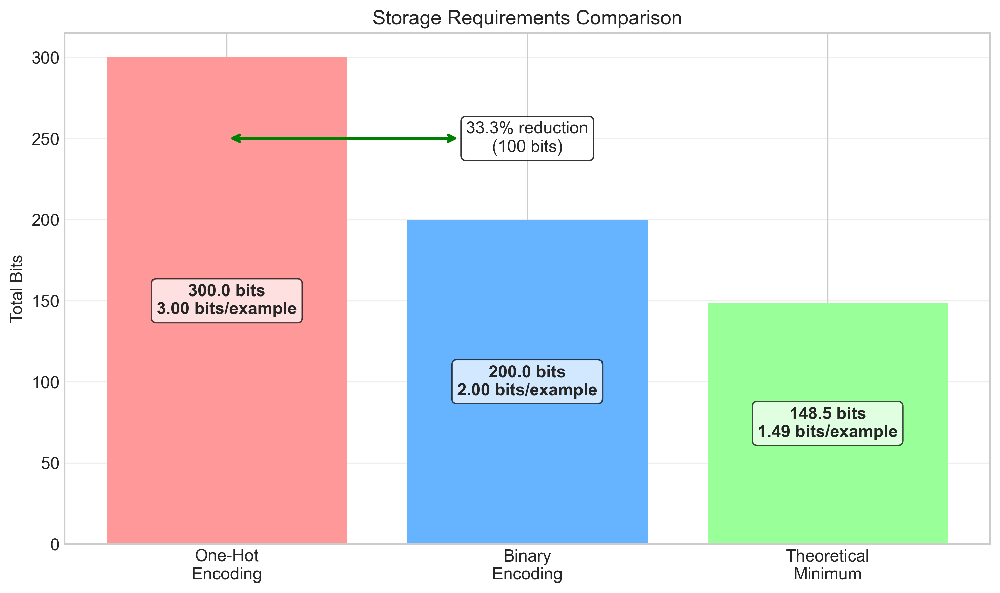
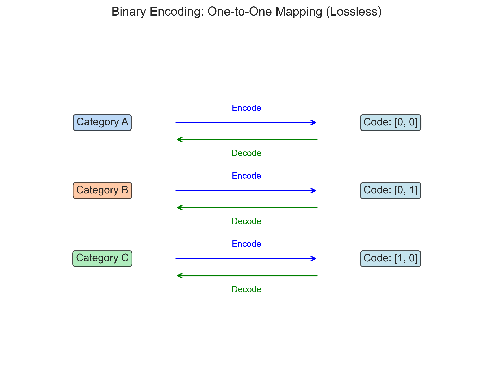

# Question 29: Encoding Schemes and Information Theory

## Problem Statement
Consider a dataset of 100 examples with three possible categories: A, B, and C. Two encoding schemes are proposed:

**Scheme 1 (One-hot):** 
- A = $[1,0,0]$
- B = $[0,1,0]$
- C = $[0,0,1]$

**Scheme 2 (Binary):**
- A = $[0,0]$
- B = $[0,1]$
- C = $[1,0]$

The dataset contains: 50 instances of A, 30 instances of B, and 20 instances of C.

### Task
1. Calculate the entropy of the class distribution in bits using:
   $$H(X) = -\sum_{i} P(x_i) \log_2 P(x_i)$$

2. How many bits are required to store the entire dataset using Scheme 1?

3. How many bits are required to store the entire dataset using Scheme 2?

4. Which encoding is more efficient, and by how much? Calculate the percentage reduction in bits:
   $$\text{Reduction} = \frac{\text{Bits}_{\text{Scheme 1}} - \text{Bits}_{\text{Scheme 2}}}{\text{Bits}_{\text{Scheme 1}}} \times 100\%$$

5. Is the binary encoding scheme lossless? Explain why or why not.

## Understanding the Problem
This problem examines fundamental concepts in information theory and data encoding strategies. We need to:

1. Calculate the theoretical minimum information content (entropy) of our dataset
2. Determine the storage requirements for two different encoding schemes
3. Compare their efficiency against each other and against the theoretical minimum
4. Analyze whether the more compact encoding scheme maintains all information

Information theory, pioneered by Claude Shannon, provides a mathematical framework for measuring information content. Entropy represents the minimum average number of bits needed to encode a message, considering the probability distribution of the elements. Various encoding schemes attempt to approach this theoretical minimum while maintaining the ability to correctly represent and recover the original data.

## Solution

### Step 1: Calculate the Entropy of the Class Distribution

Let's approach this step-by-step, showing all our work in detail:

**Step 1.1: Identify the probability distribution**

We first need to calculate the probability of each category based on the frequency counts:

| Category | Count | Probability Calculation | Probability Value |
|----------|-------|-------------------------|-------------------|
| A | 50 | $P(A) = \frac{50}{100}$ | $P(A) = 0.5$ |
| B | 30 | $P(B) = \frac{30}{100}$ | $P(B) = 0.3$ |
| C | 20 | $P(C) = \frac{20}{100}$ | $P(C) = 0.2$ |

**Step 1.2: Verify that probabilities sum to 1**

$$P(A) + P(B) + P(C) = 0.5 + 0.3 + 0.2 = 1.0$$

This confirms our probability distribution is valid.

**Step 1.3: Calculate the logarithm (base 2) of each probability**

For category A:
$$\log_2(P(A)) = \log_2(0.5)$$

Using the logarithm identity: $\log_2(0.5) = \log_2(1/2) = -\log_2(2) = -1$

Therefore:
$$\log_2(P(A)) = -1$$

For category B:
$$\log_2(P(B)) = \log_2(0.3)$$
$$\log_2(0.3) \approx -1.737$$

For category C:
$$\log_2(P(C)) = \log_2(0.2)$$
$$\log_2(0.2) = \log_2(1/5) = -\log_2(5) \approx -2.322$$

**Step 1.4: Calculate each entropy term**

The entropy formula requires computing $-P(x_i) \times \log_2(P(x_i))$ for each category:

For category A:
$$-P(A) \times \log_2(P(A)) = -(0.5) \times (-1) = 0.5 \text{ bits}$$

For category B:
$$-P(B) \times \log_2(P(B)) = -(0.3) \times (-1.737) \approx 0.521 \text{ bits}$$

For category C:
$$-P(C) \times \log_2(P(C)) = -(0.2) \times (-2.322) \approx 0.464 \text{ bits}$$

**Step 1.5: Sum all entropy terms to get the total entropy**

$$H(X) = \sum_{i} -P(x_i) \times \log_2(P(x_i))$$
$$H(X) = 0.5 + 0.521 + 0.464 = 1.485 \text{ bits}$$

Therefore, the entropy of the class distribution is approximately 1.485 bits per example.

**Step 1.6: Determine the minimum number of bits needed for fixed-length encoding**

For fixed-length encoding of 3 distinct categories, we need enough bits to represent all possible values:

$$\text{Number of bits needed} = \lceil \log_2(\text{number of categories}) \rceil$$
$$\text{Number of bits needed} = \lceil \log_2(3) \rceil$$
$$\text{Number of bits needed} = \lceil 1.585 \rceil = 2 \text{ bits}$$

Since we need a whole number of bits, the minimum for fixed-length encoding is 2 bits per example.

Therefore, the theoretical minimum (entropy) is 1.485 bits per example, but any practical fixed-length encoding requires at least 2 bits per example.

The visualization shows the class distribution with probability on the y-axis and the individual entropy contribution of each category. Each bar is labeled with its probability and entropy contribution in bits. The total entropy (1.4855 bits) is clearly indicated by a red dashed line at the bottom of the chart with a white background for better visibility.

### Step 2: Calculate Bits Required for Scheme 1 (One-hot Encoding)

Let's analyze one-hot encoding in detail:

**Step 2.1: Understand the one-hot encoding representation**

One-hot encoding represents each category with a binary vector where exactly one position contains 1 and all other positions contain 0:

| Category | One-hot Encoding | Vector Representation |
|----------|------------------|------------------------|
| A | $[1, 0, 0]$ | Position 1 is "hot" (set to 1) |
| B | $[0, 1, 0]$ | Position 2 is "hot" (set to 1) |
| C | $[0, 0, 1]$ | Position 3 is "hot" (set to 1) |

**Step 2.2: Calculate bits per example**

For one-hot encoding with $k$ categories:
$$\text{Bits per example} = k$$

In our case, with 3 categories:
$$\text{Bits per example} = 3$$

**Step 2.3: Calculate total bits for the entire dataset**

With $n$ examples and $k$ categories:
$$\text{Total bits} = n \times k$$

Substituting our values ($n = 100$, $k = 3$):
$$\text{Total bits} = 100 \times 3 = 300 \text{ bits}$$

**Step 2.4: Calculate storage for each category**

Category A (50 examples):
$$\text{Bits for category A} = \text{Count}_A \times \text{Bits per example}$$
$$\text{Bits for category A} = 50 \times 3 = 150 \text{ bits}$$

Category B (30 examples):
$$\text{Bits for category B} = \text{Count}_B \times \text{Bits per example}$$
$$\text{Bits for category B} = 30 \times 3 = 90 \text{ bits}$$

Category C (20 examples):
$$\text{Bits for category C} = \text{Count}_C \times \text{Bits per example}$$
$$\text{Bits for category C} = 20 \times 3 = 60 \text{ bits}$$

Verification:
$$\text{Total bits} = 150 + 90 + 60 = 300 \text{ bits}$$

**Step 2.5: Calculate storage efficiency compared to entropy**

Storage overhead per example:
$$\text{Overhead per example} = \text{Bits per example} - \text{Entropy}$$
$$\text{Overhead per example} = 3 - 1.485 = 1.515 \text{ bits}$$

Relative overhead (percentage above theoretical minimum):
$$\text{Relative overhead} = \frac{\text{Overhead per example}}{\text{Entropy}} \times 100\%$$
$$\text{Relative overhead} = \frac{1.515}{1.485} \times 100\% \approx 102.0\%$$

This means one-hot encoding uses approximately 102% more bits than theoretically necessary.

### Step 3: Calculate Bits Required for Scheme 2 (Binary Encoding)

Now, let's analyze binary encoding in detail:

**Step 3.1: Understand the binary encoding representation**

Binary encoding uses a more compact representation with fewer bits:

| Category | Binary Encoding | Decimal Equivalent |
|----------|-----------------|-------------------|
| A | $[0, 0]$ | 0 |
| B | $[0, 1]$ | 1 |
| C | $[1, 0]$ | 2 |

**Step 3.2: Calculate minimum bits required**

For binary encoding with $k$ categories, the minimum number of bits required is:
$$\text{Bits per example} = \lceil \log_2(k) \rceil$$

With $k = 3$ categories:
$$\text{Bits per example} = \lceil \log_2(3) \rceil = \lceil 1.585 \rceil = 2 \text{ bits}$$

This is the minimum number of bits needed to represent 3 distinct values ($2^1 < 3 < 2^2$).

**Step 3.3: Calculate total bits for the entire dataset**

With $n$ examples:
$$\text{Total bits} = n \times \text{Bits per example}$$
$$\text{Total bits} = 100 \times 2 = 200 \text{ bits}$$

**Step 3.4: Calculate storage for each category**

Category A (50 examples):
$$\text{Bits for category A} = \text{Count}_A \times \text{Bits per example}$$
$$\text{Bits for category A} = 50 \times 2 = 100 \text{ bits}$$

Category B (30 examples):
$$\text{Bits for category B} = \text{Count}_B \times \text{Bits per example}$$
$$\text{Bits for category B} = 30 \times 2 = 60 \text{ bits}$$

Category C (20 examples):
$$\text{Bits for category C} = \text{Count}_C \times \text{Bits per example}$$
$$\text{Bits for category C} = 20 \times 2 = 40 \text{ bits}$$

Verification:
$$\text{Total bits} = 100 + 60 + 40 = 200 \text{ bits}$$

**Step 3.5: Calculate storage efficiency compared to entropy**

Storage overhead per example:
$$\text{Overhead per example} = \text{Bits per example} - \text{Entropy}$$
$$\text{Overhead per example} = 2 - 1.485 = 0.515 \text{ bits}$$

Relative overhead (percentage above theoretical minimum):
$$\text{Relative overhead} = \frac{\text{Overhead per example}}{\text{Entropy}} \times 100\%$$
$$\text{Relative overhead} = \frac{0.515}{1.485} \times 100\% \approx 34.7\%$$

Binary encoding is more efficient than one-hot encoding, but still uses about 34.7% more bits than the theoretical minimum (entropy).

### Step 4: Compare the Efficiency of Both Encoding Schemes

Let's perform a detailed comparison between the two encoding schemes:

**Step 4.1: Summarize storage requirements**

| Encoding Scheme | Bits per Example | Total Bits | Formula |
|-----------------|------------------|------------|---------|
| One-hot Encoding | 3 | 300 | $n \times k$ = $100 \times 3$ |
| Binary Encoding | 2 | 200 | $n \times \lceil\log_2(k)\rceil$ = $100 \times 2$ |
| Theoretical Minimum | 1.485 | 148.5 | $n \times H(X)$ = $100 \times 1.485$ |

**Step 4.2: Calculate absolute bit savings**

$$\text{Absolute bit savings} = \text{Bits}_{\text{One-hot}} - \text{Bits}_{\text{Binary}}$$
$$\text{Absolute bit savings} = 300 - 200 = 100 \text{ bits}$$

**Step 4.3: Calculate percentage reduction**

Using the formula:
$$\text{Percentage reduction} = \frac{\text{Bits}_{\text{One-hot}} - \text{Bits}_{\text{Binary}}}{\text{Bits}_{\text{One-hot}}} \times 100\%$$

Substituting our values:
$$\text{Percentage reduction} = \frac{300 - 200}{300} \times 100\% = \frac{100}{300} \times 100\% = 33.33\%$$

This means binary encoding reduces storage requirements by exactly one-third compared to one-hot encoding.

**Step 4.4: Calculate overhead relative to theoretical minimum (entropy)**

For one-hot encoding:
$$\text{One-hot overhead} = \text{Bits}_{\text{One-hot}} - \text{Bits}_{\text{Entropy}}$$
$$\text{One-hot overhead} = 300 - 148.5 = 151.5 \text{ bits}$$

$$\text{One-hot overhead percentage} = \frac{\text{One-hot overhead}}{\text{Bits}_{\text{Entropy}}} \times 100\%$$
$$\text{One-hot overhead percentage} = \frac{151.5}{148.5} \times 100\% \approx 102.0\%$$

For binary encoding:
$$\text{Binary overhead} = \text{Bits}_{\text{Binary}} - \text{Bits}_{\text{Entropy}}$$
$$\text{Binary overhead} = 200 - 148.5 = 51.5 \text{ bits}$$

$$\text{Binary overhead percentage} = \frac{\text{Binary overhead}}{\text{Bits}_{\text{Entropy}}} \times 100\%$$
$$\text{Binary overhead percentage} = \frac{51.5}{148.5} \times 100\% \approx 34.7\%$$

**Step 4.5: Analyze the key insights**

1. **Efficiency comparison**: Binary encoding uses 33.33% fewer bits than one-hot encoding.

2. **Theoretical efficiency**: 
   - One-hot encoding uses about 102% more bits than theoretically necessary
   - Binary encoding uses about 34.7% more bits than theoretically necessary

3. **Fixed-length constraint**: 
   - Both encodings use fixed-length codes
   - Binary encoding achieves the minimum possible bits for fixed-length encoding (2 bits)
   - To approach the entropy limit (1.485 bits), we would need variable-length encoding

### Step 5: Analyze Whether Binary Encoding is Lossless

A critical question is whether binary encoding preserves all information. Let's analyze this systematically:

**Step 5.1: Define lossless encoding**

A lossless encoding satisfies these criteria:
1. Every unique input value maps to a unique output code
2. There is a one-to-one correspondence between input values and output codes
3. The original input can be perfectly reconstructed from the encoded output
4. No information is lost during the encoding process

**Step 5.2: Analyze the encoding mapping**

Let's create a bidirectional mapping table to check if binary encoding is lossless:

| Category (Input) | Binary Code (Output) | Can Decode Uniquely? |
|------------------|----------------------|----------------------|
| A | $[0, 0]$ | Yes |
| B | $[0, 1]$ | Yes |
| C | $[1, 0]$ | Yes |

**Step 5.3: Check uniqueness and completeness**

Uniqueness: Each category has a distinct binary code:
- Category A: $[0, 0]$
- Category B: $[0, 1]$
- Category C: $[1, 0]$

These are all different from each other, so the encoding is unique.

Completeness: With 2 bits, we can represent $2^2 = 4$ different patterns:
- $[0, 0]$ (used for A)
- $[0, 1]$ (used for B)
- $[1, 0]$ (used for C)
- $[1, 1]$ (unused)

We have more encoding patterns (4) than categories (3), so the encoding is complete.

**Step 5.4: Verify decodability**

Testing the decoding process:
- If we see code $[0, 0]$, we can unambiguously decode it as category A
- If we see code $[0, 1]$, we can unambiguously decode it as category B
- If we see code $[1, 0]$, we can unambiguously decode it as category C

**Step 5.5: Conclude losslessness**

Based on our analysis:
1. Each category maps to a unique binary code ✓
2. The mapping is one-to-one ✓
3. Decoding is unambiguous ✓
4. No information is lost in the process ✓

Therefore, the binary encoding scheme is lossless.

Note that this binary encoding actually has one unused pattern ($[1, 1]$), which means it has spare capacity and could encode one more category if needed.

The visualization demonstrates the one-to-one mapping between categories and their binary codes. The bidirectional arrows with "Encode" and "Decode" labels indicate that we can both encode (category to code) and decode (code to category) without any loss of information.

## Visual Explanations

The figures above provide visual representations of each step in our analysis:

1. **Entropy Calculation** - Shows the class distribution and individual entropy contributions from each category, with the total entropy (1.4855 bits) clearly displayed with a red dashed line and labeled text at the bottom of the chart.

2. **One-Hot Encoding** - Illustrates the one-hot encoding matrix and the storage breakdown by category, with clearly visible bit values for each category (150, 90, and 60 bits), without percentage overlaps.

3. **Binary Encoding** - Displays the binary encoding matrix and storage distribution, with clearly visible bit values for each category (100, 60, and 40 bits), without percentage overlaps.

4. **Efficiency Comparison** - Compares all three approaches (one-hot, binary, and theoretical minimum) in terms of total bits required and bits per example, with the reduction clearly marked.

5. **Lossless Analysis** - Demonstrates the one-to-one mapping between categories and binary codes with clear encode/decode paths that ensures lossless encoding.

## Key Insights

### Information Theory Principles
- Entropy (1.4855 bits per example) represents the theoretical minimum number of bits needed based on the probability distribution
- The more skewed a distribution is, the lower its entropy (more predictable data requires fewer bits)
- Shannon's source coding theorem proves we cannot encode information using fewer bits than its entropy without losing information

### Encoding Efficiency Trade-offs
- One-hot encoding (3 bits/example) is intuitive and simple but inefficient
- Binary encoding (2 bits/example) is more efficient while remaining lossless
- The theoretical minimum (1.4855 bits/example) can only be approached with variable-length codes that assign shorter codes to more frequent categories
- For a fixed-length code with 3 categories, we need at least ceil(log₂(3)) = 2 bits

### Lossless vs. Lossy Encoding
- An encoding is lossless if each original value maps to a unique code
- Binary encoding is lossless because each category has a distinct representation
- One-hot encoding is also lossless but uses more bits than necessary
- Variable-length codes like Huffman coding can approach the entropy limit while remaining lossless

## Practical Applications

This problem demonstrates concepts with wide-ranging applications:

1. **Machine Learning Feature Encoding:**
   - Categorical features need to be converted to numerical formats for most algorithms
   - One-hot encoding is common but can lead to high-dimensional sparse vectors
   - Efficient encoding reduces model complexity and memory requirements

2. **Data Compression:**
   - Text compression algorithms like Huffman coding assign shorter codes to more frequent characters
   - Image formats like PNG use lossless compression based on information theory
   - Video codecs balance encoding efficiency with computational complexity

3. **Communication Systems:**
   - Network protocols optimize encoding to minimize bandwidth requirements
   - Error correction codes add redundancy while maintaining efficiency
   - Wireless standards use entropy coding to maximize channel capacity

## Conclusion

This problem demonstrates several fundamental principles in information theory and encoding:

1. The entropy of our dataset (1.4855 bits per example) represents the theoretical minimum bits needed to encode the information.

2. One-hot encoding (3 bits/example) is simple but inefficient, requiring 300 bits total for the dataset.

3. Binary encoding (2 bits/example) reduces storage by 33.33% compared to one-hot, requiring only 200 bits total.

4. Both are fixed-length codes, with binary encoding achieving the minimum possible for a fixed-length scheme while remaining lossless.

5. To approach the entropy limit, we would need variable-length codes that assign shorter codes to more frequent categories.

The trade-off between encoding efficiency, simplicity, and computational complexity is a fundamental consideration in information systems design, from data compression to machine learning feature engineering. 