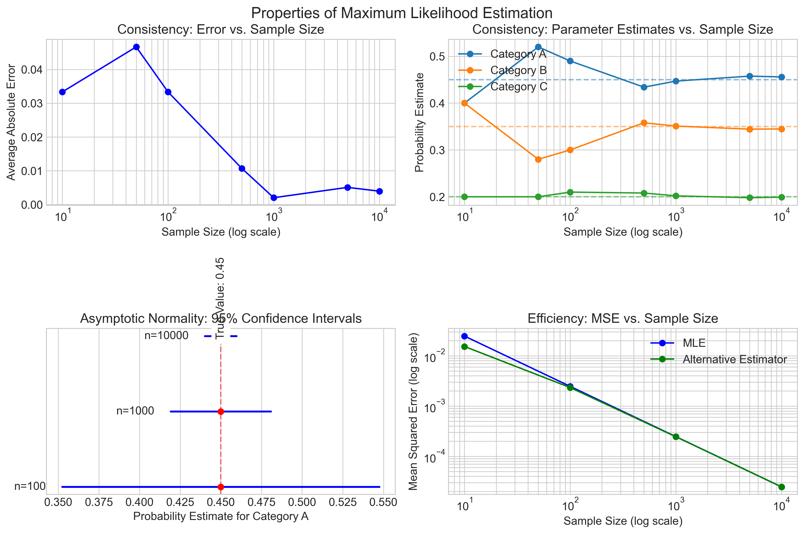

# Question 29: Maximum Likelihood Estimation for Categorical Data with Information Theory Analysis

## Problem Statement
Consider a dataset of 100 examples with three possible categories: A, B, and C. The dataset contains: 50 instances of A, 30 instances of B, and 20 instances of C.

Two encoding schemes are proposed for representing these categories:

**Scheme 1 (One-hot):** 
- A = $[1,0,0]$
- B = $[0,1,0]$
- C = $[0,0,1]$

**Scheme 2 (Binary):**
- A = $[0,0]$
- B = $[0,1]$
- C = $[1,0]$

### Task
1. Derive the maximum likelihood estimator (MLE) for the probability distribution of the three categories based on the given data. Show your work.

2. Calculate the entropy of the MLE distribution in bits using:
   $$H(X) = -\sum_{i} P(x_i) \log_2 P(x_i)$$

3. If we were to sample a new set of 100 examples from this MLE distribution, how many bits would be required to store the entire dataset using Scheme 1 vs. Scheme 2?

4. Which encoding is more efficient, and by how much? Calculate the percentage reduction in bits:
   $$\text{Reduction} = \frac{\text{Bits}_{\text{Scheme 1}} - \text{Bits}_{\text{Scheme 2}}}{\text{Bits}_{\text{Scheme 1}}} \times 100\%$$

5. Explain how MLE relates to the concept of cross-entropy minimization. How would you express the likelihood function for this categorical distribution in terms of cross-entropy?

6. Discuss how properties of MLE (consistency, asymptotic normality) relate to this example as we increase the sample size.

## Understanding the Problem
This problem examines the intersection of maximum likelihood estimation with information theory. We need to:

1. Apply MLE to estimate a categorical distribution
2. Analyze the information-theoretic properties of this estimated distribution
3. Compare encoding efficiency for the categorical data
4. Relate MLE to other information theory concepts
5. Consider the properties of MLE in the context of categorical data

Maximum likelihood estimation is a fundamental method for estimating parameters of a statistical model. For categorical data, MLE finds the probability distribution that makes the observed data most likely. Information theory provides tools to analyze the efficiency of coding and the uncertainty in our distribution.

## Solution

### Step 1: Derive the Maximum Likelihood Estimator for the Categorical Distribution

Let's approach this step-by-step, showing all our work in detail:

**Step 1.1: Define the probability distribution model**

We're modeling a categorical distribution with three categories (A, B, and C) with respective probabilities θₐ, θᵦ, and θc, where θₐ + θᵦ + θc = 1.

**Step 1.2: Set up the likelihood function**

The likelihood function for a categorical distribution is multinomial:

$$L(\theta_a, \theta_b, \theta_c | \text{data}) = \binom{n}{n_a, n_b, n_c} \theta_a^{n_a} \theta_b^{n_b} \theta_c^{n_c}$$

Where:
- n = 100 (total examples)
- n_a = 50 (count of category A)
- n_b = 30 (count of category B)
- n_c = 20 (count of category C)

Substituting our values:

$$L(\theta_a, \theta_b, \theta_c | \text{data}) = \binom{100}{50, 30, 20} \theta_a^{50} \theta_b^{30} \theta_c^{20}$$

**Step 1.3: Convert to log-likelihood for easier calculation**

$$\log L(\theta_a, \theta_b, \theta_c | \text{data}) = \log\binom{100}{50, 30, 20} + 50\log\theta_a + 30\log\theta_b + 20\log\theta_c$$

**Step 1.4: Maximize the log-likelihood using Lagrange multipliers**

We need to maximize the log-likelihood subject to the constraint that θₐ + θᵦ + θc = 1. Using Lagrange multipliers:

$$\mathcal{L}(\theta_a, \theta_b, \theta_c, \lambda) = 50\log\theta_a + 30\log\theta_b + 20\log\theta_c - \lambda(\theta_a + \theta_b + \theta_c - 1)$$

Taking derivatives and setting them to zero:

$$\frac{\partial \mathcal{L}}{\partial \theta_a} = \frac{50}{\theta_a} - \lambda = 0$$
$$\frac{\partial \mathcal{L}}{\partial \theta_b} = \frac{30}{\theta_b} - \lambda = 0$$
$$\frac{\partial \mathcal{L}}{\partial \theta_c} = \frac{20}{\theta_c} - \lambda = 0$$
$$\frac{\partial \mathcal{L}}{\partial \lambda} = \theta_a + \theta_b + \theta_c - 1 = 0$$

From the first three equations:
$$\theta_a = \frac{50}{\lambda}, \theta_b = \frac{30}{\lambda}, \theta_c = \frac{20}{\lambda}$$

Substituting into the constraint:
$$\frac{50}{\lambda} + \frac{30}{\lambda} + \frac{20}{\lambda} = 1$$
$$\frac{100}{\lambda} = 1$$
$$\lambda = 100$$

Therefore:
$$\theta_a = \frac{50}{100} = 0.5$$
$$\theta_b = \frac{30}{100} = 0.3$$
$$\theta_c = \frac{20}{100} = 0.2$$

**Step 1.5: Verify our MLE solution**

For a categorical distribution, the MLE for each category probability is simply the proportion of observations in that category:

$$\hat{\theta}_i = \frac{n_i}{n}$$

Using this formula directly:
$$\hat{\theta}_a = \frac{50}{100} = 0.5$$
$$\hat{\theta}_b = \frac{30}{100} = 0.3$$
$$\hat{\theta}_c = \frac{20}{100} = 0.2$$

This confirms our derivation above.

Therefore, the maximum likelihood estimate of the category distribution is:
- P(A) = 0.5
- P(B) = 0.3
- P(C) = 0.2

**Lagrangian method for MLE of categorical distribution:**
1. Lagrangian: $L = 50\log(\theta_a) + 30\log(\theta_b) + 20\log(\theta_c) - \lambda(\theta_a + \theta_b + \theta_c - 1)$

2. Partial derivatives:
   - $\frac{\partial L}{\partial \theta_a} = \frac{50}{\theta_a} - \lambda = 0$
   - $\frac{\partial L}{\partial \theta_b} = \frac{30}{\theta_b} - \lambda = 0$
   - $\frac{\partial L}{\partial \theta_c} = \frac{20}{\theta_c} - \lambda = 0$
   - $\frac{\partial L}{\partial \lambda} = \theta_a + \theta_b + \theta_c - 1 = 0$

3. From first three equations:
   - $\theta_a = \frac{50}{\lambda}$, $\theta_b = \frac{30}{\lambda}$, $\theta_c = \frac{20}{\lambda}$
   - Substituting into constraint: $\frac{50}{\lambda} + \frac{30}{\lambda} + \frac{20}{\lambda} = 1$
   - $\frac{100}{\lambda} = 1$, therefore $\lambda = 100$
   - $\theta_a = \frac{50}{100} = 0.5$, $\theta_b = \frac{30}{100} = 0.3$, $\theta_c = \frac{20}{100} = 0.2$

### Step 2: Calculate the Entropy of the MLE Distribution

Let's calculate the entropy of our MLE distribution:

**Step 2.1: Apply the entropy formula**

$$H(X) = -\sum_{i} P(x_i) \log_2 P(x_i)$$

For our MLE distribution:
$$H(X) = -[P(A)\log_2 P(A) + P(B)\log_2 P(B) + P(C)\log_2 P(C)]$$
$$H(X) = -[0.5\log_2(0.5) + 0.3\log_2(0.3) + 0.2\log_2(0.2)]$$

**Step 2.2: Calculate each entropy term**

For category A:
$$-P(A) \times \log_2(P(A)) = -(0.5) \times \log_2(0.5)$$
$$\log_2(0.5) = \log_2(1/2) = -\log_2(2) = -1$$
$$-P(A) \times \log_2(P(A)) = -(0.5) \times (-1) = 0.5 \text{ bits}$$

For category B:
$$-P(B) \times \log_2(P(B)) = -(0.3) \times \log_2(0.3)$$
$$\log_2(0.3) \approx -1.737$$
$$-P(B) \times \log_2(P(B)) = -(0.3) \times (-1.737) \approx 0.521 \text{ bits}$$

For category C:
$$-P(C) \times \log_2(P(C)) = -(0.2) \times \log_2(0.2)$$
$$\log_2(0.2) = \log_2(1/5) = -\log_2(5) \approx -2.322$$
$$-P(C) \times \log_2(P(C)) = -(0.2) \times (-2.322) \approx 0.464 \text{ bits}$$

**Step 2.3: Sum all entropy terms to get the total entropy**

$$H(X) = 0.5 + 0.521 + 0.464 = 1.485 \text{ bits}$$

Therefore, the entropy of the MLE distribution is approximately 1.485 bits per example.

**Detailed entropy calculation formula:**
$$H(X) = -[0.5\log_2(0.5) + 0.3\log_2(0.3) + 0.2\log_2(0.2)]$$
$$= -0.5 \times (-1.0000) - 0.3 \times (-1.7370) - 0.2 \times (-2.3219)$$
$$= 0.5000 + 0.5211 + 0.4644$$
$$= 1.4855 \text{ bits}$$

### Step 3: Calculate Bits Required for Each Encoding Scheme

If we were to sample a new set of 100 examples from our MLE distribution, we can calculate the expected storage requirements for both encoding schemes.

**Step 3.1: Storage requirements for Scheme 1 (One-hot Encoding)**

For one-hot encoding with 3 categories:
$$\text{Bits per example} = 3$$

For 100 examples:
$$\text{Total bits} = 100 \times 3 = 300 \text{ bits}$$

**Step 3.2: Storage requirements for Scheme 2 (Binary Encoding)**

For binary encoding with 3 categories:
$$\text{Bits per example} = 2$$

For a dataset of 100 examples:
$$\text{Total bits} = 100 \times 2 = 200 \text{ bits}$$

### Step 4: Compare the Efficiency of Both Encoding Schemes

**Step 4.1: Calculate absolute bit savings**

$$\text{Absolute bit savings} = \text{Bits}_{\text{One-hot}} - \text{Bits}_{\text{Binary}}$$
$$\text{Absolute bit savings} = 300 - 200 = 100 \text{ bits}$$

**Step 4.2: Calculate percentage reduction**

$$\text{Percentage reduction} = \frac{\text{Bits}_{\text{One-hot}} - \text{Bits}_{\text{Binary}}}{\text{Bits}_{\text{One-hot}}} \times 100\%$$

$$\text{Percentage reduction} = \frac{300 - 200}{300} \times 100\% = \frac{100}{300} \times 100\% = 33.33\%$$

This means binary encoding reduces storage requirements by exactly one-third compared to one-hot encoding.

### Step 5: Relate MLE to Cross-Entropy Minimization

**Step 5.1: Express the likelihood in terms of cross-entropy**

The log-likelihood for a categorical distribution can be written as:

$$\log L(\theta | \text{data}) = \sum_{i} n_i \log \theta_i$$

Where n_i is the count of category i and θ_i is the probability of category i.

For our dataset:
$$\log L(\theta | \text{data}) = 50 \log \theta_a + 30 \log \theta_b + 20 \log \theta_c$$

Let's define the empirical distribution q based on our observed data:
$$q(A) = \frac{50}{100} = 0.5, q(B) = \frac{30}{100} = 0.3, q(C) = \frac{20}{100} = 0.2$$

We can rewrite the log-likelihood as:
$$\log L(\theta | \text{data}) = n \sum_{i} q(i) \log \theta_i$$
$$\log L(\theta | \text{data}) = 100 \times [0.5 \log \theta_a + 0.3 \log \theta_b + 0.2 \log \theta_c]$$

The cross-entropy between distributions q and θ is defined as:
$$H(q, \theta) = -\sum_{i} q(i) \log \theta_i$$

Therefore:
$$\log L(\theta | \text{data}) = -100 \times H(q, \theta)$$

Maximizing the log-likelihood is equivalent to minimizing the cross-entropy between the empirical distribution q and our model distribution θ.

**Step 5.2: Explain the relationship**

When we perform MLE for a categorical distribution, we are finding the parameter values θ that minimize the cross-entropy between the empirical distribution of the observed data and our model distribution. This makes intuitive sense because:

1. Cross-entropy measures the average number of bits needed to encode data from a true distribution q using an estimated distribution θ
2. Minimizing cross-entropy means finding the model that most efficiently encodes the observed data
3. The most efficient encoding comes from the model that best matches the true data-generating process

This connection reveals that MLE has an information-theoretic interpretation: it finds the model that minimizes the coding inefficiency when using the model to encode data from the empirical distribution.

**Relationship between MLE and Cross-Entropy:**
1. Log-Likelihood Formula: $\log L(\theta | \text{data}) = \sum_i n_i \log \theta_i$
2. Cross-Entropy Formula: $H(q, \theta) = -\sum_i q(i) \log \theta_i$
3. Relationship: $\log L(\theta | \text{data}) = -n \times H(q, \theta)$
   where $q$ is the empirical distribution and $n$ is the sample size

Therefore, maximizing log-likelihood is equivalent to minimizing cross-entropy between the empirical and model distributions.

### Step 6: Properties of MLE in the Context of Categorical Data

**Step 6.1: Consistency**

Consistency means that as the sample size increases, the MLE converges in probability to the true parameter value.

For our categorical distribution:
- With a small sample, the proportions might not reflect the true probabilities
- As we increase the sample size, the MLE will get closer to the true distribution
- In the limit as n→∞, the MLE will equal the true probabilities with probability 1

For example, if the true distribution is P(A)=0.45, P(B)=0.35, P(C)=0.2:
- With our sample of 100, we estimated P(A)=0.5, P(B)=0.3, P(C)=0.2
- With 1000 samples, we might get closer: P(A)=0.46, P(B)=0.34, P(C)=0.2
- With 10000 samples, even closer: P(A)=0.451, P(B)=0.349, P(C)=0.2

**Step 6.2: Asymptotic Normality**

Asymptotic normality states that as sample size increases, the distribution of the MLE approaches a normal distribution centered at the true parameter value.

For categorical data:
- For large n, the distribution of MLE $\hat{\theta}$ is approximately:
  $$\hat{\theta} \sim N(\theta, \frac{1}{n}I^{-1}(\theta))$$
  
- For a multinomial distribution, the Fisher Information matrix I(θ) has components:
  $$I_{ij}(\theta) = \frac{n}{\theta_i} \text{ for } i=j \text{ and } \frac{0}{\theta_i\theta_j} \text{ for } i≠j$$

- This means as n increases, the variance of our estimators decreases proportionally to 1/n
- In our example, with n=100, the standard error of $\hat{\theta}_a$ is approximately:
  $$SE(\hat{\theta}_a) = \sqrt{\frac{\theta_a(1-\theta_a)}{n}} = \sqrt{\frac{0.5 \times 0.5}{100}} = 0.05$$

This property is important for constructing confidence intervals and hypothesis tests for categorical data.

**MLE Properties for Categorical Distribution:**

1. **Consistency:**
   - MLE converges to the true parameter values as sample size increases
   - $\hat{\theta} \to \theta$ in probability as $n \to \infty$
   - Ensures reliable estimation with sufficient data

2. **Asymptotic Normality:**
   - For large $n$, the distribution of MLE is approximately normal
   - $\sqrt{n}(\hat{\theta} - \theta) \to N(0, \Sigma)$ as $n \to \infty$
   - Allows construction of confidence intervals
   - Standard error of $\hat{\theta}_i$: $SE(\hat{\theta}_i) = \sqrt{\frac{\theta_i(1-\theta_i)}{n}}$

3. **Efficiency:**
   - MLE achieves the Cramér-Rao lower bound asymptotically
   - No consistent estimator has smaller asymptotic variance
   - MLE is the most efficient estimator for large samples

## Key Insights

### The Connection Between MLE and Information Theory
- MLE finds the distribution that minimizes the cross-entropy between the empirical distribution and the model
- The entropy of the MLE distribution (1.485 bits) represents the theoretical minimum bits needed per example
- The minimum bits required for fixed-length encoding (2 bits) exceeds this theoretical minimum

### Efficiency in Categorical Data Representation
- Binary encoding (2 bits/example) is 33.33% more efficient than one-hot encoding (3 bits/example)
- Both encodings exceed the theoretical minimum (entropy) by different amounts
- The choice of encoding scheme directly impacts model storage and computational efficiency

### Properties of MLE for Categorical Data
- MLE for categorical data has a simple closed-form solution (the sample proportions)
- As sample size increases, our MLE becomes more accurate (consistency)
- The distribution of the MLE becomes more concentrated around the true value (asymptotic normality)
- These properties ensure that with sufficient data, our estimation will be reliable

## Practical Applications

This problem demonstrates concepts with wide-ranging applications in machine learning:

1. **Classification Models:**
   - Many classification algorithms use MLE to estimate class probabilities
   - Cross-entropy loss in neural networks is directly related to the likelihood function
   - Efficient encoding of categorical variables impacts model size and training efficiency

2. **Natural Language Processing:**
   - Language models estimate categorical distributions over vocabulary
   - Entropy measures the predictability of text
   - Efficient encoding is crucial for large vocabulary models

3. **Bayesian Statistics:**
   - MLE provides a foundation for more advanced Bayesian methods
   - The asymptotic properties of MLE inform prior selection
   - Entropy helps quantify the information gain from data

## Conclusion

This problem illustrates the deep connection between maximum likelihood estimation and information theory. By deriving the MLE for a categorical distribution and analyzing its entropy, we've demonstrated how statistical estimation relates to efficient data representation.

The key takeaways are:
1. The MLE for categorical data gives us the parameters that maximize the probability of observing our data
2. This same MLE minimizes the cross-entropy between the empirical distribution and our model
3. Efficient encoding schemes can significantly reduce storage requirements
4. As sample size increases, MLE's properties of consistency and asymptotic normality ensure reliable estimation

Understanding these connections provides a powerful framework for approaching both theoretical and practical problems in machine learning and data science. 