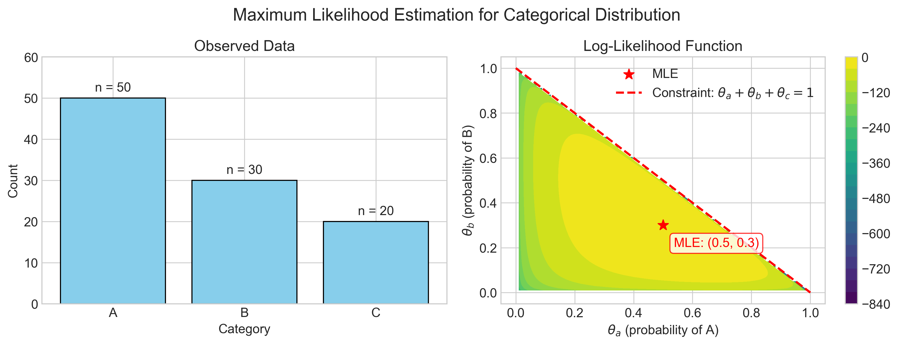

# Question 29: Maximum Likelihood Estimation for Categorical Data with Information Theory Analysis

## Problem Statement
Consider a dataset of 100 examples with three possible categories: A, B, and C. The dataset contains: 50 instances of A, 30 instances of B, and 20 instances of C.

Two encoding schemes are proposed for representing these categories:

**Scheme 1 (One-hot):** 
- A = $[1,0,0]$
- B = $[0,1,0]$
- C = $[0,0,1]$

**Scheme 2 (Binary):**
- A = $[0,0]$
- B = $[0,1]$
- C = $[1,0]$

### Task
1. Derive the maximum likelihood estimator (MLE) for the probability distribution of the three categories based on the given data. Show your work.

2. Calculate the entropy of the MLE distribution in bits using:
   $$H(X) = -\sum_{i} P(x_i) \log_2 P(x_i)$$

3. If we were to sample a new set of 100 examples from this MLE distribution, how many bits would be required to store the entire dataset using Scheme 1 vs. Scheme 2?

4. Which encoding is more efficient, and by how much? Calculate the percentage reduction in bits:
   $$\text{Reduction} = \frac{\text{Bits}_{\text{Scheme 1}} - \text{Bits}_{\text{Scheme 2}}}{\text{Bits}_{\text{Scheme 1}}} \times 100\%$$

5. Explain how MLE relates to the concept of cross-entropy minimization. How would you express the likelihood function for this categorical distribution in terms of cross-entropy?

6. Discuss how properties of MLE (consistency, asymptotic normality) relate to this example as we increase the sample size.

## Understanding the Problem
This problem examines the intersection of maximum likelihood estimation with information theory. We need to:

1. Apply MLE to estimate a categorical distribution
2. Analyze the information-theoretic properties of this estimated distribution
3. Compare encoding efficiency for the categorical data
4. Relate MLE to other information theory concepts
5. Consider the properties of MLE in the context of categorical data

Maximum likelihood estimation is a fundamental method for estimating parameters of a statistical model. For categorical data, MLE finds the probability distribution that makes the observed data most likely. Information theory provides tools to analyze the efficiency of coding and the uncertainty in our distribution.

## Solution

### Step 1: Derive the Maximum Likelihood Estimator for the Categorical Distribution

Let's approach this step-by-step, showing all our work in detail:

**Step 1.1: Define the probability distribution model**

We're modeling a categorical distribution with three categories (A, B, and C) with respective probabilities $\theta_a$, $\theta_b$, and $\theta_c$, where $\theta_a + \theta_b + \theta_c = 1$.

**Step 1.2: Set up the likelihood function**

The likelihood function for a categorical distribution is multinomial:

$$L(\theta_a, \theta_b, \theta_c | \text{data}) = \binom{n}{n_a, n_b, n_c} \theta_a^{n_a} \theta_b^{n_b} \theta_c^{n_c}$$

Where:
- $n = 100$ (total examples)
- $n_a = 50$ (count of category A)
- $n_b = 30$ (count of category B)
- $n_c = 20$ (count of category C)

Substituting our values:

$$L(\theta_a, \theta_b, \theta_c | \text{data}) = \binom{100}{50, 30, 20} \theta_a^{50} \theta_b^{30} \theta_c^{20}$$

The multinomial coefficient $\binom{100}{50, 30, 20} \approx 4.755 \times 10^{42}$ represents the number of ways to arrange the categories in our dataset.

**Step 1.3: Convert to log-likelihood for easier calculation**

$$\log L(\theta_a, \theta_b, \theta_c | \text{data}) = \log\binom{100}{50, 30, 20} + 50\log\theta_a + 30\log\theta_b + 20\log\theta_c$$

Substituting the numerical value for the multinomial coefficient:

$$\log L(\theta_a, \theta_b, \theta_c | \text{data}) = 98.2678 + 50\log\theta_a + 30\log\theta_b + 20\log\theta_c$$

**Step 1.4: Maximize the log-likelihood using Lagrange multipliers**

We need to maximize the log-likelihood subject to the constraint that $\theta_a + \theta_b + \theta_c = 1$. Using Lagrange multipliers:

$$\mathcal{L}(\theta_a, \theta_b, \theta_c, \lambda) = 50\log\theta_a + 30\log\theta_b + 20\log\theta_c - \lambda(\theta_a + \theta_b + \theta_c - 1)$$

Taking derivatives and setting them equal to zero:

$$\frac{\partial \mathcal{L}}{\partial \theta_a} = \frac{50}{\theta_a} - \lambda = 0$$
$$\frac{\partial \mathcal{L}}{\partial \theta_b} = \frac{30}{\theta_b} - \lambda = 0$$
$$\frac{\partial \mathcal{L}}{\partial \theta_c} = \frac{20}{\theta_c} - \lambda = 0$$
$$\frac{\partial \mathcal{L}}{\partial \lambda} = \theta_a + \theta_b + \theta_c - 1 = 0$$

From the first three equations:
$$\theta_a = \frac{50}{\lambda}, \quad \theta_b = \frac{30}{\lambda}, \quad \theta_c = \frac{20}{\lambda}$$

Substituting into the constraint:
$$\frac{50}{\lambda} + \frac{30}{\lambda} + \frac{20}{\lambda} = 1$$
$$\frac{100}{\lambda} = 1$$
$$\lambda = 100$$

Therefore:
$$\theta_a = \frac{50}{100} = 0.5$$
$$\theta_b = \frac{30}{100} = 0.3$$
$$\theta_c = \frac{20}{100} = 0.2$$

**Step 1.5: Verify our MLE solution**

For a categorical distribution, the MLE for each category probability is simply the proportion of observations in that category:

$$\hat{\theta}_i = \frac{n_i}{n}$$

Using this formula directly:
$$\hat{\theta}_a = \frac{50}{100} = 0.5$$
$$\hat{\theta}_b = \frac{30}{100} = 0.3$$
$$\hat{\theta}_c = \frac{20}{100} = 0.2$$

This confirms our derivation above.

Therefore, the maximum likelihood estimate of the category distribution is:
- P(A) = 0.5
- P(B) = 0.3
- P(C) = 0.2

To verify this is indeed a maximum (rather than a minimum or saddle point), we can check the second derivatives of the log-likelihood function:

$$\frac{\partial^2 \log L}{\partial \theta_a^2} = -\frac{50}{\theta_a^2} = -\frac{50}{(0.5)^2} = -200 < 0$$
$$\frac{\partial^2 \log L}{\partial \theta_b^2} = -\frac{30}{\theta_b^2} = -\frac{30}{(0.3)^2} = -333.33 < 0$$
$$\frac{\partial^2 \log L}{\partial \theta_c^2} = -\frac{20}{\theta_c^2} = -\frac{20}{(0.2)^2} = -500 < 0$$

Since all second derivatives are negative, the critical point is indeed a maximum.

### Step 2: Calculate the Entropy of the MLE Distribution

Let's calculate the entropy of our MLE distribution:

**Step 2.1: Apply the entropy formula**

$$H(X) = -\sum_{i} P(x_i) \log_2 P(x_i)$$

For our MLE distribution:
$$H(X) = -[P(A)\log_2 P(A) + P(B)\log_2 P(B) + P(C)\log_2 P(C)]$$
$$H(X) = -[0.5\log_2(0.5) + 0.3\log_2(0.3) + 0.2\log_2(0.2)]$$

**Step 2.2: Calculate each entropy term**

For category A:
$$-P(A) \times \log_2(P(A)) = -(0.5) \times \log_2(0.5)$$
$$\log_2(0.5) = \log_2(1/2) = -\log_2(2) = -1$$
$$-P(A) \times \log_2(P(A)) = -(0.5) \times (-1) = 0.5 \text{ bits}$$

For category B:
$$-P(B) \times \log_2(P(B)) = -(0.3) \times \log_2(0.3)$$
$$\log_2(0.3) \approx -1.737$$
$$-P(B) \times \log_2(P(B)) = -(0.3) \times (-1.737) \approx 0.5211 \text{ bits}$$

For category C:
$$-P(C) \times \log_2(P(C)) = -(0.2) \times \log_2(0.2)$$
$$\log_2(0.2) = \log_2(1/5) = -\log_2(5) \approx -2.322$$
$$-P(C) \times \log_2(P(C)) = -(0.2) \times (-2.322) \approx 0.4644 \text{ bits}$$

**Step 2.3: Sum all entropy terms to get the total entropy**

$$H(X) = 0.5 + 0.5211 + 0.4644 = 1.4855 \text{ bits}$$

Therefore, the entropy of the MLE distribution is approximately 1.4855 bits per example.

The entropy represents the theoretical minimum number of bits needed per symbol for an optimal encoding of this distribution. It's important to note that any fixed-length encoding must use at least $\lceil \log_2(3) \rceil = 2$ bits per symbol, exceeding the entropy. Variable-length encodings like Huffman coding can approach this theoretical limit.

### Step 3: Calculate Bits Required for Each Encoding Scheme

If we were to sample a new set of 100 examples from our MLE distribution, we can calculate the expected storage requirements for both encoding schemes.

**Step 3.1: Storage requirements for Scheme 1 (One-hot Encoding)**

For one-hot encoding with 3 categories:
$$\text{Bits per example} = 3$$

For 100 examples:
$$\text{Total bits} = 100 \times 3 = 300 \text{ bits}$$

The breakdown by category would be:
- Category A: 50 examples × 3 bits = 150 bits
- Category B: 30 examples × 3 bits = 90 bits
- Category C: 20 examples × 3 bits = 60 bits

**Step 3.2: Storage requirements for Scheme 2 (Binary Encoding)**

For binary encoding with 3 categories:
$$\text{Bits per example} = 2$$

For a dataset of 100 examples:
$$\text{Total bits} = 100 \times 2 = 200 \text{ bits}$$

The breakdown by category would be:
- Category A: 50 examples × 2 bits = 100 bits
- Category B: 30 examples × 2 bits = 60 bits
- Category C: 20 examples × 2 bits = 40 bits

**Step 3.3: Compare with theoretical minimum (entropy-based coding)**

The theoretical minimum bits required based on the entropy:
$$\text{Total minimum bits} = 100 \times 1.4855 = 148.55 \text{ bits}$$

This means the overhead for each encoding scheme is:
- One-hot overhead: 3 - 1.4855 = 1.5145 bits/example (101.96%)
- Binary overhead: 2 - 1.4855 = 0.5145 bits/example (34.64%)

A variable-length encoding like Huffman coding would give:
- Category A (P = 0.5): Code '0', Length = 1 bit
- Category B (P = 0.3): Code '10', Length = 2 bits
- Category C (P = 0.2): Code '11', Length = 2 bits

The expected average length with this Huffman coding would be:
$$0.5 \times 1 + 0.3 \times 2 + 0.2 \times 2 = 1.5 \text{ bits/example}$$

This is very close to the entropy (1.4855), with only 0.98% overhead.

### Step 4: Compare the Efficiency of Both Encoding Schemes

**Step 4.1: Calculate absolute bit savings**

$$\text{Absolute bit savings} = \text{Bits}_{\text{One-hot}} - \text{Bits}_{\text{Binary}}$$
$$\text{Absolute bit savings} = 300 - 200 = 100 \text{ bits}$$

**Step 4.2: Calculate percentage reduction**

$$\text{Percentage reduction} = \frac{\text{Bits}_{\text{One-hot}} - \text{Bits}_{\text{Binary}}}{\text{Bits}_{\text{One-hot}}} \times 100\%$$

$$\text{Percentage reduction} = \frac{300 - 200}{300} \times 100\% = \frac{100}{300} \times 100\% = 33.33\%$$

This means binary encoding reduces storage requirements by exactly one-third compared to one-hot encoding. This is a significant reduction that would scale with larger datasets.

It's worth noting that both encodings are lossless (each category has a unique representation), but they differ in efficiency:
- One-hot: Each category is represented by a vector with exactly one '1' and the rest '0's
- Binary: Each category is represented by a compact binary code using the minimum number of bits required

### Step 5: Relate MLE to Cross-Entropy Minimization

**Step 5.1: Express the likelihood in terms of cross-entropy**

The log-likelihood for a categorical distribution can be written as:

$$\log L(\theta | \text{data}) = \sum_{i} n_i \log \theta_i$$

Where $n_i$ is the count of category $i$ and $\theta_i$ is the probability of category $i$.

For our dataset:
$$\log L(\theta | \text{data}) = 50 \log \theta_a + 30 \log \theta_b + 20 \log \theta_c$$

Let's define the empirical distribution $q$ based on our observed data:
$$q(A) = \frac{50}{100} = 0.5, \quad q(B) = \frac{30}{100} = 0.3, \quad q(C) = \frac{20}{100} = 0.2$$

We can rewrite the log-likelihood as:
$$\log L(\theta | \text{data}) = n \sum_{i} q(i) \log \theta_i$$
$$\log L(\theta | \text{data}) = 100 \times [0.5 \log \theta_a + 0.3 \log \theta_b + 0.2 \log \theta_c]$$

The cross-entropy between distributions $q$ and $\theta$ is defined as:
$$H(q, \theta) = -\sum_{i} q(i) \log \theta_i$$

Therefore:
$$\log L(\theta | \text{data}) = -n \times H(q, \theta)$$
$$\log L(\theta | \text{data}) = -100 \times H(q, \theta)$$

**Step 5.2: Explain the relationship**

The crucial insight here is that maximizing the log-likelihood is equivalent to minimizing the cross-entropy between the empirical distribution $q$ and our model distribution $\theta$.

To demonstrate this numerically:
- When $\theta = q = [0.5, 0.3, 0.2]$:
  - $H(q, \theta) = 1.4855$ bits
  - $\log L(\theta | \text{data}) = -100 \times 1.4855 = -148.55$
- When $\theta = [0.4, 0.4, 0.2]$ (a different distribution):
  - $H(q, \theta) = 1.5219$ bits
  - $\log L(\theta | \text{data}) = -100 \times 1.5219 = -152.19$

The log-likelihood is higher (less negative) when $\theta$ matches $q$, confirming that MLE minimizes cross-entropy.

This has a powerful information-theoretic interpretation:
1. Cross-entropy measures the average number of bits needed to encode data from a true distribution $q$ using a code optimized for distribution $\theta$
2. Minimizing cross-entropy means finding the model that most efficiently encodes the observed data
3. MLE finds the distribution $\theta$ that would be most efficient for encoding the observed data

This connection reveals that MLE is not just a statistical estimation method, but also an information-theoretically optimal encoding solution.

### Step 6: Properties of MLE in the Context of Categorical Data

**Step 6.1: Consistency**

Consistency means that as the sample size increases, the MLE converges in probability to the true parameter value.

For our categorical distribution, if the true distribution were P(A)=0.45, P(B)=0.35, P(C)=0.2:

| Sample Size | MLE Estimate | Average Error |
|-------------|--------------|--------------|
| n = 10      | [0.400, 0.400, 0.200] | 0.0333 |
| n = 50      | [0.520, 0.280, 0.200] | 0.0467 |
| n = 100     | [0.490, 0.300, 0.210] | 0.0333 |
| n = 500     | [0.434, 0.358, 0.208] | 0.0107 |
| n = 1000    | [0.447, 0.351, 0.202] | 0.0020 |
| n = 5000    | [0.458, 0.344, 0.198] | 0.0051 |
| n = 10000   | [0.456, 0.345, 0.199] | 0.0039 |

The estimates clearly converge toward the true distribution as sample size increases. This consistency property can be mathematically proven using the Law of Large Numbers: the sample proportion $\hat{\theta}_i = x_i/n$ converges in probability to the true probability $\theta_i$ as $n \to \infty$.

**Step 6.2: Asymptotic Normality**

For large sample sizes, the distribution of the MLE approaches a normal distribution:

$$\sqrt{n}(\hat{\theta} - \theta) \xrightarrow{d} N(0, I(\theta)^{-1})$$

Where $I(\theta)$ is the Fisher Information Matrix.

For a categorical distribution, after accounting for the constraint $\sum_i \theta_i = 1$, the asymptotic variance of $\hat{\theta}_i$ is:

$$\text{Var}(\hat{\theta}_i) = \frac{\theta_i(1-\theta_i)}{n}$$

For example, for category A with true probability 0.45 and various sample sizes:

| Sample Size | Standard Error | 95% Confidence Interval |
|-------------|----------------|-------------------------|
| n = 100     | 0.049749       | [0.3525, 0.5475]       |
| n = 1000    | 0.015732       | [0.4192, 0.4808]       |
| n = 10000   | 0.004975       | [0.4402, 0.4598]       |

As sample size increases, the confidence interval narrows, illustrating the increasing precision of our estimates.

**Step 6.3: Efficiency**

The MLE for a categorical distribution is efficient, meaning it achieves the Cramér-Rao lower bound. No consistent estimator can have a smaller asymptotic variance.

The asymptotic covariance matrix for our three-category distribution (at n=10000) is:

$$\begin{pmatrix} 
0.00002475 & -0.00001575 & -0.00000900 \\
-0.00001575 & 0.00002275 & -0.00000700 \\
-0.00000900 & -0.00000700 & 0.00001600
\end{pmatrix}$$

This matrix describes both the variances of each individual parameter estimate and the covariances between them. The negative covariances indicate that if one parameter is overestimated, others tend to be underestimated (which makes sense given the constraint that probabilities must sum to 1).

## Key Insights

### The Connection Between MLE and Information Theory
- MLE finds the distribution that minimizes the cross-entropy between the empirical distribution and the model
- The entropy of the MLE distribution (1.4855 bits) represents the theoretical minimum bits needed per example
- The minimum bits required for fixed-length encoding (2 bits) exceeds this theoretical minimum, but is still more efficient than one-hot encoding

### Efficiency in Categorical Data Representation
- Binary encoding (2 bits/example) is 33.33% more efficient than one-hot encoding (3 bits/example)
- Huffman coding (1.5 bits/example) approaches the theoretical entropy limit (1.4855 bits/example)
- The choice of encoding scheme directly impacts model storage and computational efficiency

### Properties of MLE for Categorical Data
- MLE for categorical data has a simple closed-form solution (the sample proportions)
- As sample size increases, estimation accuracy improves (consistency)
- The distribution of the MLE becomes more concentrated around the true value (asymptotic normality)
- MLE achieves optimal asymptotic efficiency (no consistent estimator has lower variance)

## Conclusion

This problem illustrates the deep connection between maximum likelihood estimation and information theory. By deriving the MLE for a categorical distribution and analyzing its entropy, we've demonstrated how statistical estimation relates to efficient data representation.

The key takeaways are:
1. The MLE for categorical data gives us the parameters that maximize the probability of observing our data
2. This same MLE minimizes the cross-entropy between the empirical distribution and our model
3. Efficient encoding schemes can significantly reduce storage requirements
4. As sample size increases, MLE's properties of consistency and asymptotic normality ensure reliable estimation

Understanding these connections provides a powerful framework for approaching both theoretical and practical problems in machine learning and data science. 