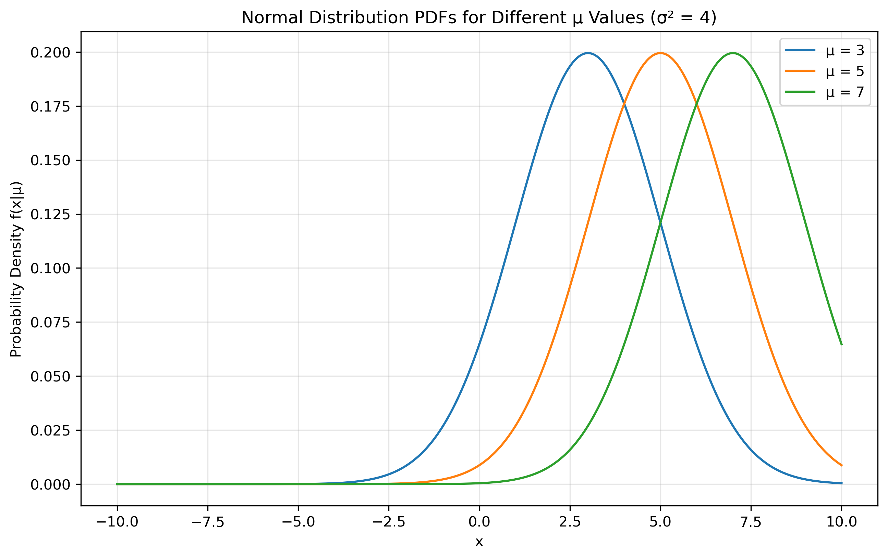
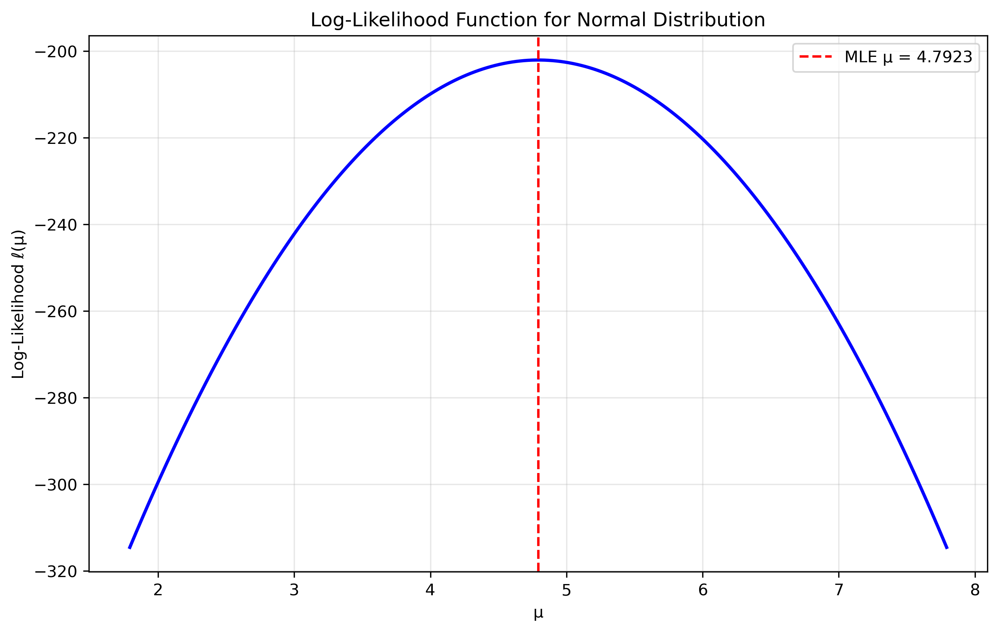
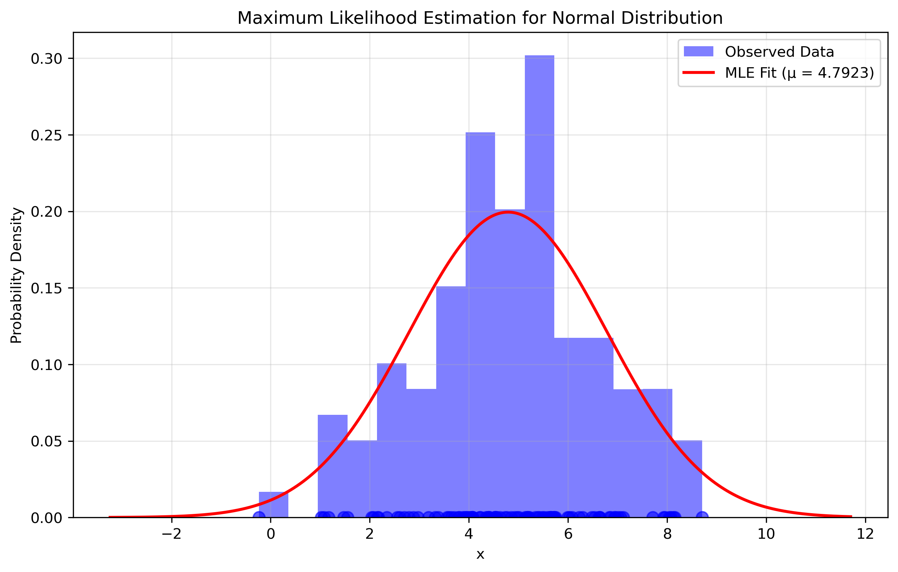
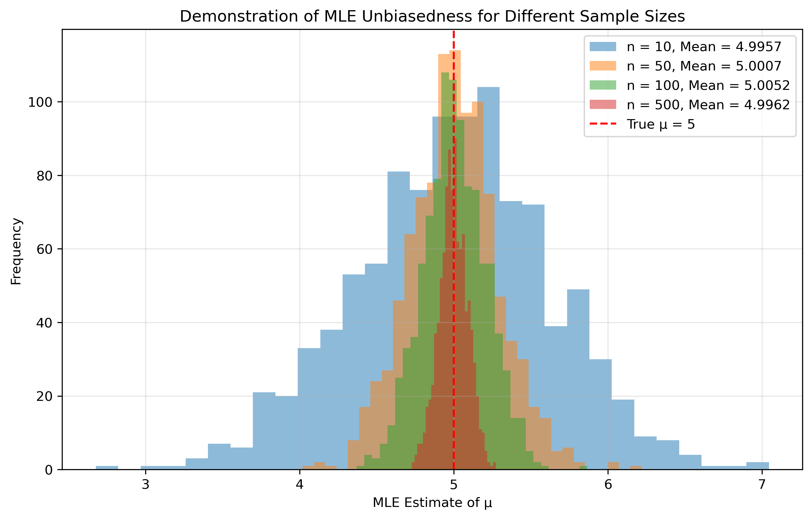

# Question 2: Maximum Likelihood Estimation for Normal Distribution

## Problem Statement
Consider a dataset of n independent observations $X_1, X_2, \ldots, X_n$ from a normal distribution with unknown mean $\mu$ and known variance $\sigma^2 = 4$. The probability density function is:

$$f(x|\mu) = \frac{1}{2\sqrt{2\pi}} e^{-\frac{(x-\mu)^2}{8}}$$

### Task
1. Write down the likelihood function $L(\mu)$ for the given observations
2. Find the maximum likelihood estimator $\hat{\mu}_{MLE}$ for $\mu$
3. Show that this estimator is unbiased

## Understanding the Probability Model

The normal distribution is a continuous probability distribution characterized by:
- Mean $\mu$ (location parameter)
- Variance $\sigma^2$ (scale parameter)
- Bell-shaped curve
- Symmetry about the mean

In our case:
- $\sigma^2 = 4$ is known
- $\mu$ is the parameter to be estimated
- The support is $(-\infty, \infty)$

## Solution

The normal distribution is a continuous probability distribution characterized by its bell-shaped curve and symmetry around the mean. It has two parameters: mean $\mu$ (location parameter) and variance $\sigma^2$ (scale parameter). In our case, $\sigma^2 = 4$ is known and $\mu$ is the parameter to be estimated.

### Step 1: Formulate the likelihood function
For n independent observations $x_1, x_2, \ldots, x_n$, the likelihood function is:

$$L(\mu | x_1, x_2, \ldots, x_n) = \prod_{i=1}^{n} f(x_i | \mu) = \prod_{i=1}^{n} \frac{1}{2\sqrt{2\pi}} e^{-\frac{(x_i-\mu)^2}{8}}$$

### Step 2: Take the logarithm to get the log-likelihood
Taking the natural logarithm, we get the log-likelihood function:

$$\ell(\mu) = \ln L(\mu | x_1, x_2, \ldots, x_n) = \sum_{i=1}^{n} \left[-\ln(2\sqrt{2\pi}) - \frac{(x_i-\mu)^2}{8}\right]$$

$$\ell(\mu) = -n\ln(2\sqrt{2\pi}) - \frac{1}{8}\sum_{i=1}^{n}(x_i-\mu)^2$$

### Step 3: Find the critical points by taking the derivative
To find the maximum, we take the derivative with respect to $\mu$ and set it to zero:

$$\frac{d\ell}{d\mu} = \frac{1}{4}\sum_{i=1}^{n}(x_i-\mu) = 0$$

### Step 4: Solve for the MLE estimate
Solving for $\mu$:

$$\sum_{i=1}^{n}(x_i-\mu) = 0$$

$$\sum_{i=1}^{n}x_i - n\mu = 0$$

$$\mu = \frac{1}{n}\sum_{i=1}^{n}x_i$$

Therefore, the MLE is:

$$\hat{\mu}_{MLE} = \frac{1}{n}\sum_{i=1}^{n}X_i$$

### Step 5: Verify it's a maximum
The second derivative of the log-likelihood is:

$$\frac{d^2\ell}{d\mu^2} = -\frac{n}{4}$$

Since the second derivative is negative, we confirm that our critical point is indeed a maximum.

### Step 6: Show unbiasedness
To show that the estimator is unbiased, we need to prove that $E[\hat{\mu}_{MLE}] = \mu$:

$$E[\hat{\mu}_{MLE}] = E\left[\frac{1}{n}\sum_{i=1}^{n}X_i\right] = \frac{1}{n}\sum_{i=1}^{n}E[X_i] = \frac{1}{n}\sum_{i=1}^{n}\mu = \mu$$

This proves that $\hat{\mu}_{MLE}$ is an unbiased estimator of $\mu$.

## Visual Explanations

### Normal Distributions for Different μ Values

This figure shows how the distribution shape changes with different $\mu$ values. The mean parameter shifts the bell curve left or right while maintaining its shape.

### Likelihood Surface

This visualization of the log-likelihood function shows the maximum point corresponding to the MLE and demonstrates the concavity of the likelihood function.

### MLE Fit to Data

This figure shows how well the MLE estimate fits the observed data by comparing the estimated normal distribution with the data histogram.

### Unbiasedness Demonstration

This visualization demonstrates how the distribution of MLE estimates remains centered on the true parameter value across different sample sizes, illustrating the unbiasedness property.

## Key Insights

### MLE Properties
- The MLE for the normal distribution with known variance is simply the sample mean
- The estimator is unbiased: its expected value equals the true parameter
- The estimator is consistent: it converges to the true value as sample size increases
- The estimator is efficient: it achieves the Cramér-Rao lower bound
- The estimator is a sufficient statistic: it captures all information in the data about $\mu$

### Practical Considerations
- The sample mean is computationally simple to calculate
- The known variance simplifies the estimation process
- The estimator is robust to moderate violations of normality assumption
- For large samples, the sample mean is approximately normally distributed

## Conclusion

The maximum likelihood estimator for the mean $\mu$ of a normal distribution with known variance is the sample mean:

$$\hat{\mu}_{MLE} = \frac{1}{n}\sum_{i=1}^{n}X_i$$

This estimator has excellent statistical properties including unbiasedness, consistency, efficiency, and asymptotic normality. Its simplicity and theoretical properties make it a fundamental tool in statistical inference, providing the foundation for many statistical methods used in practice. 