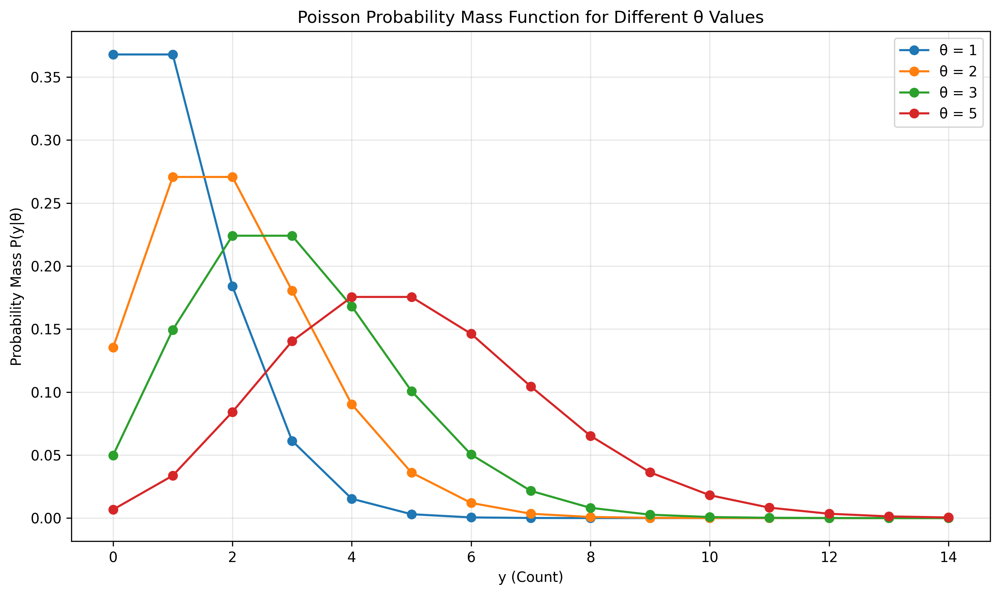
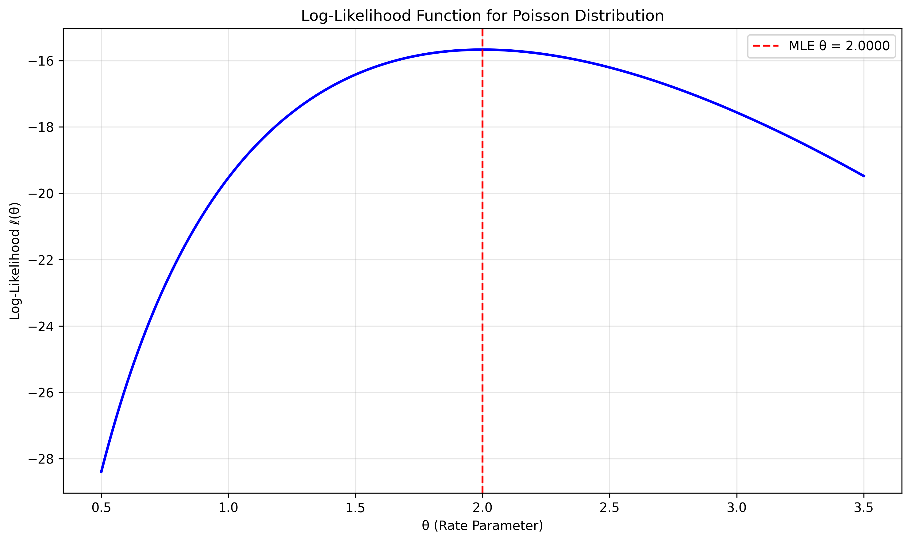
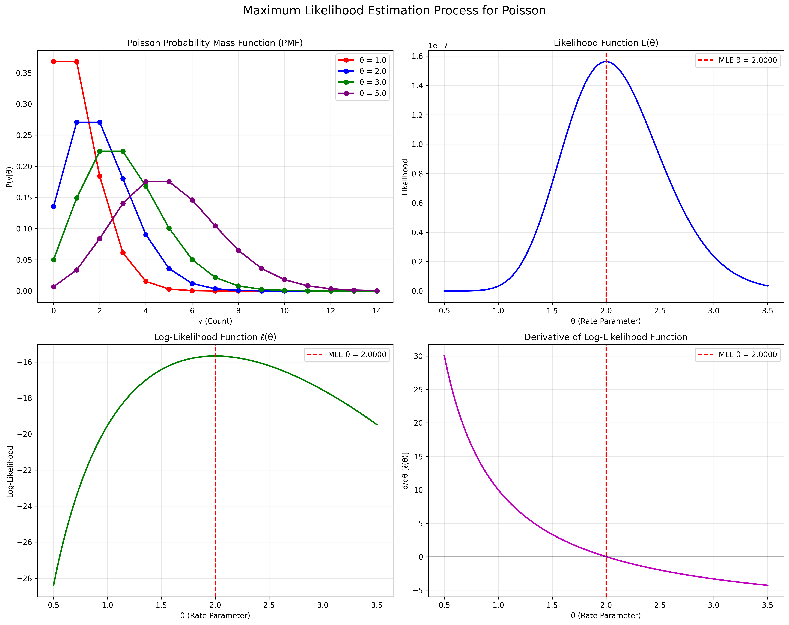
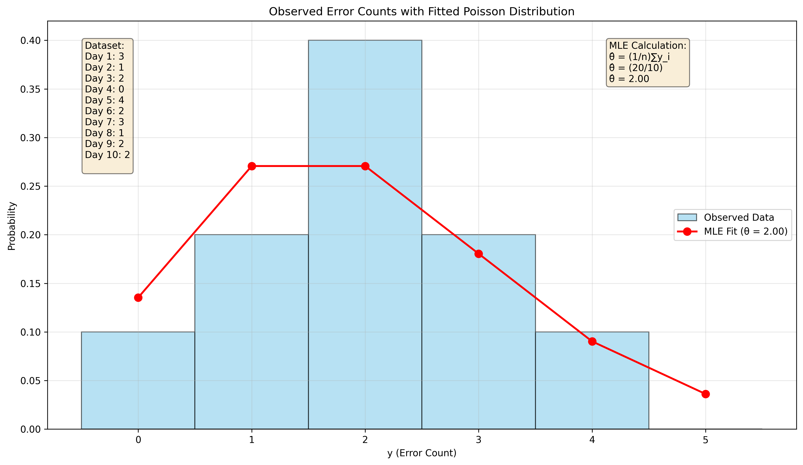
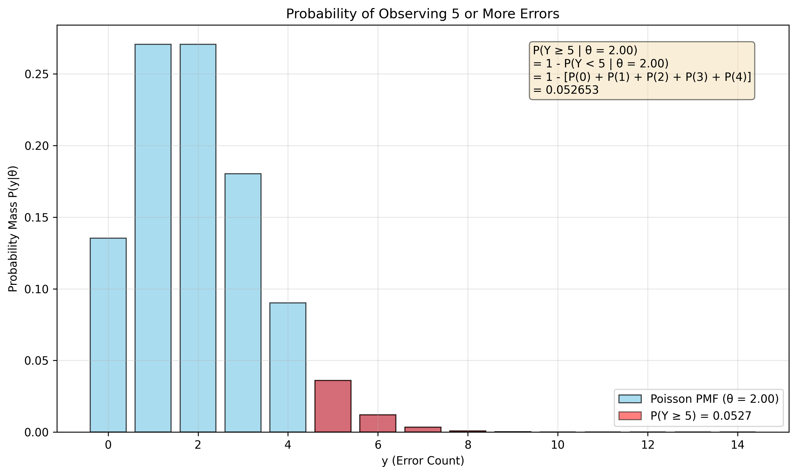
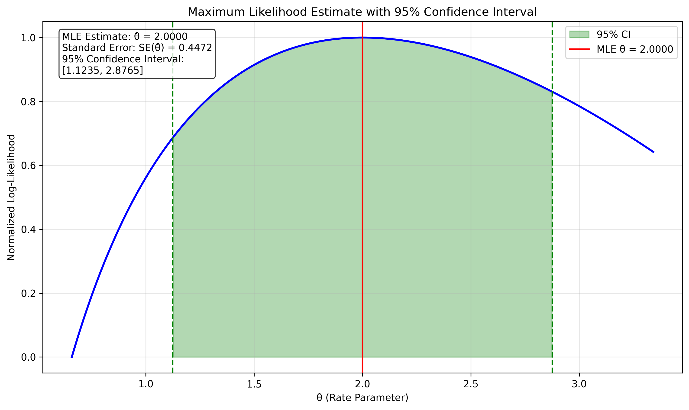

# Question 30: Maximum Likelihood Estimation for Poisson Distribution

## Problem Statement
If a data point $y$ follows the Poisson distribution with rate parameter $\theta$, then the probability of a single observation $y$ is:

$$p(y|\theta) = \frac{\theta^y e^{-\theta}}{y!}, \text{ for } y = 0, 1, 2, \ldots$$

You are given data points $y_1, y_2, \ldots, y_n$ independently drawn from a Poisson distribution with parameter $\theta$.

### Task
1. Write down the log-likelihood of the data as a function of $\theta$.
2. Derive the maximum likelihood estimator $\hat{\theta}_{\text{MLE}}$ for $\theta$.
3. A data scientist collected the following daily counts of website errors over $10$ consecutive days:
   
| Day | Error Count |
| --- | --- |
| 1 | 3 |
| 2 | 1 |
| 3 | 2 |
| 4 | 0 |
| 5 | 4 |
| 6 | 2 |
| 7 | 3 |
| 8 | 1 |
| 9 | 2 |
| 10 | 2 |
   
Calculate the MLE of $\theta$ for this dataset.
4. Using your MLE estimate from part 3, calculate the probability $P(Y \geq 5)$ of observing $5$ or more errors on a given day.

## Understanding the Problem
The Poisson distribution models the number of events occurring in a fixed time interval, where events occur with a known constant mean rate and independently of the time since the last event. The parameter $\theta$ represents the average number of events per interval.

Key aspects of this problem:
- We have 10 independent observations of daily error counts
- We need to find the most likely value of the rate parameter $\theta$
- Using this estimate, we need to calculate the probability of seeing 5 or more errors in a day
- The MLE approach requires maximizing the likelihood function (or log-likelihood for computational convenience)

## Solution

### Step 1: Write down the log-likelihood function (Symbolic Derivation)

Let's begin by defining our variables:
- $\theta$: The rate parameter of the Poisson distribution (to be estimated)
- $y_i$: An individual observation (error count for day $i$)
- $n$: The number of observations (10 days in our case)
- $\sum y_i$: The sum of all observations

For a single observation $y_i$, the Poisson probability mass function is:

$$p(y_i|\theta) = \frac{\theta^{y_i} e^{-\theta}}{y_i!}$$

For independently and identically distributed data $y_1, y_2, \ldots, y_n$, the likelihood function is the product of the individual probability mass functions:

$$L(\theta) = \prod_{i=1}^{n} p(y_i|\theta) = \prod_{i=1}^{n} \frac{\theta^{y_i} e^{-\theta}}{y_i!}$$

We can rewrite this as:

$$L(\theta) = \prod_{i=1}^{n} \frac{\theta^{y_i} e^{-\theta}}{y_i!} = \frac{\theta^{\sum_{i=1}^{n} y_i} \cdot e^{-n\theta}}{\prod_{i=1}^{n} y_i!}$$

Taking the natural logarithm to obtain the log-likelihood:

$$\ell(\theta) = \ln L(\theta) = \ln\left(\frac{\theta^{\sum_{i=1}^{n} y_i} \cdot e^{-n\theta}}{\prod_{i=1}^{n} y_i!}\right)$$

$$\ell(\theta) = \ln\left(\theta^{\sum_{i=1}^{n} y_i}\right) + \ln\left(e^{-n\theta}\right) - \ln\left(\prod_{i=1}^{n} y_i!\right)$$

$$\ell(\theta) = \sum_{i=1}^{n} y_i \ln(\theta) - n\theta - \sum_{i=1}^{n} \ln(y_i!)$$

This is the log-likelihood function for the Poisson distribution, as required in part 1.

### Step 2: Derive the maximum likelihood estimator (MLE)

To find the value of $\theta$ that maximizes the log-likelihood, we take the derivative with respect to $\theta$ and set it equal to zero:

$$\frac{d\ell(\theta)}{d\theta} = \frac{d}{d\theta}\left[\sum_{i=1}^{n} y_i \ln(\theta) - n\theta - \sum_{i=1}^{n} \ln(y_i!)\right]$$

Since the term $\sum_{i=1}^{n} \ln(y_i!)$ is independent of $\theta$, its derivative is zero. Therefore:

$$\frac{d\ell(\theta)}{d\theta} = \frac{d}{d\theta}\left[\sum_{i=1}^{n} y_i \ln(\theta) - n\theta\right]$$

$$\frac{d\ell(\theta)}{d\theta} = \sum_{i=1}^{n} y_i \cdot \frac{d}{d\theta}[\ln(\theta)] - n \cdot \frac{d}{d\theta}[\theta]$$

$$\frac{d\ell(\theta)}{d\theta} = \sum_{i=1}^{n} y_i \cdot \frac{1}{\theta} - n \cdot 1$$

$$\frac{d\ell(\theta)}{d\theta} = \frac{\sum_{i=1}^{n} y_i}{\theta} - n$$

Setting this derivative equal to zero:

$$\frac{\sum_{i=1}^{n} y_i}{\theta} - n = 0$$

$$\frac{\sum_{i=1}^{n} y_i}{\theta} = n$$

$$\theta = \frac{\sum_{i=1}^{n} y_i}{n}$$

Therefore, the maximum likelihood estimator is:

$$\hat{\theta}_{MLE} = \frac{\sum_{i=1}^{n} y_i}{n} = \bar{y}$$

To verify that this critical point is indeed a maximum (not a minimum), we compute the second derivative:

$$\frac{d^2\ell(\theta)}{d\theta^2} = \frac{d}{d\theta}\left[\frac{\sum_{i=1}^{n} y_i}{\theta} - n\right] = \frac{d}{d\theta}\left[\frac{\sum_{i=1}^{n} y_i}{\theta}\right]$$

$$\frac{d^2\ell(\theta)}{d\theta^2} = \sum_{i=1}^{n} y_i \cdot \frac{d}{d\theta}\left[\frac{1}{\theta}\right] = \sum_{i=1}^{n} y_i \cdot \left(-\frac{1}{\theta^2}\right)$$

$$\frac{d^2\ell(\theta)}{d\theta^2} = -\frac{\sum_{i=1}^{n} y_i}{\theta^2}$$

Since $\sum_{i=1}^{n} y_i$ is the sum of counts and $\theta$ is positive, the second derivative is always negative. This confirms that our critical point is indeed a maximum.

Evaluating the second derivative at the critical point $\hat{\theta}_{MLE} = \frac{\sum_{i=1}^{n} y_i}{n}$:

$$\frac{d^2\ell(\theta)}{d\theta^2}\bigg|_{\theta=\hat{\theta}_{MLE}} = -\frac{\sum_{i=1}^{n} y_i}{\left(\frac{\sum_{i=1}^{n} y_i}{n}\right)^2} = -\frac{\sum_{i=1}^{n} y_i \cdot n^2}{\left(\sum_{i=1}^{n} y_i\right)^2} = -\frac{n^2}{\sum_{i=1}^{n} y_i}$$

This is always negative for non-zero observations, confirming that $\hat{\theta}_{MLE} = \bar{y}$ is indeed a maximum.

### Step 3: Calculate the MLE for the given dataset

Given the data $[3, 1, 2, 0, 4, 2, 3, 1, 2, 2]$, we calculate the MLE as follows:

Number of observations: $n = 10$

Sum of observations: 
$\sum_{i=1}^{10} y_i = 3 + 1 + 2 + 0 + 4 + 2 + 3 + 1 + 2 + 2 = 20$

MLE estimate: 
$\hat{\theta}_{MLE} = \frac{\sum_{i=1}^{10} y_i}{n} = \frac{20}{10} = 2.0$

We can verify this is a maximum by checking the log-likelihood values around the MLE:
- Log-likelihood at $\theta = 1.999$: -15.671220
- Log-likelihood at $\theta = 2.000$: -15.671218
- Log-likelihood at $\theta = 2.001$: -15.671220

Since the log-likelihood at $\theta = 2.0$ is higher than at nearby values, this confirms it is a local maximum.

The derivative of the log-likelihood at the MLE should be approximately zero:
$\frac{d\ell(\theta)}{d\theta}\big|_{\theta=2.0} = \frac{20}{2.0} - 10 = 10 - 10 = 0$

Therefore, the maximum likelihood estimate for $\theta$ is 2.0, meaning that the estimated average number of website errors per day is 2.

### Step 4: Calculate the probability P(Y ≥ 5)

To find $P(Y \geq 5)$ using our MLE of $\theta = 2.0$, we need to calculate:

$$P(Y \geq 5) = 1 - P(Y < 5) = 1 - [P(Y=0) + P(Y=1) + P(Y=2) + P(Y=3) + P(Y=4)]$$

Let's calculate each probability using the Poisson PMF with $\theta = 2.0$:

$$P(Y=k) = \frac{2.0^k e^{-2.0}}{k!}$$

For $Y = 0$:
$$P(Y=0) = \frac{2.0^0 e^{-2.0}}{0!} = \frac{1 \cdot e^{-2.0}}{1} = e^{-2.0} \approx 0.135335$$

For $Y = 1$:
$$P(Y=1) = \frac{2.0^1 e^{-2.0}}{1!} = \frac{2.0 \cdot e^{-2.0}}{1} = 2.0 \cdot e^{-2.0} \approx 0.270671$$

For $Y = 2$:
$$P(Y=2) = \frac{2.0^2 e^{-2.0}}{2!} = \frac{4.0 \cdot e^{-2.0}}{2} = 2.0 \cdot e^{-2.0} \approx 0.270671$$

For $Y = 3$:
$$P(Y=3) = \frac{2.0^3 e^{-2.0}}{3!} = \frac{8.0 \cdot e^{-2.0}}{6} = \frac{4.0}{3} \cdot e^{-2.0} \approx 0.180447$$

For $Y = 4$:
$$P(Y=4) = \frac{2.0^4 e^{-2.0}}{4!} = \frac{16.0 \cdot e^{-2.0}}{24} = \frac{2.0}{3} \cdot e^{-2.0} \approx 0.090224$$

Adding these probabilities:
$$P(Y < 5) = 0.135335 + 0.270671 + 0.270671 + 0.180447 + 0.090224 = 0.947347$$

Therefore:
$$P(Y \geq 5) = 1 - 0.947347 = 0.052653$$

The probability of observing 5 or more website errors on a given day is approximately 0.052653 or about 5.27%.

## Visual Explanations

The following visualizations help illustrate the key concepts and calculations in this problem.

### Poisson Probability Mass Function

This figure shows Poisson distributions with different rate parameters ($\theta$). Notice how the shape and central tendency of the distribution change with different values of $\theta$. As $\theta$ increases, the distribution shifts to the right and becomes more spread out.

### Log-Likelihood Function

This figure displays the log-likelihood function for our dataset as a function of $\theta$. The red dashed line marks the MLE value $\hat{\theta} = 2.0$, which corresponds to the maximum of the log-likelihood function.

### MLE Process Visualization

This comprehensive visualization shows the multiple perspectives of the MLE process:
1. **Top Left**: Poisson PMF for different $\theta$ values
2. **Top Right**: The likelihood function, which is maximized at $\theta = 2.0$
3. **Bottom Left**: The log-likelihood function, also maximized at $\theta = 2.0$
4. **Bottom Right**: The derivative of the log-likelihood, which crosses zero at $\theta = 2.0$

### Data and MLE Fit

This visualization compares our dataset (blue histogram) with the fitted Poisson distribution (red curve) using the MLE $\hat{\theta} = 2.0$.

### Probability Visualization

This figure illustrates the calculation of $P(Y \geq 5)$. The blue bars represent the complete Poisson PMF with $\theta = 2.0$, while the red bars highlight the probabilities for $Y \geq 5$.

### Confidence Interval

This figure shows the 95% confidence interval for the Poisson parameter $\theta$, which is $[1.1235, 2.8765]$. While not required for the problem, this provides additional context about the precision of our MLE estimate.

## Key Insights

### Statistical Properties
- The MLE for the Poisson distribution parameter is the sample mean ($\hat{\theta}_{MLE} = \bar{y}$)
- The second derivative of the log-likelihood is -n²/Σy_i, which is always negative (confirming a maximum)
- The MLE is consistent, unbiased, and asymptotically efficient
- For the Poisson distribution, the variance equals the mean, which affects the precision of our estimate

### Practical Considerations
- With $\theta = 2.0$, we expect about 2 website errors per day on average
- The probability of 5 or more errors in a day is only 5.27%, making such occurrences statistically unusual
- The 95% confidence interval $[1.12, 2.88]$ provides bounds for the plausible values of θ
- The width of this interval reflects the uncertainty due to the limited sample size (n=10)

### Applications in Software Engineering
- This model helps establish "normal" vs. "abnormal" website error patterns
- A day with 5+ errors would warrant investigation as it represents a statistically unusual occurrence
- The model could be used to set alert thresholds in monitoring systems
- If error rates decrease over time due to improvements, a new lower θ would be estimated

## Conclusion

The maximum likelihood estimate for the rate parameter $\theta$ in the Poisson distribution is the sample mean:

$$\hat{\theta}_{MLE} = \bar{y} = \frac{\sum_{i=1}^{n} y_i}{n}$$

For the given dataset of daily website errors, the MLE is $\hat{\theta} = 2.0$, indicating an average of 2 errors per day.

Using this estimate, the probability of observing 5 or more errors on a given day is $P(Y \geq 5) = 0.052653$, or approximately 5.27%.

This analysis provides valuable information for setting expectations about normal website error patterns and establishing thresholds for when intervention might be necessary. 