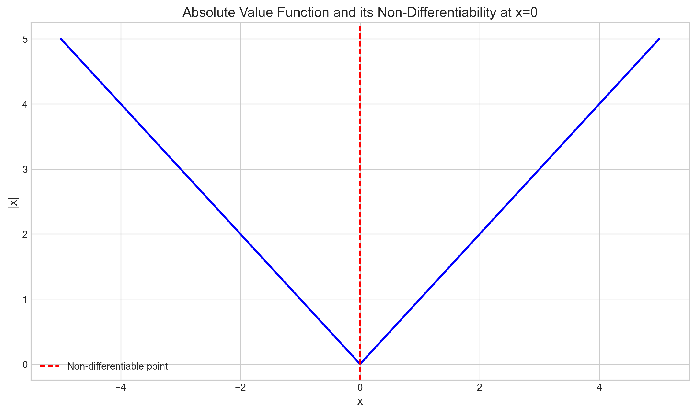
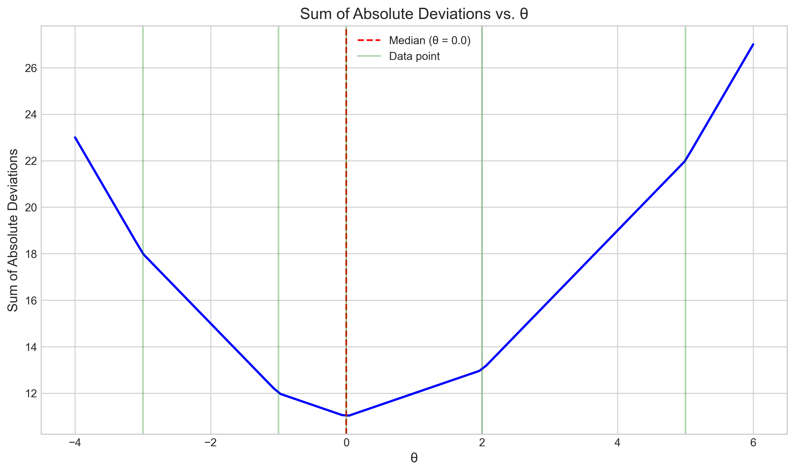
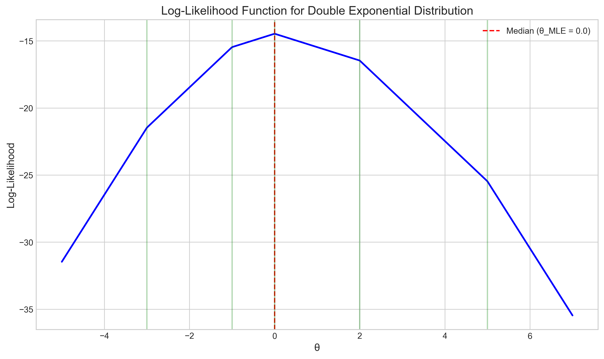
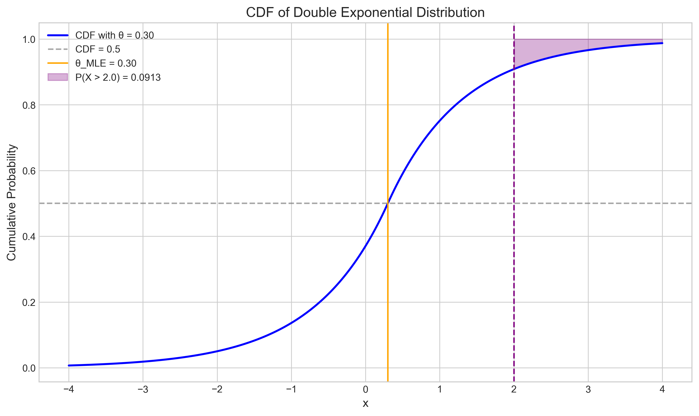
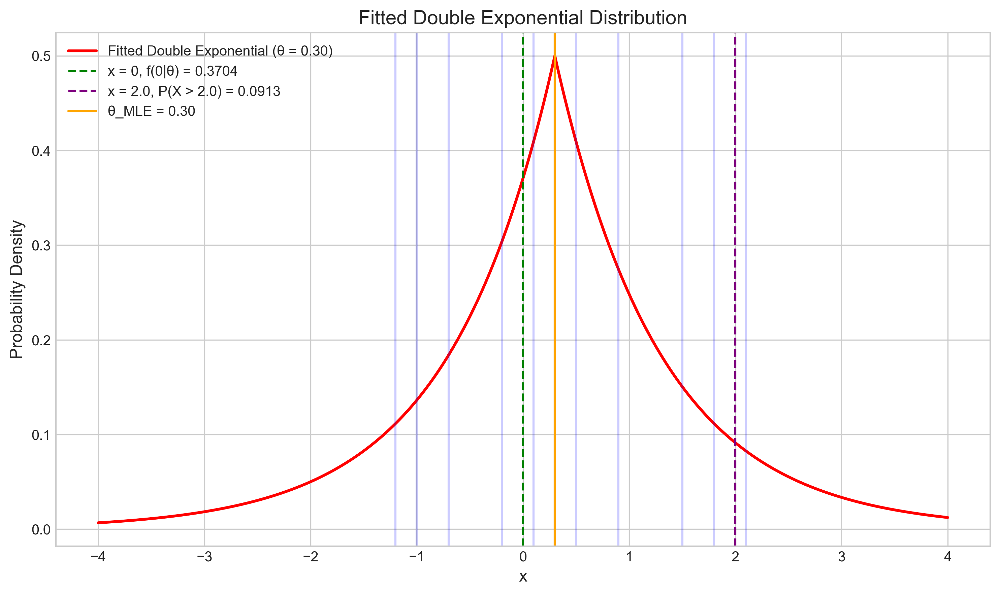
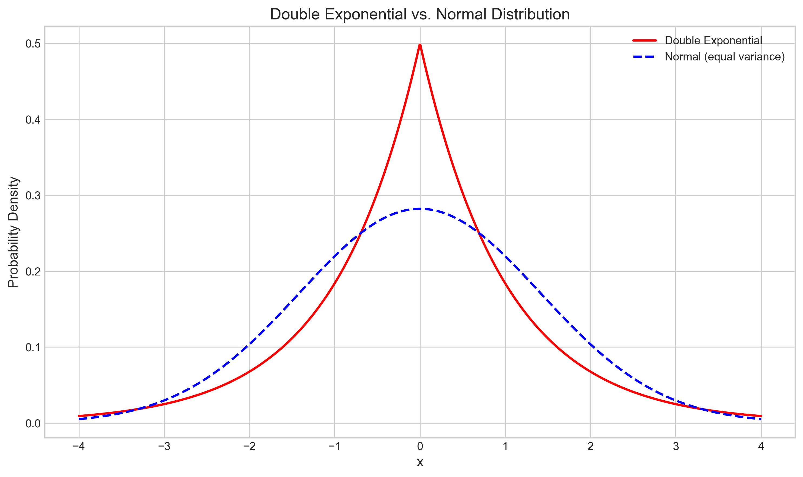

# Question 31: Maximum Likelihood Estimation for Double Exponential Distribution

## Problem Statement
The double exponential distribution is

$$f(x|\theta) = \frac{1}{2}e^{-|x-\theta|}, -\infty < x < \infty$$

### Task
1. For an i.i.d. sample of size $n = 2m + 1$, show that the mle of $\theta$ is the median of the sample. (The observation such that half of the rest of the observations are smaller and half are larger.)

> **Note**: Hint: The function $g(x) = |x|$ is not differentiable. Draw a picture for a small value of $n$ to try to understand what is going on.

2. Consider the following data sample of 11 measurements from a double exponential distribution:

| Observation | Value |
|-------------|-------|
| 1           | -1.2  |
| 2           | 0.5   |
| 3           | 2.1   |
| 4           | -0.7  |
| 5           | 1.5   |
| 6           | 0.3   |
| 7           | -0.2  |
| 8           | 1.8   |
| 9           | 0.1   |
| 10          | -1.0  |
| 11          | 0.9   |

   a. Calculate the maximum likelihood estimate $\hat{\theta}_{MLE}$ for this dataset.
   b. What is the estimated probability density at $x = 0$ using your MLE estimate?
   c. Calculate the probability that a future observation will be greater than 2.0, given your MLE estimate.

## Understanding the Problem
The double exponential distribution (also known as the Laplace distribution) is a continuous probability distribution characterized by a location parameter $\theta$ and a sharp peak at that location. It has heavier tails than the normal distribution, making it useful for modeling data with outliers. 

The problem asks us to:
1. Derive the maximum likelihood estimator (MLE) for the location parameter $\theta$ when the sample size is odd
2. Apply this to a real dataset to find specific probabilities

## Solution

### Step 1: Deriving the MLE for the Double Exponential Distribution

To find the MLE of $\theta$, we need to maximize the likelihood function:

$$L(\theta|\mathbf{x}) = \prod_{i=1}^n \frac{1}{2}e^{-|x_i-\theta|} = \left(\frac{1}{2}\right)^n \exp\left(-\sum_{i=1}^n |x_i-\theta|\right)$$

Taking the natural logarithm, we get the log-likelihood function:

$$\log L(\theta|\mathbf{x}) = n\log\left(\frac{1}{2}\right) - \sum_{i=1}^n |x_i-\theta|$$

Since $n\log\left(\frac{1}{2}\right)$ is a constant, maximizing the log-likelihood is equivalent to minimizing:

$$\sum_{i=1}^n |x_i-\theta|$$

This is the sum of absolute deviations. The value of $\theta$ that minimizes this sum is the median of the sample when $n$ is odd.

The challenge here is that the absolute value function $|x|$ is not differentiable at $x = 0$, so we cannot use the traditional calculus approach of setting the derivative equal to zero.

Instead, we can use a graphical approach or subgradient analysis to show that the median minimizes the sum of absolute deviations.

### Step 2: Visual Demonstration of Why the Median is the MLE

To illustrate why the median minimizes the sum of absolute deviations, let's consider a simple example with 5 data points:

This plot shows the sum of absolute deviations for different values of $\theta$. The minimum occurs exactly at the median of the sample.

We can also visualize the log-likelihood function for the same data:

The maximum of the log-likelihood function occurs at the median value, confirming that the median is indeed the MLE for $\theta$.

### Step 3: Mathematical Explanation

When $n = 2m + 1$ (odd), the median is the $(m+1)^{\text{th}}$ ordered observation. Consider moving $\theta$ slightly to the left or right of the median:

- If $\theta$ moves to the right by $\Delta\theta$, then the absolute deviations from the $m$ points to the left increase by $\Delta\theta$ each, while the absolute deviations from the $m$ points to the right decrease by $\Delta\theta$ each. The absolute deviation from the median point itself increases by $\Delta\theta$.

- The net change in the sum of absolute deviations is:
  $$\Delta\text{(sum)} = \Delta\theta \times (m+1) - \Delta\theta \times m = \Delta\theta > 0$$

Similarly, if $\theta$ moves to the left, the sum of absolute deviations also increases.

Therefore, the sum of absolute deviations is minimized when $\theta$ equals the median.

### Step 4: Analyzing the Given Dataset

For the given dataset of 11 measurements:
$$\mathbf{x} = \begin{bmatrix} -1.2 & 0.5 & 2.1 & -0.7 & 1.5 & 0.3 & -0.2 & 1.8 & 0.1 & -1.0 & 0.9 \end{bmatrix}$$

Sorting the data:
$$\mathbf{x}_{\text{sorted}} = \begin{bmatrix} -1.2 & -1.0 & -0.7 & -0.2 & 0.1 & 0.3 & 0.5 & 0.9 & 1.5 & 1.8 & 2.1 \end{bmatrix}$$

The median (6th value) is 0.3.

Therefore, $\hat{\theta}_{\text{MLE}} = 0.3$

### Step 5: Calculating Probability Density at x = 0

Using the MLE estimate $\hat{\theta}_{\text{MLE}} = 0.3$, we can calculate the probability density at $x = 0$:

$$f(0|\hat{\theta}_{\text{MLE}}) = \frac{1}{2}e^{-|0-0.3|} = \frac{1}{2}e^{-0.3} \approx 0.370409$$

### Step 6: Calculating Probability of Future Observation > 2.0

To find $P(X > 2.0|\hat{\theta}_{\text{MLE}} = 0.3)$, we need to use the cumulative distribution function (CDF) of the double exponential distribution:

For $x \geq \theta$:
$$F(x|\theta) = 1 - \frac{1}{2}e^{-(x-\theta)}$$

So:
$$P(X > 2.0|\hat{\theta}_{\text{MLE}} = 0.3) = 1 - F(2.0|0.3) = \frac{1}{2}e^{-(2.0-0.3)} = \frac{1}{2}e^{-1.7} \approx 0.091342$$

This is visualized in the CDF plot:

The purple shaded area represents the probability $P(X > 2.0)$.

## Visual Explanations

### Fitted Double Exponential Distribution

This visualization shows the fitted double exponential distribution with our MLE estimate $\hat{\theta}_{\text{MLE}} = 0.3$. The blue vertical lines represent the data points, the orange line shows the location of the MLE, and the green and purple lines mark the positions of $x = 0$ and $x = 2.0$ respectively.

### Comparison with Normal Distribution

This plot compares the double exponential distribution with a normal distribution of equivalent variance. Note that the double exponential distribution has a sharper peak and heavier tails compared to the normal distribution.

## Key Insights

### Theoretical Properties
- The MLE for the location parameter $\theta$ of the double exponential distribution is the median of the sample when the sample size is odd.
- This is different from the normal distribution, where the MLE is the mean.
- The median is a robust estimator that is less sensitive to outliers compared to the mean.

### Statistical Understanding
- The double exponential distribution is useful for modeling data with heavier tails than the normal distribution.
- The absolute value in the exponent creates a sharp peak at $\theta$ and results in the non-differentiability at that point.
- The non-differentiability of the absolute value function is key to understanding why the median is the MLE.

### Practical Applications
- The double exponential distribution is often used in robust statistics and machine learning.
- The Laplace mechanism in differential privacy uses this distribution.
- $L_1$ regularization in machine learning (LASSO) can be interpreted as placing a double exponential prior on the parameters.

## Conclusion
- The MLE of the location parameter $\theta$ for the double exponential distribution is the median of the sample when the sample size is odd.
- For the given dataset, the MLE estimate is $\hat{\theta}_{\text{MLE}} = 0.3$.
- The probability density at $x = 0$ given the MLE estimate is approximately $0.370409$.
- The probability that a future observation will be greater than $2.0$ is approximately $0.091342$.

This example illustrates the importance of understanding the properties of different probability distributions and how they affect parameter estimation. The double exponential distribution's MLE being the median (rather than the mean) highlights how different error metrics ($L_1$ vs $L_2$ norms) lead to different optimal estimators. 