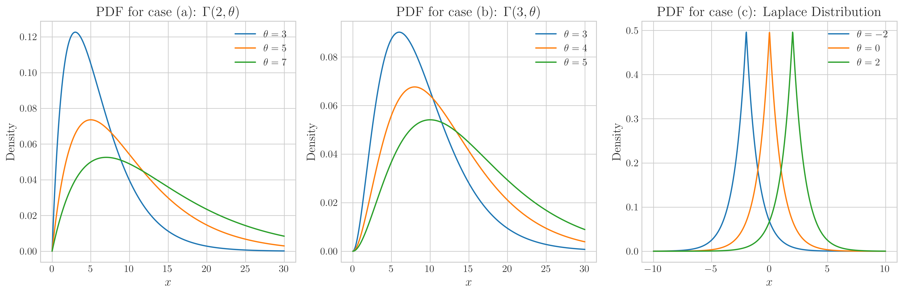
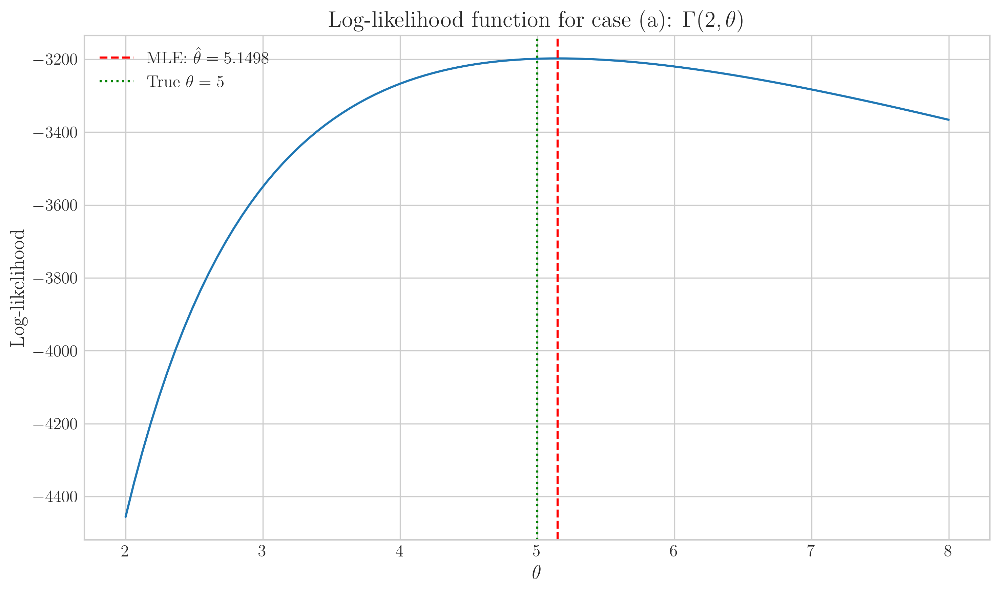
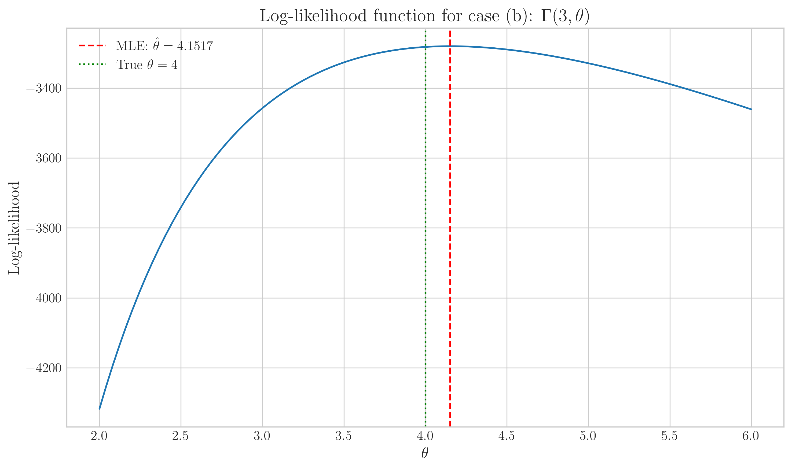
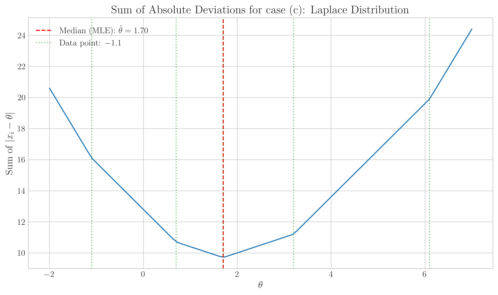
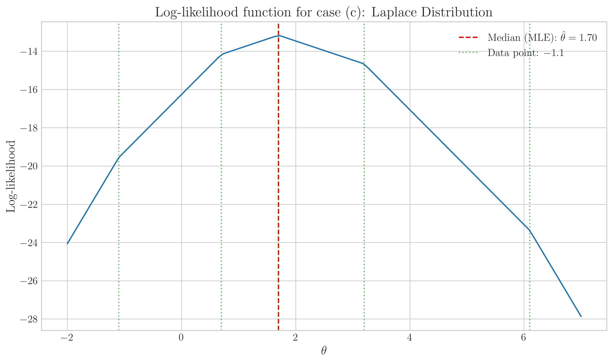

# Question 32: Maximum Likelihood Estimator for Different Distributions

## Problem Statement
Let $X_1,X_2, \ldots ,X_n$ be a random sample from distributions with the given probability density functions. In each case, find the maximum likelihood estimator $\hat{\theta}$.

$$(a) \quad f(x;\theta) = \frac{1}{\theta^2}x e^{-x/\theta}, \quad 0 < x < \infty, \quad 0 < \theta < \infty$$

$$(b) \quad f(x;\theta) = \frac{1}{2\theta^3}x^2 e^{-x/\theta}, \quad 0 < x < \infty, \quad 0 < \theta < \infty$$

$$(c) \quad f(x;\theta) = \frac{1}{2}e^{-|x-\theta|}, \quad -\infty < x < \infty, \quad -\infty < \theta < \infty$$

### Task
1. Derive the maximum likelihood estimator $\hat{\theta}$ for each probability density function.
2. For case $(c)$, work through the example with $x_1 = 6.1$, $x_2 = -1.1$, $x_3 = 3.2$, $x_4 = 0.7$, and $x_5 = 1.7$ to find the answer.

## Understanding the Problem

This problem asks us to find the maximum likelihood estimator (MLE) for the parameter $\theta$ in three different probability density functions. The MLE is the value of $\theta$ that maximizes the likelihood of observing our data.

For each distribution, we need to:
1. Form the likelihood function $L(\theta) = \prod_{i=1}^n f(x_i; \theta)$
2. Take the natural logarithm to get the log-likelihood function $\ell(\theta) = \ln L(\theta)$
3. Find the value of $\theta$ that maximizes $\ell(\theta)$ by setting the derivative equal to zero and solving

For the first two PDFs, we can use calculus to find a closed-form solution. For the third PDF, the derivative is not defined at certain points, requiring a different approach.

## Solution

### Step 1: MLE for $f(x;\theta) = \frac{1}{\theta^2}x e^{-x/\theta}$

First, let's look at the shape of this PDF:

To find the MLE, we start with the likelihood function:

$$L(\theta) = \prod_{i=1}^n \frac{1}{\theta^2}x_i e^{-x_i/\theta}$$

$$L(\theta) = \frac{1}{\theta^{2n}}\left(\prod_{i=1}^n x_i\right) e^{-\frac{1}{\theta}\sum_{i=1}^n x_i}$$

Taking the logarithm:

$$\ell(\theta) = \ln L(\theta) = \ln\left[\frac{1}{\theta^{2n}}\left(\prod_{i=1}^n x_i\right) e^{-\frac{1}{\theta}\sum_{i=1}^n x_i}\right]$$

$$\ell(\theta) = \ln\left[\frac{1}{\theta^{2n}}\right] + \ln\left[\prod_{i=1}^n x_i\right] + \ln\left[e^{-\frac{1}{\theta}\sum_{i=1}^n x_i}\right]$$

$$\ell(\theta) = -2n\ln(\theta) + \sum_{i=1}^n \ln(x_i) - \frac{1}{\theta}\sum_{i=1}^n x_i$$

To maximize, we differentiate with respect to $\theta$ and set equal to zero:

$$\frac{d\ell(\theta)}{d\theta} = -\frac{2n}{\theta} + \frac{1}{\theta^2}\sum_{i=1}^n x_i = 0$$

Solving for $\theta$:

$$\frac{1}{\theta^2}\sum_{i=1}^n x_i = \frac{2n}{\theta}$$

$$\sum_{i=1}^n x_i = 2n\theta$$

$$\hat{\theta} = \frac{1}{2n}\sum_{i=1}^n x_i = \frac{\bar{x}}{2}$$

To verify this is a maximum, we can check the second derivative:

$$\frac{d^2\ell(\theta)}{d\theta^2} = \frac{2n}{\theta^2} - \frac{2}{\theta^3}\sum_{i=1}^n x_i$$

At the critical point: $\sum_{i=1}^n x_i = 2n\theta$, substituting:

$$\frac{d^2\ell(\theta)}{d\theta^2} = \frac{2n}{\theta^2} - \frac{2}{\theta^3}(2n\theta) = \frac{2n}{\theta^2} - \frac{4n}{\theta^2} = -\frac{2n}{\theta^2} < 0$$

Since the second derivative is negative, this confirms that $\hat{\theta} = \frac{\bar{x}}{2}$ is indeed a maximum.

So the MLE for the first distribution is half of the sample mean.

The graph shows the log-likelihood function for different values of $\theta$. The vertical red dashed line indicates the MLE ($\hat{\theta} = \bar{x}/2$), and the green dotted line shows the true parameter value. The peak of the log-likelihood function confirms our analytical solution.

### Step 2: MLE for $f(x;\theta) = \frac{1}{2\theta^3}x^2 e^{-x/\theta}$

Following a similar approach:

$$L(\theta) = \prod_{i=1}^n \frac{1}{2\theta^3}x_i^2 e^{-x_i/\theta}$$

$$L(\theta) = \frac{1}{2^n\theta^{3n}}\left(\prod_{i=1}^n x_i^2\right) e^{-\frac{1}{\theta}\sum_{i=1}^n x_i}$$

Taking the logarithm:

$$\ell(\theta) = \ln L(\theta) = \ln\left[\frac{1}{2^n\theta^{3n}}\left(\prod_{i=1}^n x_i^2\right) e^{-\frac{1}{\theta}\sum_{i=1}^n x_i}\right]$$

$$\ell(\theta) = \ln\left[\frac{1}{2^n\theta^{3n}}\right] + \ln\left[\prod_{i=1}^n x_i^2\right] + \ln\left[e^{-\frac{1}{\theta}\sum_{i=1}^n x_i}\right]$$

$$\ell(\theta) = -n\ln(2) - 3n\ln(\theta) + \sum_{i=1}^n \ln(x_i^2) - \frac{1}{\theta}\sum_{i=1}^n x_i$$

$$\ell(\theta) = -n\ln(2) - 3n\ln(\theta) + 2\sum_{i=1}^n \ln(x_i) - \frac{1}{\theta}\sum_{i=1}^n x_i$$

Differentiating and setting to zero:

$$\frac{d\ell(\theta)}{d\theta} = -\frac{3n}{\theta} + \frac{1}{\theta^2}\sum_{i=1}^n x_i = 0$$

Solving for $\theta$:

$$\frac{1}{\theta^2}\sum_{i=1}^n x_i = \frac{3n}{\theta}$$

$$\sum_{i=1}^n x_i = 3n\theta$$

$$\hat{\theta} = \frac{1}{3n}\sum_{i=1}^n x_i = \frac{\bar{x}}{3}$$

To verify this is a maximum, we check the second derivative:

$$\frac{d^2\ell(\theta)}{d\theta^2} = \frac{3n}{\theta^2} - \frac{2}{\theta^3}\sum_{i=1}^n x_i$$

At the critical point: $\sum_{i=1}^n x_i = 3n\theta$, substituting:

$$\frac{d^2\ell(\theta)}{d\theta^2} = \frac{3n}{\theta^2} - \frac{2}{\theta^3}(3n\theta) = \frac{3n}{\theta^2} - \frac{6n}{\theta^2} = -\frac{3n}{\theta^2} < 0$$

Since the second derivative is negative, this confirms that $\hat{\theta} = \frac{\bar{x}}{3}$ is indeed a maximum.

So the MLE for the second distribution is one-third of the sample mean.

The graph shows the log-likelihood function for different values of $\theta$. The peak occurs at $\hat{\theta} = \bar{x}/3$, confirming our analytical solution.

### Step 3: MLE for $f(x;\theta) = \frac{1}{2}e^{-|x-\theta|}$

This case is more challenging because the log-likelihood function involves absolute values, which are not differentiable everywhere.

$$L(\theta) = \prod_{i=1}^n \frac{1}{2}e^{-|x_i-\theta|} = \left(\frac{1}{2}\right)^n e^{-\sum_{i=1}^n|x_i-\theta|}$$

Taking the logarithm:

$$\ell(\theta) = \ln L(\theta) = \ln\left[\left(\frac{1}{2}\right)^n e^{-\sum_{i=1}^n|x_i-\theta|}\right]$$

$$\ell(\theta) = n\ln\left(\frac{1}{2}\right) - \sum_{i=1}^n|x_i-\theta|$$

$$\ell(\theta) = -n\ln(2) - \sum_{i=1}^n|x_i-\theta|$$

Maximizing $\ell(\theta)$ is equivalent to minimizing $\sum_{i=1}^n |x_i-\theta|$. This is the sum of absolute deviations.

The derivative of $|x_i-\theta|$ with respect to $\theta$ is:

$$\frac{d|x_i-\theta|}{d\theta} = \begin{cases} -1 & \text{if } x_i > \theta \\ 1 & \text{if } x_i < \theta \end{cases}$$

Setting the derivative of the log-likelihood to zero:

$$\frac{d\ell(\theta)}{d\theta} = -\sum_{i: x_i > \theta} (-1) + \sum_{i: x_i < \theta} 1 = 0$$

$$\sum_{i: x_i > \theta} 1 = \sum_{i: x_i < \theta} 1$$

This equation is satisfied when $\theta$ is the median of the data, as the number of data points above the median equals the number of points below it.

For the given dataset:
$x_1 = 6.1$, $x_2 = -1.1$, $x_3 = 3.2$, $x_4 = 0.7$, $x_5 = 1.7$

Sorting the data: $-1.1, 0.7, 1.7, 3.2, 6.1$

Since $n = 5$ is odd, the median is at position $(n+1)/2 = 3$, which is $1.7$. This is our MLE.

Let's verify this by calculating the sum of absolute deviations at different points:

| $\theta$ | Sum of $\|x_i - \theta\|$ | Detailed Calculation |
|----------:|-------------------------:|:---------------------|
| $-1.1$    | $16.10$ | $\|6.1-(-1.1)\| + \|-1.1-(-1.1)\| + \|3.2-(-1.1)\| + \|0.7-(-1.1)\| + \|1.7-(-1.1)\| = 7.2 + 0 + 4.3 + 1.8 + 2.8 = 16.10$ |
| $0.7$     | $10.70$ | $\|6.1-0.7\| + \|-1.1-0.7\| + \|3.2-0.7\| + \|0.7-0.7\| + \|1.7-0.7\| = 5.4 + 1.8 + 2.5 + 0 + 1.0 = 10.70$ |
| $1.7$     | $9.70$  | $\|6.1-1.7\| + \|-1.1-1.7\| + \|3.2-1.7\| + \|0.7-1.7\| + \|1.7-1.7\| = 4.4 + 2.8 + 1.5 + 1.0 + 0 = 9.70$ |
| $3.2$     | $11.20$ | $\|6.1-3.2\| + \|-1.1-3.2\| + \|3.2-3.2\| + \|0.7-3.2\| + \|1.7-3.2\| = 2.9 + 4.3 + 0 + 2.5 + 1.5 = 11.20$ |
| $6.1$     | $19.90$ | $\|6.1-6.1\| + \|-1.1-6.1\| + \|3.2-6.1\| + \|0.7-6.1\| + \|1.7-6.1\| = 0 + 7.2 + 2.9 + 5.4 + 4.4 = 19.90$ |

We can also check points around the median to verify it's truly a minimum:

| $\theta$ | Sum of $\|x_i - \theta\|$ |
|----------:|-------------------------:|
| $1.20$    | $10.20$ |
| $1.45$    | $9.95$ |
| $1.70$    | $9.70$ |
| $1.95$    | $9.95$ |
| $2.20$    | $10.20$ |

As expected, the sum is minimized at $\theta = 1.7$, confirming that the median is indeed the MLE.

The graph displays the sum of absolute deviations for different values of $\theta$. The minimum occurs at $\theta = 1.7$ (red dashed line), which is the median of our data. The green dotted lines show the positions of the data points.

The log-likelihood function also confirms that the maximum occurs at the median.

### Comparison of All Three Distributions

To better understand the differences between these probability distributions, let's compare them visually:

This graph shows all three probability density functions with the same parameter value $\theta = 5$. The case (a) distribution has its mode at $\theta$, case (b) has a more right-skewed shape, and case (c) (Laplace distribution) is symmetric around $\theta$.

### Sampling Distributions of the MLEs

The MLEs we've derived are themselves random variables because they depend on our sample data. Their distributions are important for understanding estimation uncertainty:

These histograms show the distributions of the MLEs for each case from 500 simulated samples. All three MLEs are approximately normally distributed around the true parameter values, which is expected from asymptotic theory. The spread of these distributions reflects the precision of our estimators.

## Key Insights

### Relationship Between Distribution and Estimator
- For the first distribution, the MLE is $\hat{\theta} = \bar{x}/2$
- For the second distribution, the MLE is $\hat{\theta} = \bar{x}/3$
- For the third distribution, the MLE is $\hat{\theta} = \text{median}$
- The denominators in the first two cases (2 and 3) correspond to the exponent of $x$ in the respective PDFs ($x^1$ and $x^2$)

### Statistical Properties
- The MLEs for distributions (a) and (b) are related to the mean, which can be sensitive to outliers
- The MLE for distribution (c) is the median, which is a robust estimator less affected by outliers
- Each distribution has a unique global maximum for its log-likelihood function
- The sampling distributions of the MLEs are approximately normally distributed, as expected by asymptotic theory

### Practical Applications
- The Laplace distribution (case c) is often used in robust statistics because its MLE is the median
- In machine learning, L1 loss (absolute error) corresponds to assuming a Laplace distribution
- Understanding the relationship between distributions and their MLEs helps in choosing appropriate models
- The MLE's sampling distribution informs us about the precision of our parameter estimates

## Conclusion

The maximum likelihood estimators for the three distributions are:

- For distribution (a): $\hat{\theta} = \frac{\bar{x}}{2}$
- For distribution (b): $\hat{\theta} = \frac{\bar{x}}{3}$
- For distribution (c): $\hat{\theta} = \text{median}$

For the specific example in case (c) with the given data points, the MLE is $\hat{\theta} = 1.7$.

These results illustrate how different probability distributions lead to different estimators, and how the form of the log-likelihood function determines the mathematical properties of the MLE. The visualizations provide intuitive understanding of these statistical concepts, particularly the relationship between the parameter and the shape of the distribution, as well as the sampling properties of our estimators. 