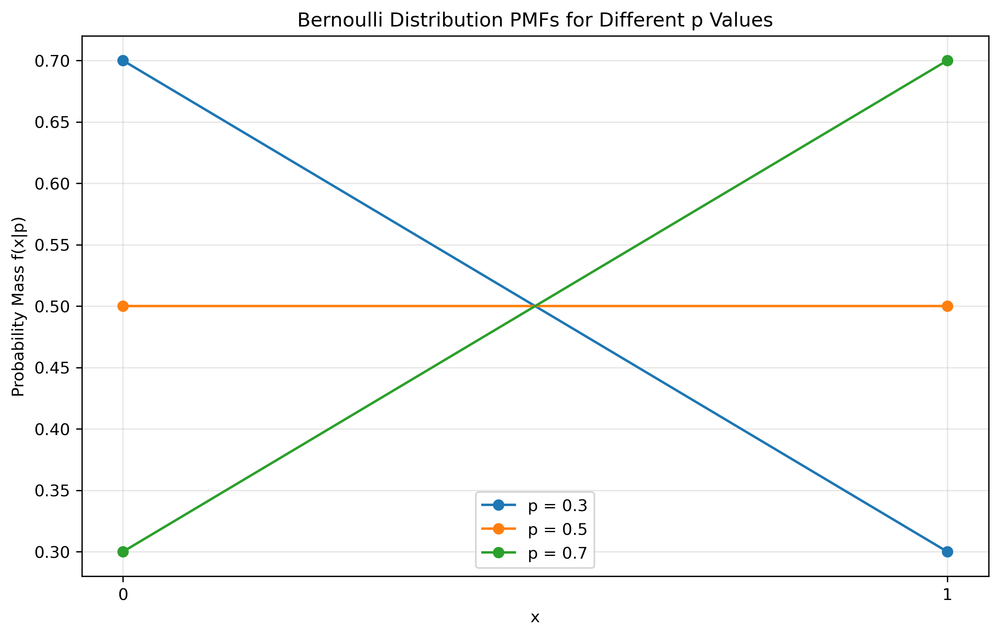
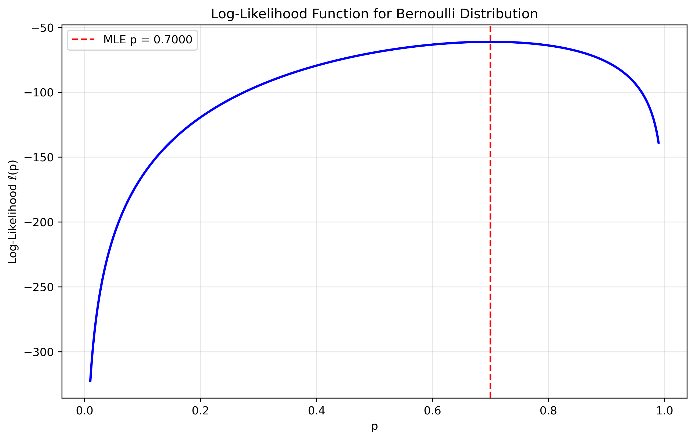
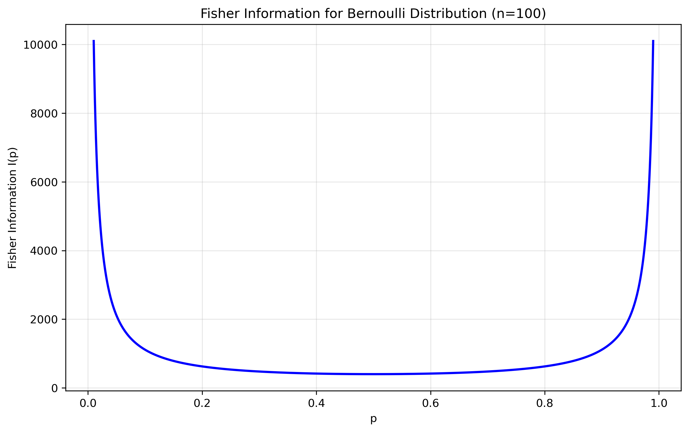
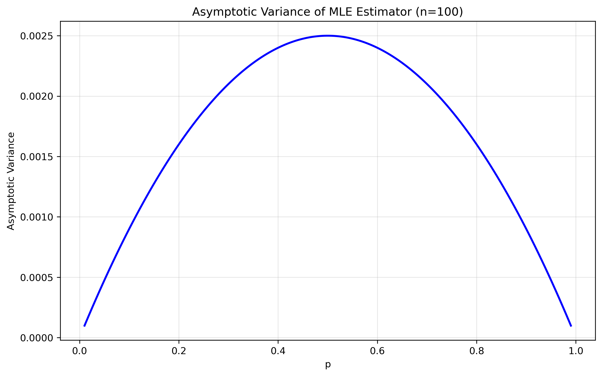

# Question 3: Maximum Likelihood Estimation for Bernoulli Distribution

## Problem Statement
You are given a dataset of n independent Bernoulli trials $X_1, X_2, \ldots, X_n$ where each $X_i$ takes value 1 with probability p and 0 with probability 1-p. The probability mass function is:

$$f(x|p) = p^x(1-p)^{1-x}$$

### Task
1. Derive the maximum likelihood estimator $\hat{p}_{MLE}$ for the probability p
2. Calculate the Fisher information $I(p)$ for this model
3. What is the asymptotic variance of $\hat{p}_{MLE}$?

## Understanding the Probability Model

The Bernoulli distribution is a discrete probability distribution that:
- Models binary outcomes (success/failure, yes/no, 1/0)
- Has a single parameter p (probability of success)
- Is the building block for many other distributions (Binomial, Geometric, etc.)

## Solution

The Bernoulli distribution is a discrete probability distribution that models binary outcomes such as success/failure, yes/no, or 1/0. It has a single parameter p that represents the probability of success (value 1) and is the building block for many other distributions.

### Step 1: Formulate the likelihood function
For n independent observations $x_1, x_2, \ldots, x_n$, the likelihood function is:

$$L(p | x_1, x_2, \ldots, x_n) = \prod_{i=1}^{n} f(x_i | p) = \prod_{i=1}^{n} p^{x_i}(1-p)^{1-x_i}$$

### Step 2: Take the logarithm to get the log-likelihood
Taking the natural logarithm, we get the log-likelihood function:

$$\ell(p) = \ln L(p | x_1, x_2, \ldots, x_n) = \sum_{i=1}^{n} [x_i\ln(p) + (1-x_i)\ln(1-p)]$$
$$\ell(p) = \left(\sum_{i=1}^{n}x_i\right)\ln(p) + \left(n - \sum_{i=1}^{n}x_i\right)\ln(1-p)$$

### Step 3: Find the critical points by taking the derivative
To find the maximum, we take the derivative with respect to p and set it to zero:

$$\frac{d\ell}{dp} = \frac{\sum_{i=1}^{n}x_i}{p} - \frac{n - \sum_{i=1}^{n}x_i}{1-p} = 0$$

### Step 4: Solve for the MLE estimate
Solving for p:

$$\frac{\sum_{i=1}^{n}x_i}{p} = \frac{n - \sum_{i=1}^{n}x_i}{1-p}$$
$$(1-p)\sum_{i=1}^{n}x_i = p(n - \sum_{i=1}^{n}x_i)$$
$$\sum_{i=1}^{n}x_i - p\sum_{i=1}^{n}x_i = pn - p\sum_{i=1}^{n}x_i$$
$$\sum_{i=1}^{n}x_i = pn$$
$$p = \frac{1}{n}\sum_{i=1}^{n}x_i$$

Therefore, the MLE is:

$$\hat{p}_{MLE} = \frac{1}{n}\sum_{i=1}^{n}X_i$$

### Step 5: Verify it's a maximum
The second derivative of the log-likelihood is:

$$\frac{d^2\ell}{dp^2} = -\frac{\sum_{i=1}^{n}x_i}{p^2} - \frac{n - \sum_{i=1}^{n}x_i}{(1-p)^2}$$

Since the second derivative is negative for all p ∈ (0,1), we confirm that our critical point is indeed a maximum.

### Step 6: Calculate the Fisher Information
The Fisher information for a single observation is:

$$I_1(p) = E\left[\left(\frac{d}{dp}\ln f(X|p)\right)^2\right] = \frac{1}{p(1-p)}$$

For n independent observations, the Fisher information is:

$$I(p) = nI_1(p) = \frac{n}{p(1-p)}$$

### Step 7: Calculate the Asymptotic Variance
The asymptotic variance of the MLE is the inverse of the Fisher information:

$$\text{Var}(\hat{p}_{MLE}) \approx \frac{1}{I(p)} = \frac{p(1-p)}{n}$$

## Visual Explanations

### Bernoulli Distribution for Different p Values

This figure shows how the distribution shape changes with different p values:
- For p = 0.3: Higher probability of 0
- For p = 0.5: Equal probability of 0 and 1
- For p = 0.7: Higher probability of 1

### Likelihood Surface

This visualization of the log-likelihood function shows the maximum point corresponding to the MLE (marked by the red dashed line) and demonstrates the concavity of the likelihood function.

### Fisher Information

This figure demonstrates:
- Fisher information is highest when p is near 0.5
- It approaches infinity as p approaches 0 or 1
- The shape is symmetric about p = 0.5

### Asymptotic Variance

This figure visualizes:
- Variance is highest when p is near 0.5
- Variance approaches 0 as p approaches 0 or 1
- The relationship is symmetric about p = 0.5

## Key Insights

### MLE Properties
- The MLE for the Bernoulli distribution is the sample proportion of successes
- The estimator is unbiased: $E[\hat{p}_{MLE}] = p$
- The estimator is consistent: it converges to the true value as sample size increases
- The estimator is efficient: it achieves the Cramér-Rao lower bound
- The estimator is asymptotically normal: its distribution approaches normal for large samples

### Practical Considerations
- The MLE is particularly simple to compute
- The variance depends on both p and n
- For small samples, the normal approximation may not be accurate
- The estimator performs best when p is not too close to 0 or 1

## Conclusion

The maximum likelihood estimator for the success probability p in a Bernoulli distribution is the sample proportion:

$$\hat{p}_{MLE} = \frac{1}{n}\sum_{i=1}^{n}X_i$$

This estimator is:
- Unbiased and consistent
- Asymptotically normal with variance $\frac{p(1-p)}{n}$
- Efficient, achieving the Cramér-Rao lower bound
- A fundamental estimator that forms the basis for many statistical procedures 