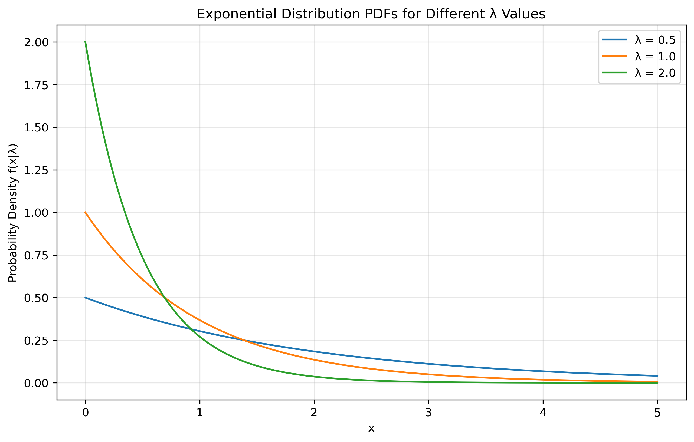

# Question 4: MLE for Exponential Distribution

## Problem Statement
Consider a dataset of n independent observations from an exponential distribution with rate parameter λ. The probability density function is:

$$f(x|\lambda) = \lambda e^{-\lambda x} \text{ for } x \geq 0$$

### Task
1. Find the maximum likelihood estimator $\hat{\lambda}_{MLE}$ for λ
2. Show that this estimator is consistent
3. Calculate the mean squared error (MSE) of $\hat{\lambda}_{MLE}$

## Understanding the Probability Model

The exponential distribution is a continuous probability distribution that models the time between independent events occurring at a constant average rate. Some key properties include:

- It has a memoryless property: P(X > s + t | X > s) = P(X > t)
- The support is the set of non-negative real numbers [0, ∞)
- The rate parameter λ is the reciprocal of the mean (1/μ)
- The variance is 1/λ²
- It is a special case of the gamma distribution
- Common applications include modeling waiting times, equipment lifetime, and survival analysis

## Solution

The exponential distribution is a continuous probability distribution that describes the time between events in a Poisson process. It has a single parameter λ (rate parameter) that determines the distribution's shape.

### Step 1: Formulate the likelihood function
For n independent observations $x_1, x_2, \ldots, x_n$, the likelihood function is:

$$L(\lambda) = \prod_{i=1}^n f(x_i|\lambda) = \prod_{i=1}^n \lambda e^{-\lambda x_i} = \lambda^n e^{-\lambda \sum_{i=1}^n x_i}$$

### Step 2: Take the logarithm to get the log-likelihood
Taking the natural logarithm, we get the log-likelihood function:

$$\ell(\lambda) = \log L(\lambda) = n \log \lambda - \lambda \sum_{i=1}^n x_i$$

### Step 3: Find the critical points by taking the derivative
To find the maximum, we take the derivative with respect to λ and set it to zero:

$$\frac{d\ell}{d\lambda} = \frac{n}{\lambda} - \sum_{i=1}^n x_i = 0$$

### Step 4: Solve for the MLE estimate
Solving for λ:

$$\frac{n}{\lambda} = \sum_{i=1}^n x_i$$

$$\lambda = \frac{n}{\sum_{i=1}^n x_i}$$

Therefore, the MLE is:

$$\hat{\lambda}_{MLE} = \frac{n}{\sum_{i=1}^n X_i} = \frac{1}{\bar{X}}$$

where $\bar{X}$ is the sample mean.

### Step 5: Verify it's a maximum
The second derivative of the log-likelihood is:

$$\frac{d^2\ell}{d\lambda^2} = -\frac{n}{\lambda^2} < 0$$

Since the second derivative is negative for all λ > 0, we confirm that our critical point is indeed a maximum.

### Step 6: Show consistency
To show that the estimator is consistent:
- The expected value of each observation is $E[X_i] = \frac{1}{\lambda}$
- By the Law of Large Numbers, the sample mean converges in probability to the true mean: $\bar{X} \xrightarrow{p} \frac{1}{\lambda}$ as $n \to \infty$
- Therefore, $\hat{\lambda}_{MLE} = \frac{1}{\bar{X}} \xrightarrow{p} \lambda$

This proves that $\hat{\lambda}_{MLE}$ is consistent.

### Step 7: Calculate the Mean Squared Error
The MSE is defined as:

$$MSE = E[(\hat{\lambda}_{MLE} - \lambda)^2] = Var(\hat{\lambda}_{MLE}) + [Bias(\hat{\lambda}_{MLE})]^2$$

For the exponential distribution:
- The variance of the sample mean is $Var(\bar{X}) = \frac{1}{n\lambda^2}$
- Using the delta method, $Var(\hat{\lambda}_{MLE}) \approx \frac{\lambda^2}{n}$
- The MLE is asymptotically unbiased, so $Bias(\hat{\lambda}_{MLE}) \approx 0$

Therefore:

$$MSE \approx \frac{\lambda^2}{n}$$

This shows that the MSE decreases at a rate of 1/n as the sample size increases.

## Visual Explanations

### Exponential PDFs for Different λ Values

This figure shows how the distribution shape changes with different λ values and helps understand the role of the rate parameter.

### Likelihood Surface

This visualization of the log-likelihood function shows the maximum point corresponding to the MLE and demonstrates the concavity of the likelihood function.

### MLE Fit to Data

This figure shows how well the MLE estimate fits the observed data by comparing the estimated PDF with the data histogram.

### Consistency Demonstration

This visualization shows how the MLE estimates converge to the true parameter value and demonstrates the reduction in variance as sample size increases.

### MSE vs Sample Size

This figure visualizes how the MSE decreases with increasing sample size and demonstrates the theoretical MSE formula.

## Key Insights

### MLE Properties
- The MLE for the exponential distribution is the reciprocal of the sample mean
- It is consistent and asymptotically efficient
- The MSE decreases as 1/n, showing good convergence properties

### Practical Considerations
- The MLE is easy to compute
- It provides a good balance between bias and variance
- The estimator is particularly useful for modeling waiting times and reliability data

### Limitations
- The MLE can be sensitive to outliers
- For small samples, the estimator might have significant bias
- The variance can be large when the true λ is small

## Conclusion

The MLE for the exponential distribution is a powerful and practical estimator that:
- Has a simple closed-form solution
- Is consistent and asymptotically efficient
- Has well-understood properties and convergence behavior
- Is widely used in practice for modeling time-to-event data 