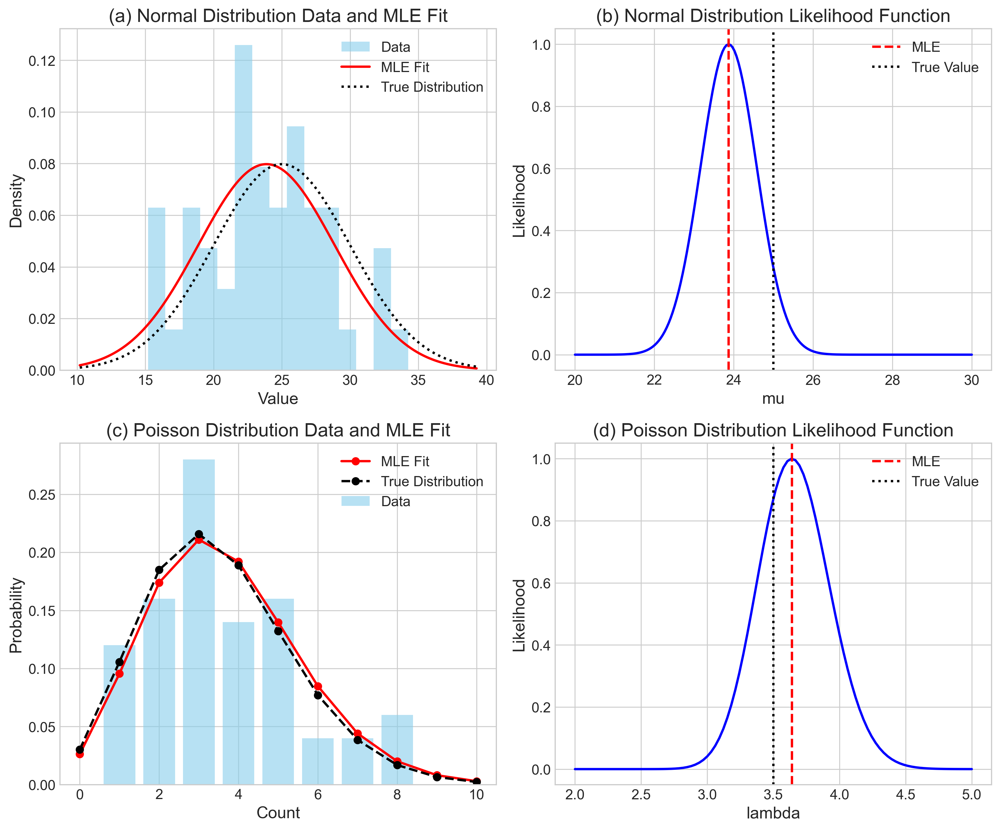

# Lecture 2.4: Maximum Likelihood Estimation Quiz

## Overview
This quiz contains 25 questions from different topics covered in section 2.4 of the lectures on Maximum Likelihood Estimation.

## Question 1

### Problem Statement
Suppose we have i.i.d. random variables $X_1, X_2, \ldots, X_n$ with the following probability density function:

$$f(x|\theta) = \begin{cases} 
\frac{\theta x^{\theta-1}}{3^{\theta}} & \text{for } 0 \leq x < 3 \\
0 & \text{otherwise}
\end{cases}$$

where $\theta$ is the shape parameter to be estimated. Using MLE, we can estimate the true value of $\theta$ based on the observed data.

In this example:
- We have n independent and identically distributed (i.i.d.) random variables
- Each $X_i$ follows the given density function
- MLE estimates the shape parameter $\theta$
- The analysis relies solely on the observed data without prior assumptions

#### Task
Calculate the maximum likelihood estimator $\hat{\theta}_{MLE}$ for the shape parameter $\theta$.

For a detailed explanation of this problem, including the step-by-step derivation, visual aids, and a simplified calculation method, see [Question 1: Maximum Likelihood Estimation for Power Law Distributions](L2_4_1_explanation.md).

## Question 2

### Problem Statement
Consider a dataset of n independent observations $X_1, X_2, \ldots, X_n$ from a normal distribution with unknown mean $\mu$ and known variance $\sigma^2 = 4$. The probability density function is:

$$f(x|\mu) = \frac{1}{2\sqrt{2\pi}} e^{-\frac{(x-\mu)^2}{8}}$$

#### Task
1. Write down the likelihood function $L(\mu)$ for the given observations
2. Find the maximum likelihood estimator $\hat{\mu}_{MLE}$ for $\mu$
3. Show that this estimator is unbiased

For a detailed explanation, see [Question 2: MLE for Normal Distribution](L2_4_2_explanation.md).

## Question 3

### Problem Statement
You are given a dataset of n independent Bernoulli trials $X_1, X_2, \ldots, X_n$ where each $X_i$ takes value 1 with probability p and 0 with probability 1-p. The probability mass function is:

$$f(x|p) = p^x(1-p)^{1-x}$$

#### Task
1. Derive the maximum likelihood estimator $\hat{p}_{MLE}$ for the probability p
2. Calculate the Fisher information $I(p)$ for this model
3. What is the asymptotic variance of $\hat{p}_{MLE}$?

For a detailed explanation, see [Question 3: MLE for Bernoulli Distribution](L2_4_3_explanation.md).

## Question 4

### Problem Statement
Consider a dataset of n independent observations from an exponential distribution with rate parameter $\lambda$. The probability density function is:

$$f(x|\lambda) = \lambda e^{-\lambda x} \text{ for } x \geq 0$$

#### Task
1. Find the maximum likelihood estimator $\hat{\lambda}_{MLE}$ for $\lambda$
2. Show that this estimator is consistent
3. Calculate the mean squared error (MSE) of $\hat{\lambda}_{MLE}$

For a detailed explanation, see [Question 4: MLE for Exponential Distribution](L2_4_4_explanation.md).

## Question 5

### Problem Statement
Consider a dataset of n independent observations $X_1, X_2, \ldots, X_n$ from a Poisson distribution with unknown rate parameter $\lambda$. The probability mass function is:

$$f(x|\lambda) = \frac{\lambda^x e^{-\lambda}}{x!} \text{ for } x = 0, 1, 2, \ldots$$

#### Task
1. Derive the maximum likelihood estimator $\hat{\lambda}_{MLE}$ for $\lambda$
2. Show that this estimator is efficient
3. Calculate the asymptotic distribution of $\hat{\lambda}_{MLE}$

For a detailed explanation, see [Question 5: MLE for Poisson Distribution](L2_4_5_explanation.md).

## Question 6

### Problem Statement
Suppose we have a dataset of n independent observations from a uniform distribution on the interval $[0, \theta]$, where $\theta$ is an unknown parameter. The probability density function is:

$$f(x|\theta) = \begin{cases} 
\frac{1}{\theta} & \text{for } 0 \leq x \leq \theta \\
0 & \text{otherwise}
\end{cases}$$

#### Task
1. Find the maximum likelihood estimator $\hat{\theta}_{MLE}$ for $\theta$
2. Show that this estimator is biased
3. Propose an unbiased estimator based on $\hat{\theta}_{MLE}$

For a detailed explanation, see [Question 6: MLE for Uniform Distribution](L2_4_6_explanation.md).

## Question 7

### Problem Statement
Consider a dataset of n independent observations from a gamma distribution with known shape parameter $\alpha = 2$ and unknown rate parameter $\beta$. The probability density function is:

$$f(x|\beta) = \frac{\beta^2 x e^{-\beta x}}{\Gamma(2)} \text{ for } x > 0$$

#### Task
1. Derive the maximum likelihood estimator $\hat{\beta}_{MLE}$ for $\beta$
2. Calculate the Fisher information $I(\beta)$
3. Construct an approximate 95% confidence interval for $\beta$

For a detailed explanation, see [Question 7: MLE for Gamma Distribution](L2_4_7_explanation.md).

## Question 8

### Problem Statement
You are given a dataset of n independent observations from a mixture of two normal distributions with equal mixing proportions. The probability density function is:

$$f(x|\mu_1, \mu_2, \sigma) = \frac{1}{2} \left( \frac{1}{\sqrt{2\pi}\sigma} e^{-\frac{(x-\mu_1)^2}{2\sigma^2}} + \frac{1}{\sqrt{2\pi}\sigma} e^{-\frac{(x-\mu_2)^2}{2\sigma^2}} \right)$$

where $\mu_1$ and $\mu_2$ are unknown means and $\sigma$ is known.

#### Task
1. Write down the log-likelihood function for this model
2. Derive the score equations for $\mu_1$ and $\mu_2$
3. Discuss the challenges in finding the MLE for this model and propose a solution

For a detailed explanation, see [Question 8: MLE for Mixture of Normals](L2_4_8_explanation.md).

## Question 9

### Problem Statement
A data scientist is studying the number of attempts needed before the first success in a series of independent trials. The data follows a geometric distribution with parameter $p$ (probability of success on each trial). The probability mass function is:

$$f(x|p) = p(1-p)^{x-1} \text{ for } x = 1, 2, 3, \ldots$$

The scientist observes the following number of attempts until first success in 8 independent experiments: 3, 1, 4, 2, 5, 2, 1, 3.

#### Task
1. Derive the maximum likelihood estimator $\hat{p}_{MLE}$ for the parameter $p$
2. Calculate the numerical value of $\hat{p}_{MLE}$ for the given data
3. Calculate the expected number of trials until first success using your MLE estimate
4. Find the variance of the number of trials based on your MLE estimate

For a detailed explanation, see [Question 9: MLE for Geometric Distribution](L2_4_9_explanation.md).

## Question 10

### Problem Statement
A researcher is analyzing the number of defects in fabric samples of a fixed size. Two models are being considered:

1. **Model A**: Poisson distribution with parameter $\lambda$ (defects follow a Poisson distribution)
2. **Model B**: Negative binomial distribution with parameters $r=2$ and $p$ (defects follow a negative binomial distribution)

The following defect counts were observed in 10 fabric samples: 0, 1, 2, 3, 1, 0, 2, 4, 1, 2.

#### Task
1. Find the maximum likelihood estimate for $\lambda$ under Model A
2. Find the maximum likelihood estimate for $p$ under Model B (with fixed $r=2$)
3. Calculate the log-likelihood for each model using the respective MLE
4. Perform a likelihood ratio test to determine which model better fits the data
5. If you were to use the Akaike Information Criterion (AIC) for model selection, which model would you choose? (Hint: AIC = 2k - 2ln(L) where k is the number of parameters and L is the maximized likelihood value)

For a detailed explanation, see [Question 10: Likelihood Ratio Testing for Model Selection](L2_4_10_explanation.md).

## Question 11

### Problem Statement
A marketing analyst is investigating the relationship between advertising expenditure (x, in thousands of dollars) and sales (y, in thousands of units). The analyst proposes a simple linear regression model:

$$y_i = \beta_0 + \beta_1 x_i + \varepsilon_i$$

where $\varepsilon_i \sim N(0, \sigma^2)$ are independent error terms. The following data has been collected:

| Advertising ($x_i$, '000s $) | Sales ($y_i$, '000s units) |
|-------------------------------|----------------------------|
| 1.0                           | 2.1                        |
| 2.0                           | 3.5                        |
| 3.0                           | 4.5                        |
| 4.0                           | 5.8                        |
| 5.0                           | 6.3                        |

#### Task
1. Write down the likelihood function for this regression model, assuming normally distributed errors
2. Derive the maximum likelihood estimators for the parameters $\beta_0$ and $\beta_1$
3. Calculate the numerical values of $\hat{\beta}_0$ and $\hat{\beta}_1$ for the given data
4. Show that the MLE of $\sigma^2$ is given by $\hat{\sigma}^2 = \frac{1}{n}\sum_{i=1}^{n}(y_i - \hat{\beta}_0 - \hat{\beta}_1 x_i)^2$
5. Calculate the numerical value of $\hat{\sigma}^2$ for the given data

For a detailed explanation, see [Question 11: MLE for Linear Regression](L2_4_11_explanation.md).

## Question 12

### Problem Statement
You are analyzing the conversion rate (proportion of visitors who make a purchase) on an e-commerce website. In a sample of 20 visitors, you observe 4 conversions.

#### Task
1. Calculate the maximum likelihood estimate (MLE) for the conversion rate $p$
2. A colleague suggests incorporating prior knowledge through Bayesian estimation. If we assume a Beta(2,8) prior for $p$ (reflecting our prior belief that the conversion rate is around 20%), calculate the maximum a posteriori (MAP) estimate
3. Compare and explain the difference between the MLE and MAP estimates
4. Suppose we continue collecting data, and in a total sample of 200 visitors, we observe 40 conversions (including the original 4). Calculate the new MLE and MAP estimates (using the same prior)
5. Explain how the discrepancy between MLE and MAP changes as we collect more data, and discuss the asymptotic properties of both estimators

For a detailed explanation, see [Question 12: Comparing MLE and Bayesian Estimation](L2_4_12_explanation.md).

## Question 13

### Problem Statement
A data scientist is analyzing the click-through rate (CTR) for a website feature. The CTR is modeled as a Beta distribution. From a previous A/B test, they collected the following 10 daily CTRs (as proportions): 0.12, 0.15, 0.11, 0.14, 0.13, 0.16, 0.12, 0.14, 0.13, and 0.15.

#### Task
1. Explain why the Beta distribution is appropriate for modeling CTR data
2. Although Beta distribution MLEs require numerical methods, you can use the method of moments to estimate the parameters α and β. Calculate these estimates using:
   - $$\hat{\alpha} = \bar{x}\left(\frac{\bar{x}(1-\bar{x})}{s^2} - 1\right)$$
   - $$\hat{\beta} = (1-\bar{x})\left(\frac{\bar{x}(1-\bar{x})}{s^2} - 1\right)$$
   where $\bar{x}$ is the sample mean and $s^2$ is the sample variance
3. Calculate the estimated mean and variance of the CTR using your parameter estimates
4. Based on your Beta distribution fit, calculate the probability that the true CTR exceeds 0.15

For a detailed explanation, see [Question 13: MLE for Beta Distribution](L2_4_13_explanation.md).

## Question 14

### Problem Statement
A marketing analyst is studying customer preferences for five different product features (A, B, C, D, E) through a survey. Each customer was asked to select their favorite feature. From a sample of 500 customers, the following preferences were recorded:
- Feature A: 145 customers
- Feature B: 95 customers
- Feature C: 120 customers
- Feature D: 85 customers
- Feature E: 55 customers

#### Task
1. Explain why a multinomial distribution is suitable for modeling this data
2. Derive the maximum likelihood estimator for the multinomial distribution parameters
3. Calculate the MLE estimates for the probability of each feature being selected
4. Construct 95% confidence intervals for each of the five feature preference probabilities
5. Based on your MLE analysis, can we conclude that Feature A is significantly more popular than Feature B? Justify your answer using the confidence intervals.

For a detailed explanation, see [Question 14: MLE for Multinomial Distribution](L2_4_14_explanation.md).

## Question 15

### Problem Statement
An important concept in maximum likelihood estimation is the Fisher information, which quantifies how much information an observable random variable carries about an unknown parameter. The Cramér-Rao lower bound uses Fisher information to establish a lower bound on the variance of any unbiased estimator.

#### Task
1. For a random sample of size n from a Bernoulli distribution with parameter p, derive the Fisher information I(p)
2. Calculate the Cramér-Rao lower bound for the variance of any unbiased estimator of p
3. Show that the MLE estimator $\hat{p} = \frac{1}{n}\sum_{i=1}^{n}X_i$ achieves this lower bound, making it an efficient estimator
4. For a random sample of size n=100 from a Bernoulli distribution with true parameter p=0.3:
   a. What is the theoretical minimum variance for any unbiased estimator?
   b. What is the standard error of the MLE estimator?
   c. Calculate the 95% confidence interval for the parameter p

For a detailed explanation, see [Question 15: Fisher Information and Efficiency of MLE](L2_4_15_explanation.md).

## Question 16

### Problem Statement
Maximum Likelihood Estimators have important asymptotic properties that make them particularly valuable in statistical inference. These properties include consistency, asymptotic normality, and asymptotic efficiency.

#### Task
1. Explain the following asymptotic properties of Maximum Likelihood Estimators:
   a. Consistency
   b. Asymptotic normality
   c. Asymptotic efficiency
2. Consider a random sample $X_1, X_2, \ldots, X_n$ from an exponential distribution with parameter $\lambda$ (rate parameter). The probability density function is $f(x|\lambda) = \lambda e^{-\lambda x}$ for $x \geq 0$.
   a. Derive the maximum likelihood estimator $\hat{\lambda}_{MLE}$ for $\lambda$
   b. Show that $\hat{\lambda}_{MLE}$ is a consistent estimator of $\lambda$
   c. Determine the asymptotic distribution of $\hat{\lambda}_{MLE}$ as $n \to \infty$
   d. For a sample size of n=50 and true parameter $\lambda=0.5$, what is the approximate probability that the MLE estimate falls within 10% of the true value?

For a detailed explanation, see [Question 16: Asymptotic Properties of MLE](L2_4_16_explanation.md).

## Question 17

### Problem Statement
A quality control engineer is testing a new manufacturing process. They randomly sample 20 items from the production line and find that 3 of them are defective. Assuming each item independently follows a Bernoulli distribution (where 1 represents a defective item and 0 represents a non-defective item):

#### Task
1. Calculate the maximum likelihood estimate for the probability p of producing a defective item
2. Calculate the standard error of your estimate
3. Write the formula for a 95% confidence interval for p

For a detailed explanation, see [Question 17: MLE for Bernoulli Distribution in Quality Control](L2_4_17_explanation.md).

## Question 18

### Problem Statement
A data analyst is studying the waiting time (in minutes) between customer arrivals at a coffee shop. They collect the following data for 6 consecutive customer arrivals: 2.5, 1.8, 3.2, 2.0, 2.7, and 1.5 minutes. Assuming the waiting times follow an exponential distribution:

#### Task
1. Calculate the maximum likelihood estimate for the rate parameter λ
2. What is the MLE estimate for the mean waiting time?
3. What is the MLE estimate for the standard deviation of the waiting time?

For a detailed explanation, see [Question 18: MLE for Exponential Distribution in Queue Analysis](L2_4_18_explanation.md).

## Question 19

### Problem Statement
A data scientist is analyzing the distribution of daily exercise durations (in minutes) for participants in a fitness study. They suspect the data follows a uniform distribution between 0 and some unknown maximum value θ. The following daily exercise durations were recorded for 8 participants: 15, 22, 18, 25, 20, 17, 23, and 19 minutes.

#### Task
1. Calculate the maximum likelihood estimate for θ
2. Show why this MLE estimator is biased
3. Give the formula for an unbiased estimator for θ based on the MLE
4. Calculate the value of the unbiased estimator

For a detailed explanation, see [Question 19: MLE for Uniform Distribution in Exercise Analysis](L2_4_19_explanation.md).

## Question 20

### Problem Statement
A restaurant manager is analyzing the number of customers who walk in without reservations each evening. Over a week (7 days), they observe the following counts: 6, 8, 5, 7, 9, 12, and 10 walk-in customers. Assuming the number of walk-in customers follows a Poisson distribution:

#### Task
1. Calculate the maximum likelihood estimate for the rate parameter λ
2. Interpret what this parameter represents in the context of the problem
3. Calculate the probability of having exactly 11 walk-in customers on a given evening using your MLE estimate
4. Calculate a 95% confidence interval for λ

For a detailed explanation, see [Question 20: MLE for Poisson Distribution in Customer Analysis](L2_4_20_explanation.md).

## Question 21

### Problem Statement
The following figure illustrates Maximum Likelihood Estimation (MLE) applied to two different probability distributions: Normal and Poisson. Each row represents a different distribution, while the columns show the data with fitted distributions and the corresponding likelihood functions.

#### Task
Given the visualizations:

1. For the normal distribution (panels a and b), what is the relationship between the sample mean and the maximum likelihood estimate (MLE)? Explain why this relationship exists
2. For the Poisson distribution (panels c and d), analyze the difference between the MLE fit and the true distribution. What parameter is being estimated, and what is the formula for the MLE estimator?
3. Examine the likelihood functions in panels (b) and (d). Explain how these functions are used to determine the MLE, and discuss the uncertainty associated with each estimate.
4. The dataset for the normal distribution has a true mean of $\mu = 25.0$ but an MLE of approximately $\hat{\mu}_{MLE} \approx 23.9$. Explain this discrepancy in terms of sampling error and the properties of maximum likelihood estimators.

For a detailed explanation, see [Question 21: Visual Analysis of Maximum Likelihood Estimation](L2_4_21_explanation.md).

## Question 22

### Problem Statement
Suppose we have samples $x_1=0$, $x_2=0$, $x_3=1$, $x_4=1$, $x_5=0$ from a Bernoulli distribution with unknown parameter $\theta$, where $\theta \in (0, 1)$.

#### Task
1. Find the maximum likelihood estimator $\hat{\theta}_{MLE}$ for the parameter $\theta$.
2. Suppose you are asked to select $\theta$ from the set $\{0.2, 0.5, 0.7\}$. Which value would be chosen according to the MLE principle?

For a detailed explanation, see [Question 22: MLE for Bernoulli Distribution with Small Sample](L2_4_22_explanation.md).

## Question 23

### Problem Statement
A random sample of size $8$ — $X_1 = 1$, $X_2 = 0$, $X_3 = 1$, $X_4 = 1$, $X_5 = 0$, $X_6 = 1$, $X_7 = 1$, and $X_8 = 0$ — is taken from the probability function:

$$p_X(k; \theta) = \theta^k (1-\theta)^{1-k}, \quad k = 0, 1; \quad 0 < \theta < 1$$

#### Task
Find the maximum likelihood estimate for $\theta$.

For a detailed explanation, see [Question 23: MLE for Bernoulli Distribution](L2_4_23_explanation.md).

## Question 24

### Problem Statement
Consider the exponential random variable $X$ with parameter $\lambda > 0$:

$$P_X(x) = \lambda \exp\{-\lambda x\}, \quad x \geq 0$$

#### Task
Given a sample $\mathcal{D} = \{x_1, \ldots, x_n\}$, what is the ML estimate of $\lambda$?

For a detailed explanation, see [Question 24: MLE for Exponential Distribution](L2_4_24_explanation.md).

## Question 25

### Problem Statement
Let $X_1, ..., X_n$ be iid from the distribution with the following probability density function:
$$f(x) = \frac{3x^2}{\theta^3}, \quad 0 \leq x \leq \theta.$$

#### Task
Find the MLE of $\theta$.

For a detailed explanation, see [Question 25: MLE for Power Distribution](L2_4_25_explanation.md).
