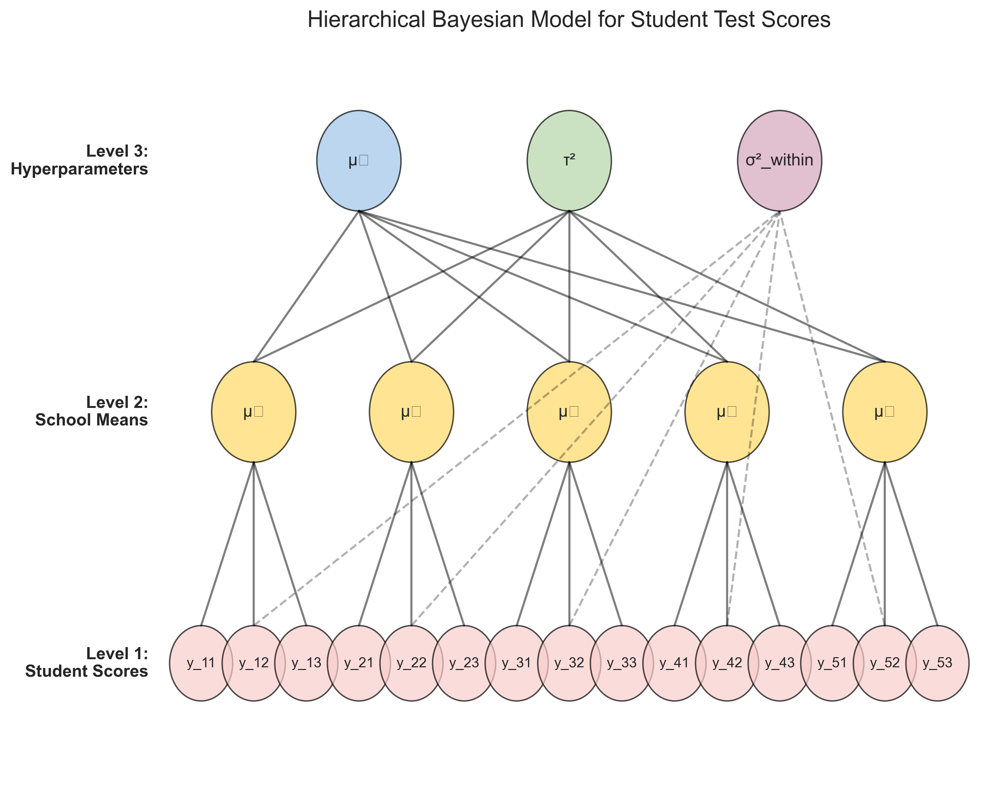
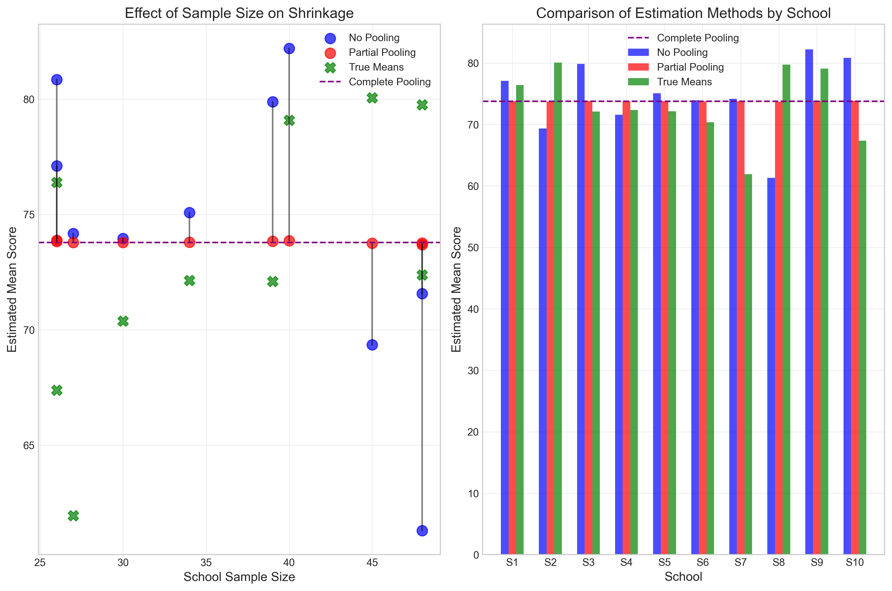
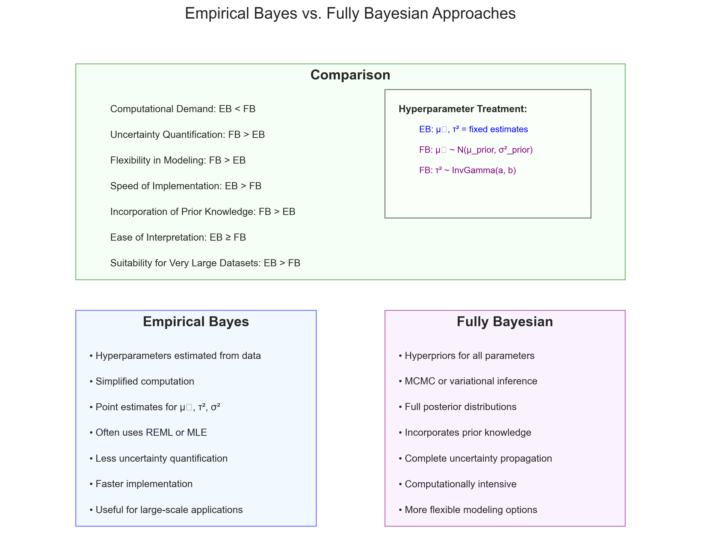

# Question 10: Hierarchical Bayesian Models for Educational Data

## Problem Statement
Consider a simple hierarchical Bayesian model for analyzing students' test scores across different schools.

## Tasks
1. Describe the basic structure of a two-level hierarchical Bayesian model for this scenario
2. Explain one advantage of using a hierarchical model versus a non-hierarchical model in this context
3. Identify a scenario where empirical Bayes might be used instead of a fully Bayesian approach

## Solution

### Task 1: Two-Level Hierarchical Bayesian Model Structure

A hierarchical Bayesian model for student test scores acknowledges the natural grouping structure in educational data, where students are nested within schools. The two-level structure explicitly models both within-school and between-school variation.

The model has the following structure:

**Level 1 (Student Level):**
For student $j$ in school $i$:
$$y_{ij} \sim \text{Normal}(\mu_i, \sigma^2_{\text{within}})$$

Where:
- $y_{ij}$ is the test score of student $j$ in school $i$
- $\mu_i$ is the mean score for school $i$
- $\sigma^2_{\text{within}}$ is the variance of scores within schools (often assumed to be the same across schools for simplicity)

**Level 2 (School Level):**
For each school $i$:
$$\mu_i \sim \text{Normal}(\mu_0, \tau^2)$$

Where:
- $\mu_0$ is the overall mean score across all schools
- $\tau^2$ is the between-school variance

**Hyperpriors (for full Bayesian analysis):**
- $\mu_0 \sim \text{Normal}(\mu_{\text{prior}}, \sigma^2_{\text{prior}})$ - Prior for overall mean
- $\tau^2 \sim \text{InvGamma}(a, b)$ - Prior for between-school variance
- $\sigma^2_{\text{within}} \sim \text{InvGamma}(c, d)$ - Prior for within-school variance

This diagram illustrates the hierarchical structure of the model, with:
- Level 1 (bottom): Individual student scores (red circles)
- Level 2 (middle): School-specific means (yellow circles)
- Level 3 (top): Hyperparameters governing the distribution of school means and within-school variance (blue, green, and purple circles)

The arrows represent the dependency relationships in the model. Each student's score depends on their school's mean and the within-school variance. Each school's mean depends on the overall mean ($\mu_0$) and between-school variance ($\tau^2$).

### Task 2: Advantages of Hierarchical Models

There are several advantages to using a hierarchical Bayesian model over separate non-hierarchical models for each school, but the most significant is what statisticians call **partial pooling** or the **shrinkage effect**.

#### Partial Pooling / Shrinkage Effect

In a hierarchical model, estimates of school means are "shrunk" toward the overall mean, with the amount of shrinkage depending on:
1. The sample size within each school
2. The relative magnitudes of within-school and between-school variance

This offers a principled middle ground between two extreme approaches:
- **No pooling**: Estimating each school's mean independently using only data from that school
- **Complete pooling**: Assuming all schools have the same mean (the grand mean)

As demonstrated in the figure, the partial pooling approach (red dots) strikes a balance between the no-pooling approach (blue dots) and the complete pooling approach (purple line). Schools with smaller sample sizes are pulled more strongly toward the grand mean, while schools with larger sample sizes maintain estimates closer to their sample means.

The benefits of this partial pooling include:

1. **Improved Accuracy**: For schools with small sample sizes, hierarchical models provide more accurate estimates by borrowing information from other schools
2. **Reduced Overfitting**: Shrinkage helps prevent overfitting to noise in small schools while preserving genuine differences in large schools
3. **Better Predictive Performance**: Hierarchical estimates typically have better predictive performance for future students in the same schools

In our simulation, we can see that schools with smaller sample sizes (below 30 students) experience more shrinkage toward the grand mean, while schools with larger samples maintain estimates closer to their observed means.

### Task 3: When to Use Empirical Bayes Instead of Fully Bayesian

**Empirical Bayes** is a hybrid approach where hyperparameters (like $\mu_0$ and $\tau^2$) are estimated from the data rather than assigned prior distributions as in a fully Bayesian approach. In empirical Bayes, these estimated hyperparameters are then treated as fixed when inferring school-specific parameters.

Scenarios where empirical Bayes might be preferred:

#### 1. Computational Constraints

When working with very large datasets (thousands of schools or millions of students), full Bayesian inference can be computationally intensive. In educational research, standardized testing data often involves massive datasets where:
- The number of students can reach into the millions
- The hierarchical structure may be complex (e.g., students within classrooms within schools within districts)

In these cases, empirical Bayes offers a more computationally efficient alternative while still capturing the hierarchical structure of the data.

#### 2. Weak Prior Information

When there is little reliable prior information about hyperparameters, or when stakeholders are reluctant to incorporate subjective prior beliefs, empirical Bayes can be a pragmatic compromise. This is particularly relevant in educational contexts where:
- Policy decisions may be based on the analysis
- Results need to be defended to various stakeholders (parents, school boards, etc.)
- The focus is on what the data reveals rather than incorporating prior knowledge

#### 3. Routine Analysis in Educational Research

For standardized reporting of educational outcomes, a consistent methodology is often required. Empirical Bayes can be more straightforward to implement in production systems for:
- Regular reporting of school performance metrics
- Year-over-year comparisons of school rankings
- Systems that need to be maintained by different analysts over time

#### 4. Exploration Before Full Modeling

As an initial analysis before developing a more complex fully Bayesian model, empirical Bayes can help:
- Identify which hierarchical structure best fits the data
- Diagnose potential modeling issues
- Provide quick preliminary results to guide further analysis

## Conclusion

Hierarchical Bayesian models provide a powerful framework for analyzing educational data by acknowledging the nested structure of students within schools. The key advantage of these models is partial pooling, which improves the accuracy of estimates, especially for schools with small sample sizes, by borrowing information from other schools. Empirical Bayes can be a practical alternative to fully Bayesian approaches when computational resources are limited, prior information is weak, consistency in routine analysis is required, or as a preliminary step in model development.

This approach has been successfully applied to educational data for school performance evaluation, value-added assessment of teachers, and understanding factors that contribute to educational outcomes at both student and school levels. 