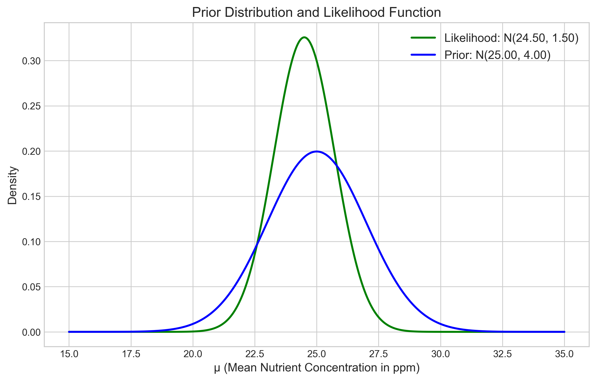
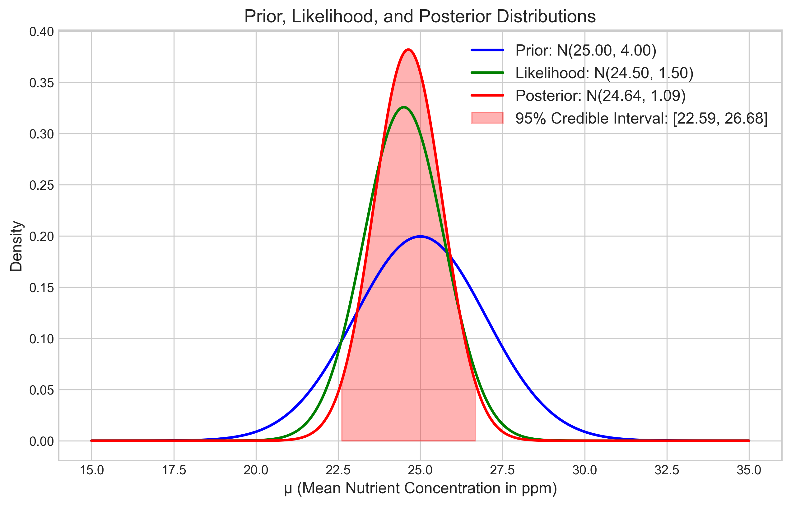
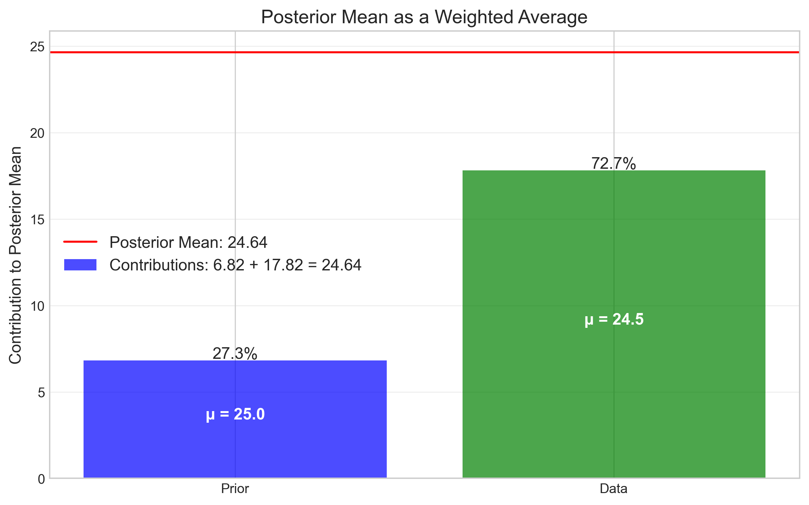
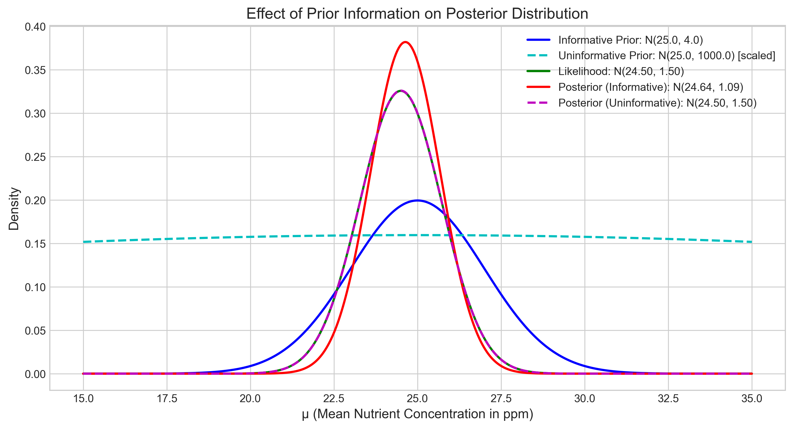

# Question 11: Informative vs Noninformative Priors

## Problem Statement
A soil scientist is developing a Bayesian model to predict soil nutrient content. Based on previous studies at similar sites, the nutrient concentration follows a normal distribution with unknown mean $\mu$.

## Task
1. If the scientist uses a normal prior for $\mu$ with mean 25 ppm and variance 4, and then collects 6 samples with measurements $\{22, 27, 24, 23, 26, 25\}$ ppm and known measurement variance $\sigma^2 = 9$, what is the posterior distribution for $\mu$?
2. Calculate the posterior mean and variance.
3. Compare how the posterior would differ if an uninformative prior had been used instead.

## Solution

### Step 1: Understanding the Problem

We have:
- A normal prior distribution for the mean nutrient concentration $\mu$ with parameters:
  - Prior mean: $\mu_0 = 25$ ppm
  - Prior variance: $\sigma_0^2 = 4$
- Six measurements: $\{22, 27, 24, 23, 26, 25\}$ ppm, with sample mean $\bar{x} = 24.5$ ppm
- Known measurement variance: $\sigma^2 = 9$

We need to find the posterior distribution of $\mu$ given the data, and then investigate how this would change if we had used an uninformative prior instead.

### Step 2: Normal-Normal Conjugate Relationship

For a normal likelihood with known variance, a normal prior is conjugate. This means our posterior distribution will also be normal.

The relationship is:
- Prior: $\mu \sim N(\mu_0, \sigma_0^2)$
- Likelihood (for each observation): $x_i | \mu \sim N(\mu, \sigma^2)$
- Posterior: $\mu | data \sim N(\mu_n, \sigma_n^2)$

Where:
$$\sigma_n^2 = \frac{1}{\frac{1}{\sigma_0^2} + \frac{n}{\sigma^2}}$$

$$\mu_n = \sigma_n^2 \left(\frac{\mu_0}{\sigma_0^2} + \frac{n\bar{x}}{\sigma^2}\right)$$

The figure above shows:
- The prior distribution (blue) centered at 25 ppm with a moderate spread
- The likelihood function (green) centered at the sample mean 24.5 ppm

### Step 3: Calculating the Posterior Distribution

Plugging in the values:
- Prior mean: $\mu_0 = 25$ ppm
- Prior variance: $\sigma_0^2 = 4$
- Sample mean: $\bar{x} = 24.5$ ppm
- Known variance: $\sigma^2 = 9$
- Sample size: $n = 6$

First, calculate the posterior precision (inverse of variance):
$$\frac{1}{\sigma_n^2} = \frac{1}{4} + \frac{6}{9} = 0.25 + 0.6667 = 0.9167$$

Therefore, the posterior variance is:
$$\sigma_n^2 = \frac{1}{0.9167} = 1.0909$$

Next, calculate the posterior mean:
$$\mu_n = 1.0909 \times \left(\frac{25}{4} + \frac{6 \times 24.5}{9}\right) = 1.0909 \times (6.25 + 16.3333) = 24.6364$$

So our posterior distribution is:
$$\mu | data \sim N(24.6364, 1.0909)$$

With a standard deviation of $\sigma_n = 1.0445$ ppm.

The 95% credible interval is $[22.5892, 26.6835]$ ppm.

The figure shows:
- The prior distribution (blue)
- The likelihood function (green)
- The posterior distribution (red), which falls between the prior and likelihood but closer to the likelihood
- The 95% credible interval (shaded red area)

### Step 4: Posterior Mean as a Weighted Average

The posterior mean can be understood as a precision-weighted average of the prior mean and the sample mean:

$$\mu_n = w_1 \mu_0 + w_2 \bar{x}$$

Where:
- $w_1 = \frac{\frac{1}{\sigma_0^2}}{\frac{1}{\sigma_0^2} + \frac{n}{\sigma^2}} = \frac{0.25}{0.9167} = 0.2727$ (27.3% weight to prior)
- $w_2 = \frac{\frac{n}{\sigma^2}}{\frac{1}{\sigma_0^2} + \frac{n}{\sigma^2}} = \frac{0.6667}{0.9167} = 0.7273$ (72.7% weight to data)

Calculating the weighted average:
$$\mu_n = 0.2727 \times 25 + 0.7273 \times 24.5 = 6.8182 + 17.8182 = 24.6364$$

This visualization shows:
- The data contributes 72.7% to the posterior mean
- The prior contributes 27.3% to the posterior mean
- Their weighted sum equals the posterior mean of 24.6364 ppm

### Step 5: Comparison with Uninformative Prior

An uninformative prior can be approximated by a normal distribution with a very large variance. We used a variance of 1000 to represent an uninformative prior.

With an uninformative prior:
- Posterior mean: 24.5007 ppm (very close to the sample mean of 24.5 ppm)
- Posterior variance: 1.4978 (close to the variance of the sample mean, $\sigma^2/n = 9/6 = 1.5$)
- Posterior standard deviation: 1.2238
- 95% credible interval: [22.1021, 26.8994] ppm (wider than with the informative prior)

The figure illustrates:
- The informative prior (blue solid line) versus the uninformative prior (cyan dashed line, scaled to be visible)
- The likelihood function (green)
- The posterior with informative prior (red solid line)
- The posterior with uninformative prior (magenta dashed line)

### Step 6: Key Insights

1. **Prior Information's Impact**: The informative prior pulls the estimate toward 25 ppm, but the data (with sample mean 24.5 ppm) still has more influence due to its higher precision.

2. **Precision Weighting**: The posterior combines information from both the prior and the data, weighted by their respective precisions. With 6 samples and the given variances, the data receives about 73% of the weight.

3. **Uninformative Prior Effect**: With an uninformative prior, the posterior mean essentially becomes the sample mean, and the posterior variance approaches the variance of the sample mean ($\sigma^2/n$).

4. **Uncertainty Reduction**: The posterior variance (1.0909) is smaller than both the prior variance (4) and the variance of the sample mean (1.5), demonstrating how Bayesian updating reduces uncertainty by combining information sources.

5. **Credible Interval Width**: The uninformative prior leads to wider credible intervals, reflecting increased uncertainty when we don't incorporate prior knowledge.

## Conclusion

The soil scientist's Bayesian analysis leads to the posterior distribution $N(24.6364, 1.0909)$ for the mean nutrient concentration. With 95% credibility, the true mean concentration is between 22.59 and 26.68 ppm.

When comparing informative and uninformative priors, we observe that:
1. An informative prior pulls the estimate toward the prior mean (25 ppm)
2. An uninformative prior results in a posterior mean closer to the sample mean (24.5 ppm)
3. The credible interval is narrower with an informative prior, reflecting reduced uncertainty
4. As sample size increases, the impact of the prior diminishes, with data eventually dominating the estimate

This example demonstrates how Bayesian inference allows scientists to incorporate prior knowledge from previous studies while still being responsive to new data, providing a balanced estimate of the true nutrient concentration. 