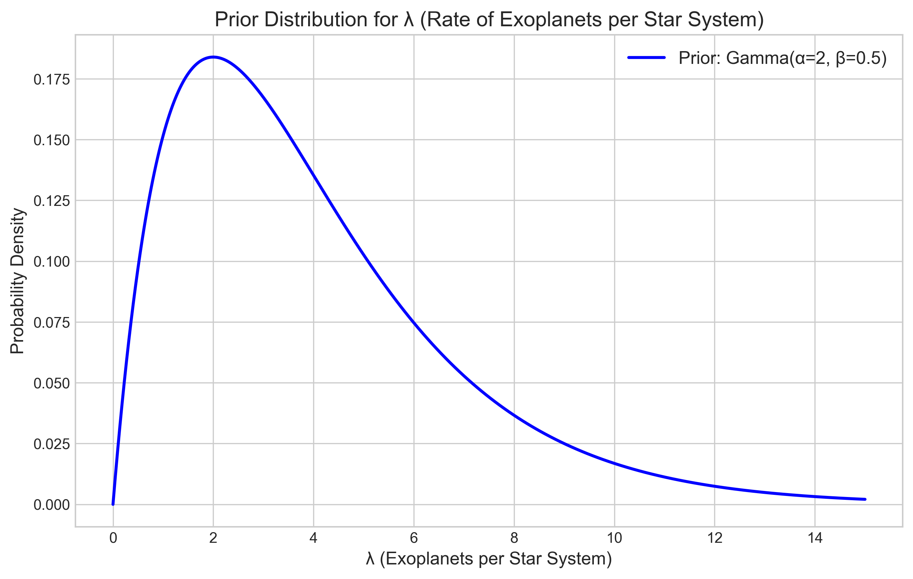
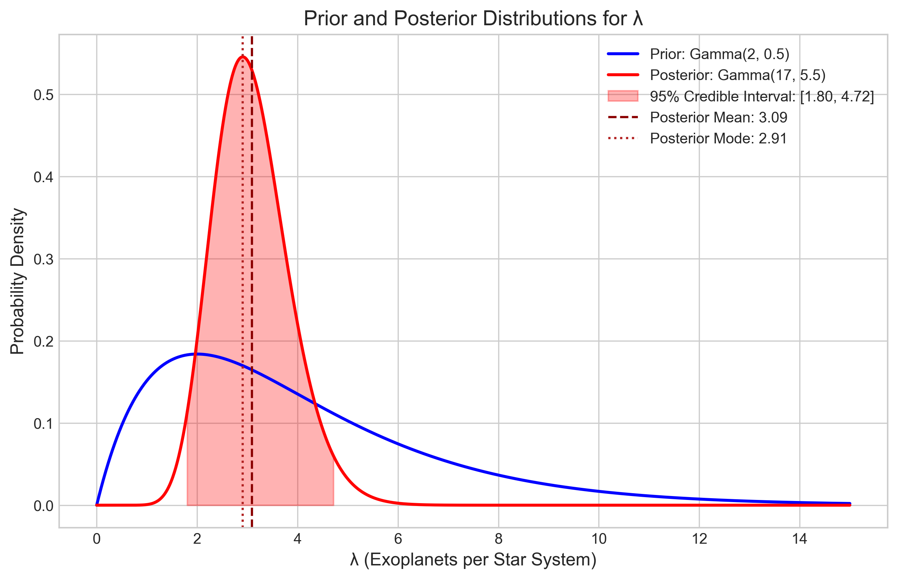
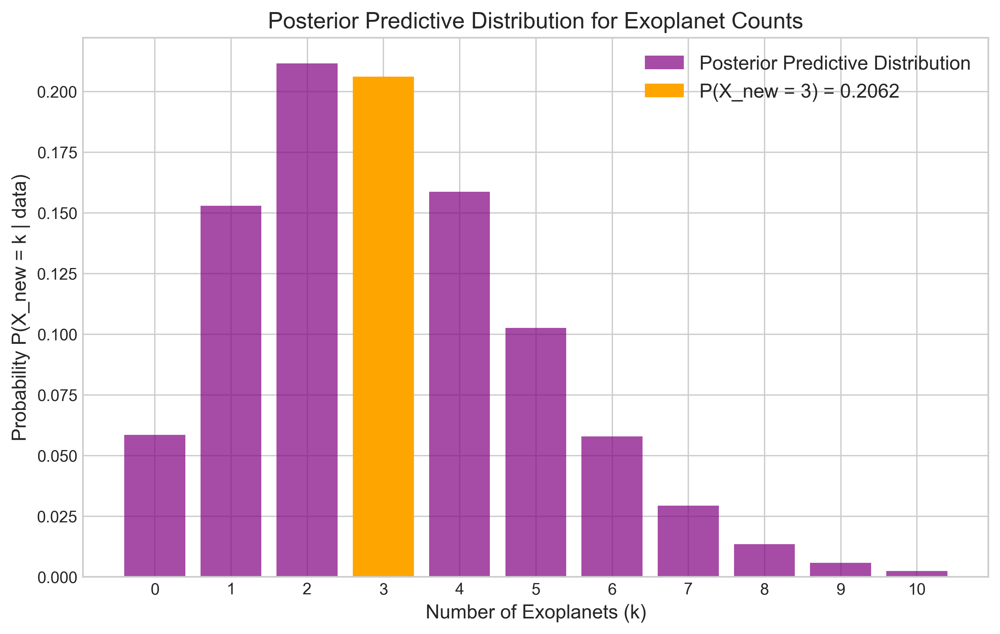
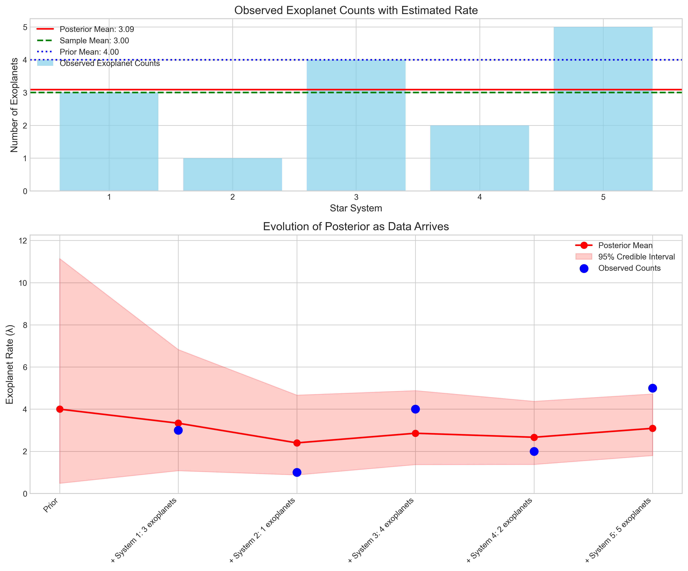

# Question 12: Posterior Predictive Distribution

## Problem Statement
In astronomy, researchers are modeling the number of exoplanets in different star systems. They believe the count follows a Poisson distribution with an unknown rate parameter $\lambda$.

## Task
1. Given that Gamma is the conjugate prior for the Poisson distribution, express the posterior distribution if the prior is $\text{Gamma}(\alpha=2, \beta=0.5)$ and observations from 5 star systems show $\{3, 1, 4, 2, 5\}$ exoplanets.
2. What is the posterior mean of $\lambda$?
3. What is the posterior predictive probability of finding exactly 3 exoplanets in the next observed star system?

## Solution

### Step 1: Understanding the Problem

We have:
- A Poisson model for exoplanet counts with unknown rate parameter $\lambda$
- A Gamma prior: $\lambda \sim \text{Gamma}(\alpha=2, \beta=0.5)$
- Observed data: $\{3, 1, 4, 2, 5\}$ exoplanets in 5 star systems
- Total count: 15 exoplanets
- Sample mean: 3.0 exoplanets per system

We need to determine the posterior distribution for $\lambda$, calculate its mean, and find the probability of observing exactly 3 exoplanets in the next star system.

### Step 2: Poisson-Gamma Conjugate Relationship

For count data following a Poisson distribution, the Gamma distribution is the conjugate prior. This means that when we update our prior belief with observed data, the posterior will also follow a Gamma distribution, just with updated parameters.

The relevant distributions are:
- Poisson likelihood: $P(X = k | \lambda) = e^{-\lambda} \cdot \lambda^k / k!$
- Gamma prior: $p(\lambda) = \text{Gamma}(\lambda | \alpha, \beta) = \frac{\beta^\alpha}{\Gamma(\alpha)} \cdot \lambda^{\alpha-1} \cdot e^{-\beta\lambda}$

The prior distribution (shown above) indicates our initial belief about the rate parameter $\lambda$ before observing any data. With $\alpha=2$ and $\beta=0.5$, the prior mean is $\alpha/\beta = 4.0$ exoplanets per system, indicating a moderately high expectation, but with considerable uncertainty.

### Step 3: Calculating the Posterior Distribution

When we update our Gamma prior with Poisson data, the posterior follows a Gamma distribution with updated parameters:

$$p(\lambda | \text{data}) = \text{Gamma}(\lambda | \alpha + \sum_{i=1}^{n} x_i, \beta + n)$$

Where $\sum_{i=1}^{n} x_i$ is the total count of exoplanets and $n$ is the number of star systems observed.

For our problem:
- $\alpha' = \alpha + \sum_{i=1}^{n} x_i = 2 + 15 = 17$
- $\beta' = \beta + n = 0.5 + 5 = 5.5$

Therefore, the posterior distribution is:
$$\lambda | \text{data} \sim \text{Gamma}(17, 5.5)$$

The posterior mean is:
$$E[\lambda | \text{data}] = \frac{\alpha'}{\beta'} = \frac{17}{5.5} = 3.0909$$

The posterior mode (most likely value) is:
$$\text{Mode}[\lambda | \text{data}] = \frac{\alpha' - 1}{\beta'} = \frac{16}{5.5} = 2.9091$$

The posterior variance is:
$$\text{Var}[\lambda | \text{data}] = \frac{\alpha'}{(\beta')^2} = \frac{17}{(5.5)^2} = 0.5620$$

With a standard deviation of $\sqrt{0.5620} = 0.7497$.

The 95% credible interval for $\lambda$ is $[1.8006, 4.7242]$.

The figure above shows:
- The prior distribution (blue line)
- The posterior distribution (red line), which is much narrower than the prior, indicating reduced uncertainty
- The posterior mean (dashed vertical line) and mode (dotted vertical line)
- The 95% credible interval (shaded red area)

### Step 4: Calculating the Posterior Predictive Distribution

The posterior predictive distribution gives the probability of future observations, accounting for our uncertainty about the parameter $\lambda$. For the Poisson-Gamma model, the posterior predictive follows a Negative Binomial distribution:

$$P(X_{\text{new}} = k | \text{data}) = \text{NegBin}(k | \alpha', \frac{\beta'}{\beta'+1})$$

For our case:
$$P(X_{\text{new}} = k | \text{data}) = \text{NegBin}(k | 17, \frac{5.5}{6.5}) = \text{NegBin}(k | 17, 0.8462)$$

The probability of observing exactly 3 exoplanets in the next star system is:
$$P(X_{\text{new}} = 3 | \text{data}) = \text{NegBin}(3 | 17, 0.8462) = 0.2062$$

or about 20.62%.

The figure shows the full posterior predictive distribution, with probabilities for 0 to 10 exoplanets in the next star system. The probability of finding exactly 3 exoplanets (highlighted in orange) is the highest, at 20.62%.

The probabilities for different outcomes are:
- 0 exoplanets: 5.84%
- 1 exoplanet: 15.28%
- 2 exoplanets: 21.16%
- 3 exoplanets: 20.62% (most likely outcome)
- 4 exoplanets: 15.86%
- 5 exoplanets: 10.25%
- 6 exoplanets: 5.78%
- 7 exoplanets: 2.92%
- 8 exoplanets: 1.35%
- 9 exoplanets: 0.58%
- 10 exoplanets: 0.23%

### Step 5: Interpreting the Results

To better understand the Bayesian inference process, we can visualize how our belief about the exoplanet rate evolved as we observed more data:

The top panel shows the observed exoplanet counts compared to the prior mean (blue dotted line), sample mean (green dashed line), and posterior mean (red solid line). The posterior mean (3.09) falls between the prior mean (4.0) and the sample mean (3.0), but closer to the sample mean because the data influence outweighs our prior belief with these sample sizes.

The bottom panel illustrates how our estimate of $\lambda$ evolves as we progressively incorporate more observations. The red line shows the posterior mean, and the shaded area represents the 95% credible interval. Notice how:
1. We start with a prior mean of 4.0 and wide credible interval
2. As we observe more star systems, the estimate converges toward the sample mean
3. The credible interval narrows, indicating increased certainty about the true value of $\lambda$

### Step 6: Key Insights

1. **Prior to Posterior Update**: The posterior distribution (Gamma(17, 5.5)) effectively combines our prior knowledge with the observed data. The narrower posterior distribution reflects increased certainty about the exoplanet rate.

2. **Posterior Mean Interpretation**: The posterior mean of 3.09 exoplanets per system represents our best estimate of the true rate parameter after observing the data.

3. **Predictive Distribution Usefulness**: The posterior predictive distribution allows astronomers to make probabilistic predictions about future observations, accounting for parameter uncertainty. The most likely outcome is 2 exoplanets (21.16%), followed closely by 3 exoplanets (20.62%).

4. **Impact of Prior Choice**: The prior mean (4.0) was pulled down by the data (mean 3.0) to a posterior mean of 3.09. With more observations, the influence of the prior diminishes, and the posterior increasingly reflects the data.

5. **Uncertainty Quantification**: The 95% credible interval [1.80, 4.72] provides a range of plausible values for the true exoplanet rate, helping astronomers communicate the uncertainty in their estimates.

## Conclusion

The astronomers' Bayesian analysis leads to the following conclusions:

1. The posterior distribution for the exoplanet rate parameter $\lambda$ is Gamma(17, 5.5).

2. The posterior mean rate of exoplanets per star system is 3.09.

3. The probability of observing exactly 3 exoplanets in the next star system is 20.62%.

4. With 95% credibility, the true exoplanet rate $\lambda$ is between 1.80 and 4.72 exoplanets per star system.

This analysis demonstrates the power of Bayesian methods for combining prior knowledge with observed data to make probabilistic predictions about future observations while accounting for uncertainty in parameter estimates. 